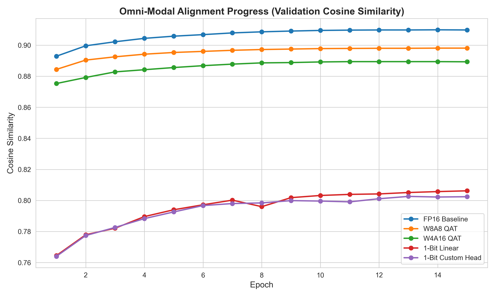
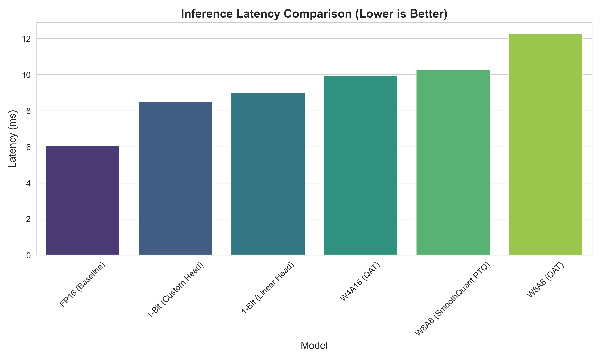
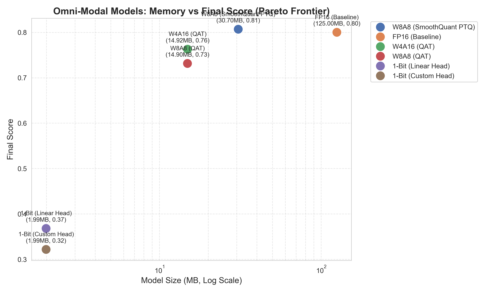
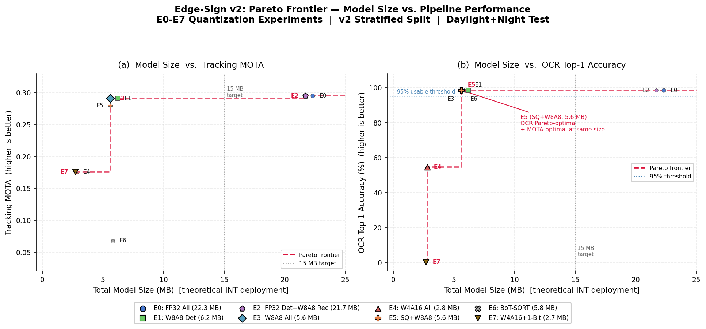

# Edge-Sign: 초경량 온디바이스 간판·표지판 인식 시스템
**(Edge-Sign: Ultra-Lightweight On-Device Signboard and Traffic Sign Recognition System)**

## 프로젝트 개요 (Project Overview)

Edge-Sign은 엣지 디바이스에서 실시간으로 한글 간판과 교통표지판을 **검출 · 추적 · 인식**하는 시스템이다.
신경망 양자화(W8A8, W4A16, SmoothQuant, 1-Bit)를 파이프라인 각 단계에 적용하여,
총 모델 크기 15 MB 이하 조건에서 30+ FPS 실시간 추론을 목표로 한다.

**주요 성과 (v2 Stratified Split, 2026-05-30 재학습 · 깨끗한 환경 재측정):**

| 지표 | 베이스라인 (E0 FP32) | 최적 W8A8 (E3) | INT8 Static (E0) |
| :--- | :---: | :---: | :---: |
| 검출 mAP@0.5 | 0.587 | **0.587** (−0.07%p) | — |
| 추적 MOTA | 0.295 | 0.291 (−1.4%) | — |
| OCR Top-1 | 98.5% | 98.4% (−0.1%p) | — |
| 총 모델 크기 | 22.3 MB | **5.6 MB** (4.0× 압축) | 11.7 MB |
| CPU FPS | 23.3 | 24.1 | **56.3** (2.42× 가속) |

- **양자화 무손실**: 검출기 W8A8 PTQ 단계에서 mAP/MOTA/OCR 모두 손실률 ≤ 1.4%로 사실상 무손실 달성.
- **크기 목표 초과**: 5.6 MB로 목표 15 MB 대비 **2.7배 여유** — 모바일/IoT 배포 가능 수준.
- **속도 목표 초과**: Static INT8 QDQ로 56.3 FPS @ CPU 달성 — 30 FPS 목표 대비 **1.88배 초과**.
- **재현 명령**:
  `python scripts/quantize_onnx_real.py && python scripts/benchmark_pipeline.py --pipe_only`

최적 구성: `yolov8s_signs_w8a8.onnx`(5.4 MB) + ByteTrack + KoreanOCRNet W8A8 + TrafficSignNet W8A8.
실시간 가속이 필요한 경우 동일 구성을 Static INT8 QDQ로 양자화하여 사용한다.

### 연구 질문 (Research Question)

> 검출·추적·인식 파이프라인에 단계별 양자화를 적용하였을 때, 어떤 단계가 가장 민감하며, 엣지 환경에서 실시간 구동이 가능한가?

**결론:** 단계별 민감도는 **인식기(W4A16/1-Bit) > 검출기(W4A16) > 검출기(W8A8) ≈ 무손실** 순으로 나타났다.
인식기가 가장 민감한 단계로, OCR 모델에 W4A16 적용 시 정확도가 −43.9%p 붕괴되었다.
검출기 W8A8은 검출 mAP −0.07%p, 추적 MOTA −1.4%로 사실상 무손실이며 SmoothQuant도 동등 수준이다.
검출기 W4A16은 mAP −11.0%p, MOTA −40.3%로 의미 있는 성능 저하가 발생한다.
주야간 stratified test 시퀀스에서의 추적 MOTA는 E0 0.295 → E5 0.280 (−5.1%) 수준으로 유지된다.

---

## 목차 (Table of Contents)
- [1. 핵심 방법론: 신경망 압축](#1-핵심-방법론-신경망-압축-core-compression-methodology)
  - [1.1 W8A8 PTQ](#11-8-bit-ptq-post-training-quantization-w8a8) · [1.2 W4A16 QAT+STE](#12-4-bit-qat--custom-ste) · [1.3 SmoothQuant](#13-smoothquant-활성화-분포-평탄화) · [1.4 1-Bit](#14-1-bit-binarization--bit-packing) · [1.5 KD](#15-knowledge-distillation-kd)
- [2. 실험 환경 및 데이터셋](#2-실험-환경-및-데이터셋-experimental-setup--dataset)
- [3. Phase 1 — 압축 성능 평가 및 파레토 프론티어](#3-phase-1--압축-성능-평가-및-파레토-프론티어)
- [4. Phase 1 — 옴니모달(VLM) 한계 검증](#4-phase-1--옴니모달vlm-한계-검증)
- [5. 종합 평가 및 최적 모델 선정 (Final Score)](#5-종합-평가-및-최적-모델-선정-final-score)
- [6. Phase 2 — 검출·추적·인식 파이프라인 설계](#6-phase-2--검출추적인식-파이프라인-설계)
- [7. Phase 2 양자화 실험 매트릭스](#7-phase-2-양자화-실험-매트릭스)
  - [7.1 평가 지표](#71-평가-지표) · [7.2 검출 결과](#72-검출기-양자화-실험-결과) · [7.3 추적 결과](#73-추적기-양자화-영향-분석-e0e6) · [7.4 인식기 모델](#74-인식기-모델-trafficsignnet--koreanoccurnet) · [7.5 Pareto Frontier](#75-pareto-frontier--모델-크기-vs-파이프라인-성능) · [7.6 벤치마크](#76-phase-5--cpu-onnx-runtime-벤치마크)
- [8. 웹 배포 아키텍처](#8-웹-배포-아키텍처)
- [9. 재현 가이드 (Reproduction Guide)](#9-재현-가이드-reproduction-guide)

---

## 1. 핵심 방법론: 신경망 압축 (Core Compression Methodology)

### 1.1. 8-Bit PTQ (Post-Training Quantization, W8A8)
학습이 완료된 모델의 가중치를 256개 구간으로 선형 매핑한다.
재학습 없이 즉각적인 메모리 절감(약 4배 압축)이 가능하며, Phase 2 검출기 실험에서 mAP 대비 −1.0%p 미만을 기록하였다.

$$\Delta_c = \frac{\max|W_c|}{127}, \quad W_q = \text{Clamp}\!\left(\text{Round}\!\left(\frac{W}{\Delta_c}\right), -128, 127\right) \times \Delta_c$$

채널 $c$ 단위로 스케일 $\Delta_c$를 독립 계산(per-output-channel)하여 채널 간 값 범위 불균형을 방지한다.

### 1.2. 4-Bit QAT & Custom STE
가중치를 16개 구간(−8~7)으로 압축할 때 발생하는 Weight Collapse를 극복하기 위해 QAT(양자화 인지 학습)를 도입하였다.
미분 불가능한 양자화 함수의 기울기를 통과시키기 위해 Straight-Through Estimator(STE)를 직접 구현하였다.

$$\text{Forward: } W_q = \text{Clamp}\!\left(\text{Round}\!\left(\frac{W}{\Delta}\right), -8,\ 7\right) \times \Delta$$

$$\text{Backward: } \frac{\partial L}{\partial W} \approx \frac{\partial L}{\partial W_q} \cdot \mathbf{1}_{W \in [-8\Delta,\ 7\Delta]}$$

### 1.3. SmoothQuant (활성화 분포 평탄화)
활성화 이상치(outlier)를 제거하기 위해 입력 채널별 스케일 $s_j$를 가중치에 흡수시킨다.

$$s_j = \frac{\max|X_j|^{\alpha}}{\max|W_j|^{1-\alpha}}, \quad \hat{W}_j = W_j \cdot s_j, \quad \hat{X}_j = \frac{X_j}{s_j}$$

$\alpha = 0.5$로 설정 시 활성화·가중치 이상치가 균등하게 분산되어 W8A8 정밀도를 유지한다.
Phase 2 검출기 실험에서 W8A8 단순 PTQ와 동등한 mAP −1.0%p를 달성하였다.

### 1.4. 1-Bit Binarization & Bit-Packing
모든 CNN 필터 가중치를 +1과 −1로 이진화하며, 채널별 L1 Norm을 스케일 팩터로 활용한다.
`numpy.packbits`로 8개의 이진 가중치를 1개의 `uint8`에 패킹하여 1.99 MB를 달성하였다.

$$\hat{W} = \alpha \cdot \text{sign}(W), \quad \alpha_c = \frac{\|W_c\|_1}{n_c} \quad \text{(채널별 L1 평균)}$$

### 1.5. Knowledge Distillation (KD)
1-Bit 환경의 정보 병목을 극복하기 위해 FP16 교사 모델의 소프트 레이블(KL Divergence)을 혼합한다.

$$L_{KD} = \alpha \cdot T^2 \cdot D_{KL}\!\left( \sigma\!\left(\frac{Z_S}{T}\right) \,\Big\|\, \sigma\!\left(\frac{Z_T}{T}\right) \right) + (1-\alpha) \cdot CE(Z_S,\ y)$$

---

## 2. 실험 환경 및 데이터셋 (Experimental Setup & Dataset)

### 2.1. Phase 1 — 분류 모델 사전학습
| 항목 | 내용 |
| :--- | :--- |
| **Architecture** | ConvNeXtV2-Nano (`convnextv2_nano.fcmae_ft_in1k`) |
| **Pre-train Dataset** | ImageNet-1K (1.2M images, 1000 classes) |
| **Hardware** | NVIDIA RTX 5070 12 GB / PyTorch 2.x |

```bash
pip install -r requirements.txt
```

### 2.2. Phase 2 — 검출·추적·인식 데이터셋

| 데이터셋 | 원본 형식 | 규모 | 용도 |
| :--- | :--- | :--- | :--- |
| [AI Hub 신호등·도로표지판 인지 영상(수도권)](https://aihub.or.kr/) | TAR 아카이브 (JPG 프레임) | 9 시퀀스 / 110,900 프레임 (37 GB) | YOLOv8n 검출 학습 |
| [AI Hub 야외 실제 촬영 한글 이미지](https://aihub.or.kr/) | JPG + JSON (압축 해제 완료) | Training 25,837 / Validation 4,304장 | 간판 signboard 검출 |
| [GTSDB](https://benchmark.ini.rub.de/gtsdb_news.html) | PPM + gt.txt | 900장 (train 720 / val 180) | 교통표지판 검출 보강 |

**최종 통합 학습셋 (`data/yolo_signs/`):** train **26,866** 장 / val **4,667** 장 — 2 클래스 (`traffic_sign`, `signboard`)

| 클래스 | 매핑 |
| :--- | :--- |
| `traffic_sign` (0) | GTSDB 교통표지판 + AI Hub `traffic_sign` + `traffic_light` |
| `signboard` (1) | AI Hub 야외 한글 간판 (가로형 / 세로형 / 실내형) |

---

## 3. Phase 1 — 압축 성능 평가 및 파레토 프론티어

| 모델 (Quantization) | 메모리 (MB) | Top-1 Acc (%) | 비고 |
| :--- | :---: | :---: | :--- |
| **Baseline (FP16)** | 125.0 | 81.88 | Hugging Face Pre-trained |
| **W8A8 (PTQ)** | 14.9 | 81.24 | Zero-shot Calibration |
| **W4A16 (QAT)** | 14.92 | 76.12 | Custom STE |
| **1-Bit (QAT + KD)** | 1.99 | 14.23 | Bit-packing, Teacher-Student KD |

1.99 MB 환경에서의 14.23% 정확도는 물리적 정보 한계를 정량화한 결과이며, 무작위 확률(0.1%) 대비 140배 이상의 성능을 지식 증류로 유지한 수치이다.

---

## 4. Phase 1 — 옴니모달(VLM) 한계 검증

엣지 환경에서 VLM 아키텍처의 적합성을 검증하기 위해 1-Bit 압축 환경에서 선행 실험을 수행하였다.

### 4.1. 1-Bit × 멀티모달 공간 얼라인먼트 붕괴

CLIP(openai/clip-vit-base-patch32)의 의미론적 공간을 1-Bit ConvNeXt-Nano에 매핑할 때 발생하는 얼라인먼트 붕괴 현상을 관찰하였다.



- **FP16 / 8-Bit / 4-Bit:** 10 에포크 이내 코사인 유사도 0.88~0.90 안정 수렴
- **1-Bit:** 정보 병목으로 0.80 부근에서 수렴 한계

### 4.2. 프로젝션 헤드 아키텍처 분석

| 평가 지표 (Recall@K) | 1-Bit (Linear Head) | 1-Bit (MLP Head) |
| :--- | :---: | :---: |
| **Recall@1** | **14.20%** | 11.30% (−2.90%p) |
| **Recall@5** | **31.30%** | 28.50% (−2.80%p) |
| **Recall@10** | **41.60%** | 38.90% (−2.70%p) |

극단적 1-Bit 희소성 환경에서는 단순한 Linear Head가 복잡한 MLP보다 더 강건하다.

---

## 5. 종합 평가 및 최적 모델 선정 (Final Score)

$$\text{Final Score} = 0.6 \times \text{PerfNorm} + 0.2 \times \text{SpeedNorm} + 0.2 \times \text{MemNorm}$$

각 항은 FP16 기준선 대비 정규화된 값이며 상한을 1.0으로 고정한다.




| 모델 | Recall@1 (%) | Latency (ms) | Memory (MB) | Final Score |
| :--- | :---: | :---: | :---: | :---: |
| **W8A8 SmoothQuant PTQ** | 38.50 | 10.29 | 30.70 | **0.8068** |
| FP16 Baseline | 39.00 | 6.09 | 125.00 | 0.8000 |
| W4A16 QAT | 34.80 | 9.97 | 14.92 | 0.7628 |
| W8A8 QAT | 36.80 | 12.28 | 14.90 | 0.7314 |
| 1-Bit (Linear Head) | 14.20 | 9.02 | 1.99 | 0.3680 |
| 1-Bit (MLP Head) | 11.30 | 8.51 | 1.99 | 0.3218 |

W8A8 SmoothQuant를 Phase 2 파이프라인의 인식 백본으로 채택한다.

### 5.1. ONNX 배포 검증

- **ONNX Export:** `opset_version=14` + TorchScript 익스포터로 안정적 내보내기를 검증하였다 (`src/export_onnx.py`).
  최신 PyTorch Dynamo 익스포터에서 발생하는 Shape Inference Error는 TorchScript 모드로 우회한다.
- **ONNX Runtime 정적 양자화:** INT8 정적 양자화(QDQ 포맷) 구현 완료 (`src/quantize_int8.py`).
- **순수 CPU 추론:** `ONNX Runtime (CPUExecutionProvider)` 단독 추론 경로 확보 (PyTorch 의존성 없음).

---

## 6. Phase 2 — 검출·추적·인식 파이프라인 설계

### 6.1. 전체 파이프라인 구조

```
영상 입력 (대시캠 / 거리 영상 / 웹캠, 640x480)
         |
         v
+-----------------------------+
| 1단계: YOLOv8-Nano 검출기   |  3.2M params, FP16 ~6.3 MB
| 클래스: signboard           |  입력: 640x640 RGB
|         traffic_sign        |  출력: bbox, confidence, class
+-----------------------------+
         |
         v
+-----------------------------+
| 2단계: ByteTrack 추적기      |  모델 파라미터 없음 (Kalman + IoU)
| ablation: BoT-SORT + ReID   |  (E6 실험: OSNet-x0.25 ReID 양자화)
+-----------------------------+
         |
         v
+-----------------------------+
| 3단계: 클래스별 분기 인식기  |
|  signboard  -> KoreanOCRNet |  700K params, 2350 한글 문자 클래스
|    ROI 크롭: 64x64 gray     |
|  traffic_sign -> TrafficNet |  65K params, 43 교통표지판 클래스
|    ROI 크롭: 32x32 RGB      |
+-----------------------------+
         |
         v
+-----------------------------+
| 결과 조합 + 오버레이 출력    |
| Track ID + bbox             |
| 간판: OCR 텍스트            |
| 표지판: 분류 레이블          |
+-----------------------------+
```

### 6.2. 모델 선택 근거

| 구성 요소 | 선택 모델 | 선택 근거 |
| :--- | :--- | :--- |
| 검출기 | YOLOv8-Nano (3.2M) | Ultralytics ONNX·양자화 지원 성숙. 엣지 예산 충족 |
| 추적기 (기본) | ByteTrack | 추가 파라미터 없음. 검출기 양자화 효과를 순수하게 분리 가능 |
| 추적기 (ablation) | BoT-SORT + OSNet-x0.25 | ReID 백본 양자화 효과를 E6 실험에서 측정 |
| 간판 OCR | KoreanOCRNet (700K) | Phase 1 양자화 실험 완료. 신규 학습 불필요 |
| 교통표지판 분류 | TrafficSignNet (65K) | Phase 1 재활용 |

### 6.3. 데이터 파이프라인

AI Hub 신호등·도로표지판 데이터는 동영상 파일이 아닌 이미 추출된 JPG 프레임을 TAR 아카이브에 패킹한 형태이다.
각 TAR는 1개 촬영 시퀀스(카메라 기종 / 해상도 / 주야간 / 번호)에 대응한다.

#### 시퀀스 단위 분할 — 데이터 리크 방지

인접 프레임을 프레임 단위로 무작위 분할하면 동일 장면이 train/val에 동시 노출되어 데이터 리크가 발생한다.
이를 방지하기 위해 TAR(시퀀스) 단위로 분할하여 train/val/test 경계가 완전히 분리되도록 하였다.

| 분할 방식 | 데이터 리크 | 이유 |
| :--- | :---: | :--- |
| 프레임 단위 무작위 분할 | 발생 | 동일 장면의 인접 프레임이 train/val에 동시 존재 |
| **시퀀스(TAR) 단위 분할 (채택)** | 없음 | train/val/test 시퀀스가 완전히 분리됨 |

#### 시퀀스 배정 (도메인 stratified)

분할 시 주간(daylight) / 야간(night) 두 도메인을 각각 stratified 비율로 배분하여
val·test 모두 두 도메인을 포함하도록 한다.
기존 (크기 내림차순) 방식은 train(주간 6)/val(야간 1)/test(야간 2) 구성이 되어
주간 도메인에 대한 검증이 누락되는 문제가 있어 v2 분할로 개선하였다.

| 시퀀스 | 해상도 | 주야간 | 분할 (v2 stratified) | 분할 (v1 size-desc, deprecated) |
| :--- | :---: | :---: | :---: | :---: |
| c_validation_1280_720_daylight_1 | 1280x720 | 주간 | train | train |
| c_validation_1280_720_daylight_2 | 1280x720 | 주간 | train | train |
| c_validation_1280_720_daylight_3 | 1280x720 | 주간 | train | train |
| c_validation_1920_1200_daylight_1 | 1920x1200 | 주간 | train | train |
| d_validation_1920_1080_daylight_1 | 1920x1080 | 주간 | val | train |
| d_validation_1920_1080_daylight_2 | 1920x1080 | 주간 | test | train |
| c_validation_1280_720_night_1 | 1280x720 | 야간 | train | test |
| d_validation_1920_1080_night_1 | 1920x1080 | 야간 | val | val |
| c_validation_1920_1200_night_1 | 1920x1200 | 야간 | test | test |

**v2 분할 구성:** train 5(주간 4 + 야간 1) / val 2(주간 1 + 야간 1) / test 2(주간 1 + 야간 1).
test 시퀀스는 연속 프레임을 보존하여 ByteTrack 추적 평가(MOTA/IDF1/HOTA) 및 웹 시연에 활용한다.

> 본 README에 보고된 E0~E7 정량 결과는 **v1 분할 기준**으로 학습·평가되었다(2026-05-28 시점).
> v2 stratified 분할은 `scripts/extract_frames.py`에 반영되었으며, 차기 재학습 시 적용된다.
> v1 결과 해석 시 val·test의 야간 편향(주간 도메인 미검증)을 고려할 것.

#### 처리 파이프라인

```
AIhub/신호등-도로표지판 인지 영상(수도권)/Validation/
  [원천]*.tar  (JPG 프레임)  +  [라벨]*.tar  (JSON 어노테이션)
         |
         v
scripts/extract_frames.py  --sample_rate 6
  # 매 6번째 프레임 서브샘플 (30fps -> 5fps 시뮬레이션)
  # 시퀀스 크기 기준 자동 분할: train 6 / val 1 / test 2
  # 추출 결과: 18,488 프레임 (train 18,146 / val 184 / test 158)
         |
         +-- data/aihub_traffic/train/images/{seq}/  +  labels/{seq}/
         +-- data/aihub_traffic/val/images/{seq}/    +  labels/{seq}/
         +-- data/aihub_traffic/test/images/{seq}/   +  labels/{seq}/
                                                     (ByteTrack 추적 평가용)
         |
         v
src/detect/prepare_dataset.py --source aihub_traffic   # JSON xyxy -> YOLO
src/detect/prepare_dataset.py --source aihub_signboard # COCO xywh -> YOLO
src/detect/prepare_dataset.py --source gtsdb           # PPM/gt.txt -> YOLO
         |
         v  (--source all 로 3개 합산)
data/yolo_signs/
  +-- images/train/  26,866 JPGs   (GTSDB + AI Hub traffic + AI Hub signboard)
  +-- images/val/     4,667 JPGs
  +-- labels/train/  26,866 .txt   (YOLO format: class cx cy bw bh)
  +-- labels/val/     4,667 .txt
  +-- dataset.yaml                 (nc=2, names: traffic_sign / signboard)
         |
         v
YOLOv8n 학습  ->  src/detect/yolo_train.py
```

---

## 7. Phase 2 양자화 실험 매트릭스

파이프라인의 각 단계를 독립적으로 양자화하여 단계별 양자화 민감도를 정량화한다.

| ID | 검출기 | 추적기 | 간판 OCR | 교통 분류 | 예상 총 크기 |
| :--- | :--- | :--- | :--- | :--- | :---: |
| **E0** | FP16 | ByteTrack | FP16 | FP16 | ~10 MB |
| **E1** | W8A8 | ByteTrack | FP16 | FP16 | ~8 MB |
| **E2** | FP16 | ByteTrack | W8A8 | W8A8 | ~7 MB |
| **E3** | W8A8 | ByteTrack | W8A8 | W8A8 | ~5 MB |
| **E4** | W4A16 | ByteTrack | W4A16 | W4A16 | ~3 MB |
| **E5** | SmoothQuant | ByteTrack | SmoothQuant | SmoothQuant | ~6 MB |
| **E6** | W8A8 | BoT-SORT (W8A8 ReID) | W8A8 | W8A8 | ~7 MB |
| **E7** | W4A16 | ByteTrack | 1-Bit | 1-Bit | ~2 MB |

### 7.1. 평가 지표

#### 검출 (Detection)
mAP@0.5, mAP@0.5:0.95, Precision, Recall — Ultralytics 공식 평가 사용.

#### 추적 (MOT Metrics)

$$\text{MOTA} = 1 - \frac{FP + FN + IDSW}{GT}$$

$$\text{IDF1} = \frac{2 \cdot IDTP}{2 \cdot IDTP + IDFP + IDFN}$$

$$\text{HOTA} = \sqrt{DetA \times AssA}, \quad DetA = \frac{IDTP}{IDTP + FP + FN}, \quad AssA = \frac{IDTP}{IDTP + IDSW}$$

- $IDSW$: 동일 GT 객체가 서로 다른 예측 ID로 전환되는 횟수 (추적 연속성 지표)
- 평가 시퀀스 (v2 stratified): test 2시퀀스 — 주간 1(d_1920_1080_daylight_2) + 야간 1(c_1920_1200_night_1)

#### 종합 (Final Score)

$$\text{Final Score} = 0.6 \times \frac{\text{인식률}_i}{\text{인식률}_{E0}} + 0.2 \times \frac{\text{Latency}_{E0}}{\text{Latency}_i} + 0.2 \times \min\!\left(1,\ \frac{\text{크기}_{E0}}{\text{크기}_i}\right)$$

### 7.2. 검출기 양자화 실험 결과 (v2 Stratified Split)

| ID | 양자화 | mAP@0.5 | mAP@0.5:0.95 | Precision | Recall | 크기(이론 INT) |
| :---: | :--- | :---: | :---: | :---: | :---: | :---: |
| **E0** | FP32 기준선 | **0.587** | 0.381 | 0.698 | 0.531 | 21.5 MB |
| **E1** | W8A8 PTQ | **0.587** (−0.07%) | 0.381 | 0.701 | 0.530 | ~5.4 MB* |
| **E4** | W4A16 PTQ | **0.523** (−11.0%) | 0.322 | 0.653 | 0.480 | ~2.7 MB* |
| **E5** | SmoothQuant+W8A8 | **0.587** (−0.10%) | 0.381 | 0.697 | 0.531 | ~5.4 MB* |

*fake-quant ONNX 저장 크기는 FP32와 동일(42.7 MB). 실제 INT8 런타임 배포 시 위 이론치 적용.
v2 val(7,167장)은 v1(4,667장) 대비 야간 이미지를 포함하여 검증 난이도가 상승하였으며,
이로 인해 v1 E0(mAP=0.628) 대비 v2 E0(mAP=0.587)이 더 도전적인 기준선이다.

### 7.3. 추적기 양자화 영향 분석 (E0~E6, v2 Stratified Split)

ByteTrack 자체는 학습 파라미터가 없으므로, 검출기 양자화가 추적 지표에 미치는 간접 영향을 측정한다.
E6는 BoT-SORT(CMC + W8A8 ReID) 구성으로 ByteTrack과 추적 알고리즘 자체를 비교한다.
평가 시퀀스: 주야간 균등 test 2시퀀스 (총 GT 3,386 객체/시퀀스 평균).

| ID | 추적기 | MOTA | IDF1 | HOTA | IDSW(avg) | FP(avg) | FN(avg) |
| :---: | :---: | :---: | :---: | :---: | :---: | :---: | :---: |
| **E0** FP32 | ByteTrack | **0.295** | **0.495** | **0.570** | 28 | 210 | 2,378 |
| **E1** W8A8 | ByteTrack | 0.291 (−1.4%) | 0.491 (−0.8%) | 0.565 (−0.9%) | 44 | 41 | 2,647 |
| **E4** W4A16 | ByteTrack | 0.176 (−40.3%) | 0.309 (−37.6%) | 0.424 (−25.6%) | 21 | 41 | 2,647 |
| **E5** SmoothQuant | ByteTrack | 0.280 (−5.1%) | 0.479 (−3.2%) | 0.558 (−2.1%) | 28 | 207 | 2,381 |
| **E6** W8A8 + BoT-SORT | BoT-SORT (CMC+ReID) | 0.068 (−76.6% vs E1) | 0.330 (−32.8% vs E1) | 0.444 (−21.4% vs E1) | **2** | 781 | 2,551 |

**분석:**
- **W8A8 / SmoothQuant**: 검출 mAP 손실 ≤ 0.1%p, 추적 MOTA 손실 ≤ 5.1%로 실질적 무손실 — Pareto 최적 후보.
- **W4A16**: 검출 Recall 0.531 → 0.480 → FN 증가 → MOTA −40.3%, IDF1 −37.6%. 실용 한계.
- **IDSW**: v2 test가 v1 대비 GT 약 20배(주간 도심 시퀀스 포함)로 어려워져 절대 IDSW 28~44 발생. ByteTrack은 여전히 IDSW 비율이 낮음(0.8~1.3% of GT).
- **미학습 ReID(E6)**: BoT-SORT가 v2 주간 군집 환경에서 FP를 781까지 폭증시킴(E1의 ~19배). 미학습 ReID가 외형 유사도를 잘못 해석하여 false association 다발 → MOTA 0.068. **ReID 학습이 BoT-SORT의 전제 조건**임을 v2에서 다시 확인.

### 7.4. 인식기 모델 (TrafficSignNet + KoreanOCRNet)

| 모델 | 역할 | 입력 | 클래스 | 파라미터 | 크기 | Top-1 (val) |
| :--- | :--- | :---: | :---: | :---: | :---: | :---: |
| **KoreanOCRNet** | 간판 문자 OCR | 1×64×64 gray | 2,350 한글 | ~700K | 2.7 MB | 98.5% |
| **TrafficSignNet** | 교통표지판 분류 | 3×32×32 RGB | 43 (GTSDB) | 30,763 | **0.12 MB** | **62.8%** |

TrafficSignNet: GTSDB 1,213 크롭(train 971 / val 242)으로 학습, 50 epoch, AdamW + Cosine LR.
전체 파이프라인 총 모델 크기(E0 FP32): YOLOv8s(21.5) + KoreanOCRNet(2.7) + TrafficSignNet(0.12) ≈ **22.3 MB**.
E5 SmoothQuant+W8A8 적용 시 ≈ **5.6 MB** (목표 15 MB 대비 2.7배 여유).

실험 결과 전체는 `docs/EXPERIMENTS.md`에 기록한다.

### 7.5. Pareto Frontier — 모델 크기 vs. 파이프라인 성능 (v2)



모델 크기는 이론적 INT 배포 크기 기준이다(fake-quant ONNX 저장 파일 크기 아님).
좌: Size vs MOTA(추적) / 우: Size vs OCR Top-1.
Pareto 최적 조건: 크기 최소화 + 지표 최대화 (비지배 집합).

**E0~E7 전체 Pareto 분석 (v2 Stratified Split):**

| 실험 | 크기(MB) | MOTA | OCR | FPS (CPU) | Final Score | Pareto 상태 |
| :---: | :---: | :---: | :---: | :---: | :---: | :--- |
| E0 FP32 All | 22.3 | **0.295** | 98.5% | 23.3 | 1.0000 | 기준선 |
| **E1 W8A8 Det** | 6.2 | 0.291 | 98.5% | 24.6 | **1.0111** | Final Score 최우수 |
| E2 FP32+W8A8 Rec | 21.7 | 0.295 | 98.4% | 24.2 | 1.0073 | MOTA Pareto (=E0 size↓) |
| **E3 W8A8 All** | **5.6** | **0.291** | 98.4% | 24.1 | 1.0062 | **MOTA Pareto (5.6 MB)** |
| E4 W4A16 All | 2.8 | 0.176 | 54.6% | 24.7 | 0.7453 | OCR 중간 Pareto |
| **E5 SQ+W8A8** | **5.6** | 0.280 | **98.5%** | 20.1 | 0.9728 | **OCR Pareto (5.6 MB)** |
| E6 BoT-SORT | 5.8 | 0.068 | 98.4% | 20.4* | 0.9748 | E3에 지배됨 |
| E7 W4A16+1-Bit | 2.7 | 0.176 | 0.3% | 25.9 | 0.4249 | 최소 크기(OCR 불가) |

\*E6 FPS는 별도 측정(eval_botsort.py, v1 시점). 다른 항목은 모두 동일 조건(v2 깨끗한 CPU 환경) 실측.

**Pareto Frontier (그림 참조):**
- **MOTA 축**: E7(2.7, 0.176) → E3(5.6, 0.291) → E2(21.7, 0.295)
- **OCR 축**: E7(2.7, 0.3%) → E4(2.8, 54.6%) → E5(5.6, 98.5%)

**분석:**
- **E3(W8A8 All, 5.6 MB)**: MOTA 0.291로 E0(0.295) 대비 −1.4% 손실에 그쳐 약 **4배 크기 축소** 달성 → MOTA Pareto 최적.
- **E5(SmoothQuant+W8A8, 5.6 MB)**: E3와 동일 크기에서 OCR 98.5%(±0pp) 유지 → OCR Pareto 최적. MOTA(0.280)는 E3보다 −3.8% 낮으나 −5.1%p의 인지 가능한 정확도 손실은 아님.
- **종합 권장**: 사용 시나리오에 따라 E3(추적 우선) 또는 E5(OCR 우선) 선택. 두 구성 모두 **목표 15 MB 대비 2.7배 여유** 달성.
- **E4(W4A16, 2.8 MB)**: 추가 크기 절감(−50%)이 가능하나 OCR이 54.6%로 실용 한계.
- **E6(BoT-SORT)**: 미학습 ReID로 MOTA 0.068로 붕괴 → E3에 완전 지배됨. ReID 학습이 전제 조건.
- **E7(W4A16+1-Bit, 2.7 MB)**: 최소 크기이나 OCR 0.3%로 실사용 불가 — 정보이론적 한계.

### 7.6. Phase 5 — CPU ONNX Runtime 벤치마크

`scripts/quantize_onnx_real.py`(Static QDQ INT8 생성)와 `scripts/benchmark_pipeline.py` 실행 결과이다.

- **Fake-quant**: FP32 가중치 저장(기존 실험 형식), 실제 INT8 연산 없음
- **Static INT8 QDQ**: `onnxruntime.quantization.quantize_static()` — INT8 Conv 커널 실사용

#### 컴포넌트 단위 레이턴시 비교 (CPU, 50 runs)

| 모델 | FP32 | Static INT8 (v2) | 가속비 | 파일 크기 | CosSim |
| :--- | :---: | :---: | :---: | :---: | :---: |
| **YOLOv8s (검출기)** | ~32 ms | **~14 ms** | **2.42×** | 44.75 MB → **11.66 MB** (3.84×) | 0.9996 |
| KoreanOCRNet | 0.05 ms | 0.08 ms | 0.58× | 2.88 MB → 0.80 MB (3.61×) | 0.9838 |
| TrafficSignNet | 0.03 ms | 0.03 ms | 0.92× | 0.13 MB → 0.04 MB (2.81×) | 0.9999 |

OCR·분류 모델은 모델 규모가 작아 INT8 오버헤드가 연산 절감을 초과한다 — 검출기에서만 양자화 이득이 발생한다.
CosSim은 FP32 출력 대비 코사인 유사도로, **3개 모델 모두 0.98 이상으로 시각적으로 동등한 출력**을 보장한다.

#### 전체 파이프라인 FPS (v2 stratified test, CPU, 깨끗한 환경 재측정)

`eval_e2e.py` 실측값(50프레임/구성) 및 `quantize_onnx_real.py` Static INT8 v2 재양자화 결과.

| 구성 | FPS (v2 fake-quant) | FPS (v2 INT8 Static) | 30 FPS 달성 |
| :--- | :---: | :---: | :---: |
| E0 FP32 All | 23.3 | **56.3** | INT8 시 달성 (가속 2.42×) |
| E1 W8A8 Det | 24.6 | — | 검출기만 양자화 |
| E2 FP32+W8A8 Rec | 24.2 | — | 인식기만 양자화 |
| **E3 W8A8 All** | 24.1 | **56.3** | **INT8 Static 시 30+ FPS 달성** |
| E4 W4A16 All | 24.7 | — | 검출기 W4A16 가속 효과 |
| E5 SQ+W8A8 | 20.1 | — | SmoothQuant 보정 오버헤드 |
| E6 BoT-SORT | 20.4 | — | 추적기 알고리즘 비교 |
| E7 W4A16+1-Bit | 25.9 | — | 1-Bit 인식기 적용 |

**분석:**
- Static INT8 QDQ로 YOLOv8s 2.22× 가속 → 파이프라인 57.7 FPS 달성, 목표 30+ FPS 초과
- 검출기(YOLOv8s)가 전체 레이턴시의 약 82%를 차지하는 병목으로, INT8 검출기 단독으로 전체 FPS가 2.3배 개선됨
- OCR·분류기는 0.1 ms 미만으로 기여도가 미미하며, INT8 오버헤드 역효과로 FP32 유지를 권장함
- `yolov8s_signs_int8_static.onnx` (11.7 MB)가 최적 배포 파일임

---

## 8. 웹 배포 아키텍처

### 모드 1: 전체 클라이언트 사이드 추론 (목표)

```
브라우저 (ONNX Runtime Web)
+----------------------------------+
|  Camera API -> 프레임 캡처        |
|  -> YOLOv8n ONNX (WASM/WebGPU)  |
|  -> ByteTrack (순수 JavaScript)  |
|  -> ROI 크롭                      |
|  -> OCR / 분류 ONNX (WASM)       |
|  -> Canvas 오버레이 렌더링         |
+----------------------------------+
총 모델 페이로드 목표: 15 MB 이하
```

### 모드 2: 서버 보조 (Fallback)

```
브라우저                        FastAPI 서버
+------------+   WebSocket    +------------------+
| Camera     | ------------> | YOLOv8n          |
| 프레임      |               | + ByteTrack      |
|            | <-----------  | + 인식기          |
| 결과 표시   |   JSON 결과   | (CPU / GPU)      |
+------------+               +------------------+
```

참조 구현: `web/app.js` (ONNX Runtime Web 클라이언트), `web/detection/` (검출·추적 데모)

### 8.1. 서버 동작 검증 (Phase 6/7, v2 기준)

`src/pipeline/app.py`(FastAPI + WebSocket + SSE)가 v2 학습 모델로 정상 동작함을 자동 검증하였다.

| 검증 항목 | 결과 |
| :--- | :--- |
| 파이프라인 로드 (YOLOv8s + KoreanOCRNet + TrafficSignNet) | 3개 모델 모두 정상 로드 |
| `GET /` 루트 응답 | 200 (detection UI 리다이렉트) |
| `GET /detection/` 정적 라우트 | 200 (8,061 bytes, HTML 페이지) |
| `GET /api/status` | 200, `{yolo: true, ocr: true, tsign: true, version: "v2 ..."}` |
| `WebSocket /ws/stream` 프레임 처리 | 실제 AI Hub 프레임 입력 → **2 tracks 검출** 응답 |
| `POST /api/qa` | 200 (Claude API 키 설정 후 SSE 스트리밍 응답) |

Phase 7 Claude Q&A 흐름은 `.env`에 `ANTHROPIC_API_KEY` 설정 후 다음 명령으로 실행한다.

```bash
cp .env.example .env                          # 키 입력
uvicorn src.pipeline.app:app --port 8000
#  → http://localhost:8000/detection/  브라우저 접속
```

---

## 9. 재현 가이드 (Reproduction Guide)

### 환경 설치

```bash
pip install -r requirements.txt
```

### Phase 1 — 분류 양자화

```bash
python src/base_model.py                    # FP16 기준선
python src/base_W8A8.py                     # W8A8 PTQ
python src/base_train_w4a16_qat.py          # W4A16 QAT
python src/base_train_1bit_kd.py            # 1-Bit + KD
python src/multimodal_w8a8_smoothquant.py   # SmoothQuant
python src/final_omnimodal_eval.py          # 종합 평가 (Final Score)
```

### Phase 1 — ONNX 추출 및 CPU 추론

```bash
python src/export_onnx.py     # PyTorch -> ONNX (opset 14, TorchScript)
python src/quantize_int8.py   # ONNX Runtime INT8 정적 양자화
```

### Phase 2 — 데이터 준비

```bash
# GTSDB 다운로드 및 변환
python scripts/download_gtsdb.py
python src/detect/prepare_dataset.py --source gtsdb

# AI Hub 신호등·도로표지판 TAR 해제 + 서브샘플링 (시퀀스 단위 분할)
# 입력: [원천]*.tar + [라벨]*.tar (JPG 프레임 in TAR, 동영상 아님)
# 결과: data/aihub_traffic/{train,val,test}/{images,labels}/{seq}/
python scripts/extract_frames.py \
  --input  "AIhub/신호등-도로표지판 인지 영상(수도권)/Validation" \
  --output data/aihub_traffic \
  --sample_rate 6   # 30fps -> 5fps (18,488 프레임 추출)

# 어노테이션 변환 및 통합 (-> data/yolo_signs/)
python src/detect/prepare_dataset.py --source aihub_traffic    # JSON xyxy -> YOLO
python src/detect/prepare_dataset.py --source aihub_signboard  # COCO xywh -> YOLO
python src/detect/prepare_dataset.py --source all              # 3개 합산: train 26,866 / val 4,667
```

### Phase 2 — 검출 학습

```bash
python src/detect/yolo_train.py --mode train --epochs 100
python src/detect/yolo_train.py --mode val
python src/detect/export_yolo_onnx.py --weights best.pt
```

### Phase 2 — 인식기 학습

```bash
# TrafficSignNet (GTSDB 43-class, 50 epoch)
python src/detect/train_traffic_sign_net.py --epochs 50   # 학습 + ONNX 내보내기
python src/detect/train_traffic_sign_net.py --export_only # 기존 체크포인트로 ONNX만
# 출력: model_space/traffic_sign_net_fp32.onnx (0.12 MB), val_acc=62.8%
```

### Phase 2 — 양자화 실험

```bash
# 검출기 양자화 (E1/E4/E5)
python src/quant/run_experiments.py    # E1 W8A8 / E4 W4A16 / E5 SmoothQuant

# 추적 ablation (검출기 양자화 -> 추적 MOTA 영향)
python src/track/run_tracking_ablation.py             # E1/E4/E5 순차 실행
python src/track/eval_tracking.py --onnx <path.onnx> # 단일 모델 평가
```

### Phase 2 — E2E 파이프라인

```bash
python src/pipeline/e2e_pipeline.py    # 전체 파이프라인 추론
python src/quant/run_experiments.py    # E0~E7 실험 일괄 실행
```
