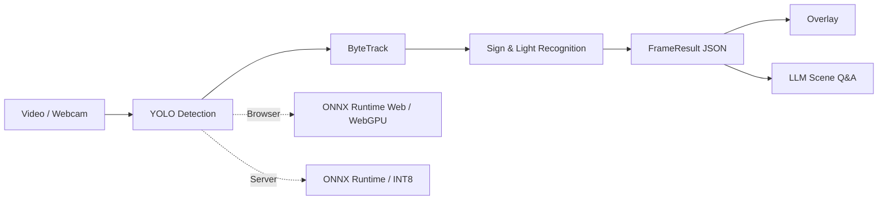

<div align="center">

# 🚦 Edge-Sign

### 초경량 On-device 교통표지판·신호등 인식 시스템

**Detection → Tracking → Recognition → Scene Q&A**

[](https://pytorch.org/)
[](https://onnx.ai/)
[](https://www.w3.org/TR/webgpu/)
[](https://www.docker.com/)
[](LICENSE)

[**Live Demo**](https://huggingface.co/spaces/gyann/edge-sign) ·
[**Technical Notes**](docs/TECHNICAL_REPORT.md) ·
[**Experiments**](docs/EXPERIMENTS.md) ·
[**Release**](https://github.com/todayoneul/edge_sign/releases/tag/v1.0.1)

</div>

Edge-Sign은 도로 영상에서 **교통표지판과 신호등을 실시간으로 검출·추적·인식**하고, 구조화된 인식 결과를 LLM 기반 주행 Q&A까지 연결한 프로젝트입니다. 단순 정확도뿐 아니라 **모델 크기, CPU latency, 브라우저 runtime, 양자화 안정성**을 함께 측정했습니다.

<p align="center">
  
</p>

## 핵심 결과

| Metric | Result | Context |
|---|---:|---|
| **INT8 model size** | **11.7 MB** | Static INT8 QDQ, server CPU |
| **CPU inference** | **56.3 FPS** | 30 FPS 목표 초과 |
| **Browser on-device** | **62 FPS** | FP32 + WebGPU |
| **Traffic detection mAP@0.5** | **0.776** | Phase 3, traffic sign / light |
| **Korean sign/light classifier** | **80.3%** | 14-class validation |

> 이론적 INT 최소 크기 5.6 MB와 실제 배포 파일 11.7 MB를 구분해 기록합니다.

## 무엇을 검증했나

- **W8A8은 검출기에서 거의 무손실**이지만 W4A16은 추적·인식 성능을 크게 떨어뜨렸습니다.
- **낮은 정밀도 = 항상 빠름**이 아니었습니다. 브라우저에서는 FP32/WebGPU가 INT8/WASM보다 훨씬 빨랐습니다.
- YOLO 검출 헤드는 full INT8에서 붕괴할 수 있어, tensor cosine similarity보다 **실제 detection count / confidence** 검증이 중요했습니다.
- 최종 배포는 환경에 따라 **Browser: FP32/WebGPU**, **Server CPU: INT8 Static QDQ**로 분리했습니다.

## Architecture


```mermaid
flowchart LR
    A[Video / Webcam] --> B[YOLO Detection]
    B --> C[ByteTrack]
    C --> D[Sign & Light Recognition]
    D --> E[FrameResult JSON]
    E --> F[Overlay]
    E --> G[LLM Scene Q&A]

    B -. Browser .-> H[ONNX Runtime Web / WebGPU]
    B -. Server .-> I[ONNX Runtime / INT8]
```

## Demo

온라인 데모에서는 샘플 영상·웹캠을 이용해 **Server ↔ On-device**, **FP32 ↔ INT8** 경로를 비교할 수 있습니다.

▶ **[Hugging Face Space에서 실행](https://huggingface.co/spaces/gyann/edge-sign)**

브라우저 호환 H.264 입력은 WebGPU 경로를 사용할 수 있고, 비호환 코덱은 서버 디코딩 경로로 자동 fallback됩니다.

## Quick Start

```bash
pip install -r requirements.txt

# pipeline server
uvicorn src.pipeline.app:app --port 8000

# tests
python -m pytest tests/
```

양자화 재현:

```bash
python scripts/archive/quantize_onnx_real.py
python scripts/archive/benchmark_pipeline.py --pipe_only
```

## Project Map

| Path | Role |
|---|---|
| `src/detect/` | YOLO training / export |
| `src/track/` | ByteTrack / tracking evaluation |
| `src/quant/` | quantization experiments |
| `src/pipeline/` | E2E inference, API, session |
| `web_modern/` | React + WebGPU demo |
| `assets/` | experiment plots / qualitative samples |
| `docs/` | detailed experiments and design notes |

## 더 자세히 보기

- [Experiment details](docs/EXPERIMENTS.md)
- [Technical report / 이전 상세 README 안내](docs/TECHNICAL_REPORT.md)
- [Third-party licenses](THIRD_PARTY_NOTICES.md)
- [AGPL-3.0 License](LICENSE)

### Scope

현재의 “Edge” 측정은 **Browser/WASM/WebGPU 및 Server CPU runtime** 기준입니다. Jetson·Raspberry Pi 등 전용 edge hardware 실측은 포함하지 않으며, tracking MOTA의 절대값보다 **quantization에 따른 상대 열화와 배포 trade-off**를 주요 분석 대상으로 삼았습니다.
