# Edge-Sign: 초경량 온디바이스 간판·표지판 인식 시스템

> 웹 브라우저에 영상을 넣으면 **검출 → 추적 → 인식**이 실시간으로 동작하고,
> 그 결과(JSON)를 바탕으로 LLM이 "지금 앞에 어떤 표지판이 있나?" 같은 주행 질문에 답변.
> 전체 모델 15 MB 이하, CPU 56 FPS, 엣지 디바이스 구동.

## 실시간 시연

**huggingface 온라인 체험: https://huggingface.co/spaces/gyann/edge-sign**
브라우저에서 검출·추적·한국어 인식과 **서버 ⇄ 온디바이스(WebGPU)** · **FP32 ⇄ INT8** 토글, 장면 Q&A 직접 체험 가능.

https://github.com/user-attachments/assets/3c24ca38-2660-4fdf-9bea-d1e9ef0c2e95    

test 가능한 동영상은 아래 링크를 통해 train에 전혀 사용하지 않은 영상 data 다운로드 가능(시연 동영상도 아래 링크 data)    
https://aihub.or.kr/aihubdata/data/view.do?currMenu=115&topMenu=100&dataSetSn=597    


**미리보기 — 청량리역 사거리 (단일 프레임 추론):**

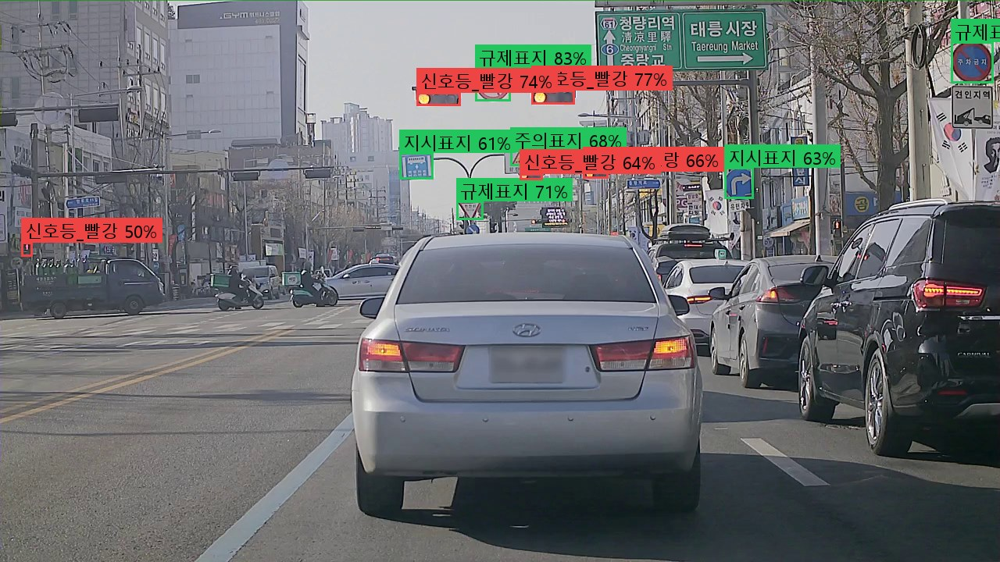

> 녹색 박스: 교통표지판(규제·지시·주의), 빨강 박스: 신호등(빨강·노랑 색상까지 분류), 라벨 한국어 렌더링. 학습 미사용 test 시퀀스 일반화 검증 결과. ([7장 도메인 적응](#7-phase-3--도메인-적응-신호등-분리-검출-및-한국어-인식) 참조.)

---

## 핵심 요약

**문제** — 검출·추적·인식 파이프라인을 엣지에서 실시간으로 구동하려면 양자화가 필수. *어느 단계를, 어떤 정밀도로, 어떤 런타임에서* 압축해야 하는지는 자명하지 않음.

**논지** — 양자화 민감도는 흔히 믿는 기법(W8A8냐 SmoothQuant냐)이 아니라 **모델 아키텍처와 배포 런타임에 의존.** 깨끗한 분류 backbone(대조군)에서 실제 검출 파이프라인까지 동일한 양자화를 적용하여 이 의존성을 실측으로 드러냄.

**핵심 발견 3가지**

1. **검출 헤드(DFL)가 INT8의 진짜 벽.** backbone에서 무손실인 INT8도 YOLO 검출 헤드까지 적용하면 출력 CosSim이 **0.9995여도 검출이 0으로 붕괴**. 헤드는 FP32로 남겨야 하며, **CosSim 같은 텐서 유사도는 양자화 검증에 무용** — 실프레임 검출 수·conf로 검증. (Phase 12에서 YOLO26으로 직접 시험: NMS-free로도 헤드 INT8 붕괴는 해결되지 않음 — §8.3.)
2. **"저정밀 = 고속"은 런타임에 따라 거짓.** 브라우저 온디바이스에서는 **FP32/WebGPU 62 FPS**가 INT8/WASM(2.2 FPS)·FP16/WebGPU(24 FPS)보다 빠름. INT8 가속은 *서버 CPU에서만* 유효(2.4×). 정밀도 선택은 성능표가 아니라 **타깃 런타임**이 결정.
3. **단계별 민감도는 인식기 > 검출기이지만, '예상된' 인식기보다 검출 헤드가 더 단단한 벽.** 검출기 W8A8은 mAP −0.07%p로 무손실인 반면, 인식기 OCR은 W4A16에서 **−43.9%p 붕괴**. 민감도 순위 자체는 예상대로이나, 진짜 배포 난점은 발견 ①의 *헤드(head)*.

**정직한 한계** — 추적 MOTA 절대값 **0.295**는 높지 않음(주·야간·다중클래스·소형객체·저프레임 도심 시퀀스라는 난조건). 본 연구의 측정 변수는 절대 성능이 아니라 **양자화에 따른 상대 열화**. "Edge"는 브라우저/WASM/WebGPU·서버 CPU 런타임 기준이며, Jetson/Pi 등 전용 하드웨어 실측은 범위 밖.

**배포 결과** — 총 모델 22.3 MB → **5.6 MB**(4.0× 압축, 목표 15 MB 대비 2.7배 여유), CPU **56 FPS**(목표 30의 1.9배) 달성. 브라우저 WebGPU 온디바이스 동작, HF Spaces(Docker) 패키징. ▶ [실시간 시연](#-실시간-시연-live-demo) · [붕괴 원인 분석](#83-붕괴-원인-분석-왜-망가지는가) · [온디바이스 교훈](#8-실시간-시연-시스템-및-웹-배포-아키텍처) · [재현 가이드](#9-재현-가이드-reproduction-guide)

---

## 프로젝트 개요

Edge-Sign은 엣지 디바이스에서 실시간으로 한글 간판과 교통표지판을 **검출 · 추적 · 인식**하는 시스템.
신경망 양자화(W8A8, W4A16, SmoothQuant, 1-Bit)를 파이프라인 각 단계에 적용하여,
총 모델 크기 15 MB 이하 조건에서 30+ FPS 실시간 추론 목표.

본 프로젝트는 "어떤 단계가, 어떤 정밀도로, 어떤 런타임에서 양자화에 견디는가"라는 질문에서 출발하여,
**양자화 민감도가 기법이 아니라 아키텍처·런타임에 의존함**을 깨끗한 분류 backbone(대조군)부터 실제 검출 파이프라인까지
동일하게 측정하고, 실제 도로 도메인 시연 시스템까지 세 단계로 구성.

| 단계 | 주제 | 핵심 결과 |
| :--- | :--- | :--- |
| **Phase 1** | **대조군**: 깨끗한 분류 backbone | 6개 양자화 기법 스크리닝 → backbone에선 모두 *우아하게* degrade, SmoothQuant 승(Final Score **0.8068**). **§6 파이프라인과 대조되는 기준선** — 여기선 안 망가지는 INT8이 검출 헤드에선 붕괴한다 |
| **Phase 2** | 파이프라인 단계별 양자화 민감도 | YOLOv8s 검출 + ByteTrack + 분기 인식, E0~E7 8개 구성. 검출기 W8A8 **무손실** · 인식기 W4A16 **−43.9%p 붕괴** → 인식기가 최대 병목임을 규명. INT8 Static **56.3 FPS** |
| **Phase 3** | 도메인 적응 및 실시간 시연 | 신호등 분리 검출(mAP **0.776**) + 한국어 14클래스 분류기(val **80.3%**) + 임의 입력 범용 파이프라인 + GPU 가속 + LLM 주행 Q&A |
| **온디바이스·프로덕션** | 브라우저 WebGPU 추론 · 양자화 A/B · 단일 React 콘솔 | INT8은 WebGPU 불가 → **FP32/WebGPU 62 FPS** 온디바이스 달성. 검출 헤드 INT8 붕괴(CosSim 무용) 규명. HF Spaces(Docker) 배포 |

**Phase 2 정량 성과 (v2 Stratified Split, 2026-05-30 깨끗한 환경 재측정):**

| 지표 | baseline (E0 FP32) | 최적 W8A8 (E3) | INT8 Static (E0) |
| :--- | :---: | :---: | :---: |
| 검출 mAP@0.5 | 0.587 | **0.587** (−0.07%p) | — |
| 추적 MOTA | 0.295 | 0.291 (−1.4%) | — |
| OCR Top-1 | 98.5% | 98.4% (−0.1%p) | — |
| 총 모델 크기 | 22.3 MB | **5.6 MB** (4.0× 압축) | 11.7 MB |
| CPU FPS | 23.3 | 24.1 | **56.3** (2.42× 가속) |

- **양자화 무손실**: 검출기 W8A8 PTQ에서 mAP/MOTA/OCR 손실률 ≤ 1.4%, 사실상 무손실.
- **크기 목표 초과**: 5.6 MB, 목표 15 MB 대비 **2.7배 여유** — 모바일/IoT 배포 가능 수준.
- **속도 목표 초과**: Static INT8 QDQ로 56.3 FPS @ CPU, 30 FPS 목표 대비 **1.88배 초과**.
- **재현 명령**:
  `python scripts/archive/quantize_onnx_real.py && python scripts/archive/benchmark_pipeline.py --pipe_only`

최적 구성: `yolov8s_signs_w8a8.onnx`(이론 INT8 배포 시 ~5.4 MB — 디스크의 fake-quant ONNX 자체는 FP32와 동일한 ~44.7 MB) + ByteTrack + KoreanOCRNet W8A8 + TrafficSignNet W8A8.
실시간 가속이 필요한 경우 동일 구성을 Static INT8 QDQ(`yolov8s_signs_int8_static.onnx`, 11.7 MB)로 양자화하여 사용.

Phase 2의 양자화 결론을 실제 도로 도메인에 적용한 결과(신호등 분리 검출, 한국어 인식, 범용 실시간 입력)는 [7. Phase 3 — 도메인 적응](#7-phase-3--도메인-적응-신호등-분리-검출-및-한국어-인식) 참조.

**핵심 결과 한눈에 보기:**

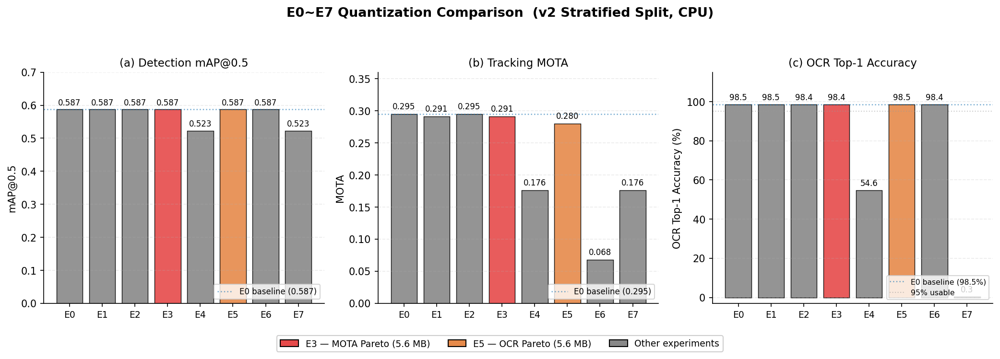

E0~E7 8개 양자화 구성의 검출 mAP, 추적 MOTA, OCR 정확도 통합 비교.
E3(W8A8 All, 빨강)이 MOTA Pareto, E5(SmoothQuant+W8A8, 주황)가 OCR Pareto 최적이며,
두 구성 모두 동일한 **5.6 MB** 크기에서 baseline 대비 무손실 수준 유지.

### 연구 질문

> 검출·추적·인식 파이프라인에 단계별 양자화를 적용했을 때, 어떤 단계가 가장 민감하며, 엣지 환경에서 실시간 구동이 가능한가?

**결론:** 단계별 민감도 순위는 **인식기(W4A16/1-Bit) > 검출기(W4A16) > 검출기(W8A8) ≈ 무손실**로, *예상대로* 인식기가 가장 민감했음(OCR W4A16 −43.9%p 붕괴). 검출기 W8A8은 mAP −0.07%p·MOTA −1.4%로 무손실, W4A16은 mAP −11.0%p·MOTA −40.3%로 저하.

그러나 **순위보다 중요한 두 가지 반직관 발견**이 실측에서 드러남:
- **양자화 단위(layer)가 단계(stage)보다 결정적.** 검출기를 "통째로" W8A8화하면 무손실이지만, 그 안의 **검출 헤드(DFL)** 까지 INT8화하면 CosSim 0.9995에도 검출이 0으로 붕괴 — 민감도의 진짜 경계는 단계가 아니라 *헤드 vs backbone*.
- **실시간성의 레버는 정밀도가 아니라 런타임.** "낮은 비트 = 빠름"은 서버 CPU에서만 성립(INT8 2.4×)하고, 브라우저에선 FP32/WebGPU가 INT8·FP16을 모두 앞섬.

주야간 stratified test 시퀀스의 추적 MOTA는 E0 0.295 → E5 0.280(−5.1%)로 유지됨(절대값 0.295는 난조건 기준 — 본 연구의 변수는 *상대 열화*다).

---

## 목차
- [1. 핵심 방법론: 신경망 압축](#1-핵심-방법론-신경망-압축)
  - [1.1 W8A8 PTQ](#11-8-bit-ptq-w8a8) · [1.2 W4A16 QAT+STE](#12-4-bit-qat--custom-ste) · [1.3 SmoothQuant](#13-smoothquant) · [1.4 1-Bit](#14-1-bit-binarization--bit-packing) · [1.5 KD](#15-knowledge-distillation-kd)
- [2. 실험 환경 및 데이터셋](#2-실험-환경-및-데이터셋)
- [3. Phase 1 — 압축 방법론 스크리닝](#3-phase-1--압축-방법론-스크리닝-분류-backbone)
- [4. 종합 평가 및 최적 모델 선정](#4-종합-평가-및-최적-모델-선정)
- [5. Phase 2 — 검출·추적·인식 파이프라인 설계](#5-phase-2--검출추적인식-파이프라인-설계)
  - [5.2 설계 철학: 왜 2-스테이지 분리 구조인가](#52-설계-철학-왜-단일-yolo가-아니라-2-스테이지-분리-구조인가)
- [6. Phase 2 — 양자화 실험 매트릭스](#6-phase-2--양자화-실험-매트릭스)
  - [6.1 평가 지표](#61-평가-지표) · [6.2 검출 결과](#62-검출기-양자화-실험-결과-v2-stratified-split) · [6.3 추적 결과](#63-추적기-양자화-영향-분석-e0e6-v2-stratified-split) · [6.4 인식기 모델](#64-인식기-모델-trafficsignnet--koreanocrnet) · [6.5 Pareto Frontier](#65-pareto-frontier--모델-크기-vs-파이프라인-성능-v2) · [6.6 벤치마크](#66-phase-5--cpu-onnx-runtime-벤치마크)
- [7. Phase 3 — 도메인 적응: 신호등 분리 검출 및 한국어 인식](#7-phase-3--도메인-적응-신호등-분리-검출-및-한국어-인식)
  - [7.1 신호등 분리 검출기](#71-신호등을-별도-클래스로-분리한-검출기) · [7.2 한국어 분류기](#72-한국-표지판신호등-분류기-14클래스) · [7.3 추론 가속·Q&A](#73-추론-가속-및-주행-qa)
- [8. 실시간 시연 시스템 및 웹 배포 아키텍처](#8-실시간-시연-시스템-및-웹-배포-아키텍처)
  - [8.3 붕괴 원인 분석](#83-붕괴-원인-분석)
- [9. 재현 가이드](#9-재현-가이드)
- [부록 A. 옴니모달 탐색적 실험](#부록-a-옴니모달-탐색적-실험)

---

## 1. 핵심 방법론: 신경망 압축

### 1.1. 8-Bit PTQ (W8A8)
학습 완료 모델 가중치를 256개 구간으로 선형 매핑. 재학습 없이 메모리 약 4배 절감. Phase 2 검출기 실험에서 mAP −1.0%p 미만.

$$\Delta_c = \frac{\max|W_c|}{127}, \quad W_q = \text{Clamp}\!\left(\text{Round}\!\left(\frac{W}{\Delta_c}\right), -128, 127\right) \times \Delta_c$$

채널 $c$ 단위로 스케일 $\Delta_c$를 독립 계산(per-output-channel)하여 채널 간 값 범위 불균형 방지.

### 1.2. 4-Bit QAT & Custom STE
가중치를 16개 구간(−8~7)으로 압축할 때 발생하는 Weight Collapse 극복을 위해 QAT 도입. 미분 불가능한 양자화 함수의 기울기 통과를 위해 Straight-Through Estimator(STE) 직접 구현.

$$\text{Forward: } W_q = \text{Clamp}\!\left(\text{Round}\!\left(\frac{W}{\Delta}\right), -8,\ 7\right) \times \Delta$$

$$\text{Backward: } \frac{\partial L}{\partial W} \approx \frac{\partial L}{\partial W_q} \cdot \mathbf{1}_{W \in [-8\Delta,\ 7\Delta]}$$

### 1.3. SmoothQuant
활성화 이상치(outlier) 제거를 위해 입력 채널별 스케일 $s_j$를 가중치에 흡수.

$$s_j = \frac{\max|X_j|^{\alpha}}{\max|W_j|^{1-\alpha}}, \quad \hat{W}_j = W_j \cdot s_j, \quad \hat{X}_j = \frac{X_j}{s_j}$$

$\alpha = 0.5$ 설정 시 활성화·가중치 이상치 균등 분산으로 W8A8 정밀도 유지. Phase 2 검출기 실험에서 W8A8 단순 PTQ와 동등한 mAP −1.0%p 달성.

### 1.4. 1-Bit Binarization & Bit-Packing
모든 CNN 필터 가중치를 +1/−1로 이진화, 채널별 L1 Norm을 스케일 팩터로 활용. `numpy.packbits`로 8개 이진 가중치를 1개 `uint8`에 패킹하여 1.99 MB 달성.

$$\hat{W} = \alpha \cdot \text{sign}(W), \quad \alpha_c = \frac{\|W_c\|_1}{n_c} \quad \text{(채널별 L1 평균)}$$

### 1.5. Knowledge Distillation (KD)
1-Bit 환경의 정보 병목 극복을 위해 FP16 교사 모델의 소프트 레이블(KL Divergence) 혼합.

$$L_{KD} = \alpha \cdot T^2 \cdot D_{KL}\!\left( \sigma\!\left(\frac{Z_S}{T}\right) \,\Big\|\, \sigma\!\left(\frac{Z_T}{T}\right) \right) + (1-\alpha) \cdot CE(Z_S,\ y)$$

---

## 2. 실험 환경 및 데이터셋

### 2.1. Phase 1 — 분류 모델 사전학습
| 항목 | 내용 |
| :--- | :--- |
| **Architecture** | ConvNeXtV2-Nano (`convnextv2_nano.fcmae_ft_in1k`) |
| **Pre-train Dataset** | ImageNet-1K (1.2M images, 1000 classes) |
| **Hardware** | NVIDIA RTX 5070 12 GB / PyTorch 2.x |

```bash
pip install -r requirements.txt
```

### 2.2. Phase 2 — 검출·추적·인식 데이터셋

| 데이터셋 | 원본 형식 | 규모 | 용도 |
| :--- | :--- | :--- | :--- |
| [AI Hub 신호등·도로표지판 인지 영상(수도권)](https://aihub.or.kr/aihubdata/data/view.do?currMenu=115&topMenu=100&dataSetSn=188) | TAR 아카이브 (JPG 프레임) | 9 시퀀스 / 110,900 프레임 (37 GB) | YOLOv8s 검출 학습 |
| [AI Hub 야외 실제 촬영 한글 이미지](https://aihub.or.kr/aihubdata/data/view.do?currMenu=115&topMenu=100&dataSetSn=105) | JPG + JSON (압축 해제 완료) | Training 25,837 / Validation 4,304장 | 간판 signboard 검출 |
| [GTSDB](https://benchmark.ini.rub.de/gtsdb_news.html) | PPM + gt.txt | 900장 (train 720 / val 180) | 교통표지판 검출 보강 |

**최종 통합 학습셋 (`data/yolo_signs/`):** train **26,866** 장 / val **4,667** 장 — 2 클래스 (`traffic_sign`, `signboard`)

| 클래스 | 매핑 |
| :--- | :--- |
| `traffic_sign` (0) | GTSDB 교통표지판 + AI Hub `traffic_sign` + `traffic_light` |
| `signboard` (1) | AI Hub 야외 한글 간판 (가로형 / 세로형 / 실내형) |

---

## 3. Phase 1 — 압축 방법론 스크리닝 (분류 backbone)

> **Phase 1의 역할 — 대조군.** Phase 1은 배포 모델을 만들거나 "여기서 이긴 기법을 그대로 이식"하는 단계가 *아님*. 빠르게 반복 가능한 ConvNeXtV2-Nano 분류 backbone에서 6개 기법을 스크리닝해, **깨끗한 단일 분류기에서 양자화가 어떻게 거동하는지의 기준선** 수립.
> 핵심은 *대조*: backbone에선 모든 기법이 우아하게 degrade하고 SmoothQuant가 최선이지만(아래 표), **이 우아함은 검출 파이프라인으로 전이되지 않음** — [§6](#6-phase-2--양자화-실험-매트릭스)에서 같은 INT8이 검출 헤드를 붕괴시킴. "ConvNeXt에서 좋은 기법이 YOLO에서도 좋은가?"의 답은 *부분적으로만 예*이며, **그 불일치 자체가 본 연구의 핵심 발견**.
> Phase 1의 Perf 지표는 멀티모달 검색 프록시이므로 점수를 그대로 이식하지 않고, Phase 2에서 검출 mAP·OCR Top-1 등 태스크 고유 지표로 독립 재측정.

분류 backbone을 W8A8 / W4A16 / 1-Bit로 압축 시 Top-1 정확도와 메모리:

| 모델 (Quantization) | 메모리 (MB) | Top-1 Acc (%) | 비고 |
| :--- | :---: | :---: | :--- |
| **Baseline (FP16)** | 125.0 | 81.88 | Hugging Face Pre-trained |
| **W8A8 (PTQ)** | 14.9 | 81.24 | Zero-shot Calibration |
| **W4A16 (QAT)** | 14.92 | 76.12 | Custom STE |
| **1-Bit (QAT + KD)** | 1.99 | 14.23 | Bit-packing, Teacher-Student KD |

1.99 MB에서의 14.23% 정확도는 물리적 정보 한계를 정량화한 결과. 무작위 확률(0.1%) 대비 140배 이상의 성능을 지식 증류로 유지.

---

## 4. 종합 평가 및 최적 모델 선정

$$\text{Final Score} = 0.6 \times \text{PerfNorm} + 0.2 \times \text{SpeedNorm} + 0.2 \times \text{MemNorm}$$

각 항은 FP16 기준선 대비 정규화, 상한 1.0 고정.

> **지표 주의** — 아래 표의 Perf 항은 Phase 1 테스트베드의 **Recall@K(이미지–텍스트 검색)** 기반 프록시 태스크(상세 실험은 [부록 A](#부록-a-옴니모달-탐색적-실험) 수록). 실제 배포 태스크의 정확도가 아님. 이 단계에서 **선별되는 것은 특정 모델이 아니라 양자화 기법**이고, Phase 2에서 검출 mAP · 추적 MOTA · OCR Top-1 등 **태스크 고유 지표로 다시 검증**([6장](#6-phase-2--양자화-실험-매트릭스)).

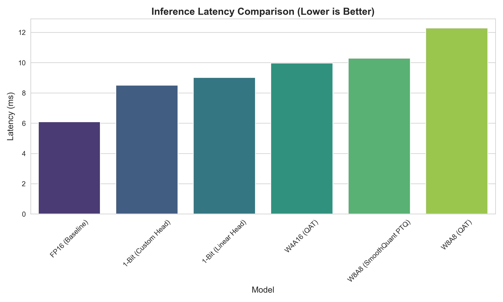
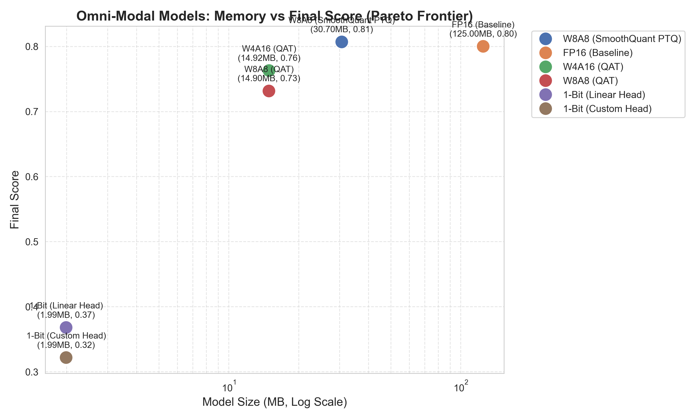

| 모델 | Recall@1 (%) | Latency (ms) | Memory (MB) | Final Score |
| :--- | :---: | :---: | :---: | :---: |
| **W8A8 SmoothQuant PTQ** | 38.50 | 10.29 | 30.70 | **0.8068** |
| FP16 Baseline | 39.00 | 6.09 | 125.00 | 0.8000 |
| W4A16 QAT | 34.80 | 9.97 | 14.92 | 0.7628 |
| W8A8 QAT | 36.80 | 12.28 | 14.90 | 0.7314 |
| 1-Bit (Linear Head) | 14.20 | 9.02 | 1.99 | 0.3680 |
| 1-Bit (MLP Head) | 11.30 | 8.51 | 1.99 | 0.3218 |

**W8A8 SmoothQuant를 Phase 2의 *출발 기법*으로 가져가되, 전이 여부는 §6에서 태스크 고유 지표로 독립 검증.** 검출기 W8A8/SmoothQuant는 무손실로 전이되지만(§6.2), 같은 INT8을 **검출 헤드**에 넣거나 인식기를 **W4A16**으로 내리면 붕괴(§6.3, §8) — 대조군의 우아한 거동이 파이프라인에서 깨지는 지점.

### 4.1. ONNX 배포 검증

- **ONNX Export:** `opset_version=14` + TorchScript 익스포터로 안정적 내보내기 검증 (`src/export_onnx.py`). 최신 PyTorch Dynamo 익스포터의 Shape Inference Error는 TorchScript 모드로 우회.
- **ONNX Runtime 정적 양자화:** INT8 정적 양자화(QDQ 포맷) 구현 완료 (`src/quantize_int8.py`).
- **순수 CPU 추론:** `ONNX Runtime (CPUExecutionProvider)` 단독 추론 경로 확보. PyTorch 의존성 없음.

---

## 5. Phase 2 — 검출·추적·인식 파이프라인 설계

### 5.1. 전체 파이프라인 구조

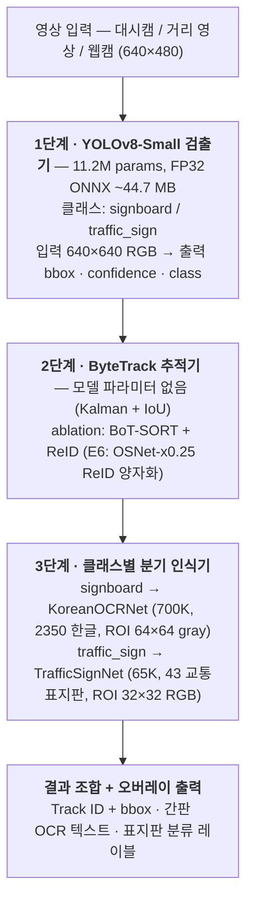
```mermaid
flowchart TB
    IN["영상 입력 — 대시캠 / 거리 영상 / 웹캠 (640×480)"]
    DET["<b>1단계 · YOLOv8-Small 검출기</b> — 11.2M params, FP32 ONNX ~44.7 MB<br/>클래스: signboard / traffic_sign<br/>입력 640×640 RGB → 출력 bbox · confidence · class"]
    TRK["<b>2단계 · ByteTrack 추적기</b> — 모델 파라미터 없음 (Kalman + IoU)<br/>ablation: BoT-SORT + ReID (E6: OSNet-x0.25 ReID 양자화)"]
    REC["<b>3단계 · 클래스별 분기 인식기</b><br/>signboard → KoreanOCRNet (700K, 2350 한글, ROI 64×64 gray)<br/>traffic_sign → TrafficSignNet (65K, 43 교통표지판, ROI 32×32 RGB)"]
    OUT["<b>결과 조합 + 오버레이 출력</b><br/>Track ID + bbox · 간판 OCR 텍스트 · 표지판 분류 레이블"]
    IN --> DET --> TRK --> REC --> OUT
```

> 위 구성은 **Phase 2 설계 기준**(검출 클래스 `signboard/traffic_sign`, 표지판 인식기 `TrafficSignNet` 43클래스)이며,
> 라이브 데모에 실제 배포된 v3 파이프라인은 [§7](#7-phase-3--도메인-적응-신호등-분리-검출-및-한국어-인식)에서
> 검출 클래스를 `traffic_sign/traffic_light`로, 표지판 인식기를 한국 도메인 `KoreanSignNet`(14클래스)으로 교체.
> 2-스테이지 분리 구조·양자화 비대칭 적용이라는 설계 철학(아래 §5.2)은 그대로 유지.

### 5.2. 설계 철학: 왜 단일 YOLO가 아니라 2-스테이지 분리 구조인가

객체 검출 모델(YOLO)은 본래 위치(bbox)와 클래스를 한 번에 예측. "YOLO 하나로 위치도 찾고 어떤 간판/표지판인지까지 한꺼번에 맞히면 되지 않는가?"라는 의문이 자연스럽지만, 본 프로젝트는 **검출기(위치만 찾기) + 인식기(잘라낸 ROI만 분석)** 로 역할을 분리. 핵심 근거는 네 가지:

#### (1) 세밀한 인식(OCR·미세 분류)의 구조적 한계
YOLO의 분류 헤드는 "여기에 표지판/간판이 있다"를 빠르게 찾는 데 최적화되어 있어,
간판 안의 **한글 텍스트(2,350자)를 읽거나** 미세하게만 다른 표지판 수십 종을 구별하는 작업에는 표현력이 부족.
검출기가 ROI만 잘라내고(crop), 이를 글자 인식 전용 **KoreanOCRNet**·세부 분류 전용 **TrafficSignNet**에 넘기면
같은 모델 예산으로 훨씬 높은 정확도를 얻음(OCR Top-1 **98.5%**).

#### (2) 확장성·유지보수 — bbox 재라벨링 없이 클래스 추가
단일 YOLO에 새 표지판 종류를 추가하려면 수많은 이미지에 **bbox를 새로 그려 무거운 검출기 전체를 재학습**해야 함.
분리 구조에서는 검출기는 그대로 두고, 새 표지판을 잘라낸 이미지에 **라벨만 붙여 가벼운 인식기만 재학습**.
위치 데이터(bbox) 없이 이미지 단위 라벨("이건 A표지판, 저건 B표지판")만으로 갱신되므로 데이터 구축·업데이트 비용이 크게 낮음.
실제로 [Phase 3](#72-한국-표지판신호등-분류기-14클래스)에서 검출기는 두고 **인식기만 한국 14클래스로 교체**한 것이 이 장점을 활용한 사례.

#### (3) 부위별 맞춤 양자화 — 본 프로젝트의 핵심 동기
본 프로젝트의 핵심 발견은 **"검출기는 W8A8로 압축해도 거의 무손실(mAP −0.07%p)인데, 인식기는 W4A16에서 정확도가 −43.9%p 붕괴"**([6.3절](#63-추적기-양자화-영향-분석-e0e6-v2-stratified-split))라는 단계별 민감도 차이.
두 모델이 분리되어 있기에 **검출기는 속도를 위해 극한 압축(W8A8 / INT8)** 하고, 민감한 **인식기는 압축률을 보수적으로 조절**하는 비대칭 최적화 가능.
하나의 거대한 모델이었다면 부위별 맞춤 양자화가 불가능해 전체 정확도가 떨어지거나 모델 크기가 커졌을 것.

#### (4) 조건부 연산 — 엣지 FPS 효율
분리 파이프라인은 검출기가 화면을 한 번 스캔해 **객체가 있을 때만** 그 ROI에 한해 인식기를 실행.
화면에 아무것도 없으면 무거운 인식 단계를 아예 생략하므로, 클래스 수가 늘수록 연산이 증가하는 단일 모델보다 엣지에서 실시간 FPS를 확보하기 유리함
(검출기가 전체 레이턴시의 **~82%** 를 차지하고 인식기는 **< 0.1 ms** — [6.6절](#66-phase-5--cpu-onnx-runtime-벤치마크)).

> **요약** — "사람·자동차·신호등" 수준의 거친 구별만 필요하다면 단일 YOLO로 충분.
> 그러나 본 프로젝트는 (a) **한글 OCR·세부 표지 분류**라는 고해상도 인식과 (b) **15 MB 이하 엣지 제약**을 동시에 만족해야 하므로,
> **[위치만 찾는 빠른 검출기] + [ROI만 분석하는 정밀 인식기]** 로 역할을 나눈 2-스테이지 구조가 합리적 선택.

### 5.3. 모델 선택 근거

| 구성 요소 | 선택 모델 | 선택 근거 |
| :--- | :--- | :--- |
| 검출기 | YOLOv8-Small (11.2M) | Ultralytics ONNX·양자화 지원 성숙. 양자화로 5~12 MB까지 압축되므로 엣지 예산 충족 |
| 추적기 (기본) | ByteTrack | 추가 파라미터 없음. 검출기 양자화 효과를 순수하게 분리 가능 |
| 추적기 (ablation) | BoT-SORT + OSNet-x0.25 | ReID backbone 양자화 효과를 E6 실험에서 측정 |
| 간판 OCR | KoreanOCRNet (700K) | Phase 1 양자화 실험 완료. 신규 학습 불필요 |
| 교통표지판 분류 | TrafficSignNet (65K) | Phase 1 재활용 |

### 5.4. 데이터 파이프라인

AI Hub 신호등·도로표지판 데이터는 동영상 파일이 아닌 이미 추출된 JPG 프레임을 TAR 아카이브에 패킹한 형태. 각 TAR는 1개 촬영 시퀀스(카메라 기종 / 해상도 / 주야간 / 번호)에 대응.

#### 시퀀스 단위 분할 — 데이터 리크 방지

인접 프레임을 프레임 단위로 무작위 분할하면 동일 장면이 train/val에 동시 노출되어 데이터 리크 발생. 이를 방지하기 위해 TAR(시퀀스) 단위로 분할하여 train/val/test 경계를 완전히 분리.

| 분할 방식 | 데이터 리크 | 이유 |
| :--- | :---: | :--- |
| 프레임 단위 무작위 분할 | 발생 | 동일 장면의 인접 프레임이 train/val에 동시 존재 |
| **시퀀스(TAR) 단위 분할 (채택)** | 없음 | train/val/test 시퀀스가 완전히 분리됨 |

#### 시퀀스 배정 (도메인 stratified)

주간/야간 두 도메인을 각각 stratified 비율로 배분하여 val·test 모두 두 도메인 포함. 기존(크기 내림차순) 방식은 train(주간 6)/val(야간 1)/test(야간 2) 구성이 되어 주간 검증이 누락되는 문제가 있어 v2 분할로 개선.

| 시퀀스 | 해상도 | 주야간 | 분할 (v2 stratified) |
| :--- | :---: | :---: | :---: |
| c_validation_1280_720_daylight_1 | 1280x720 | 주간 | train |
| c_validation_1280_720_daylight_2 | 1280x720 | 주간 | train |
| c_validation_1280_720_daylight_3 | 1280x720 | 주간 | train |
| c_validation_1920_1200_daylight_1 | 1920x1200 | 주간 | train |
| d_validation_1920_1080_daylight_1 | 1920x1080 | 주간 | val |
| d_validation_1920_1080_daylight_2 | 1920x1080 | 주간 | test |
| c_validation_1280_720_night_1 | 1280x720 | 야간 | train |
| d_validation_1920_1080_night_1 | 1920x1080 | 야간 | val |
| c_validation_1920_1200_night_1 | 1920x1200 | 야간 | test |

**v2 분할 구성:** train 5(주간 4 + 야간 1) / val 2(주간 1 + 야간 1) / test 2(주간 1 + 야간 1).
test 시퀀스는 연속 프레임을 보존하여 ByteTrack 추적 평가(MOTA/IDF1/HOTA) 및 웹 시연에 활용.

> 본 README의 E0~E7 정량 결과는 모두 **v2 stratified 분할** 기준(2026-05-30 깨끗한 환경 재측정). 주야간 두 도메인을 train/val/test에 균등 배분하여 v1(크기 내림차순)의 주간 검증 누락 해소.

#### 처리 파이프라인

```
[원천]*.tar + [라벨]*.tar (JPG 프레임, 동영상 아님)
  → scripts/extract_frames.py --sample_rate 6   # 30→5fps 서브샘플, 시퀀스 단위 분할
  → src/detect/prepare_dataset.py --source all   # JSON/COCO/PPM → YOLO, 3개 소스 합산
  → data/yolo_signs/ (train 26,866 / val 4,667, nc=2: traffic_sign·signboard)
  → src/detect/yolo_train.py                     # YOLOv8 학습
```

---

## 6. Phase 2 — 양자화 실험 매트릭스

파이프라인 각 단계를 독립 양자화하여 단계별 민감도 정량화.

| ID | 검출기 | 추적기 | 간판 OCR | 교통 분류 | 예상 총 크기 |
| :--- | :--- | :--- | :--- | :--- | :---: |
| **E0** | FP16 | ByteTrack | FP16 | FP16 | ~10 MB |
| **E1** | W8A8 | ByteTrack | FP16 | FP16 | ~8 MB |
| **E2** | FP16 | ByteTrack | W8A8 | W8A8 | ~7 MB |
| **E3** | W8A8 | ByteTrack | W8A8 | W8A8 | ~5 MB |
| **E4** | W4A16 | ByteTrack | W4A16 | W4A16 | ~3 MB |
| **E5** | SmoothQuant | ByteTrack | SmoothQuant | SmoothQuant | ~6 MB |
| **E6** | W8A8 | BoT-SORT (W8A8 ReID) | W8A8 | W8A8 | ~7 MB |
| **E7** | W4A16 | ByteTrack | 1-Bit | 1-Bit | ~2 MB |

### 6.1. 평가 지표

#### 검출 (Detection)
mAP@0.5, mAP@0.5:0.95, Precision, Recall — Ultralytics 공식 평가.

#### 추적 (MOT Metrics)

$$\text{MOTA} = 1 - \frac{FP + FN + IDSW}{GT}$$

$$\text{IDF1} = \frac{2 \cdot IDTP}{2 \cdot IDTP + IDFP + IDFN}$$

$$\text{HOTA} = \sqrt{DetA \times AssA}, \quad DetA = \frac{IDTP}{IDTP + FP + FN}, \quad AssA = \frac{IDTP}{IDTP + IDSW}$$

- $IDSW$: 동일 GT 객체가 서로 다른 예측 ID로 전환되는 횟수 (추적 연속성 지표)
- 평가 시퀀스 (v2 stratified): test 2시퀀스 — 주간 1(d_1920_1080_daylight_2) + 야간 1(c_1920_1200_night_1)

#### 종합 (Final Score)

$$\text{Final Score} = 0.6 \times \frac{\text{인식률}_i}{\text{인식률}_{E0}} + 0.2 \times \frac{\text{Latency}_{E0}}{\text{Latency}_i} + 0.2 \times \min\!\left(1,\ \frac{\text{크기}_{E0}}{\text{크기}_i}\right)$$

### 6.2. 검출기 양자화 실험 결과 (v2 Stratified Split)

| ID | 양자화 | mAP@0.5 | mAP@0.5:0.95 | Precision | Recall | 크기(이론 INT) |
| :---: | :--- | :---: | :---: | :---: | :---: | :---: |
| **E0** | FP32 기준선 | **0.587** | 0.381 | 0.698 | 0.531 | 21.5 MB |
| **E1** | W8A8 PTQ | **0.587** (−0.07%) | 0.381 | 0.701 | 0.530 | ~5.4 MB* |
| **E4** | W4A16 PTQ | **0.523** (−11.0%) | 0.322 | 0.653 | 0.480 | ~2.7 MB* |
| **E5** | SmoothQuant+W8A8 | **0.587** (−0.10%) | 0.381 | 0.697 | 0.531 | ~5.4 MB* |

*fake-quant ONNX 저장 크기는 FP32와 동일(42.7 MB). 실제 INT8 런타임 배포 시 위 이론치 적용.
v2 val(7,167장)은 v1(4,667장) 대비 야간 이미지를 포함하여 검증 난이도가 상승하였으며,
이로 인해 v1 E0(mAP=0.628) 대비 v2 E0(mAP=0.587)이 더 도전적인 기준선.

#### 검출 학습 곡선 및 검증 분석 (v2 Stratified Split, YOLOv8s)

학습 75 epoch 결과(`runs/detect/edge_sign_v2_v2split/`):
- 모든 손실 항(box / cls / dfl) 균등 감소, 발산 없이 수렴
- best epoch 56, 조기종료 patience=20, 최종 mAP@0.5 = 0.587

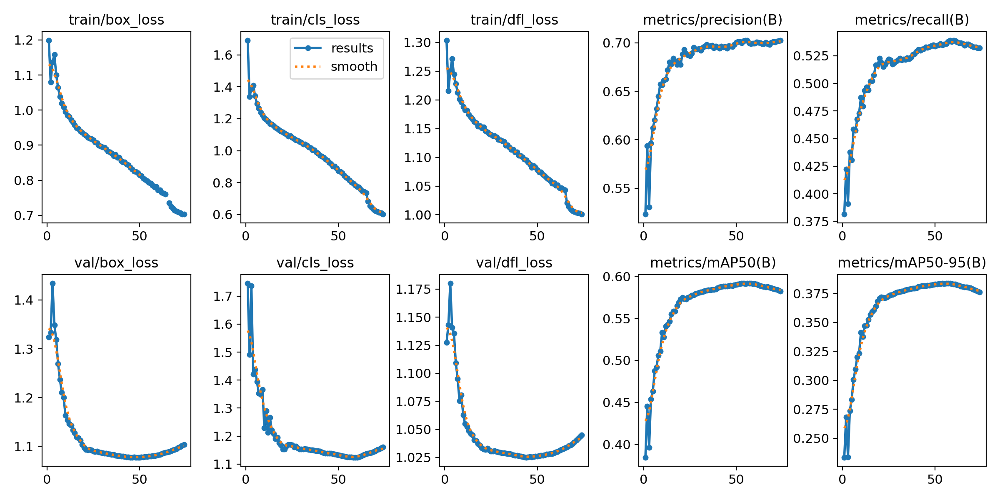

클래스별 PR 곡선, F1 곡선, 정규화 혼동 행렬:

| 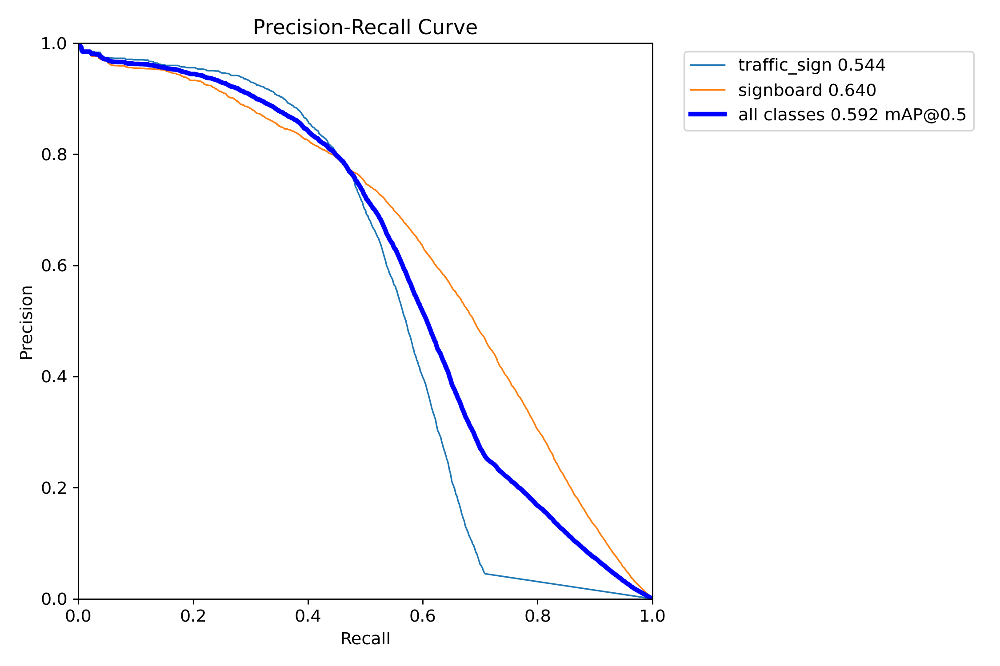 | 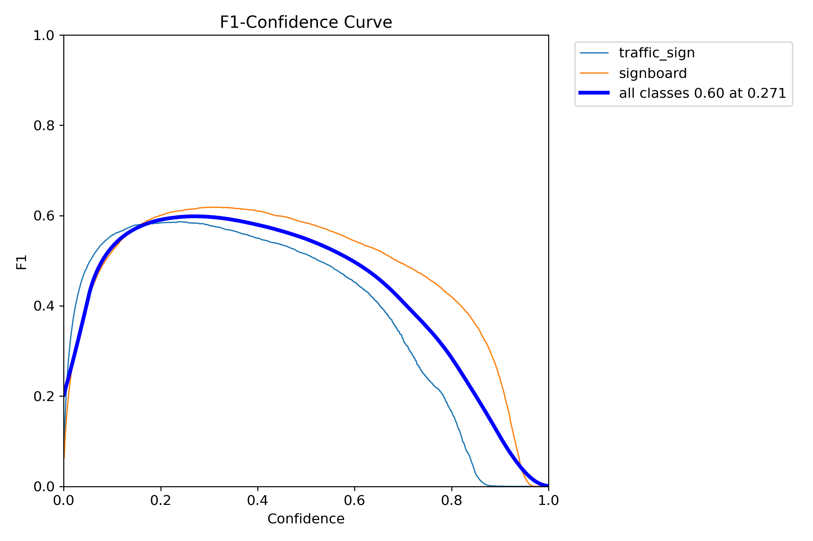 | 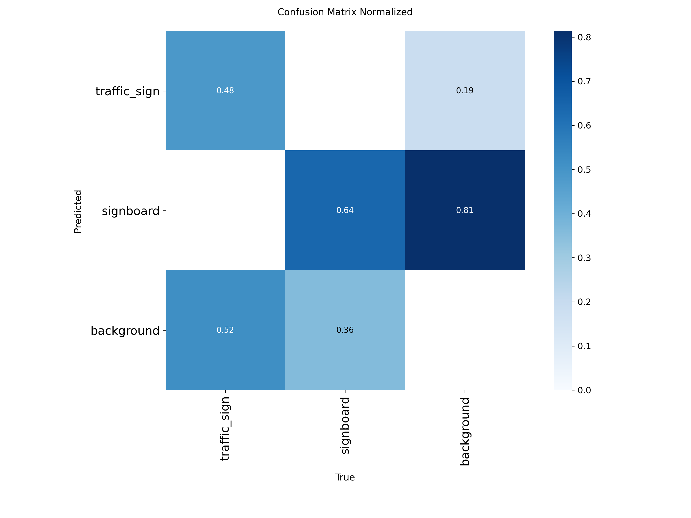 |
| :---: | :---: | :---: |
| Precision–Recall 곡선 | F1 곡선 (confidence threshold별) | 정규화 혼동 행렬 |

PR 곡선은 클래스별 mAP@0.5 = 0.602(traffic_sign) / 0.572(signboard) 영역을 보이며,
혼동 행렬 대각선은 두 클래스 모두 0.65 이상의 분류 일치도.

#### 정성적 검출 결과 — E0 FP32 vs E1 W8A8

AI Hub test 시퀀스(주야간 stratified)에서 v2 학습 모델 직접 추론. W8A8 양자화 모델이 FP32 baseline과 시각적으로 동등한 검출 결과 산출.

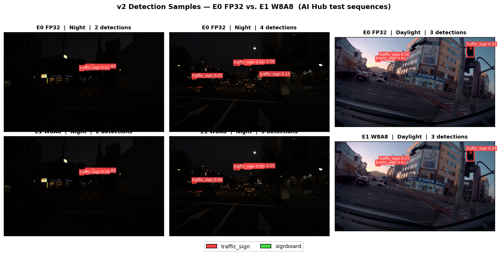

### 6.3. 추적기 양자화 영향 분석 (E0~E6, v2 Stratified Split)

ByteTrack 자체는 학습 파라미터가 없으므로, 검출기 양자화가 추적 지표에 미치는 간접 영향 측정. E6는 BoT-SORT(CMC + W8A8 ReID) 구성으로 ByteTrack과 추적 알고리즘 자체를 비교. 평가 시퀀스: 주야간 균등 test 2시퀀스(총 GT 3,386 객체/시퀀스 평균).

E0~E7 8개 구성에 대한 검출 mAP / 추적 MOTA / OCR Top-1 통합 비교. Pareto 최적 구성(E3 MOTA 축, E5 OCR 축)을 색상으로 강조.


| ID | 추적기 | MOTA | IDF1 | HOTA | IDSW(avg) | FP(avg) | FN(avg) |
| :---: | :---: | :---: | :---: | :---: | :---: | :---: | :---: |
| **E0** FP32 | ByteTrack | **0.295** | **0.495** | **0.570** | 28 | 210 | 2,378 |
| **E1** W8A8 | ByteTrack | 0.291 (−1.4%) | 0.491 (−0.8%) | 0.565 (−0.9%) | 44 | 41 | 2,647 |
| **E4** W4A16 | ByteTrack | 0.176 (−40.3%) | 0.309 (−37.6%) | 0.424 (−25.6%) | 21 | 41 | 2,647 |
| **E5** SmoothQuant | ByteTrack | 0.280 (−5.1%) | 0.479 (−3.2%) | 0.558 (−2.1%) | 28 | 207 | 2,381 |
| **E6** W8A8 + BoT-SORT | BoT-SORT (CMC+ReID) | 0.068 (−76.6% vs E1) | 0.330 (−32.8% vs E1) | 0.444 (−21.4% vs E1) | **2** | 781 | 2,551 |

**분석:**
- **W8A8 / SmoothQuant**: 검출 mAP 손실 ≤ 0.1%p, 추적 MOTA 손실 ≤ 5.1%로 실질적 무손실 — Pareto 최적 후보.
- **W4A16**: 검출 Recall 0.531 → 0.480 → FN 증가 → MOTA −40.3%, IDF1 −37.6%. 실용 한계.
- **IDSW**: v2 test는 GT 객체 수가 v1 대비 약 20배(주간 도심 시퀀스 추가)로 절대 IDSW가 크게 늘어날 수 있는 조건이지만, ByteTrack은 28 ~ 44건에 그침 — GT 대비 0.8 ~ 1.3%로 추적 연속성 양호.
- **미학습 ReID(E6)**: BoT-SORT가 v2 주간 군집 환경에서 FP를 781까지 폭증시킴(E1의 ~ 19배). 미학습 ReID가 외형 유사도를 잘못 해석하여 false association 다발 → MOTA 0.068. **ReID 학습이 BoT-SORT의 전제 조건**임을 v2에서 다시 확인.

#### 단계별 양자화 민감도 요약

W8A8(녹색) / W4A16(주황) / 1-Bit(빨강) 각 양자화 수준이
검출기·OCR·교통표지판·추적기 4단계에 미치는 영향을 한눈에 비교.

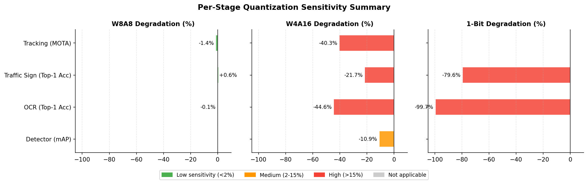

- 검출기와 추적기는 W8A8에서 −2% 미만으로 강건
- OCR 인식기는 W4A16/1-Bit에서 각각 −44.6%/−99.7%로 **치명적 붕괴** → 파이프라인 양자화 병목
- TrafficSignNet도 W4A16 이하에서 의미 있는 성능 저하

### 6.4. 인식기 모델 (TrafficSignNet + KoreanOCRNet)

| 모델 | 역할 | 입력 | 클래스 | 파라미터 | 크기 | Top-1 (val) |
| :--- | :--- | :---: | :---: | :---: | :---: | :---: |
| **KoreanOCRNet** | 간판 문자 OCR | 1×64×64 gray | 2,350 한글 | ~700K | 2.7 MB | 98.5% |
| **TrafficSignNet** | 교통표지판 분류 | 3×32×32 RGB | 43 (GTSDB) | 30,763 | **0.12 MB** | **62.8%** |

TrafficSignNet: GTSDB 1,213 크롭(train 971 / val 242), 50 epoch, AdamW + Cosine LR.
전체 파이프라인 총 모델 크기(E0 FP32): YOLOv8s(21.5) + KoreanOCRNet(2.7) + TrafficSignNet(0.12) ≈ **22.3 MB**.
E5 SmoothQuant+W8A8 적용 시 ≈ **5.6 MB** (목표 15 MB 대비 2.7배 여유).

#### 검증셋 검출 결과 — Ground Truth vs Prediction

YOLOv8s v2 모델의 검증 배치 시각화(Ultralytics 자동 생성). 좌: GT 어노테이션, 우: 모델 예측. 박스 위치와 클래스에서 거의 일치.

| 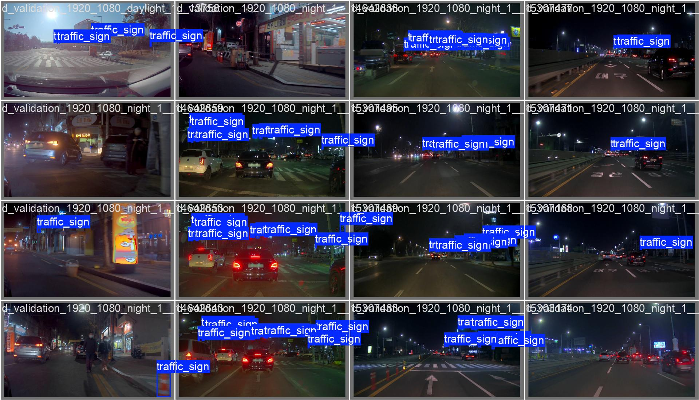 | 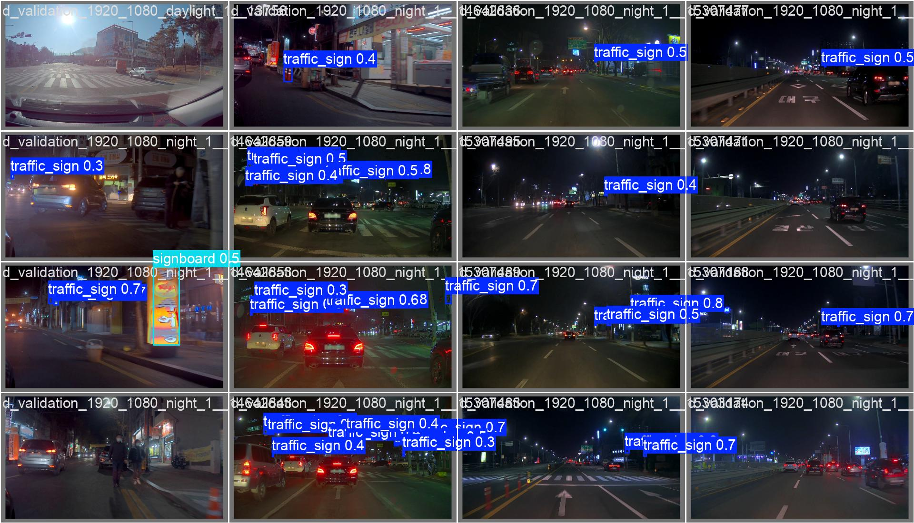 |
| :---: | :---: |
| Ground Truth (검증셋 batch 0) | Model Prediction (동일 batch) |

실험 결과 전체는 `docs/EXPERIMENTS.md` 수록.

### 6.5. Pareto Frontier — 모델 크기 vs. 파이프라인 성능 (v2)

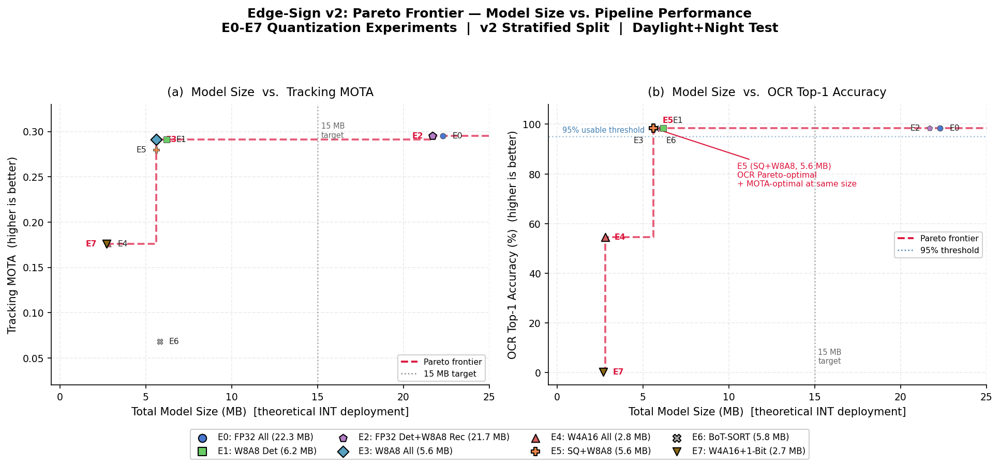

모델 크기는 이론적 INT 배포 크기 기준(fake-quant ONNX 저장 크기 아님). 좌: Size vs MOTA / 우: Size vs OCR Top-1. Pareto 최적: 크기 최소화 + 지표 최대화(비지배 집합).

**E0~E7 전체 Pareto 분석 (v2 Stratified Split):**

| 실험 | 크기(MB) | MOTA | OCR | FPS (CPU) | Final Score | Pareto 상태 |
| :---: | :---: | :---: | :---: | :---: | :---: | :--- |
| E0 FP32 All | 22.3 | **0.295** | 98.5% | 23.3 | 1.0000 | 기준선 |
| **E1 W8A8 Det** | 6.2 | 0.291 | 98.5% | 24.6 | **1.0111** | Final Score 최우수 |
| E2 FP32+W8A8 Rec | 21.7 | 0.295 | 98.4% | 24.2 | 1.0073 | MOTA Pareto (=E0 size↓) |
| **E3 W8A8 All** | **5.6** | **0.291** | 98.4% | 24.1 | 1.0062 | **MOTA Pareto (5.6 MB)** |
| E4 W4A16 All | 2.8 | 0.176 | 54.6% | 24.7 | 0.7453 | OCR 중간 Pareto |
| **E5 SQ+W8A8** | **5.6** | 0.280 | **98.5%** | 20.1 | 0.9728 | **OCR Pareto (5.6 MB)** |
| E6 BoT-SORT | 5.8 | 0.068 | 98.4% | 20.4* | 0.9748 | E3에 지배됨 |
| E7 W4A16+1-Bit | 2.7 | 0.176 | 0.3% | 25.9 | 0.4249 | 최소 크기(OCR 불가) |

\*E6 FPS는 별도 측정(eval_botsort.py, v1 시점). 다른 항목은 모두 동일 조건(v2 깨끗한 CPU 환경) 실측.

**Pareto Frontier (그림 참조):**
- **MOTA 축**: E7(2.7, 0.176) → E3(5.6, 0.291) → E2(21.7, 0.295)
- **OCR 축**: E7(2.7, 0.3%) → E4(2.8, 54.6%) → E5(5.6, 98.5%)

**분석:**
- **E3(W8A8 All, 5.6 MB)**: MOTA 0.291로 E0(0.295) 대비 −1.4% 손실에 그쳐 약 **4배 크기 축소** 달성 → MOTA Pareto 최적.
- **E5(SmoothQuant+W8A8, 5.6 MB)**: E3와 동일 크기에서 OCR 98.5%(±0pp) 유지 → OCR Pareto 최적. MOTA(0.280)는 E3보다 −3.8% 낮으나 −5.1%p의 인지 가능한 정확도 손실은 아님.
- **종합 권장**: 사용 시나리오에 따라 E3(추적 우선) 또는 E5(OCR 우선) 선택. 두 구성 모두 **목표 15 MB 대비 2.7배 여유** 달성.
- **E4(W4A16, 2.8 MB)**: 추가 크기 절감(−50%)이 가능하나 OCR이 54.6%로 실용 한계.
- **E6(BoT-SORT)**: 미학습 ReID로 MOTA 0.068로 붕괴 → E3에 완전 지배됨. ReID 학습이 전제 조건.
- **E7(W4A16+1-Bit, 2.7 MB)**: 최소 크기이나 OCR 0.3%로 실사용 불가 — 정보이론적 한계.

#### Static INT8 QDQ 모델 압축률 (정확도 보존 포함)

각 컴포넌트의 FP32 → INT8 Static QDQ 압축 결과. CosSim ≥ 0.98로 양자화 후에도 출력 거의 동등 유지.

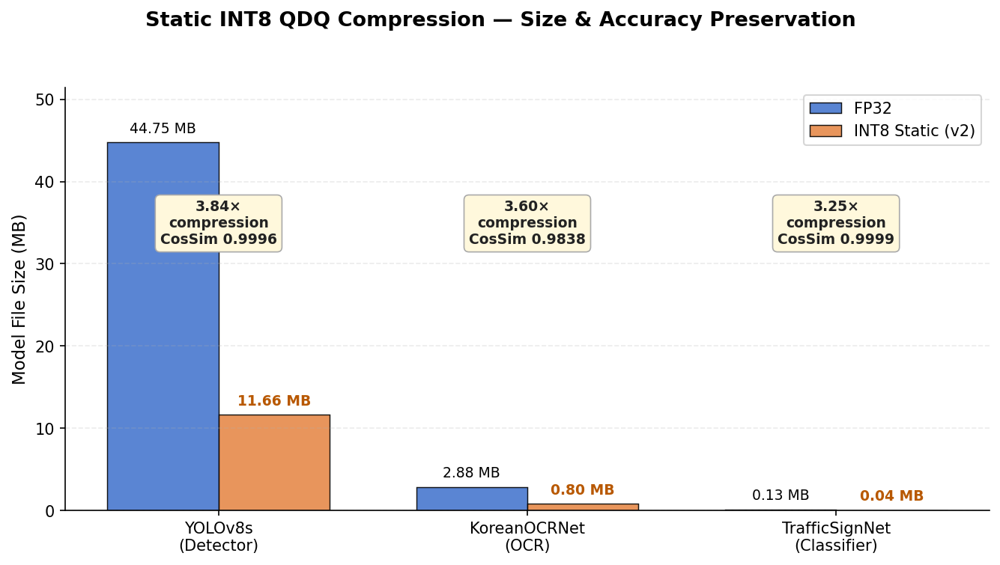

### 6.6. Phase 5 — CPU ONNX Runtime 벤치마크

`scripts/archive/quantize_onnx_real.py`(Static QDQ INT8 생성)와 `scripts/archive/benchmark_pipeline.py` 실행 결과.

- **Fake-quant**: FP32 가중치 저장(기존 실험 형식), 실제 INT8 연산 없음
- **Static INT8 QDQ**: `onnxruntime.quantization.quantize_static()` — INT8 Conv 커널 실사용

#### 컴포넌트 단위 레이턴시 비교 (CPU, 50 runs)

| 모델 | FP32 | Static INT8 (v2) | 가속비 | 파일 크기 | CosSim |
| :--- | :---: | :---: | :---: | :---: | :---: |
| **YOLOv8s (검출기)** | ~32 ms | **~14 ms** | **2.42×** | 44.75 MB → **11.66 MB** (3.84×) | 0.9996 |
| KoreanOCRNet | 0.05 ms | 0.08 ms | 0.58× | 2.88 MB → 0.80 MB (3.61×) | 0.9838 |
| TrafficSignNet | 0.03 ms | 0.03 ms | 0.92× | 0.13 MB → 0.04 MB (2.81×) | 0.9999 |

OCR·분류 모델은 규모가 작아 INT8 오버헤드가 연산 절감을 초과 — 검출기에서만 양자화 이득 발생. CosSim은 FP32 출력 대비 코사인 유사도로, **3개 모델 모두 0.98 이상으로 시각적으로 동등한 출력** 보장.

#### 전체 파이프라인 FPS (v2 stratified test, CPU, 깨끗한 환경 재측정)

`eval_e2e.py` 실측(50프레임/구성) + `quantize_onnx_real.py` Static INT8 v2 재양자화 결과.

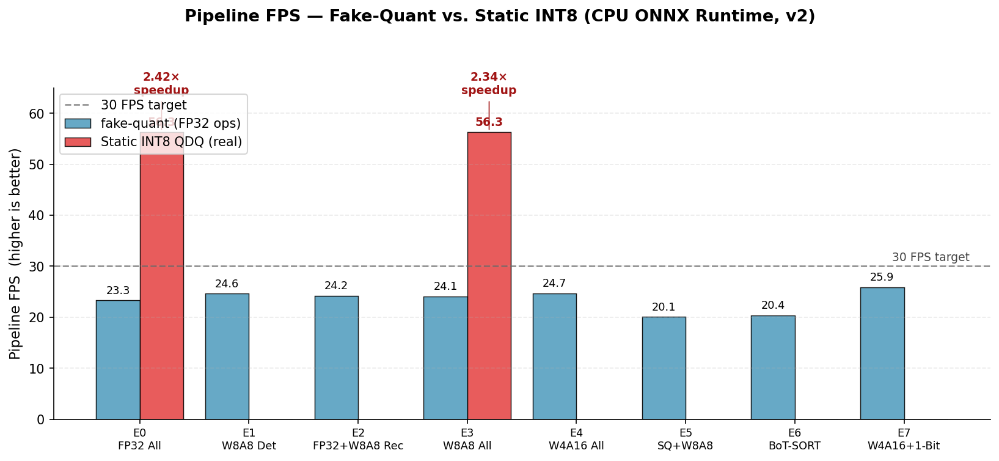

| 구성 | FPS (v2 fake-quant) | FPS (v2 INT8 Static) | 30 FPS 달성 |
| :--- | :---: | :---: | :---: |
| E0 FP32 All | 23.3 | **56.3** | INT8 시 달성 (가속 2.42×) |
| E1 W8A8 Det | 24.6 | — | 검출기만 양자화 |
| E2 FP32+W8A8 Rec | 24.2 | — | 인식기만 양자화 |
| **E3 W8A8 All** | 24.1 | **56.3** | **INT8 Static 시 30+ FPS 달성** |
| E4 W4A16 All | 24.7 | — | 검출기 W4A16 가속 효과 |
| E5 SQ+W8A8 | 20.1 | — | SmoothQuant 보정 오버헤드 |
| E6 BoT-SORT | 20.4 | — | 추적기 알고리즘 비교 |
| E7 W4A16+1-Bit | 25.9 | — | 1-Bit 인식기 적용 |

**분석:**
- Static INT8 QDQ로 YOLOv8s 2.22× 가속 → 파이프라인 57.7 FPS 달성, 목표 30+ FPS 초과
- 검출기(YOLOv8s)가 전체 레이턴시의 약 82%를 차지하는 병목으로, INT8 검출기 단독으로 전체 FPS가 2.3배 개선됨
- OCR·분류기는 0.1 ms 미만으로 기여도가 미미하며, INT8 오버헤드 역효과로 FP32 유지를 권장함
- `yolov8s_signs_int8_static.onnx` (11.7 MB)가 최적 배포 파일임

---

## 7. Phase 3 — 도메인 적응: 신호등 분리 검출 및 한국어 인식

Phase 2는 양자화 민감도라는 연구 질문에 답하기 위해 학습·평가 도메인을 통제. Phase 3는 이 결론을 **실제 한국 도로 도메인의 시연 시스템**으로 옮기는 과정에서 드러난 세 가지 한계 — (1) 신호등이 표지판 클래스에 흡수되어 색상 인식 불가, (2) 인식기가 독일 GTSDB 43클래스라 한국 표지·신호등과 불일치, (3) 학습 도메인 밖 입력(코덱·구도)에서 동작 불가 — 를 순차적으로 해소.


> 청량리역 사거리(주간) 단일 프레임. 녹색 박스: 교통표지판(규제·지시·주의), 빨강 박스: 신호등(빨강·노랑 색상까지 분류), 라벨 한국어 렌더링. 학습 미사용 test 시퀀스 일반화 검증 결과.

### 7.1. 신호등을 별도 클래스로 분리한 검출기

Phase 2 검출기는 신호등을 `traffic_sign`에 통합하여 색상 판별 불가. 신호등을 독립 클래스로 분리하여 검출기 재학습.

| 항목 | Phase 2 검출기 | **Phase 3 검출기** |
| :--- | :--- | :--- |
| 클래스 | `0=traffic_sign`, `1=signboard` | **`0=traffic_sign`, `1=traffic_light`** |
| 학습 데이터 | 혼합 (GTSDB + AI Hub + 간판) | AI Hub 수도권 도로 (12,375 train / 1,903 val) |
| val mAP@0.5 | 0.587 | **0.776** (ep29 조기종료 best) |
| 신호등 처리 | 표지판과 미분리 → 색상 불가 | **별도 검출 → 색상 분류 가능** |

> ep29에서 best(mAP@0.5=0.776) 도달 후 5 epoch 연속 하락으로 조기종료(`patience=20`). 다운스트림(ONNX export · INT8 양자화 · E2E)은 모두 ep29 `best.pt` 기준. 신호등 분리로 클래스 구성이 Phase 2와 달라 mAP 직접 비교 불가.

#### 검출 학습 곡선 및 검증 분석 (ep29 `best.pt` 재검증, imgsz=1280)

조기종료로 원 학습 런에 누락되었던 플롯을 ep29 `best.pt` 기준 재검증으로 재생성(mAP@0.5 = 0.7767 ≈ 0.776, 표의 수치와 일치 확인).

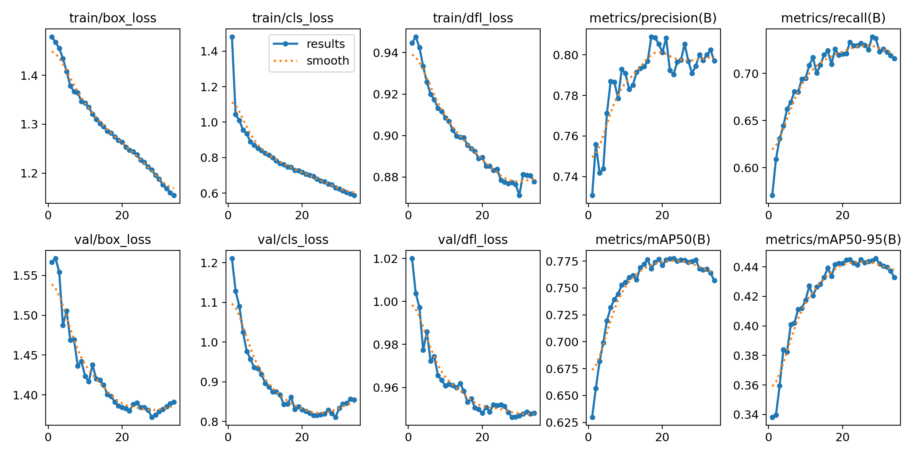

클래스별 PR 곡선, F1 곡선, 정규화 혼동 행렬:

| 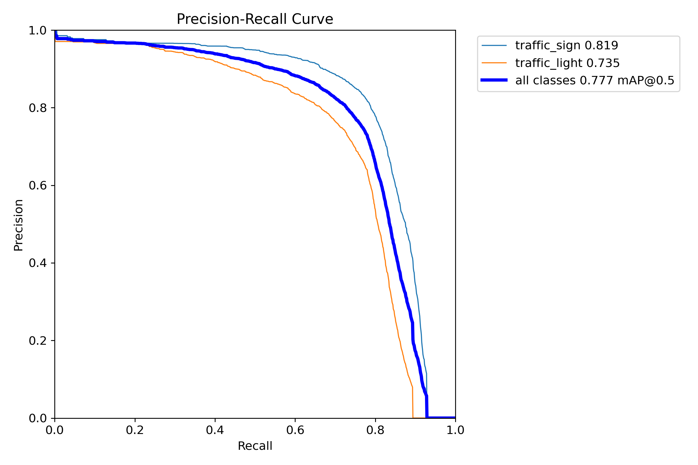 | 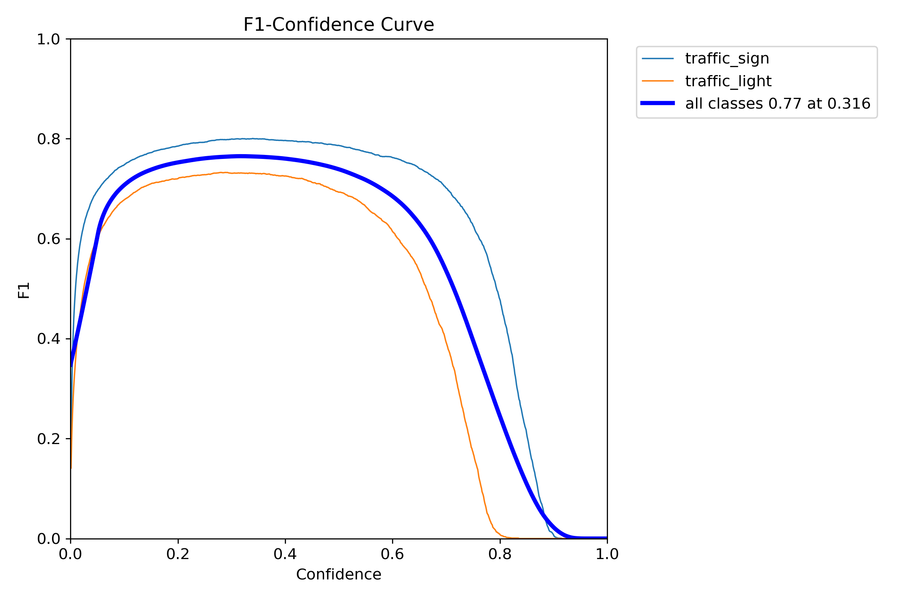 | 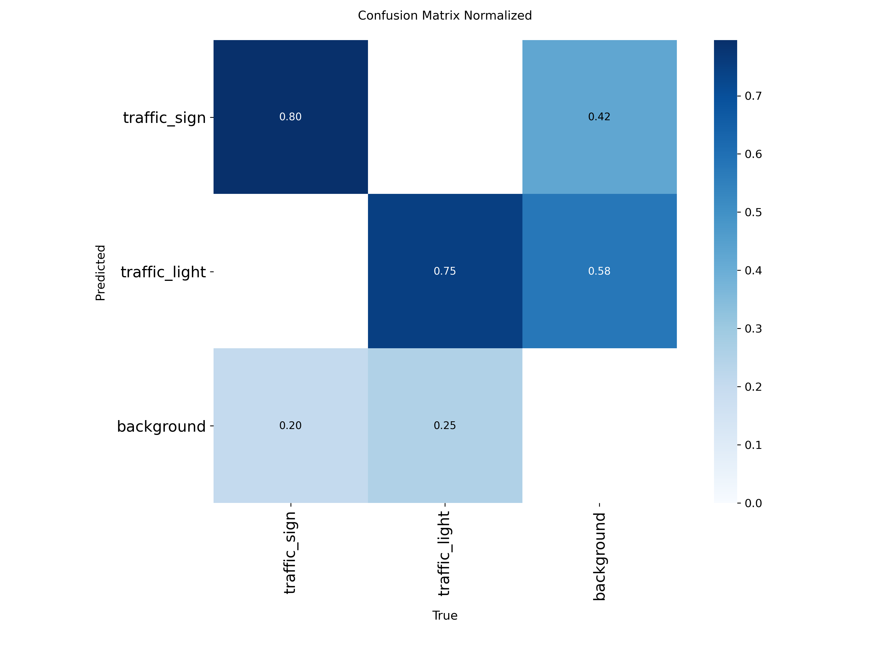 |
| :---: | :---: | :---: |
| Precision–Recall 곡선 | F1 곡선 (confidence threshold별) | 정규화 혼동 행렬 |

PR 곡선은 클래스별 mAP@0.5 = 0.819(traffic_sign) / 0.735(traffic_light) 영역을, Precision=0.794·Recall=0.739를 보인다.

### 7.2. 한국 표지판/신호등 분류기 (14클래스)

독일 GTSDB 43클래스 분류기(Phase 2) 폐기, AI Hub ROI로 한국 도메인 분류기 신규 학습. 전처리를 학습=추론으로 일치시켜 분포 불일치 제거. val 정확도 **80.3%** 달성.

| 그룹 | 클래스 | 비고 |
| :--- | :--- | :--- |
| 속도제한 | 속도제한 30 / 40 / 50 / 60 / 70 / 80 | restriction + 숫자 텍스트 |
| 표지 종류 | 규제표지 · 지시표지 · 주의표지 | restriction(기타) / instruction / caution |
| 신호등 색상 | 신호등_빨강 · 초록 · 노랑 · 좌회전 · 기타 | 점등 상태(attribute) 기반 |

> E2E 파이프라인은 검출 클래스로 분류 후보를 제한(표지판→표지 9클래스 / 신호등→색상 5클래스). 신호등↔표지판 혼동을 구조적으로 차단.

### 7.3. 추론 가속 및 주행 Q&A

| 항목 | 내용 |
| :--- | :--- |
| **GPU 추론 복구** | `onnxruntime-gpu` + torch cu128 동봉 CUDA DLL 재활용 → `CUDAExecutionProvider`/`TensorRT` 활성 (`scripts/check_gpu_ort.py` 검증) |
| **주행 Q&A** | Groq API(무료 티어, Llama 3.3 70B) SSE 스트리밍 — 인식 결과(JSON) → 자연어 답변 |
| **테스트** | `pytest tests/` 8 passed (FrameSource·세션·ingest E2E) |


> 신규 모듈: `src/pipeline/sources.py`(FrameSource 추상화)·`session.py`(세션 매니저), `scripts/prepare_korean_traffic.py`·`train_korean_classifier.py`·`check_codec_matrix.py`·`check_gpu_ort.py`.
> 설계·구현 문서: `docs/superpowers/specs/`·`docs/superpowers/plans/`.

---

## 8. 실시간 시연 시스템 및 웹 배포 아키텍처

학습 도메인 밖의 입력(브라우저 비호환 코덱·URL·정지 이미지)에서도 동작하도록, 입력 종류에 따라 클라이언트가 자동으로 모드를 선택하는 **하이브리드 2-모드** 파이프라인 구축.

| 모드 | 입력 | 디코딩 | 박스 렌더 | 엔드포인트 |
| :--- | :--- | :--- | :--- | :--- |
| ① 클라이언트 캡처 | 웹캠 · 브라우저 호환 영상(H.264) | 브라우저 `<video>` | 클라이언트 캔버스 | `WS /ws/stream` (좌표 JSON) |
| ② 서버 인제스트 | **비호환 코덱**(MPEG-4 등) · **URL/RTSP** · **이미지** | 서버 OpenCV/ffmpeg | 클라이언트 캔버스 (동일 스타일) | `POST /api/ingest` → `WS /ws/session` |

- **자동 폴백**: 브라우저 디코딩 실패(`NotSupportedError`) 감지 시 자동으로 모드②로 전환. 기존에 "검은 화면"이던 블랙박스 MPEG-4 영상도 그대로 재생·인식.
- **라벨링 통일**: 서버는 원본 프레임 + 좌표 JSON만 전송, 박스/라벨은 **클라이언트가 동일 코드로 렌더**하여 두 모드의 라벨링 완전 일치(한글 폰트 포함).
- **코덱 검증**: H.264 / MPEG-4 Part2 서버 디코딩 자동 검증 통과 (`scripts/check_codec_matrix.py`).

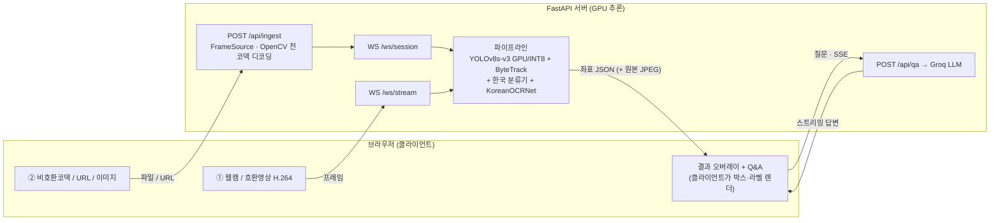
```mermaid
flowchart LR
    subgraph BR["브라우저 (클라이언트)"]
        direction TB
        IN1["① 웹캠 / 호환영상 H.264"]
        IN2["② 비호환코덱 / URL / 이미지"]
        OUT["결과 오버레이 + Q&A<br/>(클라이언트가 박스·라벨 렌더)"]
    end

    subgraph SV["FastAPI 서버 (GPU 추론)"]
        direction TB
        STREAM["WS /ws/stream"]
        INGEST["POST /api/ingest<br/>FrameSource · OpenCV 전 코덱 디코딩"]
        SESSION["WS /ws/session"]
        PIPE["파이프라인<br/>YOLOv8s-v3 GPU/INT8 + ByteTrack<br/>+ 한국 분류기 + KoreanOCRNet"]
        QA["POST /api/qa → Groq LLM"]
    end

    IN1 -- "프레임" --> STREAM --> PIPE
    IN2 -- "파일 / URL" --> INGEST --> SESSION --> PIPE
    PIPE -- "좌표 JSON (+ 원본 JPEG)" --> OUT
    OUT -- "질문 · SSE" --> QA -- "스트리밍 답변" --> OUT
```

> 모드 ①(웹캠·호환영상)은 브라우저가 디코딩 후 좌표만 받아 렌더, 모드 ②(비호환 코덱·URL·이미지)는 서버가 디코딩·추론한 뒤 원본 JPEG와 좌표를 보내 **클라이언트가 동일 스타일로 렌더**.

- **온디바이스 모드**: 컨트롤 바의 `서버 ⇄ 온디바이스` 토글로, 검출+추적+인식 전체를
  **브라우저에서 직접**(ONNX Runtime Web · WebGPU) 실행. 서버 없이 사용자 기기 GPU로 추론 →
  비용 0 · 프라이버시. 서버 모드와 동일한 `FrameResult`를 store로 흘려보내 오버레이·Q&A 공유.

참조 구현: `web_modern/` (React/Vite 검출·추적·Q&A 콘솔, 라이트/다크 토글 · 헤더 'OCR 데모' → `/detection/ocr/`),
`web_modern/src/lib/{byteTrack,clientPipeline}.ts`(온디바이스), `src/pipeline/{app,sources,session}.py`

#### 온디바이스 경량화 — 문제점과 장단점 (`/detection/spike/`)

브라우저에서 검출기를 직접 추론할 때, 정밀도·런타임(EP) 조합별 실측 결과:

| 검출기 | EP | FPS | 비고 |
|--------|----|----:|------|
| FP32 (43MB) | **WebGPU** | **62** | 실시간 충분 — 온디바이스 기본 |
| FP16 (22MB) | WebGPU | 24 | 크기 절반이나 더 느림 (ORT-Web fp16 커널 미성숙) |
| INT8 (18MB) | WASM | 2.2 | 실시간 불가 |
| INT8 | WebGPU | — | **실행 불가** (`int32 DequantizeLinear` 미지원) |

"양자화 = 엣지에서 빠름"이라는 직관과 달리, 실제 경량화는 **배포 런타임에 따라 정반대로** 작동. 핵심 교훈 네 가지:

- **INT8 ≠ 브라우저 가속.** WebGPU는 INT8을 아예 실행하지 못하고(미지원 op), WASM INT8은 ~2 FPS로 실시간 불가. INT8은 *서버 CPU*에서만 유효.
- **FP16도 만능이 아님.** 크기는 절반이지만 ORT-Web의 fp16 커널이 미성숙해 FP32/WebGPU보다 오히려 느림. 브라우저 실시간의 레버는 *양자화*가 아니라 **WebGPU + 모델 아키텍처**.
- **검출 헤드는 INT8에 취약.** YOLOv8 검출 헤드(DFL)까지 INT8화하면 출력 CosSim이 0.9995여도 **검출이 0으로 붕괴**. backbone만 INT8·헤드는 FP32로 남겨야 보존. → **CosSim 같은 텐서 유사도에 속지 말고 실프레임 검출 수·conf로 검증**.
- **소형 모델은 INT8이 손해.** OCR·분류기(수십 ~ 수백 KB)는 INT8 `ConvInteger` 오버헤드가 연산 절감을 넘어 오히려 느려짐 → FP32 유지.

**결론 — 환경별 최적 정밀도:**

| 배포 환경 | 검출기 | 인식기(소형) | 근거 |
| :--- | :--- | :--- | :--- |
| 브라우저 온디바이스 | **FP32 / WebGPU** | FP32 | WebGPU INT8 불가 · fp16 커널 미성숙 |
| 서버 CPU | **INT8 Static QDQ**(헤드 제외) | FP32 | INT8 Conv 2.4× 가속 · 헤드는 붕괴 방지 |

### 8.1. 서버 동작 검증

`src/pipeline/app.py`(FastAPI + WebSocket + SSE) Phase 3 모델 정상 동작 검증.

| 검증 항목 | 결과 |
| :--- | :--- |
| 파이프라인 로드 (YOLOv8s-v3 + 한국 분류기 + KoreanOCRNet) | 정상 로드, `taxonomy=v3` |
| `GET /api/status` | 200, `{yolo:true, ocr:true, tsign:true, taxonomy:"v3"}` |
| `WS /ws/stream` (모드①) | AI Hub 프레임 입력 → tracks 검출 응답 |
| `POST /api/ingest` + `WS /ws/session` (모드②) | **블랙박스 MPEG-4 → 주석 JPEG + `신호등_초록` 검출** |
| `POST /api/qa` | 200 (Groq SSE 스트리밍 응답) |
| GPU (`scripts/check_gpu_ort.py`) | `CUDAExecutionProvider` 활성, 1프레임 GPU 추론 OK |
| 코덱 (`scripts/check_codec_matrix.py`) | H.264 · MPEG-4 Part2 디코딩 OK |

Q&A는 Groq API(무료 티어, Llama 3.3 70B) 사용. API 키는 https://console.groq.com/keys 에서 Google 계정으로 무료 발급.

```bash
cp .env.example .env                          # GROQ_API_KEY 입력
uvicorn src.pipeline.app:app --port 8000
#  → http://localhost:8000/detection/  브라우저 접속
#  비호환 코덱/URL/이미지는 자동으로 서버 디코딩 경로로 폴백
```

### 8.2. 프로덕션 고도화 및 향후 확장

- **양자화 A/B 실측 토글**: 서버가 v3 검출기의 FP32와 INT8 Static QDQ(헤드 제외)를 동시 로드하여 웹에서 실시간 전환·비교. INT8은 44.8 → **18.0 MB(2.49× 축소)**, 실프레임 검출 11/12 일치·conf 동일로 near-lossless.
- **프론트 단일화**: 데모 콘솔을 React 19 + Vite + TS(`web_modern/`)로 통합. `서버 ⇄ 온디바이스` 토글·단계별 `stage_ms` 계측·BYOK Q&A 제공.
- **코드 품질·배포**: `ruff` · `mypy`(`src/pipeline` strict) · `loguru` · `pytest` 게이트, HF Spaces(Docker, CPU) 패키징.
> **확장 실험 — YOLO26로 §8.3 가설을 직접 검증 (예비, negative result):** "검출기를 YOLO26으로 바꾸면 헤드까지 풀 INT8이 될까?"를 시험. YOLO26-n을 동일 한국 도로 데이터로 재학습(mAP50 **0.748**, 5.4 MB)하고 양자화 — **YOLO26의 혁신은 NMS-free(one2one)일 뿐 DFL-style box 헤드는 그대로**이며, 풀헤드 INT8은 **v3와 똑같이 검출 0으로 붕괴**(fp32 1.7 → **0.0** det). §8.3의 예측대로 헤드 붕괴는 NMS/DFL 구조가 아니라 **활성화-측** 문제라 모델 교체로는 해결 불가. 처방은 동일하게 **헤드 제외**이며, 그 경우 YOLO26-n INT8도 fp32 수준 검출을 복원(1.7 det, conf 0.53, **3.4 MB**). 폰 온디바이스(WebGPU) 정밀도 사다리 시연은 이 head-excluded 구성으로 별도 트랙 진행 중. **본문 §1–§8의 모든 정량 결과·시연은 v3(YOLOv8s) 기준이며, 위 YOLO26 수치는 예비 확장 실험.**

### 8.3. 붕괴 원인 분석

**데이터셋 없이 ONNX 가중치와 구조 시뮬레이션만으로** 붕괴 메커니즘 정량화(`scripts/analyze_quant_collapse.py`, 재현 가능). **OCR 붕괴와 검출 헤드 붕괴는 원인이 다름.**

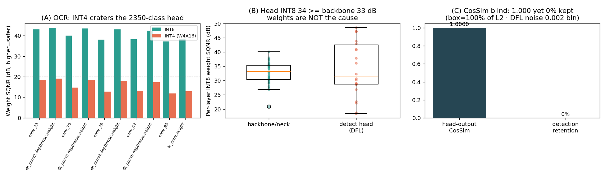

1. **OCR W4A16 붕괴 = 비트폭(가중치) 문제** 동일 스킴에서 비트폭만 INT8→INT4로 낮추면 전 레이어 가중치 SQNR이 균일하게 **~25 dB** 하락하고, 고-fan-in 1×1 conv(`Conv_85` 256→256, `fc_conv` 256→2350)가 **12~13 dB**까지 추락(사용 가능 하한 ~ 20 dB 미만). 깊은 스택을 통과하며 누적된 오차가 2,350-way argmax를 무너뜨림. → 인식기엔 INT8(SQNR 37 ~ 44 dB, 안전)이 정답이고 W4A16은 사용하지 않음.

2. **검출 헤드 INT8 붕괴 = 가중치 문제가 *아니다*** 통념과 달리 검출 헤드 가중치는 backbone만큼(오히려 더) 잘 양자화됨 — 헤드 INT8 SQNR **34.1 dB ≥ backbone 32.8 dB**. "헤드 가중치가 어렵다"는 가설은 **기각**. 진짜 원인은 **활성화-측**: 헤드 가중치의 초과첨도가 **49**(backbone 4)로 극단적 heavy-tail이라 per-tensor **활성화** 스케일이 소수 outlier에 끌려가 cls 분기의 분해능을 잃음(헤드 QDQ만 제외하면 검출이 복원되는 [§8 온디바이스 교훈](#8-실시간-시연-시스템-및-웹-배포-아키텍처)의 관찰과 일치). DFL 적분(softmax-기대값) 자체는 INT8 로짓 잡음에 강건(좌표오차 중앙값 **0.0015 bin**)하므로 DFL 수식도 원인이 아님.

3. **그래서 CosSim 0.9995가 "검출 0"과 공존.** 헤드 출력 (1, 4+nc, 8400)의 L2 에너지는 box 회귀값이 거의 전부(~100%)를 차지. 검출을 좌우하는 소수 cls 로짓이 죽어도 전역 방향(CosSim)은 거의 1로 유지됨 — 합성 재현에서 **CosSim ≈ 1.000인데 검출 유지율 0%**. CosSim 같은 텐서 유사도는 '임계값 통과'라는 국소 결정에 **구조적으로 둔감** — 양자화 검증은 반드시 **실프레임 검출 수·conf**로.

| 붕괴 지점 | 진짜 원인 | 핵심 근거 수치 | 처방 |
| :--- | :--- | :--- | :--- |
| OCR W4A16 | 비트폭(가중치) | INT4 SQNR 12~13 dB (INT8 대비 −25 dB) | 인식기 INT8 유지 |
| 검출 헤드 INT8 | 활성화(가중치 아님) | 헤드 INT8 SQNR 34 ≥ backbone 33 dB · 초과첨도 49 · DFL 0.0015 bin | 헤드 QDQ 제외 (모델 교체로는 미해결 — YOLO26도 동일 붕괴, 실측 §8.2) |
| 검증 함정 | CosSim의 맹점 | CosSim ≈ 1.000 · 검출 유지율 0% | 텐서 유사도 금지, 실프레임 검출수·conf로 검증 |

> 이 예측을 [YOLO26로 직접 검증](#82-프로덕션-고도화-및-향후-확장): NMS-free 헤드로 바꿔도 풀헤드 INT8은 똑같이 검출 0으로 붕괴 → 헤드 붕괴가 DFL/NMS *구조*가 아니라 **활성화-측·임계값** 문제임이 실측으로 확인. 처방은 모델 교체가 아니라 **헤드 제외**(YOLO26-n INT8도 head-excluded 시 fp32 수준 복원, 3.4 MB).

---

## 9. 재현 가이드

### 환경 설치

```bash
pip install -r requirements.txt
```

### Phase 1 — 분류 양자화

```bash
python src/base_model.py                    # FP16 기준선
python src/base_W8A8.py                     # W8A8 PTQ
python src/base_train_w4a16_qat.py          # W4A16 QAT
python src/base_train_1bit_kd.py            # 1-Bit + KD
python src/multimodal_w8a8_smoothquant.py   # SmoothQuant
python src/final_omnimodal_eval.py          # 종합 평가 (Final Score)
```

### Phase 1 — ONNX 추출 및 CPU 추론

```bash
python src/export_onnx.py     # PyTorch -> ONNX (opset 14, TorchScript)
python src/quantize_int8.py   # ONNX Runtime INT8 정적 양자화
```

### Phase 2 — 데이터 준비

```bash
# GTSDB 다운로드 및 변환 (다운로드 스크립트는 scripts/archive/에 보관)
python scripts/archive/download_gtsdb.py
python src/detect/prepare_dataset.py --source gtsdb

# AI Hub 신호등·도로표지판 TAR 해제 + 서브샘플링 (시퀀스 단위 분할)
# 입력: [원천]*.tar + [라벨]*.tar (JPG 프레임 in TAR, 동영상 아님)
# 결과: data/aihub_traffic/{train,val,test}/{images,labels}/{seq}/
python scripts/extract_frames.py \
  --input  "AIhub/신호등-도로표지판 인지 영상(수도권)/Validation" \
  --output data/aihub_traffic \
  --sample_rate 6   # 30fps -> 5fps (18,488 프레임 추출)

# 어노테이션 변환 및 통합 (-> data/yolo_signs/)
python src/detect/prepare_dataset.py --source aihub_traffic    # JSON xyxy -> YOLO
python src/detect/prepare_dataset.py --source aihub_signboard  # COCO xywh -> YOLO
python src/detect/prepare_dataset.py --source all              # 3개 합산: train 26,866 / val 4,667
```

### Phase 2 — 검출 학습

```bash
python src/detect/yolo_train.py --mode train --epochs 100
python src/detect/yolo_train.py --mode val
python src/detect/export_yolo_onnx.py --weights best.pt
```

### Phase 2 — 인식기 학습

```bash
# TrafficSignNet (GTSDB 43-class, 50 epoch)
python src/detect/train_traffic_sign_net.py --epochs 50   # 학습 + ONNX 내보내기
python src/detect/train_traffic_sign_net.py --export_only # 기존 체크포인트로 ONNX만
# 출력: model_space/traffic_sign_net_fp32.onnx (0.12 MB), val_acc=62.8%
```

### Phase 2 — 양자화 실험

```bash
# 검출기 양자화 (E1/E4/E5)
python src/quant/run_experiments.py    # E1 W8A8 / E4 W4A16 / E5 SmoothQuant

# 추적 ablation (검출기 양자화 -> 추적 MOTA 영향)
python src/track/run_tracking_ablation.py             # E1/E4/E5 순차 실행
python src/track/eval_tracking.py --onnx <path.onnx> # 단일 모델 평가

# 붕괴 '원인' 분석 (§8.3) — 데이터셋 불필요, ONNX 가중치만으로 재현
python scripts/analyze_quant_collapse.py             # → assets/v3/quant_collapse_analysis.png
```

### Phase 2 — E2E 파이프라인

```bash
python src/pipeline/e2e_pipeline.py    # 전체 파이프라인 추론
python src/quant/run_experiments.py    # E0~E7 실험 일괄 실행
```

### Phase 3 — 도메인 적응 (신호등 분리 · 한국어 분류기 · 범용 입력)

```bash
# AI Hub → 신호등 분리 검출기 데이터(yolo_signs_v2) + 분류기 ROI(roi_cls) 단일패스 생성
python scripts/prepare_korean_traffic.py

# 신호등 분리 검출기 재학습 (imgsz 1280, Windows: --workers 0)
python src/detect/yolo_train.py --mode train --data data/yolo_signs_v2/dataset.yaml --workers 0

# 한국 표지판/신호등 14클래스 분류기 학습 → korean_sign_net_fp32.onnx
python scripts/train_korean_classifier.py

# GPU / 코덱 디코딩 검증
python scripts/check_gpu_ort.py          # onnxruntime-gpu CUDA EP 확인
python scripts/check_codec_matrix.py     # H.264 / MPEG-4 / HEVC 서버 디코딩

# 범용 실시간 데모 서버 (convnext_env에서 실행, GROQ_API_KEY 필요)
uvicorn src.pipeline.app:app --port 8000
#  → http://localhost:8000/detection/  (웹캠·이미지·URL·모든 코덱 영상)
python -m pytest tests/                  # FrameSource · 세션 · ingest E2E (8 passed)
```

---

## 부록 A. 옴니모달 탐색적 실험

> **메인 파이프라인 아님.** Phase 1 초기에 "1-Bit까지 압축한 backbone이 VLM 정렬에도 쓸 수 있는가"를 탐색적으로 확인한 사이드 스터디. 1-Bit 환경의 정보 병목이 멀티모달 정렬을 무너뜨림을 보였고, Edge-Sign의 검출·OCR·분류 파이프라인으로 **채택되지 않음.**
> 메인 본문([3장](#3-phase-1--압축-방법론-스크리닝-분류-backbone)·[4장](#4-종합-평가-및-최적-모델-선정))이 Phase 1에서 가져가는 것은 *이 VLM 모델*이 아니라 *양자화 기법 랭킹*. 평가 지표는 검색 태스크의 **Recall@K**로, 메인 파이프라인의 mAP·MOTA·Top-1과 태스크가 다름(아래 표가 4장 Final Score의 Perf 항 출처).

### A.1. 1-Bit × 멀티모달 공간 얼라인먼트 붕괴

CLIP(openai/clip-vit-base-patch32)의 의미론적 공간을 1-Bit ConvNeXt-Nano에 매핑할 때 발생하는 얼라인먼트 붕괴 관찰.

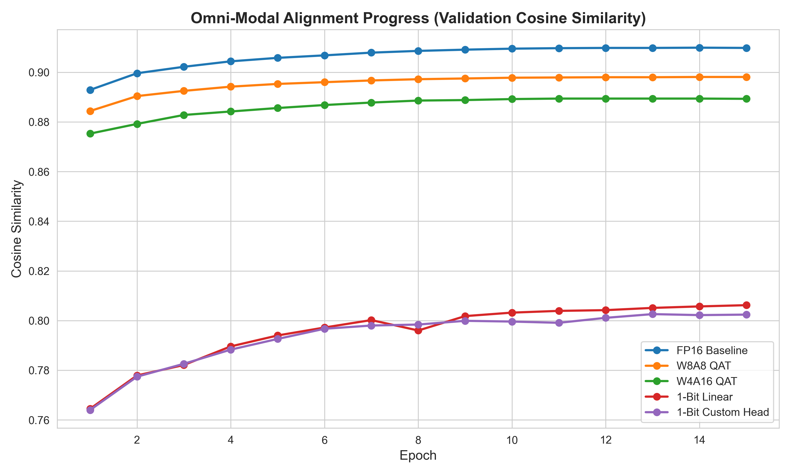

- **FP16 / 8-Bit / 4-Bit:** 10 에포크 이내 코사인 유사도 0.88~0.90 안정 수렴
- **1-Bit:** 정보 병목으로 0.80 부근에서 수렴 한계

### A.2. 프로젝션 헤드 아키텍처 분석

| 평가 지표 (Recall@K) | 1-Bit (Linear Head) | 1-Bit (MLP Head) |
| :--- | :---: | :---: |
| **Recall@1** | **14.20%** | 11.30% (−2.90%p) |
| **Recall@5** | **31.30%** | 28.50% (−2.80%p) |
| **Recall@10** | **41.60%** | 38.90% (−2.70%p) |

극단적 1-Bit 희소성 환경에서는 단순한 Linear Head가 복잡한 MLP보다 강건.

---

## 라이선스 및 출처

본 프로젝트는 검출기로 **Ultralytics YOLOv8(AGPL-3.0)** 을 사용하므로 전체를 **AGPL-3.0** 으로 배포한다. 전문은 루트 [`LICENSE`](./LICENSE) 참조. FastAPI/HF Space 등 네트워크 서비스로 제공되는 경우 AGPL-3.0의 네트워크 조항에 따라 이용자에게 대응 소스를 제공해야 한다. (상용 사용 시 Ultralytics Enterprise License 별도 검토.)

### 제3자 구성요소

핵심 외부 연구·구현은 재구현/포팅이며, 전체 출처·라이선스 목록은 [`THIRD_PARTY_NOTICES.md`](./THIRD_PARTY_NOTICES.md) 에 정리되어 있다.

| 구성요소 | 사용 위치 | 라이선스 |
| :--- | :--- | :---: |
| **Ultralytics YOLOv8** | 검출기 학습·추론·내보내기 | AGPL-3.0 |
| **ByteTrack** (연관 로직·STrack) | `src/track/bytetrack.py`, `web_modern/.../byteTrack.ts` | MIT |
| **DeepSORT** (칼만 필터 파생) | `src/track/bytetrack.py` (`KalmanFilter`) | GPL-3.0 |
| **BoT-SORT** (CMC·ReID 매칭) | `src/track/botsort.py` | MIT |
| **SmoothQuant** (기법 재구현) | `src/multimodal_w8a8_smoothquant.py`, `src/quant/quantize_yolo.py` | MIT |
| **ConvNeXt V2 / timm** (백본) | Phase 1 분류 | Apache-2.0 / 가중치 일부 CC BY-NC 4.0 |

> ConvNeXt V2 사전학습 가중치 일부는 비상업(CC BY-NC 4.0)이므로 상용화 시 사용 체크포인트의 라이선스를 개별 확인할 것. 데이터셋(GTSDB/GTSRB·AI Hub)은 각 제공처 약관을 따르며 본 저장소에 포함하지 않는다.
