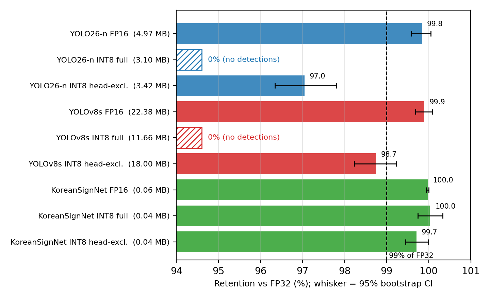
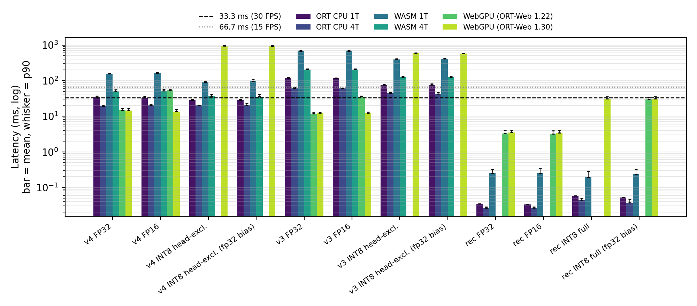
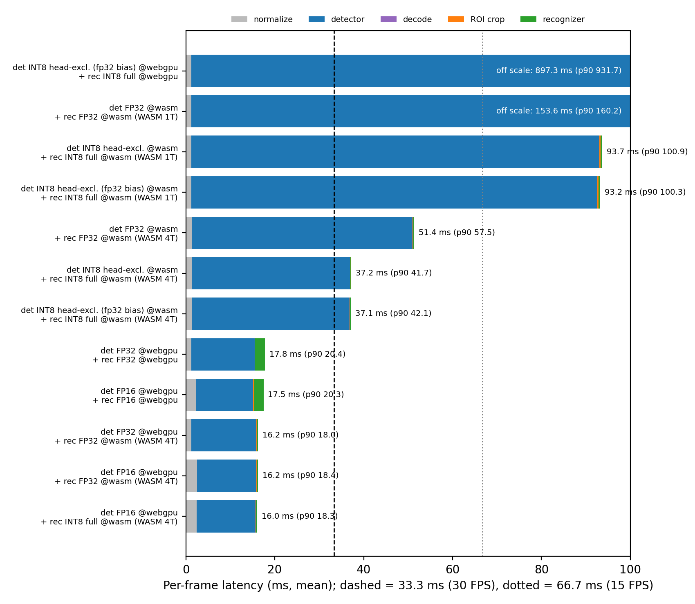

# 도로 영상 인식을 위한 브라우저 기반 엣지 비전의 구성요소·실행 환경별 양자화 실증 분석

**English title:** An Empirical Study of Component- and Runtime-Aware Quantization for Browser-Based Road-Scene Recognition

> 초안 상태(2026-09-26): 모든 수치는 `paper_evidence/`의 원시 기록에서 다시 계산할 수 있다. 수치별 원천은 [RUNTIME_MATRIX.md](reports/RUNTIME_MATRIX.md)와 [TIIS_EVIDENCE_REPORT.md](reports/TIIS_EVIDENCE_REPORT.md)에 있다.

---

## Abstract

브라우저에서 도로 표지판·신호등을 인식하는 검출–인식 파이프라인에 양자화를 적용할 때, 정확도 손실과 속도 이득이 구성요소와 실행 환경에 따라 어떻게 달라지는지 실험하였다. 대상은 다음과 같다.
- 모델: 헤드 구조가 다른 두 검출기(YOLOv8s, YOLO26-n)와 14클래스 인식기
- 변형: FP32, FP16, 정적 INT8(헤드 포함·제외, bias 표현 2종)의 18개
- 평가: 학습·보정과 겹치지 않는 test 시퀀스(2,417프레임)
- 실행 환경: 네이티브 CPU, 브라우저 WASM, WebGPU(ONNX Runtime Web 두 버전). 같은 입력으로 1,024회씩 측정하고, 지연 차이의 원인을 연산자 배치 로그로 확인하였다.

결과는 다음과 같다.
- **구성요소에 따라 손실이 달랐다.** 검출 헤드까지 INT8로 바꾸면 두 검출기 모두 검출이 사라졌고, 인식기는 전체 INT8에서도 정확도가 유지되었다(Top-1 유지율 100.0%). 가중치 전용 실험에서 헤드 붕괴의 원인은 활성값 양자화였고, YOLOv8s에서는 DFL 적분 커널의 반올림이 위치 오차를 더했다. 헤드를 제외한 INT8의 mAP@0.5:0.95 유지율은 97.0–98.7%로 사전에 정한 99% 기준에 미달하였다(YOLO26-n은 95% 신뢰구간 전체가 기준 아래).
- **실행 환경에 따라 INT8의 속도 효과가 뒤집혔다.** INT8은 CPU와 WASM에서 최대 2.3배 빨랐지만 WebGPU에서는 49–83배 느렸다. 양자화 연산이 WebGPU에서 지원되지 않아 CPU로 배치되었기 때문이다. FP16의 효과도 런타임 버전에 따라 달랐다.
- **구성요소별 배치가 가장 빨랐다.** 검출기는 WebGPU FP32, 인식기는 WASM에 둔 배치가 프레임당 16.2 ms(p90 18.0 ms)로, 모든 구성요소를 WebGPU에 둔 배치보다 빨랐다.

이 결과는 양자화 여부를 모델 단위로 한 번에 정하지 말고, 구성요소와 목표 실행 환경의 조합마다 태스크 지표와 실측 지연으로 정해야 함을 보여 준다.

**English abstract (working draft).** We study how quantization affects accuracy and latency across components and runtimes in a browser-based detection–recognition pipeline for Korean traffic signs and lights.

*Setup.* We evaluate 18 variants on 2,417 sequence-disjoint test frames:
- two detectors with different heads (YOLOv8s and YOLO26-n) and a 14-class recognizer;
- FP32, FP16, and static INT8 with or without the detection head and with two bias representations.

Latency is measured 1,024 times per configuration on native ONNX Runtime CPU, WebAssembly, and WebGPU in two ONNX Runtime Web versions, and operator-placement logs explain the differences.

*Results.*
- **Accuracy depends on the component.** Quantizing the detection head removes every detection in both detectors, whereas the recognizer keeps its accuracy even when fully quantized. A weight-only ablation attributes the head collapse to activation quantization; in YOLOv8s, rounding the fixed DFL integration kernel adds a localization error. With the head kept in FP32, the detectors retain 97.0–98.7% of FP32 mAP@0.5:0.95, below the 99% criterion fixed before measurement (for YOLO26-n the whole 95% confidence interval lies below it).
- **The speed effect of INT8 depends on the runtime.** INT8 is up to 2.3× faster on CPU and WebAssembly but 49–83× slower on WebGPU, because the quantize operators fall back to the CPU. The effect of FP16 also changes with the runtime version.
- **Per-component placement is fastest.** Running the detector on WebGPU and the recognizer on WebAssembly gives 16.2 ms per frame (p90 18.0 ms), faster than placing both on WebGPU.

These results argue for choosing precision per component and per target runtime, using task metrics and measured latency.

**Keywords**: Neural network quantization, Traffic sign recognition, Web browser inference, WebGPU, ONNX Runtime

---

## 1. Introduction

도로 영상의 표지판과 신호등은 화면에서 작게 나타나고, 가림과 조명 변화의 영향을 받는다 [1]. 실제 응용은 프레임마다 객체를 찾는 데 그치지 않는다. 같은 객체를 이어서 추적하고, 속도 제한 값이나 신호 점등 상태 같은 세부 클래스를 판별해야 한다 [2]. 그래서 검출기, 추적기, 세부 인식기를 차례로 실행하는 파이프라인이 흔히 쓰인다. 이런 파이프라인을 별도 설치 없이 웹 브라우저에서 실행하면 배포가 쉽고 영상이 사용자 기기를 벗어나지 않는다. 대신 브라우저는 네이티브 런타임보다 제약이 많다. 연산은 WebAssembly(WASM)나 WebGPU를 거쳐야 하고, 지원되는 연산자와 스레드 사용도 실행 환경에 따라 다르다 [3], [4].

신경망 양자화는 모델 크기와 연산량을 줄이는 대표적 방법이다 [5], [6]. 그러나 파이프라인에 양자화를 적용할 때는 두 가지를 따로 따져야 한다. 첫째, 양자화 오차가 어느 구성요소에서 태스크 정확도로 이어지는가이다. 검출기의 몸통과 헤드, 뒤 단계의 인식기는 구조와 출력 형식이 달라서 같은 설정에서도 손실이 다를 수 있다 [7]–[10]. 둘째, 양자화 모델이 목표 실행 환경에서 실제로 빨라지는가이다. INT8의 속도 이득은 연산 장치와 커널 지원에 따라 달라진다 [11]. 브라우저에서는 이런 차이가 더 클 수 있다 [3], [4]. 기존 검출기 양자화 연구는 대부분 단일 모델의 정확도나 한 가지 하드웨어에서의 지연을 다루므로, 구성요소와 실행 환경을 함께 바꿨을 때의 결과는 알기 어렵다.

본 연구는 한국 도로 영상의 교통표지판·신호등 인식 파이프라인을 대상으로 구성요소, 정밀도, 실행 환경을 한 실험 틀에서 측정한다. 연구 질문은 다음과 같다.
- **RQ1 (구성요소):** 같은 정적 INT8 설정을 적용할 때 검출기의 몸통, 검출 헤드, 인식기 가운데 어디에서 정확도가 손실되는가?
- **RQ2 (실행 환경):** 같은 모델 파일의 지연이 네이티브 CPU, 브라우저 WASM, 브라우저 WebGPU에서 어떻게 달라지며, 그 원인은 무엇인가?
- **RQ3 (배치):** 구성요소마다 정밀도와 실행 환경을 다르게 배치하면 브라우저 파이프라인의 프레임당 지연이 어떻게 달라지는가?

본 논문의 기여는 다음과 같다.
1. 출력 구조가 다른 두 검출기(DFL 헤드와 NMS를 쓰는 YOLOv8s, NMS가 필요 없는 YOLO26-n)와 14클래스 인식기에 대해 정밀도, 양자화 범위(헤드 포함·제외), bias 표현을 바꾼 18개 변형을 학습·보정 데이터와 겹치지 않는 시퀀스에서 평가한다.
2. 같은 입력 텐서로 6개 실행 환경 구성(네이티브 CPU·WASM 각 1·4스레드, WebGPU 두 런타임 버전)의 지연을 1,024회씩 측정하고, 연산자 배치 로그로 지연 차이의 원인을 확인한다.
3. 한 브라우저 페이지에서 검출기와 인식기를 서로 다른 실행 환경에 배치해 파이프라인 지연을 측정하고, 구성요소별 배치 원칙을 제시한다.
4. 판정 기준(FP32 대비 99% 정확도 유지, p90 지연)을 측정 전에 공개 벤치마크 근거로 정하고, 측정 코드와 원시 기록을 공개한다.

2장은 관련 연구를 정리한다. 3장은 모델, 데이터, 양자화 변형, 측정 절차를 설명한다. 4장은 세 연구 질문의 결과를 제시하고 타당성의 한계를 논의한다. 5장은 결론을 맺는다.

---

## 2. Related Work

### 2.1. 도로 표지 인식 파이프라인

교통표지판 검출은 작은 객체와 복잡한 배경을 다루는 응용으로 연구되어 왔다 [1]. Behrendt 등 [2]은 신호등의 검출·추적·분류를 한 파이프라인으로 결합하였고, Manocha 등 [12]은 한국 도로 표지판 검출을 평가하였다. Luo 등 [13]은 YOLOv8 기반 경량 표지 검출기를 임베디드 기기에서 실행하였다. 본 연구는 YOLOv8 [14]과 YOLO26 [15] 검출기, ByteTrack [16] 추적기, 검출 영역을 세부 클래스로 나누는 경량 인식기로 파이프라인을 구성한다. 추적기는 학습 가중치가 없으므로 양자화 대상에서 제외한다.

### 2.2. 검출기와 다단계 파이프라인의 양자화

정수 양자화는 가중치와 활성값을 낮은 비트의 정수로 나타내 저장과 연산 비용을 줄인다 [5]. 채널별 대칭 가중치와 비대칭 활성값, 보정 데이터 기반 범위 추정은 학습 후 양자화(PTQ)의 표준 구성이다 [6]. 검출기에 대해서는 전체 그래프의 저비트 변환 [7], YOLO의 PTQ [8], 박스 회귀 분기에 특화된 보정 [9]이 제안되었다. Moon 등 [10]은 모바일 INT8 변환에서 검출 헤드가 크게 열화되는 문제를 다루었다. Niu 등 [17]은 텐서 오차 대신 태스크 손실로 보정 지표를 정해야 한다고 보았다. Anderson 등 [18]은 다중 카메라 검출·추적에서 선택적 양자화와 ID 안정성의 절충을 보고하였다. 이 연구들은 대부분 단일 모델의 정확도나 한 가지 하드웨어의 지연을 평가한다. 본 연구는 새로운 양자화 알고리즘을 제안하지 않는다. 대신 표준 PTQ 설정을 파이프라인의 각 구성요소에 똑같이 적용해, 손실이 나타나는 위치를 비교한다.

### 2.3. 브라우저 추론과 실행 백엔드

Ma 등 [3]은 브라우저 딥러닝 프레임워크의 성능을 네이티브 실행과 비교해 큰 격차를 보고하였다. Wang 등 [4]은 브라우저 추론의 지연과 정확도가 백엔드, 기기, 프레임워크에 따라 크게 달라짐을 보였다. Kim 등 [11]은 모바일 GPU에서 INT8 추론이 항상 빠르지 않음을 측정하였다. ONNX Runtime과 ONNX Runtime Web [19]은 같은 ONNX 그래프를 네이티브 CPU, WASM, WebGPU에서 실행하므로, 모델 파일을 고정하고 실행 환경만 바꿔 비교할 수 있다. 성능 측정 방법은 MLPerf Inference [20]의 정확도 목표(FP32 대비 99%)와 단일 스트림 지연 보고 방식(p90, 1,024회 이상)을 따른다. 본 연구는 이 틀을 브라우저 도로 영상 인식에 적용해, 양자화 효과가 실행 환경에 따라 달라지는지를 연산자 배치 수준까지 확인한다.

---

## 3. Method

### 3.1. 파이프라인과 구성요소

입력 프레임 $I_t$에 대해 검출기 $D$는 박스·신뢰도·상위 클래스(교통표지판, 신호등)의 집합 $\mathcal B_t=D(I_t)$를 출력한다. 추적기 $T$는 이전 상태와 현재 검출을 연관해 $\mathcal S_t=T(\mathcal B_t,\mathcal S_{t-1})$를 만든다. 인식기 $R$은 각 객체 영역을 14개 세부 클래스로 분류한다. 세부 클래스는 제한속도 6종, 기타 규제, 지시, 주의 표지와 신호등의 적·녹·황·좌회전·기타 상태이다. Table 1은 실험에 쓴 세 구성요소를 요약한다.

**Table 1.** 구성요소 모델. 파라미터 수는 FP32 ONNX의 부동소수점 initializer 합계이다.

| 구성요소 | 모델 | 파라미터 | FP32 파일 | 입력 | 출력·후처리 |
| :--- | :--- | ---: | ---: | :--- | :--- |
| 검출기 A | YOLOv8s [14] | 11.17 M | 44.75 MB | 640×640 | [1,6,8400], DFL 박스 회귀, 클래스별 NMS |
| 검출기 B | YOLO26-n [15] | 2.42 M | 9.81 MB | 640×640 | [1,300,6], 일대일 할당으로 NMS 불필요 |
| 인식기 | KoreanSignNet (3 conv + 2 1×1 conv) | 0.029 M | 0.117 MB | 32×32 | 14-class logits |

**2단계 분리 구조를 택한 이유.** 단일 검출기가 위치와 세부 클래스를 한 번에 예측하게 할 수도 있다. 그러나 본 시스템은 위치를 찾는 검출기와 잘라낸 영역만 분류하는 인식기를 분리하였다. 이유는 네 가지이다.
1. 제한속도 값이나 신호 점등 상태처럼 작은 영역의 세부 차이는 영역을 잘라 확대한 전용 분류기가 판별하기 쉽다.
2. 세부 클래스를 추가하거나 바꿀 때 박스 주석 없이 영역 단위 라벨만으로 인식기만 다시 학습하면 된다. 실제로 독일 GTSDB 43클래스 분류기를 한국 14클래스 인식기로 교체할 때 검출기는 그대로 두었다.
3. 구성요소가 분리되어 있어야 구성요소마다 다른 정밀도와 실행 환경을 적용할 수 있다. 이것이 본 연구의 전제이다.
4. 인식기는 검출된 객체가 있을 때만 실행되므로 빈 프레임에서는 인식 비용이 들지 않는다.

**배포 형태.** 공개 시연은 검출·추적·인식 전체를 ONNX Runtime Web으로 브라우저 안에서 실행한다(온디바이스).
- 사용자는 화면에서 검출기(YOLO26-n, YOLOv8s), 정밀도(FP32, FP16, INT8), 실행 환경(WebGPU, WASM)을 골라 4.3–4.4절의 구성을 직접 재현할 수 있다. 인식기는 4.4절의 결과에 따라 WASM에서 실행한다.
- 서버(FastAPI)는 두 가지만 맡는다. 하나는 브라우저가 디코딩하지 못하는 입력(비호환 코덱 영상, 스트림 URL, 정지 영상)의 디코딩과 추론이고, 다른 하나는 인식 결과를 언어 모델에 전달하는 장면 질의응답이다.
- 두 경로는 같은 결과 형식과 렌더링 코드를 공유한다. 본 논문의 측정은 온디바이스 추론 경로를 대상으로 한다.

두 검출기는 같은 한국 도로 데이터로 학습했지만 헤드 구조가 다르다. YOLOv8s의 헤드는 박스 경계 분포를 적분하는 DFL [21]을 포함하고, 후처리로 NMS가 필요하다. YOLO26-n의 추론 그래프에는 DFL 적분이 없고, 최대 300개 검출을 직접 출력한다. 구조가 다른 두 헤드를 비교하면 헤드 민감도가 특정 구조에만 해당하는지 확인할 수 있다.

### 3.2. 데이터와 평가 분할

데이터는 AI Hub 「신호등·도로표지판 인지 영상(수도권)」[22]이다. 30 fps 원본을 5 fps로 서브샘플링하고, 비슷한 연속 프레임이 학습과 평가에 함께 들어가지 않도록 **시퀀스 단위**로 분할하였다(Table 2). 학습·보정·test 분할 사이에서 시퀀스 이름과 JPEG SHA-256이 모두 다름을 확인하였다. 인식기는 학습·검증 시퀀스의 GT 박스에서 자른 ROI로 학습하였다(학습 42,547개, 검증 8,623개). 검출기 보정에는 검증 시퀀스의 150프레임을, 인식기 보정에는 검증 ROI 가운데 seed 0으로 뽑은 512개를 사용하였다. 두 보정 집합 모두 test와 겹치지 않는다.

**Table 2.** 시퀀스 독립 분할

| 분할 | 이미지 | 객체 | 표지판 | 신호등 | 시퀀스 | 주간 / 야간 |
| :--- | ---: | ---: | ---: | ---: | ---: | ---: |
| 학습 | 12,375 | 43,677 | 21,637 | 22,040 | 5 | 12,250 / 125 |
| 보정 | 150 | 621 | 319 | 302 | 1 | 150 / 0 |
| test | 2,417 | 6,772 | 3,366 | 3,406 | 2 | 2,401 / 16 |

검출 정확도는 test 2,417프레임에서 COCO 방식 mAP@0.5:0.95를 주 지표로, mAP@0.5를 보조 지표로 계산한다 [23]. AP 계산은 Ultralytics와 같은 101점 보간이며, 저장된 예측으로 두 구현의 결과가 일치함(최대 절대 오차 0)을 확인하였다. 인식 정확도는 test의 수동 GT 박스에서 자른 ROI 6,771개의 Top-1이다. 이 값은 검출 결과와 무관한 오라클 박스 분류 정확도이다.

### 3.3. 양자화 변형

모든 INT8 변형은 ONNX Runtime의 정적 PTQ로 만든 QDQ 그래프이다 [19]. 가중치는 채널별 대칭 INT8, 활성값은 비대칭 UINT8로 표현하고, 범위는 MinMax로 보정한다 [6]. 변형마다 두 요인을 바꾼다.
- **양자화 범위:** 전체 그래프(full) 또는 마지막 모듈을 FP32로 둔 그래프(head-excluded). 검출기의 헤드는 마지막 `model.N` 모듈(YOLOv8s `model.22`, YOLO26-n `model.23`)이다. 인식기의 헤드는 분류 1×1 conv이다.
- **bias 표현:** INT32(ONNX Runtime 기본값) 또는 FP32. INT32 bias는 CPU의 정수 합성곱 융합에 쓰인다. 반면 일부 브라우저 WebGPU 커널은 INT32 역양자화를 지원하지 않는다.

FP16 변형은 가중치와 활성값을 반정밀도로 변환한 그래프이다. YOLO26-n FP16은 입력도 FP16이고, YOLOv8s와 인식기의 FP16은 FP32 입출력을 유지한 채 내부에서 변환한다. 이렇게 구성요소마다 FP32, FP16, INT8 4종(범위 2 × bias 2)을 만들어 모두 18개 변형을 얻었다. 변형별 파일 크기, SHA-256, 제외 노드 수는 공개 기록에 있다.

### 3.4. 실행 환경과 측정 절차

실행 환경은 다음 6가지 구성이다.
- 네이티브 ONNX Runtime 1.23.2 CPU 실행 제공자(1·4 스레드)
- 브라우저 ONNX Runtime Web 1.30.0의 WASM(1·4 스레드)
- 브라우저 WebGPU(ONNX Runtime Web 1.30.0; 버전 영향을 보기 위해 1.22.0도 측정)

측정 장비는 AMD Ryzen 5 9600X(6코어 12스레드), NVIDIA GeForce RTX 5070, Windows 11, Chrome 153이다. 브라우저의 멀티스레드 WASM은 `SharedArrayBuffer`가 필요하다. 그래서 COOP/COEP 헤더로 교차 출처 격리를 적용한 페이지에서만 측정하고, 결과에 격리 여부와 실제 스레드 수를 기록하였다.

측정에서는 다음을 통제하였다.
- **입력:** 서버가 모든 실행 환경에 같은 RGB 입력(검출기 640×640, 인식기 32×32)을 주고, 각 환경은 정규화만 수행한다.
- **지연:** 배치 1, 고정 프레임에서 워밍업 20회 뒤 추론 호출 1,024회를 측정하고 평균·p50·p90·p99를 보고한다. 약 1초가 걸리는 WebGPU INT8만 128회로 줄였다.
- **연산자 배치:** WebGPU 세션을 verbose 로그로 만들고, 각 노드가 배치된 실행 제공자를 로그에서 읽는다.
- **브라우저 정확도:** WebGPU와 WASM의 검출 출력을 test 전체에 대해 수집하고, CPU와 같은 디코더로 mAP를 다시 계산해 수치 일치성을 확인한다.
- **파이프라인(RQ3):** 한 페이지에서 검출기와 인식기 세션을 각각 지정한 실행 환경으로 만든다. test 앞 512프레임을 순서대로 처리하며 정규화, 검출, 디코딩(신뢰도 0.25 이상), ROI 추출, 인식의 시간을 기록한다. 각 프레임은 시간 측정 구간 밖에서 받아 오며(카메라 입력에 해당), 추적기와 화면 렌더링은 측정 범위에서 제외한다.

지연 측정은 다른 측정과 겹치지 않도록 하나씩 순차 실행하였다. Chrome은 실행마다 새 프로필의 headless 모드로 시작하였다.

### 3.5. 판정 기준

판정 기준은 측정 전에 정하였다.
- **정확도:** FP32 대비 주 지표 유지율 99% 이상이면 통과로 본다. MLPerf Inference [20]가 양자화 구현에 요구하는 품질 목표이다.
- **지연(기준 A, 30 FPS):** p90 ≤ 33.3 ms이다. AI Hub 원본 영상의 30 fps와 실시간 검출의 관례적 정의(30 FPS 이상) [24]를 근거로 한다.
- **지연(기준 B, 15 FPS):** p90 ≤ 66.7 ms이다. MLPerf가 비전 응용의 최소치로 제시한 15–20 Hz [20]를 근거로 한다.
- **통계 요건:** p90은 MLPerf 단일 스트림 요건에 따라 1,024회 이상 측정한 값만 판정에 쓴다.

모델 크기는 문헌 근거가 있는 문턱이 없으므로 합격 기준에 넣지 않았다. 대신 실제 파일 바이트와 FP32 대비 압축비를 보고한다.

---

## 4. Results and Discussion

### 4.1. 선행 탐색: 본 실험 설계의 출발점

본 실험에 앞서 두 단계의 탐색을 수행하였다. 이 절의 수치는 **원시 예측과 반복 측정 기록이 보존되지 않은 과거 집계**이다. 게다가 대부분 활성값을 FP32로 둔 가중치 전용 시뮬레이션이다. 따라서 4.2절 이후의 재현 가능한 측정과 섞어 비교하지 않고, 연구 질문을 세운 근거로만 제시한다.

첫째, ImageNet으로 학습한 ConvNeXtV2-Nano 분류기 [25]에서 압축 기법을 비교하였다. FP16 기준 Top-1 81.88%는 W8A8 PTQ에서 81.24%, W4A16 QAT에서 76.12%로 떨어졌고, 1비트 이진화 [26]와 지식 증류 [27]에서는 14.23%까지 떨어졌다. 단일 분류기에서는 8비트 양자화의 손실이 1%p 미만이었다.

둘째, 이 결과가 다단계 파이프라인에도 그대로 옮겨지는지 이전 세대 파이프라인(v2)에서 확인하였다(Table 3). v2의 검출 클래스는 교통표지판·간판이었고, 인식기는 단일 한글 문자 분류기와 GTSDB [28] 표지 분류기였다. 가중치 8비트에서는 검출과 두 인식기가 모두 유지되었다. 그러나 4비트에서는 2,350클래스 문자 분류기가 98.5%에서 54.6%로 무너졌다. 같은 비트폭이라도 구성요소마다 손실이 크게 다르다는 이 관찰이 RQ1의 출발점이다.

**Table 3.** v2 파이프라인의 단계별 가중치 시뮬레이션(과거 집계). 평가 데이터가 지표마다 다르며, 원시 기록이 없어 참고용으로만 제시한다.

| 평가 대상 | 지표 | FP32 | W8 | W4 |
| :--- | :--- | ---: | ---: | ---: |
| v2 검출기 (YOLOv8s, 표지판·간판) | mAP@0.5 | 0.587 | 0.587 | 0.523 |
| 단일 한글 문자 분류기 (2,350 클래스) | Top-1 (%) | 98.5 | 98.4 | 54.6 |
| GTSDB 표지 분류기 (43 클래스) | Top-1 (%) | 62.8 | 63.2 | 49.2 |

셋째, 한국 도로용 검출기(본 논문의 YOLOv8s)를 정적 INT8 QDQ로 변환하자 검출 결과가 사라졌고, 검출 헤드를 FP32로 남기면 검출이 돌아왔다. 출력 텐서의 코사인 유사도는 높게 유지되어 텐서 유사도만으로는 이 실패를 알아챌 수 없었다. 데이터 없이 가중치만 분석한 결과, 헤드 가중치의 INT8 SQNR(34.1 dB)은 몸통(32.8 dB)보다 낮지 않았다. 대신 헤드 가중치 분포의 초과 첨도가 49로 매우 컸다(몸통 4). 이로부터 붕괴 원인이 가중치가 아니라 활성값 양자화에 있다는 가설을 세웠다. 4.2절은 이 가설을 태스크 지표로 검증한다.

넷째, 초기 브라우저 시연에서는 FP16 WebGPU가 FP32보다 느렸고, INT8 모델은 WebGPU에서 실행되지 않았다. 반면 서버 CPU에서는 INT8 검출기가 빨랐다. 정밀도의 효과가 실행 환경에 따라 뒤집힐 수 있다는 이 관찰이 RQ2와 RQ3의 출발점이다. 다만 당시에는 실행 환경, 정밀도, 런타임 버전이 동시에 바뀌어 원인을 분리할 수 없었다. 4.3절은 이 요인들을 하나씩 고정해 다시 측정한다.

### 4.2. 구성요소별 정확도 민감도 (RQ1)

Table 4는 18개 변형의 정확도이다. 모든 값은 ONNX Runtime CPU에서 test 전체로 계산하였다. 브라우저 실행 환경에서도 같은 값이 나오는지는 4.3절에서 확인한다.

**Table 4.** 구성요소·정밀도별 정확도(독립 test). 검출기는 mAP, 인식기는 오라클 ROI 6,771개의 Top-1이다. INT8 셀의 "a / b"는 INT32 bias / FP32 bias 변형의 값이다. 유지율은 같은 구성요소 FP32 대비 주 지표(검출기 mAP@0.5:0.95, 인식기 Top-1)의 비율이다. *점추정은 99% 미만이지만 95% 신뢰구간(98.2–99.2%)이 기준을 포함한다.

| 구성요소 | 정밀도 | 파일 (MB) | mAP@0.5 | mAP@0.5:0.95 / Top-1 | 유지율 (%) | 99% 기준 |
| :--- | :--- | ---: | ---: | ---: | ---: | :---: |
| YOLO26-n | FP32 | 9.81 | 0.4999 | 0.2422 | 100 | 기준 |
| | FP16 | 4.97 | 0.4986 | 0.2418 | 99.8 | 통과 |
| | INT8 전체 | 3.10 / 2.99 | 0 / 0 | 0 / 0 | 0 | 불합격 |
| | INT8 헤드 제외 | 3.42 / 3.33 | 0.4826 / 0.4824 | 0.2350 / 0.2352 | 97.0 / 97.1 | 불합격 |
| YOLOv8s | FP32 | 44.75 | 0.5653 | 0.2808 | 100 | 기준 |
| | FP16 | 22.38 | 0.5656 | 0.2805 | 99.9 | 통과 |
| | INT8 전체 | 11.66 / 11.55 | 0 / 0 | 0 / 0 | 0 | 불합격 |
| | INT8 헤드 제외 | 18.00 / 17.91 | 0.5585 / 0.5584 | 0.2772 / 0.2771 | 98.7 / 98.7 | 보류* |
| KoreanSignNet | FP32 | 0.117 | – | 0.8082 | 100 | 기준 |
| | FP16 | 0.060 | – | 0.8080 | 99.98 | 통과 |
| | INT8 전체 | 0.042 / 0.039 | – | 0.8084 / 0.8084 | 100.04 | 통과 |
| | INT8 헤드 제외 | 0.043 / 0.041 | – | 0.8058 / 0.8058 | 99.7 | 통과 |

같은 INT8 설정에서 세 구성요소의 결과는 뚜렷이 갈렸다.

**검출 헤드: 전체 INT8은 붕괴한다.** 헤드까지 양자화한 검출기는 두 모델 모두 신뢰도 0.001 이상의 검출을 하나도 내지 못해 mAP가 0이었다. 두 헤드는 구조가 다르다. YOLOv8s는 DFL 박스 회귀와 NMS를 쓰고, YOLO26-n은 DFL 적분이 없는 일대일 출력이다. 그런데도 결과가 같았으므로, 붕괴는 특정 헤드 구조가 아니라 헤드 양자화 자체와 관련된 현상이다.

**몸통: 헤드를 제외하면 정확도가 대부분 돌아온다.** 헤드를 FP32로 두면 mAP@0.5:0.95 유지율은 YOLO26-n 97.0%, YOLOv8s 98.7%로 회복되었다. 그러나 두 모델 모두 사전에 정한 99% 기준에는 미치지 못했다. 손실은 주로 재현율에서 나왔다. YOLO26-n의 신뢰도 0.25 기준 재현율은 0.4232에서 0.4027로 줄었지만, 정밀도는 0.7546에서 0.7600으로 오히려 올랐다. 양자화 후 신뢰도가 전반적으로 낮아져 임계값을 넘는 검출이 줄어든 것이다(3,798개 → 3,588개). 클래스별 유지율은 표지판과 신호등이 비슷했다(YOLO26-n 97.1%·97.0%, YOLOv8s 98.8%·98.6%).

**인식기: 전체 INT8도 손실이 없다.** 2.87만 파라미터의 인식기는 분류 헤드까지 INT8로 바꿔도 Top-1이 0.8084로 FP32(0.8082)와 같았다. FP32 예측과의 일치율은 98.6%였다. 헤드를 제외한 변형(0.8058)이 오히려 조금 낮았지만, 이 차이는 ROI 18개에 해당해 우연 변동으로 보인다.

**정밀도 선택의 영향.** FP16은 모든 구성요소에서 99.8% 이상을 유지하였다. INT8의 bias 표현(INT32/FP32)은 정확도에 영향이 없었다(차이 0.0003 이하). bias 표현은 4.3절에서 보듯 실행 가능성과 속도에만 영향을 준다.

**유지율의 불확실성.** 프레임 단위 부트스트랩(1,000회)으로 유지율의 95% 신뢰구간을 구하였다.
- YOLO26-n 헤드 제외 INT8: 96.3–97.8%로 99% 기준에 명확히 미달한다.
- YOLOv8s 헤드 제외 INT8: 98.2–99.2%로 구간이 기준을 포함하므로 판정을 보류한다.
- 인식기 전체 INT8: 99.7–100.3%로 기준을 통과한다.
- 같은 시퀀스의 프레임은 서로 상관되어 있어 이 구간은 실제보다 좁을 수 있다.

**붕괴 원인: 가중치인가 활성값인가.** 4.1절의 가설을 검증하기 위해 가중치 전용 ablation을 수행하였다. 활성값은 FP32로 두고 Conv 가중치만 INT8 격자로 반올림하였다(Table 5).
- 가중치만 양자화한 검출기는 헤드를 포함해도 붕괴하지 않았다(YOLO26-n 유지율 99.1%). 따라서 전체 INT8의 검출 소실은 헤드 **활성값** 양자화에서 온다.
- YOLOv8s는 헤드 가중치만 양자화해도 mAP@0.5:0.95가 96.4%로 떨어졌지만, mAP@0.5는 99.75%로 유지되었다. 검출 여부가 아니라 박스 위치 정확도가 떨어진 것이다.
- 원인은 DFL이 경계 분포의 기대값을 계산할 때 쓰는 고정 1×1 커널(값 0–15)이었다. 이 커널을 INT8 격자(간격 15/127)로 반올림하면 각 bin의 위치값이 최대 0.055 bin 어긋난다. 이 커널 하나만 FP32로 두자 유지율은 99.6%로 돌아왔다.
- 즉 YOLOv8s의 헤드에는 활성값뿐 아니라, 학습 가중치가 아닌 적분 계산식까지 양자화 대상에 섞여 있다. 헤드 제외가 두 문제를 함께 피한다.

**Table 5.** 가중치 전용 INT8 ablation(활성값 FP32). 유지율은 mAP@0.5:0.95 기준이다.

| 검출기 | 양자화 범위 | Conv 수 | 가중치 SQNR 평균 (dB) | mAP@0.5 | mAP@0.5:0.95 | 유지율 (%) |
| :--- | :--- | ---: | ---: | ---: | ---: | ---: |
| YOLO26-n | 헤드만 | 24 | 42.9 | 0.4995 | 0.2399 | 99.1 |
| | 전체 | 102 | 41.4 | 0.4981 | 0.2393 | 98.8 |
| YOLOv8s | 헤드만 | 19 | 39.9 | 0.5639 | 0.2706 | 96.4 |
| | 전체 | 64 | 40.2 | 0.5631 | 0.2705 | 96.3 |
| | 헤드만, DFL 커널 제외 | 18 | 39.4 | 0.5660 | 0.2796 | 99.6 |

**Fig. 1.** 구성요소·정밀도별 정확도 유지율(검출기 mAP@0.5:0.95, 인식기 Top-1; 괄호는 파일 크기). 수염은 95% 프레임 부트스트랩 신뢰구간이고 점선은 99% 기준이다. 전체 INT8 검출기는 검출이 하나도 없어 0%이다. FP32 bias 변형은 INT32 bias 변형과의 차이가 0.1%p 이내라 생략하였다.

### 4.3. 실행 환경별 지연과 원인 (RQ2)

Table 6은 같은 모델 파일의 배치 1 추론 지연이다. 결과는 세 가지로 요약된다.

**Table 6.** 실행 환경별 추론 지연, 평균 / p90 (ms). 1,024회 측정(WebGPU INT8만 128회). INT8은 INT32 bias 변형이며, 1.22 WebGPU에서는 실행에 실패하였다. 인식기 WASM은 1스레드이다.

| 모델 | ORT CPU 1T | ORT CPU 4T | WASM 1T | WASM 4T | WebGPU (ORT-Web 1.22) | WebGPU (ORT-Web 1.30) |
| :--- | ---: | ---: | ---: | ---: | ---: | ---: |
| YOLO26-n FP32 | 34.1 / 37.3 | 19.2 / 20.4 | 157.1 / 164.6 | 49.8 / 55.7 | 14.7 / 16.7 | 14.3 / 16.8 |
| YOLO26-n FP16 | 33.5 / 36.6 | 20.0 / 20.9 | 164.3 / 172.0 | 52.0 / 57.9 | 54.3 / 58.1 | 13.6 / 15.6 |
| YOLO26-n INT8 헤드 제외 | 28.2 / 29.6 | 20.2 / 20.8 | 90.8 / 98.1 | 37.2 / 41.8 | 실행 실패 | 943.5 / 970.3 |
| YOLOv8s FP32 | 118.1 / 121.2 | 60.4 / 63.1 | 671.3 / 702.6 | 203.0 / 214.3 | 11.6 / 12.7 | 11.9 / 13.0 |
| YOLOv8s FP16 | 116.4 / 120.2 | 60.5 / 62.7 | 679.9 / 702.6 | 204.6 / 215.7 | 35.2 / 37.4 | 12.1 / 13.2 |
| YOLOv8s INT8 전체 | 54.5 / 56.9 | 33.2 / 35.3 | 294.3 / 314.4 | 94.6 / 103.0 | 실행 실패 | 792.3 / 821.2 |
| YOLOv8s INT8 헤드 제외 | 75.6 / 79.1 | 44.7 / 46.7 | 397.0 / 415.2 | 125.1 / 134.7 | 실행 실패 | 583.3 / 597.1 |
| KoreanSignNet FP32 | 0.03 / 0.03 | 0.03 / 0.03 | 0.25 / 0.32 | – | 3.25 / 3.96 | 3.48 / 4.09 |
| KoreanSignNet INT8 전체 | 0.06 / 0.06 | 0.04 / 0.05 | 0.19 / 0.28 | – | 실행 실패 | 31.0 / 35.7 |

**첫째, INT8의 속도 효과는 실행 환경에 따라 방향이 바뀐다.**
- YOLOv8s의 전체 INT8은 네이티브 CPU(1.8–2.2배)와 WASM(2.2–2.3배)에서 FP32보다 빨랐다. 그러나 WebGPU에서는 66배 느렸다(11.9 → 792 ms).
- 정확도를 지키려고 헤드를 제외하면 CPU 이득이 1.35배(4스레드)로 줄어든다.
- 파라미터가 적은 YOLO26-n은 네이티브 CPU 4스레드에서 INT8 이득이 없었다(19.2 ms로 같음).
- 크기를 줄이는 결정과 속도를 높이는 결정이 실행 환경에 따라 서로 다른 결론으로 이어진다.

**둘째, WebGPU의 INT8 감속은 연산자 배치로 설명된다.** 연산자 배치 로그(Table 7)에 따르면 두 버전의 ONNX Runtime Web 모두 `QuantizeLinear`를 WebGPU에서 실행하지 못한다.
- 그래서 양자화 지점마다 노드가 CPU로 배치된다(YOLOv8s 전체 INT8 250개, YOLO26-n 헤드 제외 312개).
- 추론 한 번에 GPU와 CPU 사이 전송이 수백 번 일어나, INT8 모델은 FP32보다 49–83배 느려진다.
- 1.22에서는 INT32 bias를 역양자화하는 WebGPU 커널이 영점(zero point) 없는 입력을 거부해, 세션 생성 후 첫 추론에서 실행이 실패하였다. FP32 bias로 만든 변형만 1.22에서 실행되었다. bias 표현은 정확도가 아니라 실행 가능성을 좌우한다.

**셋째, 정밀도의 효과는 런타임 버전에도 달려 있다.**
- 1.22에서 FP16은 FP32보다 3.0–3.7배 느렸다. `Split`, `Cast`, `GatherElements` 등 FP16 커널이 없는 연산이 CPU로 배치되었기 때문이다(YOLO26-n 29개).
- 1.30에서는 이 연산들이 WebGPU에서 실행되어 FP16이 FP32와 비슷하거나 5% 빨랐다.
- 4.1절의 초기 관찰(FP16이 더 느리고 INT8은 실행되지 않음)은 모델의 성질이 아니라 당시 런타임 버전의 성질이었다.

**Table 7.** WebGPU 세션의 노드 배치(GPU / CPU 노드 수)와 CPU로 배치된 주요 연산. ORT-Web 1.22는 JSEP, 1.30은 WebGPU 실행 제공자를 쓴다.

| 모델 | 1.22 GPU / CPU | 1.30 GPU / CPU | CPU로 배치된 주요 연산 |
| :--- | ---: | ---: | :--- |
| YOLO26-n FP32 | 399 / 11 | 226 / 9 | 인덱스 연산(Tile, Gather, Mod 등); 1.22는 TopK 추가 |
| YOLO26-n FP16 | 427 / 29 | 228 / 9 | 1.22: Split 12, Cast 5, GatherElements 2 추가 |
| YOLOv8s FP16 | 267 / 8 | 139 / 0 | 1.22: Split 8 |
| YOLOv8s INT8 전체 (FP32 bias) | 1,210 / 254 | 1,210 / 254 | QuantizeLinear 250, Transpose 4 |
| YOLO26-n INT8 헤드 제외 (FP32 bias) | 1,606 / 327 | 1,571 / 325 | QuantizeLinear 312, Transpose 4, 인덱스 연산 |
| KoreanSignNet INT8 전체 (FP32 bias) | 57 / 12 | 57 / 12 | QuantizeLinear 12 |

**구성요소 크기와 실행 환경.** 2.87만 파라미터의 인식기는 WASM(0.25 ms)보다 WebGPU(3.5 ms)에서 14배 느렸다. 연산량이 작으면 GPU 디스패치와 전송 비용이 계산 시간보다 커지기 때문이다. 반대로 검출기는 WebGPU에서 가장 빨랐다. 적합한 실행 환경이 구성요소의 규모에 따라 다르다는 점이 RQ3의 배치 실험으로 이어진다.

**브라우저 수치 일치성.**
- FP32 검출기를 WebGPU에서 test 전체로 실행한 mAP는 ONNX Runtime CPU와 소수 여섯째 자리까지 같았다.
- FP16은 GPU 누산 차이로 mAP@0.5:0.95가 최대 0.0011 달랐다(YOLOv8s). 유지율은 99.5%로 여전히 기준 안이다.
- WASM에서는 FP32 검출기가 CPU와 같았고, INT8 헤드 제외 검출기도 0.0003 이내로 일치하였다.
- 따라서 Table 4의 정확도는 브라우저 실행 환경에도 그대로 적용된다.

**Fig. 2.** 변형·실행 환경별 배치 1 추론 지연(로그 축, 막대 = 평균, 수염 = p90). 점선은 30 FPS(33.3 ms), 점점선은 15 FPS(66.7 ms) 예산이다. 막대가 없는 칸은 실행 실패(1.22의 INT32 bias INT8), 측정 안 함(1.22의 검출기 INT8 속도), 또는 해당 없음(인식기 WASM 4스레드)이다.

### 4.4. 구성요소별 실행 환경 배치 (RQ3)

Table 8은 한 브라우저 페이지에서 검출기(YOLO26-n)와 인식기를 각각 지정한 실행 환경에 배치한 파이프라인의 프레임당 지연이다. 조건은 test 앞 512프레임, 프레임당 평균 검출 1.7–1.8개이다.

**Table 8.** 브라우저 파이프라인 배치별 프레임당 지연(ms). WASM은 교차 출처 격리 페이지의 4스레드(1T 표시 행 제외)이다.

| 검출기 @실행 환경 | 인식기 @실행 환경 | 검출 | 인식 | 합계 평균 | p90 | FPS | 30 FPS 기준 | 검출 유지율 (%) |
| :--- | :--- | ---: | ---: | ---: | ---: | ---: | :---: | ---: |
| FP32 @WebGPU | FP32 @WASM | 14.61 | 0.21 | **16.21** | 18.00 | 61.7 | 통과 | 100 |
| FP16 @WebGPU | INT8 전체 @WASM | 13.18 | 0.24 | **16.04** | 18.34 | 62.3 | 통과 | 99.8 |
| FP32 @WebGPU | FP32 @WebGPU | 14.29 | 2.13 | 17.75 | 20.38 | 56.3 | 통과 | 100 |
| FP16 @WebGPU | FP16 @WebGPU | 12.88 | 2.18 | 17.47 | 20.34 | 57.3 | 통과 | 99.8 |
| INT8 헤드 제외 @WASM | INT8 전체 @WASM | 35.56 | 0.21 | 37.19 | 41.71 | 26.9 | 불합격(15 FPS 통과) | 97.0 |
| FP32 @WASM | FP32 @WASM | 49.64 | 0.19 | 51.37 | 57.45 | 19.5 | 불합격(15 FPS 통과) | 100 |
| INT8 헤드 제외 @WASM 1T | INT8 전체 @WASM 1T | 91.83 | 0.39 | 93.68 | 100.94 | 10.7 | 불합격 | 97.0 |
| FP32 @WASM 1T | FP32 @WASM 1T | 151.75 | 0.36 | 153.56 | 160.21 | 6.5 | 불합격 | 100 |
| INT8 헤드 제외 @WebGPU | INT8 전체 @WebGPU | 876.74 | 19.01 | 897.28 | 931.66 | 1.1 | 불합격 | 97.1 |

- **검출기 WebGPU + 인식기 WASM 배치가 가장 빨랐다(16.0–16.2 ms, p90 18.0–18.5 ms).**
  - 인식기까지 WebGPU에 두면 인식 단계가 0.2 ms에서 2.1 ms로 늘어, 합계가 약 1.5 ms(9%) 느려졌다.
  - 인식기는 검출된 영역을 한 번에 묶어 호출하는데도 GPU 디스패치 비용이 연산보다 컸다.
- **FP16 검출기의 추론 이득(1.3 ms)은 JavaScript에서 FP16 입력 텐서를 만드는 비용(1.2 ms)에 상쇄되었다.** 정확도가 온전한 FP32 검출기와 같은 속도이다.
- **WebGPU를 쓸 수 없는 환경에서는 INT8만이 지연 여유를 늘린다.**
  - WASM 4스레드에서 INT8 헤드 제외 검출기는 FP32보다 파이프라인 전체를 1.38배 빠르게 했다.
  - 그러나 두 구성 모두 30 FPS 기준에는 미치지 못하고 15 FPS 기준만 통과하였다. INT8은 정확도 유지율 97%라는 대가도 따른다.
  - 교차 출처 격리가 없는 페이지(WASM 1스레드)에서는 두 구성 모두 15 FPS에도 미치지 못했다.
- **정리하면 구성요소별 권장 배치는 다음과 같다.**
  - 검출기: WebGPU가 있으면 FP32(또는 1.30 이상에서 FP16), 없으면 INT8 헤드 제외.
  - 인식기: 어느 경우든 WASM. 이 규모에서는 정밀도 선택이 속도에 거의 영향이 없고, 정확도도 모두 유지된다.
  - WebGPU에 INT8을 두는 배치는 어떤 경우에도 피해야 한다.

**Fig. 3.** 브라우저 파이프라인 배치별 단계 지연(평균). 점선은 30 FPS, 점점선은 15 FPS 예산이다. WebGPU INT8 배치는 축 밖(897 ms)이다.

### 4.5. 타당성의 위협

- **기기와 브라우저:** 모든 지연은 데스크톱 한 대(Ryzen 5 9600X, RTX 5070, Chrome 153)에서 측정하였다. 모바일 GPU나 다른 브라우저 엔진에서는 절대값과 순위가 달라질 수 있다. 같은 절차로 두 번째 기기를 측정할 수 있도록 번들과 스크립트를 공개한다.
- **데이터:** 평가 분할은 같은 AI Hub 수집원의 시퀀스 독립 분할 하나이다. test의 야간 프레임은 16장뿐이어서 조명 조건별 결론을 내리지 않는다. test는 5 fps로 서브샘플링되어 있어 30 fps 영상에서의 추적 결과를 대표하지 않는다.
- **측정 범위:** 파이프라인 지연에는 추적기(가중치 없는 JavaScript ByteTrack), 캔버스 렌더링, 카메라·영상 디코딩이 빠져 있다. 30 FPS 기준 통과는 이 범위에 한정된다. 추적 정확도는 수동 정체성 주석이 없어 평가하지 않았다.
- **통계:** 부트스트랩은 프레임 간 상관을 무시하므로 신뢰구간이 실제보다 좁다. WebGPU INT8 지연은 128회만 측정하였다.
- **비교 대상:** 다른 검출기 계열과 공개 벤치마크(GTSDB, TT100K 등)에서는 같은 절차를 수행하지 않았다. 따라서 결과는 두 YOLO 계열 헤드 구조에 대한 관찰이다.

---

## 5. Conclusion

본 연구는 브라우저 기반 도로 영상 인식 파이프라인에서 양자화의 효과를 구성요소, 정밀도, 실행 환경의 세 축으로 나누어 측정하였다.

첫째, 같은 정적 INT8 설정이라도 구성요소에 따라 결과가 크게 달랐다.
- 검출 헤드를 양자화하면 헤드 구조와 관계없이 검출이 사라졌고, 그 원인은 가중치가 아니라 활성값 양자화였다.
- 헤드를 FP32로 남겨도 검출기의 mAP@0.5:0.95 유지율은 97.0–98.7%로 99% 기준에 이르지 못했다. YOLO26-n은 신뢰구간 전체가 기준 아래였고, YOLOv8s는 구간이 기준에 걸쳐 있다.
- 반면 2.87만 파라미터의 인식기는 전체 INT8에서도 정확도를 유지하였다.
- 따라서 "파이프라인 전체를 INT8로" 같은 일괄 결정은 적절하지 않다. 양자화는 구성요소 단위로, 텐서 유사도가 아닌 태스크 지표로 검증해야 한다.

둘째, 같은 모델 파일의 속도는 실행 환경에 따라 정반대로 움직였다.
- INT8은 네이티브 CPU와 WASM에서 최대 2.3배 빨랐지만, WebGPU에서는 양자화 연산이 CPU로 배치되어 49–83배 느려졌다.
- FP16의 효과는 ONNX Runtime Web 버전에 따라 FP32보다 3.7배 느린 것에서 동등한 것까지 바뀌었다.
- 따라서 "양자화하면 엣지에서 빨라진다"는 가정은 목표 실행 환경과 런타임 버전을 명시할 때만 성립한다.

셋째, 구성요소마다 실행 환경을 다르게 배치하는 것이 가장 효과적이었다. 검출기는 WebGPU에서 FP32로, 인식기는 WASM에서 실행할 때 프레임당 16.2 ms로 가장 빨랐다. WebGPU를 쓸 수 없는 환경에서만 INT8 검출기가 지연 여유를 늘렸고, 이때 약 3%의 정확도 손실을 감수해야 한다.

후속 연구는 다음과 같다.
- 모바일 GPU와 다른 브라우저 엔진에서 같은 절차를 반복한다.
- 수동 정체성 주석을 구축해 양자화가 추적 품질에 미치는 영향을 평가한다.
- 헤드의 활성값 범위를 보정하는 방법(예: 헤드 전용 보정 데이터, 채널별 활성값 양자화)으로 99% 기준을 충족하는 INT8 검출기를 탐색한다.

**Data and Code Availability.** 소스 코드와 측정 스크립트는 https://github.com/todayoneul/edge_sign (AGPL-3.0)에 공개되어 있다. 평가 분할 목록, 모델 해시, 프레임별 예측, 지연 trace, 연산자 배치 로그는 `paper_evidence/`에 있다. AI Hub 데이터는 제공처 약관에 따라 재배포하지 않는다.

---

## References

[1] A. Møgelmose, M. M. Trivedi, and T. B. Moeslund, “Vision-based traffic sign detection and analysis for intelligent driver assistance systems: Perspectives and survey,” IEEE Transactions on Intelligent Transportation Systems, vol. 13, no. 4, pp. 1484–1497, 2012, doi: 10.1109/TITS.2012.2209421.

[2] K. Behrendt, L. Novak, and R. Botros, “A deep learning approach to traffic lights: Detection, tracking, and classification,” in Proc. of IEEE Int. Conf. on Robotics and Automation (ICRA), pp. 1370–1377, 2017, doi: 10.1109/ICRA.2017.7989163.

[3] Y. Ma, D. Xiang, S. Zheng, D. Tian, and X. Liu, “Moving deep learning into web browser: How far can we go?,” in Proc. of The World Wide Web Conference (WWW), pp. 1234–1244, 2019, doi: 10.1145/3308558.3313639.

[4] Q. Wang et al., “Anatomizing deep learning inference in web browsers,” ACM Transactions on Software Engineering and Methodology, vol. 34, no. 2, pp. 1–43, 2025, doi: 10.1145/3688843.

[5] B. Jacob et al., “Quantization and training of neural networks for efficient integer-arithmetic-only inference,” in Proc. of IEEE/CVF Conf. on Computer Vision and Pattern Recognition (CVPR), pp. 2704–2713, 2018, doi: 10.1109/CVPR.2018.00286.

[6] M. Nagel, M. Fournarakis, R. A. Amjad, Y. Bondarenko, M. van Baalen, and T. Blankevoort, “A white paper on neural network quantization,” arXiv preprint arXiv:2106.08295, 2021, doi: 10.48550/arXiv.2106.08295.

[7] R. Li, Y. Wang, F. Liang, H. Qin, J. Yan, and R. Fan, “Fully quantized network for object detection,” in Proc. of IEEE/CVF Conf. on Computer Vision and Pattern Recognition (CVPR), pp. 2805–2814, 2019, doi: 10.1109/CVPR.2019.00292.

[8] M. Wang et al., “Q-YOLO: Efficient inference for real-time object detection,” in Proc. of Asian Conf. on Pattern Recognition (ACPR), Lecture Notes in Computer Science, Springer, pp. 307–321, 2023, doi: 10.1007/978-3-031-47665-5_25.

[9] Y. Ding, W. Feng, C. Chen, J. Guo, and X. Liu, “Reg-PTQ: Regression-specialized post-training quantization for fully quantized object detector,” in Proc. of IEEE/CVF Conf. on Computer Vision and Pattern Recognition (CVPR), pp. 16174–16184, 2024, doi: 10.1109/CVPR52733.2024.01531.

[10] H.-C. Moon, S. Lee, J. Jeong, and S. Kim, “YOLOv6+: Simple and optimized object detection model for INT8 quantized inference on mobile devices,” Signal, Image and Video Processing, vol. 19, no. 8, 2025, doi: 10.1007/s11760-025-04234-0.

[11] S. Kim, G. Park, and Y. Yi, “Performance evaluation of INT8 quantized inference on mobile GPUs,” IEEE Access, vol. 9, pp. 164245–164255, 2021, doi: 10.1109/ACCESS.2021.3133100.

[12] P. Manocha, A. Kumar, J. A. Khan, and H. Shin, “Korean traffic sign detection using deep learning,” in Proc. of Int. SoC Design Conf. (ISOCC), pp. 247–248, 2018, doi: 10.1109/ISOCC.2018.8649887.

[13] Y. Luo, Y. Ci, S. Jiang, and X. Wei, “A novel lightweight real-time traffic sign detection method based on an embedded device and YOLOv8,” Journal of Real-Time Image Processing, vol. 21, no. 2, 2024, doi: 10.1007/s11554-023-01403-7.

[14] G. Jocher, A. Chaurasia, and J. Qiu, “Ultralytics YOLOv8,” version 8.0.0, 2023. [Online]. Available: https://github.com/ultralytics/ultralytics

[15] G. Jocher, J. Qiu, M. Liu, S. Lyu, F. C. Akyon, and M. E. Kalfaoglu, “Ultralytics YOLO26: Unified real-time end-to-end vision models,” arXiv preprint arXiv:2606.03748, 2026, doi: 10.48550/arXiv.2606.03748.

[16] Y. Zhang et al., “ByteTrack: Multi-object tracking by associating every detection box,” in Proc. of European Conf. on Computer Vision (ECCV), Lecture Notes in Computer Science, Springer, pp. 1–21, 2022, doi: 10.1007/978-3-031-20047-2_1.

[17] L. Niu, J. Liu, Z. Yuan, D. Yang, X. Wang, and W. Liu, “Improving post-training quantization on object detection with task loss-guided Lp metric,” arXiv preprint arXiv:2304.09785, 2023, doi: 10.48550/arXiv.2304.09785.

[18] E. Anderson et al., “Model optimization for multi-camera 3D detection and tracking,” arXiv preprint arXiv:2602.00450, 2026, doi: 10.48550/arXiv.2602.00450.

[19] ONNX Runtime developers, “ONNX Runtime,” 2021. [Online]. Available: https://onnxruntime.ai

[20] V. J. Reddi et al., “MLPerf inference benchmark,” in Proc. of ACM/IEEE Annual Int. Symp. on Computer Architecture (ISCA), pp. 446–459, 2020, doi: 10.1109/ISCA45697.2020.00045.

[21] X. Li et al., “Generalized focal loss: Learning qualified and distributed bounding boxes for dense object detection,” in Proc. of Advances in Neural Information Processing Systems (NeurIPS), vol. 33, 2020, doi: 10.48550/arXiv.2006.04388.

[22] National Information Society Agency, “Traffic light and road sign recognition video (Seoul metropolitan area),” AI-Hub dataset. [Online]. Available: https://aihub.or.kr/aihubdata/data/view.do?currMenu=115&topMenu=100&dataSetSn=188

[23] T.-Y. Lin et al., “Microsoft COCO: Common objects in context,” in Proc. of European Conf. on Computer Vision (ECCV), Lecture Notes in Computer Science, Springer, pp. 740–755, 2014, doi: 10.1007/978-3-319-10602-1_48.

[24] J. Redmon, S. Divvala, R. Girshick, and A. Farhadi, “You only look once: Unified, real-time object detection,” in Proc. of IEEE Conf. on Computer Vision and Pattern Recognition (CVPR), pp. 779–788, 2016, doi: 10.1109/CVPR.2016.91.

[25] S. Woo, S. Debnath, R. Hu, X. Chen, Z. Liu, I. S. Kweon, and S. Xie, “ConvNeXt V2: Co-designing and scaling ConvNets with masked autoencoders,” in Proc. of IEEE/CVF Conf. on Computer Vision and Pattern Recognition (CVPR), pp. 16133–16142, 2023, doi: 10.1109/CVPR52729.2023.01548.

[26] M. Rastegari, V. Ordonez, J. Redmon, and A. Farhadi, “XNOR-Net: ImageNet classification using binary convolutional neural networks,” in Proc. of European Conf. on Computer Vision (ECCV), Lecture Notes in Computer Science, Springer, pp. 525–542, 2016, doi: 10.1007/978-3-319-46493-0_32.

[27] G. Hinton, O. Vinyals, and J. Dean, “Distilling the knowledge in a neural network,” arXiv preprint arXiv:1503.02531, 2015, doi: 10.48550/arXiv.1503.02531.

[28] S. Houben, J. Stallkamp, J. Salmen, M. Schlipsing, and C. Igel, “Detection of traffic signs in real-world images: The German traffic sign detection benchmark,” in Proc. of Int. Joint Conf. on Neural Networks (IJCNN), pp. 1–8, 2013, doi: 10.1109/IJCNN.2013.6706807.
