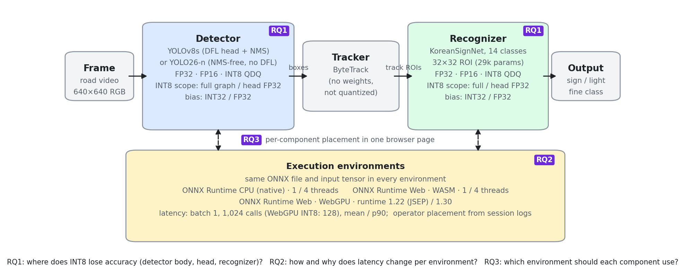
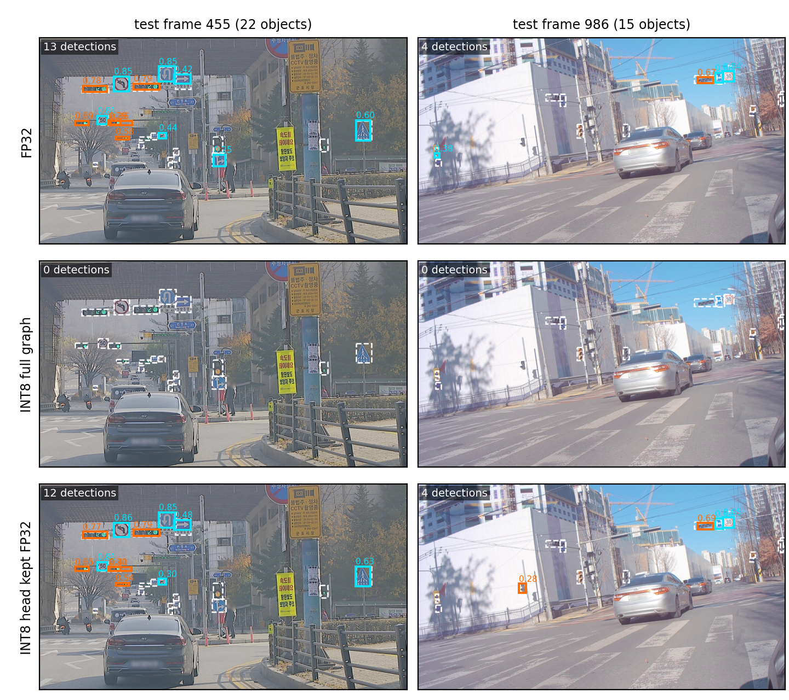
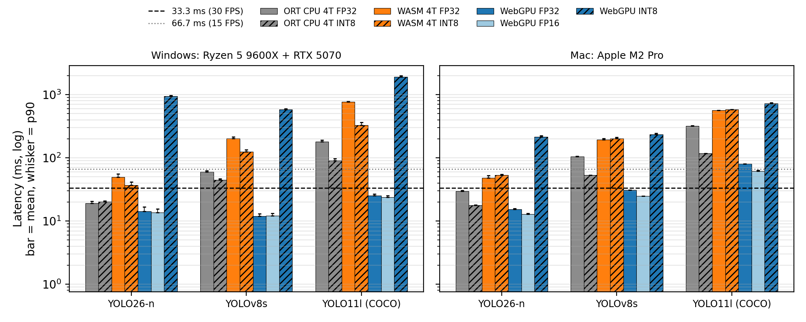
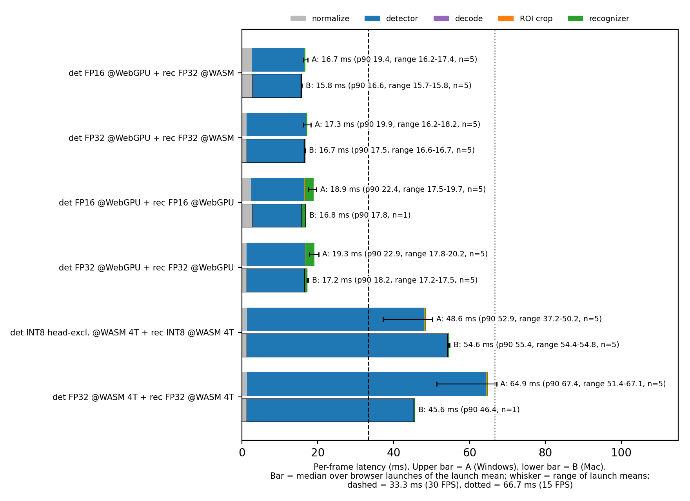

# BRIQ: 브라우저 기반 비전 추론의 구성요소·실행 환경별 양자화 실증 분석

**English title:** BRIQ: A Component- and Runtime-Aware Study of Quantization for Browser-Based Vision Inference

> 초안 상태(2026-09-27): 모든 수치는 `paper_evidence/`의 원시 기록에서 다시 계산할 수 있다. 수치별 원천은 [RUNTIME_MATRIX.md](reports/RUNTIME_MATRIX.md)(Windows·Mac), [COCO_VALIDATION.md](reports/COCO_VALIDATION.md), [TIIS_EVIDENCE_REPORT.md](reports/TIIS_EVIDENCE_REPORT.md)에 있다. Table 1의 표시는 원문과 대조하였다(Wang 등의 TOSEM 논문은 WebGPU를 평가에서 제외, Kim 등의 IEEE Access 논문은 정확도 손실을 함께 보고). 기기 B의 WASM FP32·INT8 비교를 조용한 환경에서 다시 재는 절차는 [DEVICE_MEASUREMENT_GUIDE.md](reports/DEVICE_MEASUREMENT_GUIDE.md) 8절에 있다.

---

## Abstract

브라우저에서 비전 모델을 실행하면 설치 없이 배포할 수 있고 영상이 사용자 기기를 벗어나지 않지만, 실제 응용은 여러 모델로 이루어지고 브라우저의 실행 환경(WebAssembly, WebGPU)은 연산자 지원과 성능 특성이 서로 다르다. 기존 양자화 연구는 주로 단일 모델의 정확도나 한 가지 하드웨어의 지연을 다루어, 구성요소와 실행 환경을 함께 바꿀 때 양자화의 효과는 알려져 있지 않다. 본 연구는 이를 측정하는 실증 평가 틀 BRIQ(Browser Runtime-aware Inference Quantization)를 제시하고, 도로 표지판·신호등 검출–추적–인식 파이프라인의 두 검출기와 인식기에 18개 정밀도 변형을 적용해 시퀀스 독립 test 2,417프레임에서 구성요소 정확도와 종단 정확도를 평가하였다. 같은 모델 파일의 지연은 두 기기(Windows 데스크톱, Apple M2 Pro)의 네이티브 CPU, WebAssembly, 두 버전의 WebGPU에서 측정해 연산자 배치 로그로 원인을 확인하였고, 검출기 수준의 결과는 MLPerf가 채택한 YOLO11l과 COCO 부분집합에서 측정 전에 공개한 예측으로 검증하였다. 검출 헤드까지 INT8로 바꾸면 박스 좌표와 클래스 점수가 한 활성값 척도를 공유하는 텐서에서 모든 점수가 0으로 반올림되어 세 검출기 모두 검출이 사라졌다. 헤드를 제외한 INT8은 주 도로 워크로드의 두 검출기에서 FP32 mAP의 97.0–98.7%를 유지해 사전 기준 99%에 못 미쳤고 종단 정답률 유지율은 94.2%로 더 낮았으며, 외부 검증의 YOLO11l은 99.2%를 유지하였다. INT8은 네이티브 CPU에서 대체로 속도를 높였으나 그 이득의 크기와 존재 여부는 모델과 기기에 따라 달랐고, WebGPU에서는 양자화 연산이 CPU로 배치되어 Windows에서 49–89배, Mac에서 7.6–14배 느렸으며, WebAssembly에서는 Windows에서 1.3–2.4배 빨랐으나 시험한 Mac에서는 빨라지지 않았다. 검출기를 WebGPU에, 인식기를 WebAssembly에 둔 구성요소별 배치는 두 기기 모두에서 가장 빨랐다(프레임당 중앙값 16.7 ms, 15.8 ms). 이 결과는 양자화 여부를 모델 단위로 한 번에 정하지 말고, 구성요소와 목표 실행 환경·기기의 조합마다 운영 조건의 태스크 지표와 실측 지연으로 정해야 함을 보여 준다.

**English abstract (working draft).** Running vision models in a web browser allows install-free deployment and keeps video on the user's device, but real applications combine several models, and the browser's runtimes (WebAssembly and WebGPU) differ in operator support and performance. Prior quantization studies mostly report the accuracy of a single model or the latency on a single piece of hardware, so the effect of quantization when both the component and the runtime change is not known. We present BRIQ (Browser Runtime-aware Inference Quantization), an empirical evaluation framework for this question, and apply 18 precision variants to the two detectors and the recognizer of a road-sign and traffic-light detection–tracking–recognition pipeline, evaluating component-level and end-to-end accuracy on 2,417 sequence-disjoint test frames. Latency of the same model files is measured on native CPU, WebAssembly, and WebGPU in two ONNX Runtime Web versions on two devices (a Windows desktop and an Apple M2 Pro laptop) and explained with operator-placement logs, and the detector-level findings are tested against predictions published before measurement on the YOLO11l model and COCO subset adopted by MLPerf. Quantizing the detection head removes every detection in all three detectors, because a tensor that carries class scores together with box coordinates shares one activation scale and rounds every score to zero. With the head kept in FP32, the two road-scene detectors retain 97.0–98.7% of FP32 mAP, below the preregistered 99% criterion, and 94.2% of end-to-end accuracy, whereas YOLO11l on COCO retains 99.2%. INT8 generally accelerates native-CPU inference, although the benefit depends on the model and device; on WebGPU it is 49–89× slower on Windows and 7.6–14× slower on the Mac because the quantize operators fall back to the CPU, and on WebAssembly it is 1.3–2.4× faster on Windows but not faster on the tested Mac. Placing the detector on WebGPU and the recognizer on WebAssembly is the fastest configuration on both devices (median 16.7 ms and 15.8 ms per frame). These results argue for choosing precision per component and per target runtime and device, using task metrics at the operating point and measured latency.

**Keywords**: Neural network quantization, Browser-based inference, WebGPU, ONNX Runtime, Object detection, Traffic sign recognition

---

## 1. Introduction

비전 모델을 웹 브라우저에서 실행하면 별도 설치 없이 배포할 수 있고, 영상이 사용자 기기를 벗어나지 않아 개인정보 보호에도 유리하다. 대신 브라우저는 네이티브 런타임보다 제약이 많다 [1], [2].
- 연산은 WebAssembly(WASM)나 WebGPU를 거쳐야 한다. WASM은 CPU에서 SIMD와 멀티스레드를 쓸 수 있지만, 멀티스레드는 교차 출처 격리가 적용된 페이지에서만 가능하다. WebGPU는 GPU를 쓰지만 지원되는 연산자와 데이터형이 런타임마다 다르다.
- 같은 추론 엔진도 버전에 따라 커널 구현이 바뀌고, 같은 모델 파일이라도 기기의 CPU·GPU 구조에 따라 성능이 다르게 나타난다.
- 따라서 네이티브 환경에서 얻은 모델 최적화의 효과가 브라우저에서도 그대로 성립한다고 가정하기 어렵다.

게다가 실제 비전 응용은 모델 하나가 아니라 여러 구성요소로 이루어지는 경우가 많다. 예를 들어 도로 영상의 표지판과 신호등은 화면에서 작게 나타나고, 가림과 조명 변화의 영향을 받는다 [3]. 응용은 프레임마다 객체를 찾는 데 그치지 않고, 같은 객체를 이어서 추적하며 속도 제한 값이나 신호 점등 상태 같은 세부 클래스를 판별해야 한다 [4]. 그래서 검출기, 추적기, 세부 인식기를 차례로 실행하는 파이프라인이 흔히 쓰인다. 이런 파이프라인에서는 구성요소마다 규모와 출력 형식이 다르므로, 최적화의 효과도 구성요소마다 다를 수 있다.

신경망 양자화는 모델 크기와 연산량을 줄이는 대표적 방법이다 [5], [6]. 그러나 파이프라인에 양자화를 적용할 때는 두 가지를 따로 따져야 한다. 첫째, 양자화 오차가 어느 구성요소에서 태스크 정확도로 이어지는가이다. 검출기의 몸통과 헤드, 뒤 단계의 인식기는 구조와 출력 형식이 달라서 같은 설정에서도 손실이 다를 수 있다 [7]–[10]. 둘째, 양자화 모델이 목표 실행 환경에서 실제로 빨라지는가이다. INT8의 속도 이득은 연산 장치와 커널 지원에 따라 달라지며 [11], 브라우저에서는 이런 차이가 더 클 수 있다 [1], [2]. 기존 검출기 양자화 연구는 대부분 단일 모델의 정확도나 한 가지 하드웨어에서의 지연을 다루므로, 구성요소와 실행 환경을 함께 바꿨을 때의 결과는 알기 어렵다.

본 연구는 브라우저 비전 추론에서 양자화의 효과를 구성요소, 정밀도, 실행 환경의 세 축으로 한 실험 틀에서 측정한다. 이 평가 틀과 연구를 BRIQ(Browser Runtime-aware Inference Quantization)라 부른다. BRIQ는 새 양자화 알고리즘이 아니라, 같은 모델 파일을 구성요소·정밀도·실행 환경별로 측정하고 원인을 연산자 수준까지 추적하는 실증 분석의 이름이다.
- 주 응용 워크로드는 한국 도로 영상의 교통표지판·신호등 인식 파이프라인(검출기·추적기·인식기)이다.
- 지연은 두 기기(Windows 데스크톱, Apple Silicon 노트북)에서 같은 절차로 측정한다.
- 검출기 수준의 결과는 MLPerf가 채택한 모델과 데이터(YOLO11l, COCO safe subset)로 외부 검증한다.

Fig. 1은 BRIQ의 구성요소, 양자화 변형, 실행 환경과 연구 질문의 관계를 요약한다.

**Fig. 1.** BRIQ 연구 구성. 검출기와 인식기는 정밀도·양자화 범위·bias 표현을 바꾼 변형으로 평가하고(RQ1), 같은 ONNX 파일을 여러 실행 환경에서 측정하며(RQ2), 두 구성요소를 한 브라우저 페이지에서 서로 다른 실행 환경에 배치한다(RQ3). 추적기는 학습 가중치가 없어 양자화하지 않는다.

연구 질문은 다음과 같다.
- **RQ1 (구성요소):** 같은 정적 INT8 설정을 적용할 때 검출기의 몸통, 검출 헤드, 인식기 가운데 어디에서 정확도가 손실되며, 그 손실은 파이프라인의 최종 인식 결과까지 어떻게 전파되는가?
- **RQ2 (실행 환경):** 같은 모델 파일의 지연이 네이티브 CPU, 브라우저 WASM, 브라우저 WebGPU에서 어떻게 달라지며, 그 원인은 무엇인가? 그 결과는 기기가 바뀌어도 유지되는가?
- **RQ3 (배치):** 구성요소마다 정밀도와 실행 환경을 다르게 배치하면 브라우저 파이프라인의 프레임당 지연이 어떻게 달라지는가?

본 논문의 기여는 다음과 같다.
1. **구성요소별 양자화 분석 (4.2절).** 두 검출기와 인식기에서 양자화 민감도를 비교하고, 가중치 전용·활성값 전용·단일 텐서 ablation으로 검출 붕괴의 원인을 추적한다. 평가한 검출기 그래프에서는 박스 좌표와 클래스 점수가 한 텐서별 활성값 척도를 공유할 때 모든 점수가 0으로 반올림되는 치명적 실패 모드가 있음을 보이고, 그 손실이 종단 정확도로 전파되는 크기를 측정한다.
2. **실행 환경별 분석 (4.3절).** 네이티브 CPU, WASM, WebGPU와 ONNX Runtime Web 버전에 따라 정밀도의 실제 지연 효과가 어떻게 달라지는지를 연산자 배치 로그와 함께 분석하고, 두 번째 기기에서 어떤 결과가 유지되고 어떤 결과가 기기에 따라 달라지는지 구분한다.
3. **구성요소별 배치와 교차 워크로드 검증 (4.4–4.5절).** 도로 파이프라인에서 구성요소마다 실행 환경을 나눈 배치의 이득을 두 기기에서 보이고(4.4절), 검출기 수준의 결과를 MLPerf가 채택한 표준 워크로드에서 측정 전에 공개한 예측으로 검증한다(4.5절).

판정 기준(99% 유지율 등)은 측정 전에 정하였고(4.1.5절), 측정 코드와 원시 기록은 모두 공개한다.

2장은 관련 연구를 정리한다. 3장은 BRIQ의 연구 설계(문제 정의, 구성요소별 양자화, 실행 환경별 측정·배치)를 설명한다. 4장은 실험 구성을 밝히고 세 연구 질문의 결과와 외부 검증을 제시한 뒤, 결과의 의미와 타당성의 한계를 논의한다. 5장은 결론, 한계, 후속 연구를 정리한다. 본 실험 설계의 출발점이 된 선행 탐색은 부록 A에 둔다.

---

## 2. Related Work

### 2.1. Multi-stage Vision Inference Pipelines

교통표지판 검출은 작은 객체와 복잡한 배경을 다루는 응용으로 연구되어 왔다 [3]. Behrendt 등 [4]은 신호등의 검출·추적·분류를 한 파이프라인으로 결합하였고, Manocha 등 [12]은 한국 도로 표지판 검출을 평가하였다. Luo 등 [13]은 YOLOv8 기반 경량 표지 검출기를 임베디드 기기에서 실행하였다. 검출 뒤에 추적을 붙이는 구성에서는 ByteTrack [14]처럼 학습 가중치 없이 검출 결과만으로 객체를 연관하는 추적기가 널리 쓰인다. Anderson 등 [15]은 다중 카메라 검출·추적 모델에 양자화를 적용해 정확도와 정체성 유지의 절충을 보고하였다. 본 연구는 YOLOv8 [16]과 YOLO26 [17] 검출기, ByteTrack 추적기, 검출 영역을 세부 클래스로 나누는 경량 인식기로 파이프라인을 구성한다. 기존 연구가 파이프라인의 정확도나 한 가지 하드웨어의 최적화를 다룬 것과 달리, 본 연구는 파이프라인의 각 구성요소에 같은 양자화 설정을 적용해 손실이 나타나는 위치를 비교하고, 구성요소마다 다른 브라우저 실행 환경에 배치했을 때의 프레임 지연을 측정한다.

### 2.2. Quantization for Object Detection

정수 양자화는 가중치와 활성값을 낮은 비트의 정수로 나타내 저장과 연산 비용을 줄인다 [5]. 채널별 대칭 가중치와 비대칭 활성값, 보정 데이터 기반 범위 추정은 학습 후 양자화(PTQ)의 표준 구성이다 [6]. 검출기에 대해서는 전체 그래프의 저비트 변환 [7], YOLO의 PTQ [8], 박스 회귀 분기에 특화된 보정 [9]이 제안되었다. Moon 등 [10]은 모바일 INT8 변환에서 검출 헤드가 크게 열화되는 문제를 다루었다. Niu 등 [18]은 텐서 오차 대신 태스크 손실로 보정 지표를 정해야 한다고 보았다. 이 연구들은 대부분 새로운 양자화 방법을 제안하고 단일 모델의 정확도나 한 가지 하드웨어의 지연으로 평가한다. 본 연구는 새로운 양자화 알고리즘을 제안하지 않는다. 대신 표준 PTQ 설정을 파이프라인의 각 구성요소에 똑같이 적용하고, 검출 헤드의 실패를 텐서 단위까지 분리해 그 원인을 밝힌다.

### 2.3. Browser-Based DNN Inference and Runtime Backends

Ma 등 [1]은 브라우저 딥러닝 프레임워크의 성능을 네이티브 실행과 비교해 큰 격차를 보고하였다. Wang 등 [2]은 브라우저 추론의 지연과 정확도가 백엔드, 기기, 프레임워크에 따라 크게 달라짐을 보였다. 다만 WebGPU는 당시 초기 단계여서 평가에서 제외하고 WASM과 WebGL 백엔드만 다루었다. Lee와 Jeon [19]은 JavaScript, WebAssembly, 그리고 입력 해상도와 성능 지표에 따라 둘 중 하나를 동적으로 고르는 혼합 방식을 비교하였다. WebAssembly는 더 빨랐고 JavaScript는 메모리 효율이 높아, 실행 방식에 따라 추론 시간과 메모리 사용이 서로 절충되었다. 다만 이 연구의 대상은 ResNet 계열 분류 모델이었고, 모델 양자화, WebGPU 실행, 여러 구성요소로 이루어진 파이프라인은 다루지 않았다. Kim 등 [11]은 모바일 GPU에서 INT8 추론의 지연과 정확도를 함께 평가해, INT8이 항상 빠르지는 않음을 보였다. ONNX Runtime과 ONNX Runtime Web [20]은 같은 ONNX 그래프를 네이티브 CPU, WASM, WebGPU에서 실행하므로, 모델 파일을 고정하고 실행 환경만 바꿔 비교할 수 있다. 성능 판정은 MLPerf Inference를 따른다. 정확도는 FP32 기준 대비 품질 등급(95%·99%)으로 [21], [22], 지연은 단일 스트림 방식(p90, 1,024회 이상)으로 보고한다 [21]. 본 연구는 이 틀을 브라우저 파이프라인에 적용해, 양자화 효과가 구성요소, 실행 환경, 기기에 따라 어떻게 달라지는지를 연산자 배치 수준까지 확인한다.

Table 1은 대표 관련 연구와 본 연구의 범위를 비교한다.

**Table 1.** 관련 연구와의 범위 비교. ✓는 해당 항목을 주 실험에서 다룬 경우이다. "태스크 정확도"는 텐서 오차가 아닌 태스크 지표(mAP, Top-1, 추적 지표)로 평가한 경우, "연산자 배치"는 지연 차이를 연산자가 실행된 장치 수준에서 분석한 경우이다.

| 연구 | 양자화 | 브라우저 | WebGPU | 다중 구성요소 | 태스크 정확도 | 연산자 배치 |
| :--- | :---: | :---: | :---: | :---: | :---: | :---: |
| Ma 등 [1] | – | ✓ | – | – | – | – |
| Wang 등 [2] | – | ✓ | – | – | ✓ | – |
| Lee와 Jeon [19] | – | ✓ | – | – | – | – |
| Kim 등 [11] | ✓ | – | – | – | ✓ | – |
| Q-YOLO [8], Reg-PTQ [9] | ✓ | – | – | – | ✓ | – |
| Moon 등 [10] | ✓ | – | – | – | ✓ | – |
| Niu 등 [18] | ✓ | – | – | – | ✓ | – |
| Behrendt 등 [4] | – | – | – | ✓ | ✓ | – |
| Anderson 등 [15] | ✓ | – | – | ✓ | ✓ | – |
| **본 연구 (BRIQ)** | ✓ | ✓ | ✓ | ✓ | ✓ | ✓ |

---

## 3. BRIQ Study Design

### 3.1. Problem Formulation and Pipeline

입력 프레임 $I_t$에 대해 검출기 $D$는 박스·신뢰도·상위 클래스(교통표지판, 신호등)의 집합 $\mathcal B_t=D(I_t)$를 출력한다. 추적기 $T$는 이전 상태와 현재 검출을 연관해 $\mathcal S_t=T(\mathcal B_t,\mathcal S_{t-1})$를 만든다. 인식기 $R$은 각 객체 영역을 14개 세부 클래스로 분류한다. 세부 클래스는 제한속도 6종, 기타 규제, 지시, 주의 표지와 신호등의 적·녹·황·좌회전·기타 상태이다.

학습 가중치가 있는 구성요소 $c\in\{D,R\}$마다 정밀도 $p_c$(FP32, FP16, INT8 변형)와 실행 환경 $e_c$(네이티브 CPU, WASM, WebGPU)를 고른다. 배치 $\pi=(p_D,e_D,p_R,e_R)$의 프레임당 지연을 $L(\pi)$, FP32 대비 종단 정확도 유지율을 $R_{\text{E2E}}(p_D,p_R)$라 하면, 배포 결정은 다음 문제로 쓸 수 있다.

$$\pi^\ast=\arg\min_{\pi}\ L(\pi)\quad\text{s.t.}\quad R_{\text{E2E}}(p_D,p_R)\ge\tau \tag{1}$$

BRIQ는 이 문제를 최적화하는 알고리즘이 아니라, 문제의 두 항이 무엇에 의존하는지를 측정한다. $R_{\text{E2E}}$가 정밀도 조합에 따라 어떻게 달라지는지(RQ1)와 CPU에서 구한 정확도를 어느 브라우저 실행 환경까지 옮길 수 있는지(4.3절의 수치 일치성), $L$은 정밀도·실행 환경·기기에 따라 어떻게 바뀌는지(RQ2), 구성요소별로 $e_c$를 나누면 $L$이 얼마나 줄어드는지(RQ3)를 확인한다. 기준 $\tau$는 4.1.5절에서 정한다. Table 2는 실험에 쓴 세 구성요소를 요약한다.

**Table 2.** 구성요소 모델. 파라미터 수는 FP32 ONNX의 부동소수점 initializer 합계이다.

| 구성요소 | 모델 | 파라미터 | FP32 파일 | 입력 | 출력·후처리 |
| :--- | :--- | ---: | ---: | :--- | :--- |
| 검출기 A | YOLOv8s [16] | 11.17 M | 44.75 MB | 640×640 | [1,6,8400], DFL 박스 회귀, 클래스별 NMS |
| 검출기 B | YOLO26-n [17] | 2.42 M | 9.81 MB | 640×640 | [1,300,6], 일대일 할당으로 NMS 불필요 |
| 인식기 | KoreanSignNet (3 conv + 2 1×1 conv) | 0.029 M | 0.117 MB | 32×32 | 14-class logits |

두 검출기는 같은 한국 도로 데이터로 학습했지만 헤드 구조가 다르다. YOLOv8s의 헤드는 박스 경계 분포를 적분하는 DFL [23]을 포함하고, 후처리로 NMS가 필요하다. YOLO26-n의 추론 그래프에는 DFL 적분이 없고, 최대 300개 검출을 직접 출력한다. 구조가 다른 두 헤드를 비교하면 헤드 민감도가 특정 구조에만 해당하는지 확인할 수 있다.

**2단계 분리 구조를 택한 이유.** 단일 검출기가 위치와 세부 클래스를 한 번에 예측하게 할 수도 있다. 그러나 본 시스템은 위치를 찾는 검출기와 잘라낸 영역만 분류하는 인식기를 분리하였다. 이유는 네 가지이다.
1. 제한속도 값이나 신호 점등 상태처럼 작은 영역의 세부 차이는 영역을 잘라 확대한 전용 분류기가 판별하기 쉽다.
2. 세부 클래스를 추가하거나 바꿀 때 박스 주석 없이 영역 단위 라벨만으로 인식기만 다시 학습하면 된다. 실제로 독일 GTSDB 43클래스 분류기를 한국 14클래스 인식기로 교체할 때 검출기는 그대로 두었다.
3. 구성요소가 분리되어 있어야 식 (1)처럼 구성요소마다 다른 정밀도와 실행 환경을 적용할 수 있다. 이것이 본 연구의 전제이다.
4. 인식기는 검출된 객체가 있을 때만 실행되므로 빈 프레임에서는 인식 비용이 들지 않는다.

**배포 형태.** 공개 시연은 검출·추적·인식 전체를 ONNX Runtime Web으로 브라우저 안에서 실행한다(온디바이스).
- 사용자는 화면에서 검출기(YOLO26-n, YOLOv8s), 정밀도(FP32, FP16, INT8), 실행 환경(WebGPU, WASM)을 골라 4.3–4.4절의 구성을 직접 재현할 수 있다. 인식기는 4.4절의 결과에 따라 WASM에서 실행한다.
- 서버(FastAPI)는 두 가지만 맡는다. 하나는 브라우저가 디코딩하지 못하는 입력(비호환 코덱 영상, 스트림 URL, 정지 영상)의 디코딩과 추론이고, 다른 하나는 인식 결과를 언어 모델에 전달하는 장면 질의응답이다.
- 두 경로는 같은 결과 형식과 렌더링 코드를 공유한다. 본 논문의 측정은 온디바이스 추론 경로를 대상으로 한다.

### 3.2. Component-Wise Quantization Design

모든 INT8 변형은 ONNX Runtime의 정적 PTQ로 만든 QDQ 그래프이다 [20]. 실수 텐서 $x$는 척도 $s$와 영점 $z$로 정수 $q$에 대응된다 [5], [6].

$$q=\operatorname{clip}\!\left(\left\lfloor x/s\right\rceil + z,\ q_{\min},\ q_{\max}\right),\qquad \hat{x}=s\,(q-z) \tag{2}$$

가중치 $W$는 출력 채널 $c$마다 대칭 INT8 척도를 쓴다($z=0$, $q\in[-128,127]$).

$$s_c=\frac{\max_i |W_{c,i}|}{127} \tag{3}$$

활성값은 보정 데이터에서 관측한 범위 $[x_{\min},x_{\max}]$로 비대칭 UINT8 척도와 영점을 **텐서마다 하나씩** 정한다($q\in[0,255]$, MinMax 보정).

$$s=\frac{x_{\max}-x_{\min}}{255},\qquad z=\left\lfloor -x_{\min}/s\right\rceil \tag{4}$$

식 (2)와 (4)에 따르면 범위에 0이 포함된 텐서에서 $|x|<s/2$인 값은 모두 영점으로 반올림되어 $\hat{x}=0$이 된다. 크기가 크게 다른 양을 한 텐서에 담으면 작은 쪽 값이 통째로 사라질 수 있다는 뜻이다. 4.2절은 이 성질이 검출 붕괴를 설명하는지 ablation으로 검증한다.

QDQ 그래프는 식 (2)의 양자화(Q)와 역양자화(DQ)를 텐서마다 삽입한 형태이다. 실행 환경이 Q–연산–DQ 패턴을 정수 커널로 합칠 수 있으면 정수 연산으로 실행하고, 그렇지 않으면 식 (2)를 그대로 계산한다. 구성요소마다 두 요인을 바꾼다.
- **양자화 범위:** 전체 그래프(full) 또는 마지막 모듈을 FP32로 둔 그래프(head-excluded). 검출기의 헤드는 마지막 `model.N` 모듈(YOLOv8s `model.22`, YOLO26-n `model.23`)이다. 인식기의 헤드는 분류 1×1 conv이다.
  - 검출기 헤드는 다시 두 부분으로 나뉜다. 하나는 학습된 합성곱 분기(박스 분기 `cv2`, 클래스 분기 `cv3`)이다.
  - 다른 하나는 분기 출력을 박스 좌표와 점수로 바꾸는 **디코드 단계**이다. DFL 적분, 거리→박스 변환, sigmoid, 출력 연결, YOLO26-n의 상위 300개 선택이 여기에 속한다.
  - 디코드 단계에는 학습 가중치가 없다. YOLOv8s DFL의 1×1 커널도 0–15의 고정값이다.
- **bias 표현:** INT32(ONNX Runtime 기본값) 또는 FP32. INT32 bias는 입력 척도와 가중치 척도의 곱을 척도로 쓰며($s_b=s_x s_{w,c}$, $z_b=0$), CPU가 합성곱을 정수 커널로 합칠 때 쓰인다. 반면 일부 브라우저 WebGPU 커널은 INT32 역양자화를 지원하지 않는다.

FP16 변형은 가중치와 활성값을 반정밀도로 변환한 그래프이다. YOLO26-n FP16은 입력도 FP16이고, YOLOv8s와 인식기의 FP16은 FP32 입출력을 유지한 채 내부에서 변환한다.

**원인 분리 설계.** 검출기의 손실이 어디에서 오는지 가르기 위해, 전체 INT8 QDQ 그래프에서 출발해 지정한 부분의 양자화만 남기고 나머지를 FP32로 되돌린 분석용 변형을 만든다.
- **가중치 전용:** 활성값은 FP32로 두고 Conv 가중치만 식 (3)으로 반올림한다(전체, 헤드, 헤드에서 DFL 커널 제외).
- **활성값 전용:** 가중치는 FP32로 두고 활성값만 식 (4)로 양자화한다(전체, 헤드, 디코드 단계).
- **단일 텐서:** 디코드 단계의 활성값 텐서를 하나씩만 양자화해 붕괴를 일으키는 텐서를 찾고, 그 텐서만 FP32로 되돌려 필요성을 확인한다.
- **디코드 단계만 FP32:** 헤드 분기는 W8A8로 두고 디코드 단계만 FP32로 둔 변형으로, 헤드 분기 활성값의 손실을 분리한다.

손실이 파이프라인의 최종 출력까지 전파되는지는 구성요소 지표와 별도로 **종단 정답률**(4.1.1절)로 측정한다. 종단 정확도는 검출기와 인식기 정밀도의 모든 조합에 대해 계산한다.

### 3.3. Runtime-Aware Profiling and Placement

같은 ONNX 파일을 다음 6가지 실행 환경 구성에서 실행한다.
- 네이티브 ONNX Runtime CPU 실행 제공자(1·4 스레드)
- 브라우저 ONNX Runtime Web의 WASM(1·4 스레드)
- 브라우저 WebGPU(ONNX Runtime Web 1.30.0; 런타임 버전의 영향을 보기 위해 1.22.0도 측정)

브라우저의 멀티스레드 WASM은 `SharedArrayBuffer`가 필요하다. 그래서 COOP/COEP 헤더로 교차 출처 격리를 적용한 페이지에서만 측정하고, 결과에 격리 여부와 실제 스레드 수를 기록한다.

측정 절차는 세 가지이다.
- **단일 모델 지연:** 측정 서버가 모든 실행 환경에 같은 RGB 입력(검출기 640×640, 인식기 32×32)을 주고, 각 환경은 정규화만 수행한다. 배치 1, 고정 프레임에서 워밍업 뒤 추론 호출만 반복 측정한다.
- **연산자 배치:** WebGPU 세션을 verbose 로그로 만들고, 각 노드가 배치된 실행 제공자(WebGPU 또는 CPU)를 로그에서 읽는다. 지연 차이는 이 배치로 설명한다.
- **수치 일치성:** WebGPU와 WASM의 검출 출력을 test 전체에 대해 수집하고, CPU와 같은 디코더로 mAP를 다시 계산한다. 일치가 확인된 정밀도·실행 환경 조합에서는 CPU에서 구한 검출 정확도를 브라우저 배치에도 쓸 수 있다. 인식기의 브라우저 출력은 이 절차로 확인하지 않았으므로, 식 (1)의 $R_{\text{E2E}}$는 CPU에서 계산한 값으로 보고한다.

**구성요소별 배치.** 한 브라우저 페이지에서 검출기와 인식기 세션을 각각 지정한 실행 환경으로 만든다. test 프레임을 순서대로 처리하며 정규화, 검출, 디코딩(신뢰도 0.25 이상), ROI 추출, 인식의 시간을 단계별로 기록한다.
- 각 프레임은 시간 측정 구간 밖에서 받아 온다(카메라 입력에 해당). 추적기(가중치 없는 JavaScript ByteTrack)와 화면 렌더링은 측정 범위에서 제외한다. 따라서 이 값은 전체 응용의 지연이 아니라 **검출–인식 프레임 지연**이다.
- 브라우저 실행 사이의 편차를 보기 위해 주요 배치는 브라우저를 새로 띄워 여러 번 측정하고, 같은 회차에 측정한 배치끼리 짝지어 비교한다.
- 지연 측정은 다른 측정과 겹치지 않도록 하나씩 순차 실행한다. Chrome은 실행마다 새 프로필로 시작한다.

---

## 4. Experiments and Results

### 4.1. Experimental Configuration

#### 4.1.1. Datasets and Splits

데이터는 AI Hub 「신호등·도로표지판 인지 영상(수도권)」[24]이다. 30 fps 원본을 5 fps로 서브샘플링하고, 비슷한 연속 프레임이 학습과 평가에 함께 들어가지 않도록 **시퀀스 단위**로 분할하였다(Table 3). 학습·보정·test 분할 사이에서 시퀀스 이름과 JPEG SHA-256이 모두 다름을 확인하였다. 인식기는 학습·검증 시퀀스의 GT 박스에서 자른 ROI로 학습하였다(학습 42,547개, 검증 8,623개). 검출기 보정에는 검증 시퀀스의 150프레임을, 인식기 보정에는 검증 ROI 가운데 seed 0으로 뽑은 512개를 사용하였다. 두 보정 집합 모두 test와 겹치지 않는다.

**Table 3.** 시퀀스 독립 분할

| 분할 | 이미지 | 객체 | 표지판 | 신호등 | 시퀀스 | 주간 / 야간 |
| :--- | ---: | ---: | ---: | ---: | ---: | ---: |
| 학습 | 12,375 | 43,677 | 21,637 | 22,040 | 5 | 12,250 / 125 |
| 보정 | 150 | 621 | 319 | 302 | 1 | 150 / 0 |
| test | 2,417 | 6,772 | 3,366 | 3,406 | 2 | 2,401 / 16 |

**종단 정답률.** 검출기 → ByteTrack → 인식기를 ONNX Runtime CPU에서 test 전체에 실행하고, 세부 라벨이 있는 GT 객체 6,771개 가운데 다음 두 조건을 모두 만족하는 비율을 센다.
- 같은 상위 클래스의 추적 상자가 IoU 0.5 이상으로 대응된다. 대응은 IoU가 큰 쌍부터 한 번씩만 짓는다.
- 그 추적 상자의 인식 결과가 GT 세부 클래스와 같다.

인식기 입력은 공개 시연과 같이 원본 프레임에서 추적 상자 영역을 잘라 만들고, 인식 결과는 추적 상자의 상위 클래스에 속한 세부 클래스 가운데 최고 점수로 정한다. ByteTrack 설정은 추적 임계값 0.25, 대응 임계값 0.8, 저신뢰 임계값 0.1, 버퍼 30프레임이며, 시퀀스가 바뀌면 초기화한다. 검출기 출력은 인식기와 무관하므로 검출기 변형마다 한 번 실행하고, 같은 추적 상자를 인식기 변형마다 분류한다.

#### 4.1.2. Models and Variants

Table 2의 세 구성요소마다 FP32, FP16, INT8 4종(양자화 범위 2 × bias 표현 2)을 만들어 모두 18개 변형을 얻었다. 3.2절의 원인 분리용 변형은 두 검출기에 대해 추가로 만들었다. 변형별 파일 크기, SHA-256, 제외 노드 수는 공개 기록에 있다. 두 기기의 측정은 SHA-256이 같은 모델 파일로 수행하였다.

#### 4.1.3. Hardware and Software Environment

지연은 두 기기에서 같은 스크립트로 측정하였다.
- **기기 A (Windows):** AMD Ryzen 5 9600X(6코어 12스레드), NVIDIA GeForce RTX 5070, Windows 11, Chrome 153.
- **기기 B (Mac):** Apple MacBook Pro, M2 Pro(성능 코어 6 + 효율 코어 4, GPU 16코어, 통합 메모리 16 GB), macOS 26.6.2, Chrome 153.0.8010.54. headless Chrome에서 하드웨어 WebGPU 어댑터(Metal)를 사용하였다.
- **공통:** 네이티브 ONNX Runtime 1.23.2, ONNX Runtime Web 1.30.0(WebGPU 실행 제공자)과 1.22.0(JSEP). 두 기기의 WebGPU 어댑터는 모두 `shader-f16` 기능을 지원하였다(어댑터 정보는 측정 기록마다 저장).

정확도는 두 기기에서 같은 모델 파일을 쓰므로 기기 A의 ONNX Runtime CPU에서 계산하였다. 기기 B에서도 WebGPU의 수치 일치성을 test 전체로 다시 확인하였다(4.3절).

#### 4.1.4. Measurement Protocol

- **단일 모델 지연:** 워밍업 20회 뒤 추론 호출 1,024회를 측정하고 평균·p50·p90·p99를 보고한다. 추론 한 번이 0.2–1초 걸리는 WebGPU INT8만 128회로 줄였다.
- **파이프라인:** test 앞 512프레임(프레임당 평균 검출 1.7–1.8개)을 처리한다. 기기 A는 주요 7개 배치를, 기기 B는 주요 4개 배치를 브라우저를 5번 새로 띄워 측정하였다(배치마다 5 × 512프레임). 나머지 배치는 1회 측정이다.
- **배경 부하:** 두 기기 모두 측정 중 10초마다 CPU 사용 상위 프로세스를 기록하였다. 기기 A에서 배경 프로세스와 겹친 측정은 부하가 가라앉은 뒤 다시 측정하였다(4.5절 Table 12 주석). 기기 B의 부하는 4.6절에서 논의한다.

#### 4.1.5. Metrics and Criteria

검출 정확도는 test 2,417프레임에서 COCO 방식 mAP@0.5:0.95를 주 지표로, mAP@0.5를 보조 지표로 계산한다 [25]. AP 계산은 Ultralytics와 같은 101점 보간이며, 저장된 예측으로 두 구현의 결과가 일치함(최대 절대 오차 0)을 확인하였다. 인식 정확도는 test의 수동 GT 박스에서 자른 ROI 6,771개의 Top-1이다. 이 값은 검출 결과와 무관한 오라클 박스 분류 정확도이다.

판정 기준(정확도 유지율 99%, 지연 기준 A·B)은 측정 전에 정하였다. 95% 상대 품질 등급은 측정 뒤 현행 MLPerf YOLO 과제와 비교하기 위해 추가한 참고 등급이다.
- **정확도:** 주 지표의 FP32 대비 유지율 $R$을 두 등급으로 판정한다.

$$R=\frac{m_{\text{variant}}}{m_{\text{FP32}}},\qquad \text{등급 }\tau\text{ 통과} \iff R\ge\tau,\quad \tau\in\{0.95,\ 0.99\} \tag{5}$$

  두 값은 MLPerf Inference의 품질 목표를 따른다. 초기 MLPerf의 검출 과제는 FP32 mAP의 99%를 품질 목표로 두었고 [21], 현재의 YOLOv11 과제는 기준 mAP의 95%(yolo-95)와 99%(yolo-99) 두 등급을 둔다 [22].
  - 합격 여부는 99% 기준으로 판정하고(식 (1)의 $\tau=0.99$), 95% 등급은 참고로만 보고한다.
  - MLPerf의 등급은 정해진 모델과 COCO 부분집합에 대한 값이다. 따라서 95% 등급을 넘었다고 해서 한국 도로 환경에서의 배포 적합성이 입증되지는 않는다.
  - 유지율의 불확실성은 부트스트랩 95% 신뢰구간(프레임 단위, 1,000회)으로 나타내고, 구간이 등급 값을 포함하면 판정을 보류한다.
- **지연(기준 A, 30 FPS):** p90 ≤ 33.3 ms이다. AI Hub 원본 영상의 30 fps와 실시간 검출의 관례적 정의(30 FPS 이상) [26]를 근거로 한다.
- **지연(기준 B, 15 FPS):** p90 ≤ 66.7 ms이다. MLPerf가 비전 응용의 최소치로 제시한 15–20 Hz [21]를 근거로 한다.
- **통계 요건:** 단일 모델 지연의 p90은 MLPerf 단일 스트림 요건에 따라 1,024회 이상 측정해 구한다. 파이프라인은 실행별 p90의 중앙값으로 판정하고, 5회를 합친 2,560프레임의 p90으로도 같은 판정이 나오는지 확인한다.

모델 크기는 문헌 근거가 있는 문턱이 없으므로 합격 기준에 넣지 않았다. 대신 실제 파일 바이트와 FP32 대비 압축비를 보고한다.

#### 4.1.6. External Validation Protocol

검출기 수준의 결과가 Edge-Sign 모델과 한국 도로 데이터에만 해당하는지 확인하기 위해, 표준 워크로드에서 같은 절차를 반복한다. 정식 MLPerf 제출(LoadGen, 시나리오 규정 준수)이 아니라, MLPerf가 쓰는 모델과 데이터로 하는 외부 검증이다. 예측과 판정 규칙은 측정 전에 공개 기록으로 고정하였다.
- **모델:** MLPerf Inference v6.0 edge 검출 과제와 같은 YOLO11l [27]이다(COCO 사전학습 공식 가중치, 파라미터 2,534만). 헤드는 YOLOv8s와 같은 DFL 구조이다. 출력 `[1,84,8400]`은 박스 좌표 4채널과 클래스 점수 80채널을 한 텐서로 연결한다.
- **데이터:** MLPerf의 COCO safe subset [28]이다. COCO 2017 val 5,000장 [25] 가운데 상업 이용이 가능한 라이선스의 1,525장(80클래스, 객체 11,251개)으로, MLCommons 스크립트와 같은 규칙으로 만들었다.
- **보정:** MLPerf가 YOLO용 보정 목록을 정하지 않았으므로, val2017 가운데 평가 부분집합에 없는 이미지에서 seed 0으로 500장을 뽑았다.
- **전처리·평가:** 공식 추론과 같은 640×640 레터박스를 쓴다. Ultralytics 검증 설정(신뢰도 0.001, 다중 라벨, 클래스별 NMS 0.7, 최대 300개)으로 후처리하고, pycocotools로 mAP를 계산한다. 신뢰구간은 이미지 단위 부트스트랩으로 구한다.
- **변형:** 3.2절과 같은 절차로 FP16과 INT8 변형(전체, 헤드 제외, 디코드 단계만 FP32)을 만들고, 원인 분리용 진단 변형 두 가지를 더한다.
- **지연:** 기기 A에서는 3.3절의 실행 환경을 모두 측정하되, 추론 한 번이 수 초인 WASM 1스레드는 제외하였다. 기기 B에서는 대표 조건(CPU 4T, WASM 4T, WebGPU 1.30)만 측정하였다.
- **사전 예측(P1–P5):**
  - P1: 전체 INT8은 붕괴한다.
  - P2: 출력 연결 텐서 하나만 양자화해도 붕괴한다.
  - P3: 디코드 단계에서 출력 연결만 FP32로 두면 붕괴하지 않는다.
  - P4: 헤드 제외 INT8은 붕괴하지 않는다. 유지율은 99% 기준으로 판정한다.
  - P5: INT8은 CPU·WASM에서 빠르고 WebGPU에서 느리며, FP16의 효과는 런타임 버전에 달려 있다.
- **비교 방식:** 두 워크로드 사이의 절대 mAP는 비교하지 않는다. 각 워크로드 안에서 FP32 대비 유지율만 비교한다.

### 4.2. RQ1: Component-Wise Accuracy Sensitivity

Table 4는 18개 변형의 정확도이다. 모든 값은 ONNX Runtime CPU에서 test 전체로 계산하였다. 브라우저 실행 환경에서도 같은 값이 나오는지는 4.3절에서 확인한다.

**Table 4.** 구성요소·정밀도별 정확도(독립 test). 검출기는 mAP, 인식기는 오라클 ROI 6,771개의 Top-1이다. INT8 셀의 "a / b"는 INT32 bias / FP32 bias 변형의 값이다. 유지율은 같은 구성요소 FP32 대비 주 지표(검출기 mAP@0.5:0.95, 인식기 Top-1)의 비율이고, 대괄호는 부트스트랩 95% 신뢰구간(INT32 bias 변형)이다. 판정은 식 (5)에 따른 사전 기준(99%)과 참고용 95% 등급이며, 신뢰구간이 기준값을 포함하면 보류로 표시한다.

| 구성요소 | 정밀도 | 파일 (MB) | mAP@0.5 | mAP@0.5:0.95 / Top-1 | 유지율 (%) [95% CI] | 99% 기준 | 95% 등급(참고) |
| :--- | :--- | ---: | ---: | ---: | ---: | :---: | :---: |
| YOLO26-n | FP32 | 9.81 | 0.4999 | 0.2422 | 100 | 기준 | 기준 |
| | FP16 | 4.97 | 0.4986 | 0.2418 | 99.8 [99.6–100.0] | 통과 | 통과 |
| | INT8 전체 | 3.10 / 2.99 | 0 / 0 | 0 / 0 | 0 | 불합격 | 불합격 |
| | INT8 헤드 제외 | 3.42 / 3.33 | 0.4826 / 0.4824 | 0.2350 / 0.2352 | 97.0 / 97.1 [96.3–97.8] | 불합격 | 통과 |
| YOLOv8s | FP32 | 44.75 | 0.5653 | 0.2808 | 100 | 기준 | 기준 |
| | FP16 | 22.38 | 0.5656 | 0.2805 | 99.9 [99.7–100.1] | 통과 | 통과 |
| | INT8 전체 | 11.66 / 11.55 | 0 / 0 | 0 / 0 | 0 | 불합격 | 불합격 |
| | INT8 헤드 제외 | 18.00 / 17.91 | 0.5585 / 0.5584 | 0.2772 / 0.2771 | 98.7 / 98.7 [98.2–99.2] | 보류 | 통과 |
| KoreanSignNet | FP32 | 0.117 | – | 0.8082 | 100 | 기준 | 기준 |
| | FP16 | 0.060 | – | 0.8080 | 100.0 [99.9–100.0] | 통과 | 통과 |
| | INT8 전체 | 0.042 / 0.039 | – | 0.8084 / 0.8084 | 100.0 [99.7–100.3] | 통과 | 통과 |
| | INT8 헤드 제외 | 0.043 / 0.041 | – | 0.8058 / 0.8058 | 99.7 [99.4–100.0] | 통과 | 통과 |

같은 INT8 설정에서 세 구성요소의 결과는 뚜렷이 갈렸다.

**검출 헤드: 전체 INT8은 붕괴한다.** 헤드까지 양자화한 검출기는 두 모델 모두 신뢰도 0.001 이상의 검출을 하나도 내지 못해 mAP가 0이었다. 두 헤드는 구조가 다르다. YOLOv8s는 DFL 박스 회귀와 NMS를 쓰고, YOLO26-n은 DFL 적분이 없는 일대일 출력이다. 그런데도 결과가 같았으므로, 붕괴는 특정 헤드 구조가 아니라 헤드 양자화 자체와 관련된 현상이다.

**몸통: 헤드를 제외하면 정확도가 대부분 돌아온다.** 헤드를 FP32로 두면 mAP@0.5:0.95 유지율은 YOLO26-n 97.0%, YOLOv8s 98.7%로 회복되었다. 그러나 두 모델 모두 사전에 정한 99% 기준에는 이르지 못했다(참고로 95% 등급은 넘었다). 손실은 주로 재현율에서 나왔다. YOLO26-n의 신뢰도 0.25 기준 재현율은 0.4232에서 0.4027로 줄었지만, 정밀도는 0.7546에서 0.7600으로 오히려 올랐다. 양자화 후 신뢰도가 전반적으로 낮아져 임계값을 넘는 검출이 줄어든 것이다(3,798개 → 3,588개). 클래스별 유지율은 표지판과 신호등이 비슷했다(YOLO26-n 97.1%·97.0%, YOLOv8s 98.8%·98.6%).

**인식기: 전체 INT8도 손실이 없다.** 2.87만 파라미터의 인식기는 분류 헤드까지 INT8로 바꿔도 Top-1이 0.8084로 FP32(0.8082)와 같았다. FP32 예측과의 일치율은 98.6%였다. 헤드를 제외한 변형(0.8058)이 오히려 조금 낮았지만, 이 차이는 ROI 18개에 해당해 우연 변동으로 보인다.

**정밀도 선택의 영향.** FP16은 모든 구성요소에서 99.8% 이상을 유지하였다. INT8의 bias 표현(INT32/FP32)은 정확도에 영향이 없었다(차이 0.0003 이하). bias 표현은 4.3절에서 보듯 실행 가능성과 속도에만 영향을 준다.

**유지율의 불확실성.**
- 99% 기준: YOLO26-n은 구간 전체(96.3–97.8%)가 기준 아래여서 불합격이다. YOLOv8s는 구간(98.2–99.2%)이 기준을 포함하므로 보류한다.
- 95% 등급(참고): 헤드 제외 검출기의 구간은 두 모델 모두 95%보다 위에 있다.
- 인식기는 FP16과 INT8 변형 모두 구간 하한이 99.4% 이상이어서 99% 기준을 통과한다.
- 같은 시퀀스의 프레임은 서로 상관되어 있어 프레임 단위 구간은 실제보다 좁을 수 있다. 그래서 25프레임(5초) 단위의 이동 블록 부트스트랩으로도 구간을 다시 구했다. 구간은 거의 같았고(YOLO26-n 96.2–97.9%, YOLOv8s 98.2–99.4%) 판정은 바뀌지 않았다.

Fig. 2는 Table 4의 유지율을 구성요소별로 보여 준다.

**Fig. 2.** 구성요소·정밀도별 정확도 유지율(검출기 mAP@0.5:0.95, 인식기 Top-1; 괄호는 파일 크기). 수염은 95% 프레임 부트스트랩 신뢰구간이고, 파선은 99% 기준, 점선은 95% 참고 등급이다. 전체 INT8 검출기는 검출이 하나도 없어 0%이다. FP32 bias 변형은 INT32 bias 변형과의 차이가 0.1%p 이내라 생략하였다.

**붕괴 원인: 가중치·활성값·단일 텐서 분리.** 선행 탐색(부록 A)에서 세운 가설, 즉 붕괴 원인이 가중치가 아니라 활성값 양자화에 있다는 가설을 3.2절의 원인 분리 변형으로 검증하였다(Table 5).
- **가중치 전용:** 활성값을 FP32로 두고 Conv 가중치만 INT8로 반올림하면, 헤드를 포함해도 붕괴하지 않았다(유지율 YOLO26-n 98.8–99.1%, YOLOv8s 96.3–96.4%; 가중치 SQNR 평균 39–43 dB). 가중치 양자화만으로는 붕괴가 재현되지 않는다.
- **활성값 전용:** 가중치를 FP32로 두고 활성값만 양자화하면, 범위를 전체·헤드·디코드 단계로 좁혀도 두 검출기 모두 mAP가 0이었다. 가중치 전용 결과와 합치면, 붕괴에 가중치 양자화는 필요하지 않고 활성값 양자화만으로 충분하다.
- **단일 텐서:** 디코드 단계에서 양자화되는 활성값 텐서 24개를 하나씩만 양자화하는 선별 검사를 하였다(test 242프레임, 10프레임 간격).
  - 붕괴(mAP 0)를 일으킨 텐서는 YOLO26-n 5개, YOLOv8s 1개였다. 모두 클래스 점수를 박스 좌표와 한 텐서에 담아 척도가 2.5–3.7인 텐서였다.
  - YOLOv8s에서는 최종 출력 연결이 유일했다. YOLO26-n에서는 상위 300개를 고르기 전에 점수와 박스를 합친 텐서와, 거기서 나온 텐서들(전치, 분할, 점수 선택)이 더해졌다.
  - test 전체로 확인하면, 출력 연결 텐서 하나만 양자화해도 두 검출기 모두 mAP가 0이었다.
- **필요성 확인:** 붕괴를 일으킨 텐서만 FP32로 두고 나머지 디코드 단계 활성값을 모두 양자화하면, 두 검출기 모두 붕괴하지 않았다(test 전체 유지율 YOLO26-n 57.0%, YOLOv8s 61.2%). 따라서 붕괴에는 이 텐서들 가운데 적어도 하나의 양자화가 필요하다. 남은 손실은 박스 좌표만 담은 텐서의 반올림에서 온다(단독 양자화 시 유지율 73–95%).

**메커니즘.** 점수와 박스 좌표가 섞인 텐서의 범위는 박스 좌표가 정한다.
- YOLOv8s 출력 연결의 보정 범위는 0–640.9 픽셀이어서, 식 (4)의 척도는 $s=2.513$이다.
- 점수(0–1)는 모두 $s/2\approx1.26$보다 작다. 따라서 식 (2)에서 영점으로 반올림되고, 역양자화한 모든 신뢰도가 정확히 0이 된다. YOLO26-n의 텐서들($s=2.54$–$3.72$)도 같다.
- 반면 점수만 담은 텐서(sigmoid 출력, $s\approx0.004$)는 단독으로 양자화해도 유지율이 99.9%였다.
- 선행 탐색(부록 A)에서 YOLOv8s 출력 텐서의 코사인 유사도가 높게 유지된 것도 같은 이유로 설명된다. YOLOv8s의 출력은 앵커마다 박스 좌표와 점수를 담는데, 텐서 크기의 대부분은 박스 좌표가 차지한다. 박스 좌표는 $\pm s/2$(약 1.3픽셀) 안에서 보존되므로, 점수가 모두 사라져도 텐서 유사도는 거의 변하지 않는다.
- 반면 YOLO26-n은 점수로 상위 300개를 고른다. 점수가 사라지면 출력되는 박스 자체가 바뀌어, 코사인 유사도도 test 평균 0.63으로 떨어졌다. 어느 경우든 텐서 유사도로는 검출 붕괴를 판정할 수 없다.

**YOLOv8s의 위치 오차: DFL 고정 커널.** 가중치 전용 실험에서 YOLOv8s는 헤드 가중치만 양자화해도 mAP@0.5:0.95가 96.4%로 떨어졌지만, mAP@0.5는 99.75%로 유지되었다. 검출 여부가 아니라 박스 위치가 어긋난 것이다. DFL은 경계마다 16개 bin의 확률 $p_i$로 거리의 기대값을 계산한다.

$$d=\sum_{i=0}^{15} w_i\,p_i,\qquad w_i=i,\qquad \sum_{i} p_i=1 \tag{6}$$

- 이 적분은 값이 0–15로 고정된 1×1 합성곱으로 구현된다. 식 (3)으로 양자화하면 척도가 $15/127$이 되어, 반올림 오차 $|\hat w_i-w_i|$는 최대 $s_c/2\approx0.059$ bin이다(실측 최대 0.055 bin).
- $\sum_i p_i=1$이므로 거리 오차 $|\hat d-d|=|\sum_i(\hat w_i-w_i)\,p_i|$도 같은 한계 안에 있다. stride 32 특징맵에서는 최대 약 1.8픽셀이다.
- 이 커널 하나만 FP32로 두자 유지율은 99.6%로 돌아왔다. YOLOv8s의 헤드에는 활성값뿐 아니라 학습 가중치가 아닌 적분 계산식까지 양자화 대상에 섞여 있고, 헤드 제외는 두 문제를 함께 피한다.

**손실 분해.** 디코드 단계만 FP32로 두고 나머지를 W8A8로 양자화하면 붕괴는 사라졌다.
- 다만 유지율은 YOLO26-n 94.3%, YOLOv8s 92.8%로, 헤드 전체를 FP32로 둔 경우(97.0%, 98.7%)보다 각각 2.7%p와 5.9%p 낮았다.
- 헤드 합성곱 분기의 가중치 양자화 손실은 1%p 이하였다(YOLO26-n 헤드 가중치 99.1%, YOLOv8s DFL 커널 제외 99.6%). 따라서 이 차이는 대부분 분기의 활성값 양자화에서 온다.
- 정리하면 INT8 검출기의 손실은 세 부분으로 나뉜다. 디코드 단계의 점수 소실은 붕괴를 일으키고, 헤드 분기의 활성값은 2.7–5.9%p, 몸통은 1.3–3.0%p를 잃게 한다.
- 디코드 단계만 제외한 모델은 헤드 전체를 제외한 모델보다 작다(YOLOv8s 11.7 MB 대 18.0 MB). 그러나 99% 기준에 미치지 못했고, 95% 등급도 YOLOv8s는 미달, YOLO26-n은 보류(신뢰구간 93.5–95.2%)였다.

**Table 5.** 양자화 요인 분리 ablation. 분석용 변형은 전체 INT8 QDQ 그래프에서 표시한 부분만 양자화하고 나머지는 FP32로 되돌렸다. 값은 test 전체의 mAP@0.5:0.95 유지율(%)이다. 붕괴 텐서는 단일 텐서 선별 검사에서 단독으로 mAP 0을 만든 텐서이다(YOLO26-n 5개, YOLOv8s 1개).

| 실험 | 양자화한 부분 | YOLO26-n | YOLOv8s |
| :--- | :--- | ---: | ---: |
| 가중치 전용 | 헤드 Conv 가중치 | 99.1 | 96.4 |
| | 전체 Conv 가중치 | 98.8 | 96.3 |
| | 헤드 Conv 가중치(DFL 커널 제외) | – | 99.6 |
| 활성값 전용 | 전체 활성값 | 0 | 0 |
| | 헤드 활성값 | 0 | 0 |
| | 디코드 단계 활성값 | 0 | 0 |
| | 출력 연결 텐서 1개 | 0 | 0 |
| | 디코드 단계, 출력 연결 제외 | 0 | 61.2 |
| | 디코드 단계, 붕괴 텐서 제외 | 57.0 | 61.2 |
| W8A8 | 디코드 단계만 FP32 | 94.3 | 92.8 |
| | 헤드 전체 FP32 (Table 4) | 97.0 | 98.7 |

**종단 정확도로의 전파.** 구성요소의 손실이 최종 인식 결과까지 어떻게 전파되는지 Table 6으로 확인하였다.
- 인식기의 정밀도(FP32·FP16·INT8)는 종단 정답률을 바꾸지 않았다(유지율 99.7–100.0%). FP16 검출기도 99.8%를 유지하였다.
- 헤드 제외 INT8 검출기의 종단 유지율은 94.2%(신뢰구간 92.8–95.7%)였다. 검출 mAP 유지율(97.0%)보다 손실이 두 배 가까이 크다.
- 대응된 객체의 인식 정확도는 86.2%로 FP32(86.5%)와 거의 같았다. 따라서 손실은 대응된 객체 수가 줄어든 데서 온다(2,936개 → 2,777개, −5.4%).
- mAP는 모든 신뢰도 임계값에 걸쳐 정확도를 평균하지만, 파이프라인은 추적 임계값(0.25)에서 동작한다. INT8이 신뢰도를 전반적으로 낮추면 이 임계값을 넘는 검출이 줄고, 그 손실이 그대로 최종 결과로 이어진다.
- 따라서 파이프라인에서 양자화 여부를 판정할 때는 검출 mAP만 보지 말고, 운영 임계값에서의 종단 지표도 함께 확인해야 한다. Fig. 3은 이 차이를 두 test 프레임에서 보여 준다.

**Table 6.** 검출→추적→인식 종단 정확도(YOLO26-n, test 전체, 세부 라벨이 있는 GT 6,771개).
- 대응: 같은 상위 클래스의 추적 상자와 IoU 0.5 이상으로 대응된 GT 수
- 조건부 정확도: 대응된 GT 가운데 세부 클래스를 맞힌 비율
- 종단 정답률: 전체 GT 가운데 대응되고 세부 클래스까지 맞힌 비율
- 유지율: FP32 검출기 + FP32 인식기 대비. 대괄호는 프레임 부트스트랩 95% 신뢰구간이다.

| 검출기 | 인식기 | 대응 | 조건부 정확도 (%) | 종단 정답률 (%) | 유지율 (%) [95% CI] |
| :--- | :--- | ---: | ---: | ---: | ---: |
| FP32 | FP32 | 2,936 | 86.5 | 37.5 | 100 |
| FP32 | INT8 전체 | 2,936 | 86.5 | 37.5 | 100.0 [99.7–100.3] |
| FP16 | FP32 | 2,928 | 86.6 | 37.5 | 99.8 [99.2–100.3] |
| FP16 | FP16 | 2,928 | 86.6 | 37.4 | 99.8 [99.2–100.3] |
| FP16 | INT8 전체 | 2,928 | 86.5 | 37.4 | 99.7 [99.1–100.3] |
| INT8 헤드 제외 | FP32 | 2,777 | 86.2 | 35.3 | 94.2 [92.8–95.7] |
| INT8 헤드 제외 | INT8 전체 | 2,777 | 86.4 | 35.4 | 94.4 [93.0–95.9] |
| INT8 전체 | 모든 변형 | 0 | – | 0 | 0 |

**Fig. 3.** YOLO26-n 정밀도별 검출 예(신뢰도 0.25 이상). 흰 점선은 GT, 색 상자는 검출(청록: 표지판, 주황: 신호등)이며, 숫자는 신뢰도이다.
- 프레임 선택 규칙: GT 객체 수가 가장 많은 주간 test 프레임과, 그로부터 100프레임 이상 떨어진 프레임 가운데 GT 수가 가장 많은 프레임
- INT8 전체는 두 프레임 모두 검출이 없다.
- 헤드 제외 INT8은 대부분의 검출을 유지하지만, 신뢰도가 임계값 근처인 검출은 사라지거나 바뀐다.

### 4.3. RQ2: Runtime-Dependent Latency and Its Causes

Table 7은 기기 A(Windows)에서 같은 모델 파일의 배치 1 추론 지연이다. 결과는 세 가지로 요약되며, 기기 B(Mac)에서의 재현 여부는 이 절의 끝에서 Table 9와 Fig. 4로 정리한다.

**Table 7.** 기기 A의 실행 환경별 추론 지연, 평균 / p90 (ms). 1,024회 측정(WebGPU INT8만 128회). INT8은 INT32 bias 변형이며, 1.22 WebGPU에서는 실행에 실패하였다. 인식기 WASM은 1스레드이다.

| 모델 | ORT CPU 1T | ORT CPU 4T | WASM 1T | WASM 4T | WebGPU (ORT-Web 1.22) | WebGPU (ORT-Web 1.30) |
| :--- | ---: | ---: | ---: | ---: | ---: | ---: |
| YOLO26-n FP32 | 34.1 / 37.3 | 19.2 / 20.4 | 157.1 / 164.6 | 49.8 / 55.7 | 14.7 / 16.7 | 14.3 / 16.8 |
| YOLO26-n FP16 | 33.5 / 36.6 | 20.0 / 20.9 | 164.3 / 172.0 | 52.0 / 57.9 | 54.3 / 58.1 | 13.6 / 15.6 |
| YOLO26-n INT8 헤드 제외 | 28.2 / 29.6 | 20.2 / 20.8 | 90.8 / 98.1 | 37.2 / 41.8 | 실행 실패 | 943.5 / 970.3 |
| YOLOv8s FP32 | 118.1 / 121.2 | 60.4 / 63.1 | 671.3 / 702.6 | 203.0 / 214.3 | 11.6 / 12.7 | 11.9 / 13.0 |
| YOLOv8s FP16 | 116.4 / 120.2 | 60.5 / 62.7 | 679.9 / 702.6 | 204.6 / 215.7 | 35.2 / 37.4 | 12.1 / 13.2 |
| YOLOv8s INT8 전체 | 54.5 / 56.9 | 33.2 / 35.3 | 294.3 / 314.4 | 94.6 / 103.0 | 실행 실패 | 792.3 / 821.2 |
| YOLOv8s INT8 헤드 제외 | 75.6 / 79.1 | 44.7 / 46.7 | 397.0 / 415.2 | 125.1 / 134.7 | 실행 실패 | 583.3 / 597.1 |
| KoreanSignNet FP32 | 0.03 / 0.03 | 0.03 / 0.03 | 0.25 / 0.32 | – | 3.25 / 3.96 | 3.48 / 4.09 |
| KoreanSignNet INT8 전체 | 0.06 / 0.06 | 0.04 / 0.05 | 0.19 / 0.28 | – | 실행 실패 | 31.0 / 35.7 |

**첫째, INT8의 속도 효과는 실행 환경에 따라 방향이 바뀐다.**
- YOLOv8s의 전체 INT8은 네이티브 CPU(1.8–2.2배)와 WASM(2.2–2.3배)에서 FP32보다 빨랐다. 그러나 WebGPU에서는 66배 느렸다(11.9 → 792 ms).
- 정확도를 지키려고 헤드를 제외하면 CPU 이득이 1.35배(4스레드)로 줄어든다.
- 파라미터가 적은 YOLO26-n은 네이티브 CPU 4스레드에서 INT8 이득이 없었다(19.2 ms 대 20.2 ms).
- 크기를 줄이는 결정과 속도를 높이는 결정이 실행 환경에 따라 서로 다른 결론으로 이어진다.

**둘째, WebGPU의 INT8 감속은 연산자 배치로 설명된다.** 연산자 배치 로그(Table 8)에 따르면 두 버전의 ONNX Runtime Web 모두 `QuantizeLinear`를 WebGPU에서 실행하지 못한다.
- 그래서 양자화 지점마다 노드가 CPU로 배치된다(YOLOv8s 전체 INT8 250개, YOLO26-n 헤드 제외 312개).
- 추론 한 번에 GPU와 CPU 사이 전송이 수백 번 일어나, INT8 모델은 FP32보다 49–83배 느려진다.
- 1.22에서는 INT32 bias를 역양자화하는 WebGPU 커널이 영점(zero point) 없는 입력을 거부해, 세션 생성 후 첫 추론에서 실행이 실패하였다. FP32 bias로 만든 변형만 1.22에서 실행되었다. bias 표현은 정확도가 아니라 실행 가능성을 좌우한다.

**셋째, 정밀도의 효과는 런타임 버전에도 달려 있다.**
- 1.22에서 FP16은 FP32보다 3.0–3.7배 느렸다. `Split`, `Cast`, `GatherElements` 등 FP16 커널이 없는 연산이 CPU로 배치되었기 때문이다(YOLO26-n 29개).
- 1.30에서는 이 연산들이 WebGPU에서 실행되어 FP16이 FP32와 비슷하거나 5% 빨랐다.
- 선행 탐색(부록 A)의 초기 관찰(FP16이 더 느리고 INT8은 실행되지 않음)은 모델의 성질이 아니라 당시 런타임 버전의 성질이었다.

**Table 8.** WebGPU 세션의 노드 배치(GPU / CPU 노드 수)와 CPU로 배치된 주요 연산. ORT-Web 1.22는 JSEP, 1.30은 WebGPU 실행 제공자를 쓴다. 기기 B에서 측정한 배치(1.30 전체, 1.22의 YOLO26-n FP32·FP16)는 모든 행에서 기기 A와 노드 수까지 같았다.

| 모델 | 1.22 GPU / CPU | 1.30 GPU / CPU | CPU로 배치된 주요 연산 |
| :--- | ---: | ---: | :--- |
| YOLO26-n FP32 | 399 / 11 | 226 / 9 | 인덱스 연산(Tile, Gather, Mod 등); 1.22는 TopK 추가 |
| YOLO26-n FP16 | 427 / 29 | 228 / 9 | 1.22: Split 12, Cast 5, GatherElements 2 추가 |
| YOLOv8s FP16 | 267 / 8 | 139 / 0 | 1.22: Split 8 |
| YOLOv8s INT8 전체 (FP32 bias) | 1,210 / 254 | 1,210 / 254 | QuantizeLinear 250, Transpose 4 |
| YOLOv8s INT8 헤드 제외 (FP32 bias) | 937 / 181 | 913 / 181 | QuantizeLinear 177, Transpose 4 |
| YOLO26-n INT8 헤드 제외 (FP32 bias) | 1,606 / 327 | 1,571 / 325 | QuantizeLinear 312, Transpose 4, 인덱스 연산 |
| KoreanSignNet INT8 전체 (FP32 bias) | 57 / 12 | 57 / 12 | QuantizeLinear 12 |

**구성요소 크기와 실행 환경.** 2.87만 파라미터의 인식기는 WASM(0.25 ms)보다 WebGPU(3.5 ms)에서 14배 느렸다. 연산량이 작으면 GPU 디스패치와 전송 비용이 계산 시간보다 커지기 때문이다. 반대로 검출기는 WebGPU에서 가장 빨랐다. 적합한 실행 환경이 구성요소의 규모에 따라 다르다는 점이 RQ3의 배치 실험으로 이어진다.

**브라우저 수치 일치성.**
- FP32 검출기를 WebGPU에서 test 전체로 실행한 mAP는 ONNX Runtime CPU와 소수 여섯째 자리까지 같았다. 기기 B의 WebGPU(Metal)에서도 같았다.
- FP16은 GPU 누산 차이로 mAP@0.5:0.95가 최대 0.0011(기기 A), 0.0012(기기 B) 달랐다. 유지율은 99.5% 이상으로 여전히 기준 안이다.
- WASM의 일치성은 기기 A에서 YOLO26-n의 FP32와 INT8 헤드 제외(FP32 bias) 변형으로 확인하였다. FP32는 CPU와 같았고, INT8은 0.0003 이내로 일치하였다.
- 따라서 FP32·FP16 검출기는 두 기기의 WebGPU 모두에서 CPU 평가와 실질적으로 같은 정확도를 보였고, Table 4의 검출기 정확도는 이 조합의 브라우저 배치에 적용된다. 인식기와 종단 정확도(Table 6)는 CPU에서만 계산했고, INT8 변형의 태스크 수준 일치는 기기 A의 WASM에서만 확인했으므로, 정확도가 기기와 실행 환경에 무관하다고까지 주장하지는 않는다.

**두 번째 기기에서의 재현.** 같은 모델 파일과 절차로 기기 B(Apple M2 Pro)에서 다시 측정하였다. Table 9는 두 기기에서 정밀도의 효과를 같은 실행 환경 안의 비율로 비교하고, Fig. 4는 대표 조건의 절대 지연을 두 기기에 나란히 보여 준다.

**Table 9.** 기기별 정밀도 효과(평균 지연의 비). 1보다 크면 앞의 변형이 느리다. INT8은 헤드 제외(INT32 bias) 변형이다. 기기 B의 절대 지연(평균 / p90, ms)은 공개 기록 `runtime/matrix_mac/`에 있다.

| 효과 | 모델 | 기기 A (Windows) | 기기 B (Mac) | 방향 |
| :--- | :--- | ---: | ---: | :---: |
| WebGPU 1.30: INT8 / FP32 | YOLO26-n | 66× | 14× | 같음 |
| | YOLOv8s | 49× | 7.6× | 같음 |
| | YOLO11l (COCO) | 75× | 9.0× | 같음 |
| WebGPU 1.22: FP16 / FP32 | YOLO26-n | 3.7× | 1.6× | 같음 |
| WebGPU 1.30: FP16 / FP32 | YOLO26-n | 0.95× | 0.84× | 같음 |
| | YOLOv8s | 1.02× | 0.81× | 기기 B만 이득 |
| | YOLO11l (COCO) | 0.95× | 0.77× | 같음 |
| 네이티브 CPU 4T: FP32 / INT8 (속도 향상) | YOLO26-n | 0.95× | 1.68× | 기기 B만 이득 |
| | YOLOv8s | 1.35× | 1.97× | 같음 |
| | YOLO11l (COCO) | 2.0× | 2.7× | 같음 |
| WASM 4T: FP32 / INT8 (속도 향상) | YOLO26-n | 1.34× | 0.89× | **반대** |
| | YOLOv8s | 1.62× | 0.95× | **반대** |
| | YOLO11l (COCO) | 2.3× | 0.97× | **반대** |
| 인식기: WebGPU 1.30 / WASM 1T | KoreanSignNet FP32 | 14× | 6.0× | 같음 |

두 기기의 결과는 두 갈래로 나뉜다.
- **두 기기에서 같았던 것.** WebGPU에서 INT8이 느린 현상, FP16의 효과가 런타임 버전에 달린 현상, 작은 인식기가 WebGPU보다 WASM에서 빠른 현상은 두 기기에서 같은 방향이었다. 원인이 되는 연산자 배치(`QuantizeLinear` YOLO26-n 312개, YOLOv8s 177개, YOLO11l 556개; 1.22 FP16의 `Split` 12개 등)도 두 기기에서 노드 수까지 같았다. 즉 두 시험 기기(두 GPU 모두 `shader-f16` 지원)에서는 같은 ORT-Web 버전과 모델 그래프이면 노드 배치가 동일했고, 그 비용의 크기만 달랐다. 어댑터 기능이나 셰이더 지원이 다른 GPU(예: `shader-f16` 미지원)에서는 배치가 달라질 수 있으므로, 이 동일성을 모든 기기로 일반화하지는 않는다. 기기 B의 감속 폭이 작은 것(7.6–14배 대 49–89배)은 CPU와 GPU가 메모리를 공유하는 통합 메모리 구조에서 CPU 배치의 전송 비용이 작기 때문일 가능성이 있지만, 본 연구에서 이를 분리하지는 않았다.
- **두 기기에서 달랐던 것.** WASM에서 INT8의 속도 이득은 기기 A에서만 나타났다. 시험한 기기 B에서는 네이티브 CPU의 INT8이 1.7–2.7배 빨랐는데도, 같은 모델의 WASM INT8은 세 검출기 모두 FP32와 같거나 느렸다(0.89–1.01배, 1스레드 포함). 기기 B의 FP32 WASM 지연은 기기 A와 비슷했으므로(YOLO26-n 4T 47.9 ms 대 49.8 ms), 차이는 INT8 경로에서 생긴 것으로 보인다. 원인(예: 브라우저 WASM 엔진이 정수 SIMD 연산을 기계어로 옮기는 방식)은 분리하지 않았다. 또한 이 값은 모델마다 한 번의 측정이고 측정 중 배경 부하가 있었으므로(4.6절), 한 대의 Mac에서 관찰된 결과로만 보고하며 ARM 계열 기기 전반의 성질로 일반화하지 않는다. 그래도 이 관찰은 "WASM에서는 INT8이 빠르다"는 결론이 기기에 따라 달라질 수 있음을 보여 준다.

**Fig. 4.** 두 기기의 검출기 배치 1 추론 지연(로그 축, 막대 = 평균, 수염 = p90). 대표 조건만 표시하였다: 네이티브 ORT CPU 4스레드, WASM 4스레드, WebGPU(ORT-Web 1.30)의 FP32·FP16과 INT8(헤드 제외, INT32 bias). 파선은 30 FPS(33.3 ms), 점선은 15 FPS(66.7 ms) 예산이다. 기기 A의 전체 조건(1스레드, ORT-Web 1.22, 인식기)은 Table 7에 있다.

### 4.4. RQ3: Component-Wise Runtime Placement

Table 10은 한 브라우저 페이지에서 검출기(YOLO26-n)와 인식기를 각각 지정한 실행 환경에 배치한 파이프라인의 프레임당 지연이고, Fig. 5는 주요 배치의 단계별 지연을 두 기기에 나란히 보여 준다. 반복 측정한 배치는 같은 회차에 측정한 배치끼리 짝지어 차이를 비교하였다.

**Table 10.** 브라우저 파이프라인 배치별 프레임당 검출–인식 지연(ms), 기기 A / 기기 B.
- 반복 측정한 배치(기기 A 7개, 기기 B 4개; † 표시)는 브라우저 실행 5회(각 512프레임) 결과의 중앙값이고, 대괄호는 실행 간 [최소–최대]이다. 나머지는 1회(512프레임) 측정이다.
- 기준 판정은 실행별 p90의 중앙값으로 하였다. 5회의 2,560프레임을 합친 p90으로 판정해도 모든 배치에서 결과가 같았다. 판정 열은 "기기 A / 기기 B"이다.
- WASM은 교차 출처 격리 페이지의 4스레드이다(1T 표시 행 제외).
- 종단 유지율은 같은 정밀도 조합의 Table 6 값(ONNX Runtime CPU)이다. 브라우저 실행 환경과의 수치 일치를 확인한 범위는 4.3절에 있다.

| 검출기 @실행 환경 | 인식기 @실행 환경 | 기기 A 합계 | 기기 A p90 | 기기 B 합계 | 기기 B p90 | 30 FPS | 15 FPS | 종단 유지율 (%) |
| :--- | :--- | ---: | ---: | ---: | ---: | :---: | :---: | ---: |
| FP16 @WebGPU | FP32 @WASM | **16.72**† [16.20–17.39] | 19.37 | **15.77**† [15.75–15.84] | 16.56 | 통과 / 통과 | 통과 / 통과 | 99.8 |
| FP16 @WebGPU | INT8 전체 @WASM | 16.96† [16.04–17.39] | 19.71 | 15.91 | 16.80 | 통과 / 통과 | 통과 / 통과 | 99.7 |
| FP32 @WebGPU | FP32 @WASM | 17.25† [16.21–18.20] | 19.91 | 16.69† [16.64–16.69] | 17.49 | 통과 / 통과 | 통과 / 통과 | 100 |
| FP16 @WebGPU | FP16 @WebGPU | 18.90† [17.47–19.69] | 22.35 | 16.79 | 17.84 | 통과 / 통과 | 통과 / 통과 | 99.8 |
| FP32 @WebGPU | FP32 @WebGPU | 19.32† [17.75–20.24] | 22.95 | 17.20† [17.15–17.54] | 18.24 | 통과 / 통과 | 통과 / 통과 | 100 |
| INT8 헤드 제외 @WASM | INT8 전체 @WASM | 48.61† [37.19–50.22] | 52.91 | 54.57† [54.40–54.77] | 55.39 | 불합격 / 불합격 | 통과 / 통과 | 94.4 |
| FP32 @WASM | FP32 @WASM | 64.85† [51.37–67.15] | 67.36 | 45.56 | 46.40 | 불합격 / 불합격 | 불합격 / 통과 | 100 |
| INT8 헤드 제외 @WASM 1T | INT8 전체 @WASM 1T | 93.68 | 100.94 | 169.90 | 171.61 | 불합격 / 불합격 | 불합격 / 불합격 | 94.4 |
| FP32 @WASM 1T | FP32 @WASM 1T | 153.56 | 160.21 | 154.00 | 156.16 | 불합격 / 불합격 | 불합격 / 불합격 | 100 |
| INT8 헤드 제외(FP32 bias) @WebGPU | INT8 전체 @WebGPU | 897.28 | 931.66 | 224.54 | 230.33 | 불합격 / 불합격 | 불합격 / 불합격 | 94.3 |

- **두 기기 모두 검출기는 WebGPU, 인식기는 WASM에 둔 배치가 가장 빨랐다.** 가장 낮은 지연은 두 기기 모두 FP16 검출기와 FP32 인식기의 조합이었다(기기 A 16.72 ms, 기기 B 15.77 ms).
  - 인식기까지 WebGPU에 두면 인식 단계가 기기 A에서 0.24 ms에서 2.3 ms로, 기기 B에서 0.20 ms에서 0.67 ms로 늘었다. 같은 회차끼리 비교하면 두 기기 모두 5회 전부 WASM 배치가 빨랐고, 차이는 평균 1.8 ms(기기 A, 1.3–2.7 ms)와 0.59 ms(기기 B, 0.48–0.85 ms)였다.
  - 인식기는 검출된 영역을 한 번에 묶어 호출하는데도 GPU 디스패치 비용이 연산보다 컸다.
- **FP16 검출기의 이득은 입력 변환 비용에 상당 부분 상쇄되었다.** 기기 A에서 FP16은 검출 추론을 1.8 ms 줄였지만, JavaScript에서 FP16 입력 텐서를 만드는 데 1.3 ms가 더 들어 순이득은 0.5 ms(약 3%)였다. 기기 B에서는 검출 추론이 2.5 ms 줄고 순이득은 0.89 ms(약 5%)였다. 두 기기 모두 5회 전부 FP16이 빨랐다.
- **인식기 정밀도는 속도에 영향이 없었다.** 기기 A에서 WASM 인식기를 INT8로 바꾼 차이는 평균 +0.1 ms(−0.2–+0.6 ms)였고 5회 중 2회만 INT8이 빨랐다. 기기 B(1회)에서도 INT8이 0.12 ms 느렸다.
- **WebGPU를 쓸 수 없는 환경에서의 선택은 기기에 따라 달랐다.**
  - 기기 A의 WASM 4스레드에서는 INT8 헤드 제외 검출기가 FP32보다 파이프라인을 1.31–1.38배 빠르게 했고(5회 모두), INT8만 15 FPS 기준을 통과하였다(p90 중앙값 52.9 ms 대 67.4 ms). FP32는 실행별로 5회 중 1회만 통과하였다.
  - 기기 B에서는 반대로 FP32(45.6 ms, 1회)가 INT8(54.6 ms, 5회의 중앙값)보다 빨랐고, 두 구성 모두 15 FPS 기준을 통과하였다. Table 9의 WASM INT8 결과와 같은 방향이다. 다만 FP32는 1회만 측정해 같은 회차의 짝 비교도 1회(INT8이 8.9 ms 느림)뿐이므로, 기기 A의 5회 짝 비교만큼 강한 근거는 아니다.
  - INT8의 대가는 검출 mAP 유지율 97.0%, 종단 유지율 94.4%이므로, 이 관찰이 유지된다면 기기 B에서는 WASM INT8을 쓸 이유가 없다.
  - 교차 출처 격리가 없는 페이지(WASM 1스레드)에서는 두 기기 모두 15 FPS에도 미치지 못했다.
- **실행 간 편차.** 기기 A의 첫 실행은 나머지 네 실행과 다른 시간대에 측정되었고, WASM 배치에서 18–26%, WebGPU 배치에서 3–12% 빨랐다. 기기 B의 실행 간 범위는 모든 반복 배치에서 0.4 ms 이내였다. 5회 반복한 짝 비교는 기기 A의 인식기 정밀도(INT8이 빠른 회차 2/5)와 전체 FP16 대 전체 FP32(FP16이 빠른 회차 4/5)를 제외하면, 두 기기 모두 모든 회차에서 같은 방향이었다.
- **정리하면 구성요소별 권장 배치는 다음과 같다.**
  - 검출기: WebGPU가 있으면 FP32 또는 FP16(ORT-Web 1.30 이상). 없으면 대상 기기에서 INT8 헤드 제외와 FP32를 실측해 고른다. 기기 A처럼 INT8만 예산을 지키는 기기에서는 약 6%의 종단 손실을 감수해야 한다.
  - 인식기: 두 기기 모두 WASM. 이 규모에서는 정밀도 선택이 속도에 영향이 없고, 종단 정확도도 모두 유지된다(Table 6).
  - WebGPU에 INT8을 두는 배치는 두 기기 모두에서 가장 느렸으므로 피해야 한다.

**Fig. 5.** 두 기기의 주요 파이프라인 배치별 단계 지연. 배치마다 위 막대는 기기 A, 아래 막대는 기기 B이다. 막대는 실행별 평균의 중앙값, 수염은 실행 간 범위이고, 숫자는 합계와 p90의 중앙값 및 실행 횟수(n)이다. 파선은 30 FPS, 점선은 15 FPS 예산이다. WASM 1스레드 배치와 WebGPU INT8 배치(기기 A 897 ms, 기기 B 225 ms)는 Table 10에만 표시하였다.

### 4.5. Cross-Workload Validation (YOLO11l, COCO)

4.1.6절의 사전 예측을 MLPerf가 채택한 모델과 데이터(YOLO11l, COCO safe subset)에서 확인하였다. 이 절은 RQ1·RQ2의 검출기 수준 결과에 대한 외부 검증이다. Table 11은 정확도, Table 12는 지연이다.

**Table 11.** YOLO11l 정밀도별 정확도(COCO safe subset 1,525장, pycocotools).
- 유지율은 FP32 대비 mAP@0.5:0.95이고, 대괄호는 이미지 단위 부트스트랩 95% 신뢰구간이다.
- INT8 셀의 "a / b"는 INT32 bias / FP32 bias 변형의 값이다. 신뢰구간은 INT32 bias 변형의 것이다.
- 진단 변형은 가중치를 FP32로 두고, 표시한 활성값만 양자화하였다.

| 변형 | 파일 (MB) | mAP@0.5 | mAP@0.5:0.95 | 유지율 (%) [95% CI] | 99% 기준 | 95% 등급(참고) |
| :--- | ---: | ---: | ---: | ---: | :---: | :---: |
| FP32 | 101.7 | 0.7091 | 0.5401 | 100 | 기준 | 기준 |
| FP16 | 50.9 | 0.7091 | 0.5404 | 100.0 [100.0–100.1] | 통과 | 통과 |
| INT8 전체 | 26.7 / 26.4 | 0 / 0 | 0 / 0 | 0 | 불합격 | 불합격 |
| INT8 헤드 제외 | 31.1 / 30.8 | 0.7010 / 0.7014 | 0.5356 / 0.5351 | 99.2 / 99.1 [98.4–99.8] | 보류 | 통과 |
| INT8 디코드 단계만 FP32 | 26.8 | 0.7008 | 0.5347 | 99.0 [98.2–99.6] | 보류 | 통과 |
| 진단: 출력 연결 텐서만 양자화 | – | 0 | 0 | 0 | – | – |
| 진단: 디코드 단계, 출력 연결 제외 | – | 0.6766 | 0.4683 | 86.7 [86.2–87.7] | – | – |

**사전 예측의 확인 (정확도).**
- **P1 재현:** 전체 INT8은 두 bias 표현 모두 신뢰도 0.001 이상의 검출을 하나도 내지 못했다. 출력 연결 텐서의 보정 범위는 −33–673이고 척도는 $s=2.77$이다. 점수 1.0도 0.36 단계에 불과해 모든 점수가 영점으로 반올림된다. 4.2절의 메커니즘과 같다.
- **P2 재현:** 가중치를 FP32로 두고 출력 연결 텐서 하나만 양자화해도 mAP는 0이었다.
- **P3 재현:** 디코드 단계 활성값을 양자화하되 출력 연결만 FP32로 두면 붕괴하지 않았다(유지율 86.7%). mAP@0.5 유지율은 95.4%여서, 남은 손실은 주로 박스 좌표 텐서의 반올림에 따른 위치 오차이다. YOLOv8s(61.2%)와 같은 양상이다.
- **P4 재현:** 헤드 제외 INT8은 붕괴하지 않았다. 유지율은 99.2%이지만 신뢰구간(98.4–99.8%)이 기준을 포함하므로 99% 기준은 보류이고, 95% 등급은 통과한다.

**워크로드에 따라 달라진 것.**
- 붕괴의 원인과 위치(점수와 박스 좌표를 한 척도로 담는 텐서)는 두 워크로드에서 같았다. 이는 박스와 점수를 한 출력으로 합치는 헤드 구조에서 나오는 성질로, 평가한 YOLO 계열 검출기 그래프에 한정된 결론이다.
- 반면 붕괴를 피한 뒤 남는 손실의 크기는 워크로드에 따라 달랐다.
  - COCO의 YOLO11l은 디코드 단계만 FP32로 두어도 99.0%로, 헤드 전체를 FP32로 둔 경우(99.2%)와 거의 같았다. 파일도 26.8 MB로 헤드 제외(31.1 MB)보다 작다.
  - Edge-Sign의 두 검출기는 디코드 단계만 제외하면 헤드 제외보다 2.7–5.9%p 낮았다.
  - 헤드 분기 활성값의 민감도는 모델과 데이터에 따라 다르므로, 양자화 범위는 워크로드마다 태스크 지표로 다시 확인해야 한다.
- 참고로 MLPerf의 절대 목표(yolo-99 52.87, yolo-95 50.73)와 비교하면 헤드 제외(53.6)와 디코드 제외(53.5)는 두 목표를 모두 넘는다. 다만 평가 코드가 공식 구현과 달라 참고로만 적는다.

**Table 12.** YOLO11l 실행 환경별 추론 지연, 평균 / p90 (ms).
- 1,024회 측정(WebGPU INT8만 128회)이다. ORT-Web 1.22 WebGPU의 INT8은 FP32 bias 변형이다.
- 기기 A에서 측정 중 기록한 CPU 부하가 배경 프로세스와 겹친 네 측정(CPU 4T의 FP32·FP16·INT8 전체, WASM 4T의 FP32)은 부하가 가라앉은 뒤 다시 측정한 값이다. 처음 값과의 차이는 10% 이내였다.
- 기기 B는 대표 조건만 측정하였다(–: 측정 안 함).

| 기기 | 변형 | ORT CPU 1T | ORT CPU 4T | WASM 4T | WebGPU (ORT-Web 1.22) | WebGPU (ORT-Web 1.30) |
| :--- | :--- | ---: | ---: | ---: | ---: | ---: |
| A | FP32 | 370.4 / 382.9 | 180.9 / 191.9 | 762.7 / 777.3 | 25.2 / 26.9 | 25.2 / 26.9 |
| A | FP16 | 365.1 / 375.0 | 191.7 / 194.9 | 676.5 / 731.9 | 55.7 / 58.9 | 24.0 / 25.3 |
| A | INT8 전체 | 140.5 / 145.4 | 85.7 / 87.6 | 319.1 / 338.0 | 2,056.5 / 2,148.8 | 2,238.2 / 2,274.0 |
| A | INT8 헤드 제외 | 163.0 / 171.5 | 90.5 / 97.9 | 330.3 / 365.9 | 1,812.4 / 1,839.6 | 1,897.5 / 1,986.2 |
| B | FP32 | – | 320.1 / 323.2 | 564.8 / 566.8 | – | 80.6 / 81.0 |
| B | FP16 | – | – | – | – | 61.9 / 63.5 |
| B | INT8 헤드 제외 | – | 117.3 / 118.2 | 583.1 / 584.9 | – | 721.8 / 742.1 |

**사전 예측의 확인 (실행 환경).** P5는 기기 A의 측정을 위해 공개한 예측이다. 기기 B의 결과는 사후에 같은 예측과 대조하였다.
- **P5(a):** 기기 A에서 재현되었다. INT8은 CPU와 WASM에서 FP32보다 빨랐다. 전체 INT8은 CPU 1T 2.6배, 4T 2.1배, WASM 4T 2.4배였고, 헤드 제외는 각각 2.3배, 2.0배, 2.3배였다. 기기 B에서는 CPU 4T(2.7배)에서만 성립하고 WASM 4T에서는 성립하지 않았다(0.97배). 4.3절의 기기 의존성과 같다.
- **P5(b) 재현:** ORT-Web 1.30 WebGPU에서 INT8은 FP32보다 기기 A에서 75–89배, 기기 B에서 9.0배 느렸다. 배치 로그에서 `QuantizeLinear` 647개(헤드 제외 556개)가 CPU에 배치되었고, 헤드 제외의 배치는 기기 B에서도 같았다. Edge-Sign 검출기와 같은 원인이다.
- **P5(c) 재현:** FP16은 ORT-Web 1.22 WebGPU에서 FP32보다 2.2배 느렸고, 이때 `Split` 11개가 CPU에 배치되었다. 1.30에서는 CPU 배치가 없어져 FP32보다 기기 A에서 5%, 기기 B에서 23% 빨랐다.
- 정리하면, 사전에 공개한 다섯 가지 예측이 기기 A의 표준 워크로드에서 모두 재현되었다. 달라진 것은 붕괴를 피한 뒤의 손실 크기와, 기기 B의 WASM INT8 이득뿐이다.

### 4.6. Discussion and Threats to Validity

**논의.**
- **정확도 판정과 지연 판정은 옮길 수 있는 범위가 다르다.** 붕괴 메커니즘은 평가한 세 검출기 그래프에서 같았고, 연산자 배치는 같은 ORT-Web 버전과 모델 그래프에서 두 시험 기기 사이에 동일하였다. FP32·FP16 검출기의 WebGPU 정확도도 두 기기 모두 CPU 평가와 실질적으로 같았다. 반면 같은 배치의 비용과 WASM의 INT8 이득은 기기에 따라 달랐다. 따라서 확인한 정밀도·실행 환경 조합에서는 정확도를 CPU에서 한 번 평가해 다시 쓸 수 있지만, 지연은 목표 기기마다 다시 측정해야 한다. INT8 변형의 기기 간 태스크 수준 일치는 모든 실행 환경에서 확인하지 않았다.
- **구성요소별 배치의 이득은 두 기기에서 같았다.** 인식기의 WASM 배치가 WebGPU 배치보다 빠른 현상은 두 기기에서 모두 5회 전부 나타났다. 작은 모델은 GPU 디스패치 비용이 계산 시간보다 크다는 구조적 이유에서 나오므로, 규모가 크게 다른 구성요소를 섞는 다른 브라우저 파이프라인에도 적용될 가능성이 높다.
- **mAP 유지율은 파이프라인 손실을 과소평가한다.** INT8의 손실은 신뢰도 분포의 이동으로 나타났고, 운영 임계값에서 종단 손실이 mAP 손실의 약 두 배가 되었다(4.2절). 식 (1)의 제약을 mAP로 대신하면 실제보다 관대한 결정을 내리게 된다.

**타당성의 위협.**
- **기기와 브라우저:** 지연은 데스크톱 한 대(x86 CPU, 외장 GPU)와 노트북 한 대(ARM CPU, 통합 GPU)에서 측정하였다. 두 기기 모두 Chrome 153과 ONNX Runtime Web만 사용했으며, Safari·Firefox, 다른 추론 프레임워크, 모바일 기기는 측정하지 않았다. 기기 B의 WASM INT8 결과처럼 기기에 따라 결론이 달라질 수 있다. 노드 배치의 동일성은 `shader-f16`을 지원하는 두 GPU에서만, INT8 변형의 브라우저 정확도 일치는 기기 A의 WASM에서만 확인하였다.
- **배경 부하:** 두 기기 모두 측정 전용으로 쓰지 못했다.
  - 기기 A의 파이프라인 반복 측정 직후에는 클라우드 동기화 프로세스가 논리 코어 약 1개를 쓰고 있었다. 첫 실행과 나머지 실행 사이의 차이(WASM 최대 26%)는 이런 조건 차이에서 왔을 수 있다.
  - 기기 B에서는 10초 간격 CPU 부하 기록 1,062개 가운데 13%(143개)에서 측정과 무관한 프로세스(데스크톱 앱, IDE, 시스템 서비스)가 코어 하나의 50% 이상을 썼다. 이런 표본은 WASM 단일 모델 측정 구간에서 가장 많았고(19%, 494개 중 93개), 네이티브 CPU·WebGPU 측정 구간에서는 1%였다. 또 22시 이후(파이프라인 반복과 YOLO11l 측정)에는 측정에 쓰지 않은 다른 Chrome 창이 약 0.2코어를 계속 썼다.
  - 기기 B는 10코어여서 4스레드 WASM에 미치는 영향은 기기 A보다 작을 것으로 보이며, 실제로 WASM 파이프라인 5회의 범위는 0.4 ms 이내였다. 그래도 절대 지연은 부하 조건에 따라 달라질 수 있으므로, 구성 간 비교는 같은 회차의 짝 비교로 보고하였다. 특히 기기 B의 WASM 단일 모델 지연(Table 9)은 부하가 많던 구간에 모델마다 한 번 측정한 값이다.
- **데이터:** 평가 분할은 같은 AI Hub 수집원의 시퀀스 독립 분할 하나이다. test의 야간 프레임은 16장뿐이어서 조명 조건별 결론을 내리지 않는다. test는 5 fps로 서브샘플링되어 있어 30 fps 영상에서의 추적 결과를 대표하지 않는다.
- **측정 범위:** 파이프라인 지연에는 추적기, 캔버스 렌더링, 카메라·영상 디코딩이 빠져 있다. 30 FPS 기준 통과는 이 범위에 한정된다. 종단 정답률은 프레임 단위의 검출·인식 결과로 계산했고, 추적 정확도(정체성 유지)는 수동 정체성 주석이 없어 평가하지 않았다. 종단 정확도는 YOLO26-n 파이프라인에서만 측정하였다.
- **통계:** 프레임 부트스트랩은 프레임 간 상관을 무시하므로 신뢰구간이 실제보다 좁다(블록 부트스트랩 결과는 4.2절). WebGPU INT8 지연은 128회만 측정하였다. 단일 텐서 검사는 test 242프레임의 선별 검사이며, 결론에 쓴 붕괴와 필요성은 test 전체로 다시 확인하였다. 기기 B의 결과는 P5 공개 뒤에 측정되었으므로 사전 예측의 검증이 아니라 사후 비교이다. 기기 B의 파이프라인에서 FP32@WASM은 1회만 측정되어, WASM에서 FP32와 INT8 검출기의 짝 비교는 기기 B에서 1회뿐이다.
- **외부 검증의 범위:** 외부 검증은 YOLO 계열 검출기 하나(YOLO11l)와 COCO 부분집합으로 한정된다.
  - 붕괴 메커니즘은 박스와 점수를 한 출력으로 합치는 YOLO 계열 헤드에 대한 결론이다. 출력 구조가 다른 검출기(예: DETR 계열)나 다른 표지 데이터셋(GTSDB, TT100K)에서는 같은 절차를 수행하지 않았다.
  - 인식기, 종단 정확도, 구성요소별 배치는 COCO로 검증하지 않았다.
  - COCO 정확도는 MLPerf 공식 평가 코드가 아니라 본 연구의 평가 코드로 계산하였다.

---

## 5. Conclusion

### 5.1. Summary

본 연구는 브라우저 비전 추론에서 양자화의 효과를 구성요소, 정밀도, 실행 환경의 세 축으로 측정하는 실증 평가 틀 BRIQ를 도로 표지 인식 파이프라인에 적용하였다.
- **구성요소별 양자화 분석(기여 1).** 같은 정적 INT8 설정이라도 구성요소에 따라 결과가 갈렸다. 검출 헤드의 양자화는 박스 좌표와 클래스 점수가 한 활성값 척도를 공유하는 텐서에서 모든 점수를 0으로 만들어 검출을 없앴다. 헤드를 제외해도 도로 워크로드의 두 검출기는 사전 기준 99%에 이르지 못했으며, 손실은 종단 지표에서 더 커졌다. 반면 작은 인식기는 전체 INT8에서도 손실이 없었다. 양자화는 구성요소 단위로, 운영 조건의 종단 지표로 검증해야 한다.
- **실행 환경별 분석(기여 2).** INT8과 FP16의 속도 효과는 실행 환경과 런타임 버전에 따라 방향이 바뀌었고, 그 원인은 연산자 배치로 설명되었다. 연산자 배치와 그에 따른 효과의 방향은 시험한 두 기기에서 같았지만, WASM에서 INT8의 이득은 두 기기에서 달랐다. "양자화하면 엣지에서 빨라진다"는 가정은 목표 실행 환경, 런타임 버전, 기기를 명시할 때만 성립한다.
- **구성요소별 배치와 교차 워크로드 검증(기여 3).** 검출기를 WebGPU에, 인식기를 WASM에 둔 배치가 두 기기에서 모두 가장 빨랐다. 검출기 수준의 결과는 MLPerf가 채택한 표준 워크로드에서 사전 공개한 예측대로 재현되었고, 워크로드에 따라 달라진 것은 붕괴를 피한 뒤 남는 손실의 크기였다. 따라서 양자화 범위를 정하는 원칙(점수와 좌표가 섞인 텐서를 피한다)은 평가한 검출기 그래프들에서 일반화되지만, 남는 손실의 크기와 실제 속도 이득은 워크로드와 기기마다 확인해야 한다.

### 5.2. Limitations

- **브라우저와 기기:** Chrome과 ONNX Runtime Web만 측정하였다. Safari·Firefox의 WebGPU 구현, 모바일 기기(스마트폰 GPU, 저전력 CPU)는 다루지 않았다. 기기도 두 대뿐이어서 기기 B에서 나타난 WASM INT8의 차이가 ARM 계열 전반의 성질인지는 알 수 없다. 노드 배치의 동일성과 INT8 변형의 브라우저 정확도 일치도 일부 기기와 실행 환경에서만 확인하였다.
- **양자화 방법:** 표준 정적 PTQ(MinMax 보정, 텐서별 활성값 척도)만 평가하였고, 사전 기준 99%를 충족하는 도로 검출기의 INT8 구성은 찾지 못했다.
- **검출기 구조:** 붕괴 메커니즘은 박스와 점수를 한 출력 텐서로 합치는 YOLO 계열 그래프(YOLOv8s, YOLO26-n, YOLO11l)에서만 확인하였다. 출력 구조가 다른 검출기(DETR 계열 등)에는 적용되지 않을 수 있다.
- **종단 평가:** 종단 정확도는 한 워크로드(YOLO26-n 도로 파이프라인)에서만 측정하였고, 수동 정체성 주석이 없어 추적 품질(정체성 유지)은 평가하지 않았다.
- **측정 범위:** 파이프라인 지연에서 카메라 입력, 영상 디코딩, 추적기, 렌더링을 제외하였다. 측정 기기에서 배경 부하를 완전히 없애지 못했다.

### 5.3. Future Work

5.2절의 한계에 각각 대응하는 후속 연구는 다음과 같다.
- **브라우저와 기기:** Safari·Firefox와 모바일 기기(Android Chrome, iOS Safari)에서 같은 번들과 스크립트로 측정하고, 여러 ARM·x86 기기에서 WASM INT8 커널의 동작과 INT8 변형의 브라우저 정확도 일치를 비교해 기기 의존성의 원인을 규명한다.
- **양자화 방법:** 다른 보정 방법(백분위수, 엔트로피)과 점수·박스 좌표에 서로 다른 척도를 쓰는 디코드 단계 분리, 헤드 분기의 활성값 척도 보정으로 99% 기준을 충족하는 INT8 검출기를 탐색한다.
- **검출기 구조:** 점수와 박스를 따로 출력하는 DETR 계열 등 다른 출력 구조의 검출기에 같은 원인 분리 절차를 적용한다.
- **종단 평가:** 수동 정체성 주석을 구축해 양자화가 추적 품질(ID 전환, IDF1)에 미치는 영향을 평가하고, 다른 워크로드에서도 종단 정확도를 측정한다.
- **측정 범위:** 카메라 입력부터 렌더링까지 포함한 전체 응용 지연을 측정하고, 측정 전용 환경에서 배경 부하의 영향을 정량화한다.

**Data and Code Availability.** 소스 코드와 측정 스크립트는 https://github.com/todayoneul/edge_sign (AGPL-3.0)에 공개되어 있다. 평가 분할 목록, 모델 해시, 프레임별 예측, 두 기기의 지연 trace·연산자 배치 로그·CPU 부하 기록은 `paper_evidence/`에 있다(기기 B는 `runtime/matrix_mac/`). AI Hub 데이터는 제공처 약관에 따라 재배포하지 않는다.

---

## Appendix A. Preliminary Exploration

본 실험에 앞서 두 단계의 탐색을 수행하였다. 이 부록의 수치는 **원시 예측과 반복 측정 기록이 보존되지 않은 과거 집계**이다. 게다가 대부분 활성값을 FP32로 둔 가중치 전용 시뮬레이션이다. 따라서 본문의 재현 가능한 측정과 섞어 비교하지 않고, 연구 질문을 세운 근거로만 제시한다.

첫째, ImageNet으로 학습한 ConvNeXtV2-Nano 분류기 [29]에서 압축 기법을 비교하였다. FP16 기준 Top-1 81.88%는 W8A8 PTQ에서 81.24%, W4A16 QAT에서 76.12%로 떨어졌고, 1비트 이진화 [30]와 지식 증류 [31]에서는 14.23%까지 떨어졌다. 단일 분류기에서는 8비트 양자화의 손실이 1%p 미만이었다.

둘째, 이 결과가 다단계 파이프라인에도 그대로 옮겨지는지 이전 세대 파이프라인(v2)에서 확인하였다(Table A1). v2의 검출 클래스는 교통표지판·간판이었고, 인식기는 단일 한글 문자 분류기와 GTSDB [32] 표지 분류기였다. 가중치 8비트에서는 검출과 두 인식기가 모두 유지되었다. 그러나 4비트에서는 2,350클래스 문자 분류기가 98.5%에서 54.6%로 무너졌다. 같은 비트폭이라도 구성요소마다 손실이 크게 다르다는 이 관찰이 RQ1의 출발점이다.

**Table A1.** v2 파이프라인의 단계별 가중치 시뮬레이션(과거 집계). 평가 데이터가 지표마다 다르며, 원시 기록이 없어 참고용으로만 제시한다.

| 평가 대상 | 지표 | FP32 | W8 | W4 |
| :--- | :--- | ---: | ---: | ---: |
| v2 검출기 (YOLOv8s, 표지판·간판) | mAP@0.5 | 0.587 | 0.587 | 0.523 |
| 단일 한글 문자 분류기 (2,350 클래스) | Top-1 (%) | 98.5 | 98.4 | 54.6 |
| GTSDB 표지 분류기 (43 클래스) | Top-1 (%) | 62.8 | 63.2 | 49.2 |

셋째, 한국 도로용 검출기(본 논문의 YOLOv8s)를 정적 INT8 QDQ로 변환하자 검출 결과가 사라졌고, 검출 헤드를 FP32로 남기면 검출이 돌아왔다. 출력 텐서의 코사인 유사도는 높게 유지되어 텐서 유사도만으로는 이 실패를 알아챌 수 없었다. 데이터 없이 가중치만 분석한 결과, 헤드 가중치의 INT8 SQNR(34.1 dB)은 몸통(32.8 dB)보다 낮지 않았다. 대신 헤드 가중치 분포의 초과 첨도가 49로 매우 컸다(몸통 4). 이로부터 붕괴 원인이 가중치가 아니라 활성값 양자화에 있다는 가설을 세웠다. 4.2절은 이 가설을 태스크 지표로 검증한다.

넷째, 초기 브라우저 시연에서는 FP16 WebGPU가 FP32보다 느렸고, INT8 모델은 WebGPU에서 실행되지 않았다. 반면 서버 CPU에서는 INT8 검출기가 빨랐다. 정밀도의 효과가 실행 환경에 따라 뒤집힐 수 있다는 이 관찰이 RQ2와 RQ3의 출발점이다. 다만 당시에는 실행 환경, 정밀도, 런타임 버전이 동시에 바뀌어 원인을 분리할 수 없었다. 4.3절은 이 요인들을 하나씩 고정해 다시 측정한다.

---

## References

[1] Y. Ma, D. Xiang, S. Zheng, D. Tian, and X. Liu, “Moving deep learning into web browser: How far can we go?,” in Proc. of The World Wide Web Conference (WWW), pp. 1234–1244, 2019, doi: 10.1145/3308558.3313639.

[2] Q. Wang et al., “Anatomizing deep learning inference in web browsers,” ACM Transactions on Software Engineering and Methodology, vol. 34, no. 2, pp. 1–43, 2025, doi: 10.1145/3688843.

[3] A. Møgelmose, M. M. Trivedi, and T. B. Moeslund, “Vision-based traffic sign detection and analysis for intelligent driver assistance systems: Perspectives and survey,” IEEE Transactions on Intelligent Transportation Systems, vol. 13, no. 4, pp. 1484–1497, 2012, doi: 10.1109/TITS.2012.2209421.

[4] K. Behrendt, L. Novak, and R. Botros, “A deep learning approach to traffic lights: Detection, tracking, and classification,” in Proc. of IEEE Int. Conf. on Robotics and Automation (ICRA), pp. 1370–1377, 2017, doi: 10.1109/ICRA.2017.7989163.

[5] B. Jacob et al., “Quantization and training of neural networks for efficient integer-arithmetic-only inference,” in Proc. of IEEE/CVF Conf. on Computer Vision and Pattern Recognition (CVPR), pp. 2704–2713, 2018, doi: 10.1109/CVPR.2018.00286.

[6] M. Nagel, M. Fournarakis, R. A. Amjad, Y. Bondarenko, M. van Baalen, and T. Blankevoort, “A white paper on neural network quantization,” arXiv preprint arXiv:2106.08295, 2021, doi: 10.48550/arXiv.2106.08295.

[7] R. Li, Y. Wang, F. Liang, H. Qin, J. Yan, and R. Fan, “Fully quantized network for object detection,” in Proc. of IEEE/CVF Conf. on Computer Vision and Pattern Recognition (CVPR), pp. 2805–2814, 2019, doi: 10.1109/CVPR.2019.00292.

[8] M. Wang et al., “Q-YOLO: Efficient inference for real-time object detection,” in Proc. of Asian Conf. on Pattern Recognition (ACPR), Lecture Notes in Computer Science, Springer, pp. 307–321, 2023, doi: 10.1007/978-3-031-47665-5_25.

[9] Y. Ding, W. Feng, C. Chen, J. Guo, and X. Liu, “Reg-PTQ: Regression-specialized post-training quantization for fully quantized object detector,” in Proc. of IEEE/CVF Conf. on Computer Vision and Pattern Recognition (CVPR), pp. 16174–16184, 2024, doi: 10.1109/CVPR52733.2024.01531.

[10] H.-C. Moon, S. Lee, J. Jeong, and S. Kim, “YOLOv6+: Simple and optimized object detection model for INT8 quantized inference on mobile devices,” Signal, Image and Video Processing, vol. 19, no. 8, 2025, doi: 10.1007/s11760-025-04234-0.

[11] S. Kim, G. Park, and Y. Yi, “Performance evaluation of INT8 quantized inference on mobile GPUs,” IEEE Access, vol. 9, pp. 164245–164255, 2021, doi: 10.1109/ACCESS.2021.3133100.

[12] P. Manocha, A. Kumar, J. A. Khan, and H. Shin, “Korean traffic sign detection using deep learning,” in Proc. of Int. SoC Design Conf. (ISOCC), pp. 247–248, 2018, doi: 10.1109/ISOCC.2018.8649887.

[13] Y. Luo, Y. Ci, S. Jiang, and X. Wei, “A novel lightweight real-time traffic sign detection method based on an embedded device and YOLOv8,” Journal of Real-Time Image Processing, vol. 21, no. 2, 2024, doi: 10.1007/s11554-023-01403-7.

[14] Y. Zhang et al., “ByteTrack: Multi-object tracking by associating every detection box,” in Proc. of European Conf. on Computer Vision (ECCV), Lecture Notes in Computer Science, Springer, pp. 1–21, 2022, doi: 10.1007/978-3-031-20047-2_1.

[15] E. Anderson et al., “Model optimization for multi-camera 3D detection and tracking,” arXiv preprint arXiv:2602.00450, 2026, doi: 10.48550/arXiv.2602.00450.

[16] G. Jocher, A. Chaurasia, and J. Qiu, “Ultralytics YOLOv8,” version 8.0.0, 2023. [Online]. Available: https://github.com/ultralytics/ultralytics

[17] G. Jocher, J. Qiu, M. Liu, S. Lyu, F. C. Akyon, and M. E. Kalfaoglu, “Ultralytics YOLO26: Unified real-time end-to-end vision models,” arXiv preprint arXiv:2606.03748, 2026, doi: 10.48550/arXiv.2606.03748.

[18] L. Niu, J. Liu, Z. Yuan, D. Yang, X. Wang, and W. Liu, “Improving post-training quantization on object detection with task loss-guided Lp metric,” arXiv preprint arXiv:2304.09785, 2023, doi: 10.48550/arXiv.2304.09785.

[19] C. Lee and S. Jeon, “A hybrid JavaScript–WebAssembly framework for efficient deep learning inference in web browsers,” KSII Transactions on Internet and Information Systems, vol. 20, no. 1, pp. 243–264, 2026, doi: 10.3837/tiis.2026.01.011.

[20] ONNX Runtime developers, “ONNX Runtime,” 2021. [Online]. Available: https://onnxruntime.ai

[21] V. J. Reddi et al., “MLPerf inference benchmark,” in Proc. of ACM/IEEE Annual Int. Symp. on Computer Architecture (ISCA), pp. 446–459, 2020, doi: 10.1109/ISCA45697.2020.00045.

[22] MLCommons, “MLPerf Inference benchmark suite,” GitHub repository. [Online]. Available: https://github.com/mlcommons/inference (accessed Sep. 26, 2026).

[23] X. Li et al., “Generalized focal loss: Learning qualified and distributed bounding boxes for dense object detection,” in Proc. of Advances in Neural Information Processing Systems (NeurIPS), vol. 33, 2020, doi: 10.48550/arXiv.2006.04388.

[24] National Information Society Agency, “Traffic light and road sign recognition video (Seoul metropolitan area),” AI-Hub dataset. [Online]. Available: https://aihub.or.kr/aihubdata/data/view.do?currMenu=115&topMenu=100&dataSetSn=188

[25] T.-Y. Lin et al., “Microsoft COCO: Common objects in context,” in Proc. of European Conf. on Computer Vision (ECCV), Lecture Notes in Computer Science, Springer, pp. 740–755, 2014, doi: 10.1007/978-3-319-10602-1_48.

[26] J. Redmon, S. Divvala, R. Girshick, and A. Farhadi, “You only look once: Unified, real-time object detection,” in Proc. of IEEE Conf. on Computer Vision and Pattern Recognition (CVPR), pp. 779–788, 2016, doi: 10.1109/CVPR.2016.91.

[27] G. Jocher and J. Qiu, “Ultralytics YOLO11,” version 11.0.0, 2024. [Online]. Available: https://github.com/ultralytics/ultralytics

[28] MLCommons, “YOLO for the MLPerf Inference v6.0 edge suite,” 2026. [Online]. Available: https://mlcommons.org/2026/03/yolo-inference/ (accessed Sep. 26, 2026).

[29] S. Woo, S. Debnath, R. Hu, X. Chen, Z. Liu, I. S. Kweon, and S. Xie, “ConvNeXt V2: Co-designing and scaling ConvNets with masked autoencoders,” in Proc. of IEEE/CVF Conf. on Computer Vision and Pattern Recognition (CVPR), pp. 16133–16142, 2023, doi: 10.1109/CVPR52729.2023.01548.

[30] M. Rastegari, V. Ordonez, J. Redmon, and A. Farhadi, “XNOR-Net: ImageNet classification using binary convolutional neural networks,” in Proc. of European Conf. on Computer Vision (ECCV), Lecture Notes in Computer Science, Springer, pp. 525–542, 2016, doi: 10.1007/978-3-319-46493-0_32.

[31] G. Hinton, O. Vinyals, and J. Dean, “Distilling the knowledge in a neural network,” arXiv preprint arXiv:1503.02531, 2015, doi: 10.48550/arXiv.1503.02531.

[32] S. Houben, J. Stallkamp, J. Salmen, M. Schlipsing, and C. Igel, “Detection of traffic signs in real-world images: The German traffic sign detection benchmark,” in Proc. of Int. Joint Conf. on Neural Networks (IJCNN), pp. 1–8, 2013, doi: 10.1109/IJCNN.2013.6706807.
