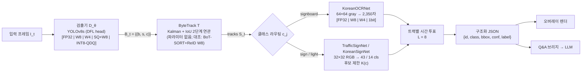

# [논문 초안] Edge-Sign — KSII TIIS 투고용 개조식 정리본

> **작성 기준일** 2026-09-23 · **원본** `README.md`(commit `095f3cd`) + `docs/*` + `src/*` + `paper_evidence/*`(읽기 전용 감사 결과)
> **틀** 「일반적인 논문 작성 예」(Title → Abstract → 1. Introduction → 2. Related Work → 3. Method → 4. Experiments → 5. Conclusion → References)
> **원칙** 기존 코드·문서는 수정하지 않았고, 새 학습·추론·벤치마크도 실행하지 않았음. 모든 수치는 README·docs·저장된 로그에서 옮겼으며 근거 상태를 아래 기호로 표시함.

## 0. 문서 안내

### 0.1 표기 규칙

| 기호 | 의미 | 투고 전 조치 |
| :---: | :--- | :--- |
| † | README·docs에는 기록되어 있으나 **원시 실행 로그·예측 파일이 보존되지 않은 값**(`paper_evidence` 판정: VERIFIED_DOC_ONLY) | 재측정 또는 로그 복원 후 사용 |
| ‡ | README 표기와 **원시 근거·코드 정의·산술이 불일치**하는 항목(판정: CONFLICT). 이 초안에서 정정값을 쓰거나 두 값을 함께 적음 | 원문 확인 후 하나로 확정 |
| \* | 구현 정의가 **표준 지표와 다른 proxy 지표**(예: IDF1\*, HOTA\*) | 표준 구현(TrackEval 등)으로 재평가하거나 proxy로 명명 |
| [n] | 참고문헌 번호. **DOI가 있는 153편은 2026-09-23 Crossref·DataCite API(1편은 doi.org 해석)로 실재 여부와 서지사항을 확인함. DOI가 없는 5편(소프트웨어·표준·데이터셋)은 URL로 표기함** | BibTeX: `paper_evidence/references.bib` |

- KSII TIIS는 **영문 원고**만 받으므로, 이 문서는 구조와 논리를 확정하기 위한 **국문 개조식 설계본**임. 영문 번역 시 절 번호와 표·그림 번호를 그대로 유지하면 됨.
- 참고문헌 번호는 카테고리 순으로 붙였음. 최종 원고에서는 BibTeX로 **인용 순서대로 다시 번호를 매길 것**(TIIS는 인용 순서 번호 방식).

### 0.2 README → 논문 절 대응

| README 절 | 논문 위치 |
| :--- | :--- |
| 핵심 요약 · 연구 질문 | Abstract, §1.2–1.4 |
| §1 핵심 방법론(W8A8·W4A16·SmoothQuant·1-Bit·KD) | §3.4 |
| §2 실험 환경·데이터셋, §5.4 데이터 파이프라인 | §4.1.1–4.1.2 |
| §3–4 Phase 1 스크리닝·Final Score | §4.2.1 (대조군) |
| §5.1–5.3 파이프라인·설계 철학·모델 선택 | §3.2–3.3 |
| §6 Phase 2 양자화 매트릭스(E0–E7) | §3.4(구성), §4.2.2–4.2.3(결과) |
| §7 Phase 3 도메인 적응 | §4.2.6 |
| §8 시연 시스템·온디바이스 교훈 | §3.6, §4.2.5 |
| §8.3 붕괴 원인 분석, §8.2 YOLO26 확장 | §3.5, §4.2.4 |
| §9 재현 가이드, 라이선스 | 부록 B, Data Availability |
| 부록 A 옴니모달 탐색 | §4.2.1 각주 (Supplementary) |

---

## Title

> 가이드: Method 이름으로 시작 · 핵심 아이디어 + 목적(real-time, on-device) + 도메인(traffic sign/light) 조합 · 너무 길지 않게

- **추천안 (A)**
  - EN: **Edge-Sign: Stage-wise Quantization Sensitivity of a Detection–Tracking–Recognition Pipeline for Real-Time On-Device Traffic Sign and Light Recognition**
  - KO: Edge-Sign: 실시간 온디바이스 교통표지판·신호등 인식을 위한 검출–추적–인식 파이프라인의 단계별 양자화 민감도 분석
  - 추천 이유: Method 이름(Edge-Sign), 핵심 아이디어(stage-wise quantization sensitivity), 목적(real-time on-device), 도메인(traffic sign/light)이 모두 들어감.
- **대안 (B)**: 발견을 앞세운 제목
  - EN: *Where Does INT8 Break? Layer- and Runtime-Dependent Quantization Sensitivity in an Edge Traffic-Sign Detection–Tracking–Recognition Pipeline*
  - 주의: 질문형 제목은 주장 강도가 높음. 헤드 붕괴 원인에 대한 통제 실험(부록 A)을 확보한 뒤에만 권장.
- **대안 (C)**: 짧은 제목
  - EN: *Edge-Sign: Architecture- and Runtime-Aware Quantization for Real-Time Traffic Sign Recognition in the Browser*

---

## Abstract

> 가이드: 배경(1–2문장) → 기존 한계(1문장) → 제안 핵심(2–3문장) → 정량 결과(1–2문장). 마지막에 작성하는 절이지만 설계본이라 먼저 정리함.

- **(배경)** 교통표지판·신호등 인식은 첨단 운전자 보조 시스템(ADAS)의 핵심 인지 기능임. 영상 스트림에서 이를 실시간으로 수행하려면 검출–추적–인식으로 이어지는 다단계 파이프라인을 메모리·연산이 제한된 엣지 런타임(서버 CPU, 웹 브라우저)에서 구동해야 하며, 이때 신경망 양자화가 사실상 필수임.
- **(한계)** 기존 양자화 연구는 대부분 단일 분류기나 단일 검출기의 정확도에 집중함. 그래서 (i) 파이프라인의 어느 단계·어느 층이 양자화에 민감한지, (ii) 저정밀 연산의 속도 이득이 배포 런타임에 따라 어떻게 달라지는지가 체계적으로 다뤄지지 않았음.
- **(제안 1)** YOLOv8s 검출기, ByteTrack 추적기, 클래스별로 분기되는 경량 인식기(한글 문자 OCR, 한국 표지·신호등 분류)로 이루어진 파이프라인 **Edge-Sign**을 구성함. 여기에 8비트·4비트·SmoothQuant·1비트 양자화와 정적 INT8을 **단계별로 독립 적용**하는 8개 구성(E0–E7)의 민감도 분석 프레임워크를 제안함.
- **(제안 2)** 검출 헤드를 FP32로 남기는 **헤드 제외 정적 INT8 양자화**를 제시하고, 텐서 유사도 대신 **실프레임 검출 수·신뢰도로 검증하는 절차**와 **데이터 없는(data-free) 붕괴 원인 분석**을 함께 제시함. 또한 브라우저 WebGPU 온디바이스 추론과 서버 추론을 결합한 실시간 시스템, 인식 결과(JSON) 기반 LLM 주행 질의응답을 구현함.
- **(결과 1)** 검출기 8비트 가중치 양자화는 mAP@0.5 −0.04%p, MOTA −1.4%로 사실상 무손실이었음. 반면 한글 OCR은 4비트에서 Top-1이 −43.9%p 떨어져 인식 단계가 가장 민감했음.
- **(결과 2)** 백본 INT8은 무손실이었으나, 검출 헤드까지 INT8로 바꾸면 출력 코사인 유사도가 0.9995†인데도 검출이 0건†으로 붕괴했음. 헤드를 제외하면 검출이 복원되었고, NMS-free 헤드를 가진 YOLO26-n에서도 같은 경향†을 보였음.
- **(결과 3)** 정적 INT8로 CPU 파이프라인은 23.3→56.3 FPS†(2.42배)로 빨라졌고 검출기 파일은 44.7→11.7 MB로 줄었음. 그러나 브라우저에서는 FP32/WebGPU(62 FPS†)가 FP16/WebGPU(24 FPS†)와 INT8/WASM(2.2 FPS†)보다 빨라, **최적 정밀도는 타깃 런타임이 결정함**을 보였음.
- **Keywords**: Neural network quantization; Traffic sign recognition; Multi-object tracking; Edge AI; On-device inference; WebGPU; YOLO; Post-training quantization

> **투고 전 주의** — 초록의 † 수치는 원시 로그가 보존되지 않았으므로 재측정 후 확정할 것. 결과 1의 "−0.04%p"는 README의 "−0.07%p"를 산술에 맞게 정정한 값임(상대 변화 −0.07%)‡.

---

## 1. Introduction

> 가이드: 동기(motivation)와 핵심 아이디어·기여를 배경지식 없는 독자도 따라올 수 있게 단계적으로 풀어 씀.

### 1.1 연구 주제의 중요성 (넓은 주제 → 좁은 주제)

- **엣지 인공지능의 확산**: 지연 시간·대역폭·프라이버시 제약 때문에 추론을 클라우드가 아니라 단말 가까이에서 수행하는 엣지 인텔리전스가 주요 패러다임이 됨 [155]–[157], [138].
- **주행 환경 인지**: 교통표지판·신호등 인식은 ADAS·자율주행의 기본 인지 기능이며, 수십 년간 벤치마크와 서베이가 축적됨 [1]–[3], [17], [20].
- **정지 영상에서 영상 스트림으로**: 실제 주행에서는 프레임 단위 검출만으로 부족함. 같은 객체를 여러 프레임에 걸쳐 추적하고 세부 의미(속도 제한 값, 신호 색상, 간판 문자)를 인식하는 **검출–추적–인식 다단계 파이프라인**이 필요함 [18], [66].
- **엣지 제약과 양자화**: 다단계 파이프라인은 모델이 여러 개라 메모리·연산 부담이 누적됨. 32비트 부동소수점을 8비트 이하 정수로 바꾸는 양자화는 모델 크기를 약 4배 줄이고 정수 연산으로 가속하는 대표 기법임 [82]–[85].
- **새로운 엣지 런타임, 웹 브라우저**: WebAssembly(WASM)와 WebGPU로 설치 없이 사용자 기기의 CPU·GPU에서 추론할 수 있게 되어, 서버 비용과 프라이버시 측면의 이점이 큼 [125]–[127], [132], [141].
- → 따라서 **"다단계 인식 파이프라인을 어떤 정밀도로 압축해야 서버 CPU와 브라우저 모두에서 실시간으로 구동되는가"** 는 실용적 중요성이 높은 문제임.

### 1.2 연구 동기: 기존 연구의 한계

- **한계 L1 — 단일 모델 중심의 양자화 평가**
  - PTQ·QAT 연구 다수가 ImageNet 분류 정확도로 기법을 비교함 [91], [94], [95]. 검출기 양자화 연구도 단일 검출기의 mAP를 주로 봄 [115]–[120].
  - 다단계 파이프라인에서는 검출 오류가 추적(ID 유지)과 인식(ROI 품질)으로 전파됨. 그런데 **어느 단계가 병목인지 분리해서 측정한 연구는 드묾** [67].
- **한계 L2 — 층 단위 민감도와 검증 지표의 문제**
  - 완전 양자화(fully quantized) 검출기에서 헤드·회귀 분기가 어렵다는 보고가 있음 [115], [120], [122].
  - 그러나 실제 배포 도구(ONNX Runtime QDQ)에서 **"출력 텐서 유사도는 거의 1인데 검출은 사라지는" 실패 양상**, 그리고 이를 걸러내는 검증 절차는 명시적으로 다뤄지지 않았음. 태스크 손실 기반 보정 지표 연구 [121]가 있으나 배포 후 검증 문제와는 다름.
- **한계 L3 — "저비트 = 고속" 가정의 런타임 의존성**
  - INT8 가속은 하드웨어 명령어·커널 지원에 달려 있음 [101], [133], [134]. 브라우저 추론 연구 [125]–[130]는 주로 FP32 모델의 런타임 성능을 측정함.
  - **같은 검출 모델의 정밀도(FP32/FP16/INT8)와 실행 백엔드(CPU EP/WASM/WebGPU)를 함께 바꿔 가며 실시간성을 비교한 연구는 제한적임.**
- **한계 L4 — 한국 도로 도메인**
  - 한국 표지판 연구 [15], [16]는 상위 3개 클래스 검출 수준임. 신호등 색상, 한국 표지 세부 클래스, 한글 간판 문자를 한 파이프라인에서 경량으로 다룬 사례는 부족함.
- → **연구 동기**: *"검출·추적·인식 파이프라인에 단계별 양자화를 적용했을 때 어느 **단계**, 어느 **층**이 가장 민감하며, 어느 **런타임**에서 실시간 구동이 가능한가?"*

### 1.3 핵심 아이디어와 해결 방법

- **아이디어 1 — 2-스테이지 분리 구조로 단계별 독립 양자화**
  - 검출기는 "위치만" 찾고, 인식기는 잘라낸 ROI의 "의미만" 분석하게 역할을 나눔. 그러면 각 단계를 서로 다른 정밀도로 독립 양자화할 수 있어 단계별 민감도를 분리해 측정할 수 있음 (§3.2).
  - 추적기로는 학습 파라미터가 없는 ByteTrack [49]을 고정해, 검출기 양자화가 추적 지표에 주는 **간접 영향**만 분리함.
- **아이디어 2 — 대조군에서 파이프라인으로의 전이 측정**
  - 먼저 깨끗한 분류 백본(ConvNeXtV2-Nano [149])에서 6개 기법을 스크리닝해 기준선을 세움. 이어서 같은 기법군을 실제 검출·인식 파이프라인에 적용해 **기법의 우아한 거동이 깨지는 지점**을 찾음 (§4.2.1–4.2.2).
- **아이디어 3 — 층 단위 제외와 태스크 수준 검증**
  - 검출 헤드만 FP32로 남기는 정적 INT8(QDQ) 양자화를 적용함. 검증은 CosSim 같은 텐서 유사도가 아니라 **실프레임 검출 수·신뢰도**로 수행함 (§3.5).
- **아이디어 4 — 정밀도 × 런타임 매트릭스 실측**
  - 동일 검출기를 서버 CPU와 브라우저(WASM/WebGPU)에서 FP32·FP16·INT8로 실행해, 배포 환경별 정밀도 선택 지침을 도출함 (§4.2.5).
- **Teaser Figure (Fig. 1) 제안** — 1쪽 상단 배치
  - 왼쪽: 입력 → [검출기 | 추적기 | 인식기] 각 블록 아래에 정밀도 다이얼(FP32/W8/W4/1b/INT8).
  - 오른쪽: 세 가지 발견 요약 — ① 인식기 W4 붕괴(−43.9%p), ② 헤드 INT8 붕괴(CosSim 0.9995†, 검출 0†), ③ 런타임 역전(WebGPU FP32 62 FPS† > WASM INT8 2.2 FPS†).
  - 캡션만 읽어도 이해되도록(self-contained) 작성.

### 1.4 주요 기여 (Our contributions are summarized as follows)

- **C1. 파이프라인 단계별 양자화 민감도 프레임워크** (§3.4, §4.2.2)
  - 검출–추적–인식 파이프라인에 W8·W4·SmoothQuant·1-bit를 단계별로 독립 적용하는 8개 구성(E0–E7)을 설계함.
  - 민감도 순위가 **인식기(W4/1-bit) > 검출기(W4) > 검출기(W8) ≈ 무손실**임을 정량화함. 크기–정확도 Pareto 구성(E3·E5, 이론 5.6 MB†)을 제시함.
- **C2. 층 단위 민감도와 텐서 유사도 검증의 함정** (§3.5, §4.2.3–4.2.4)
  - 백본에서 무손실인 정적 INT8도 **검출 헤드까지 적용하면 검출이 붕괴**함을 YOLOv8s와 YOLO26-n 두 헤드 설계에서 관찰함†.
  - CosSim이 이 붕괴를 드러내지 못하는 구조적 이유를 데이터 없는 분석(SQNR·첨도·DFL 합성 실험)으로 설명하는 가설을 제시함. 처방으로 헤드 제외 양자화와 태스크 수준 검증 절차를 제안함.
- **C3. 정밀도 선택의 런타임 의존성 실증** (§4.2.5)
  - 서버 CPU에서는 정적 INT8이 2.42배† 가속되지만, 브라우저에서는 INT8 WebGPU 실행 불가, WASM INT8 2.2 FPS†, FP16 WebGPU 24 FPS†로 FP32 WebGPU(62 FPS†)보다 느림을 보임.
  - 소형 인식기(수십–수백 KB)는 INT8 오버헤드로 오히려 느려짐을 보임. 이를 바탕으로 **배포 환경별 정밀도 지침표**를 제시함.
- **C4. 공개 실시간 시스템** (§3.6, §4.2.6)
  - 한국 도로 도메인(신호등 분리 검출, 한국 14클래스 분류기)으로 적응한 파이프라인을 서버·브라우저 하이브리드 웹 시스템과 LLM 주행 Q&A로 통합함.
  - 공개 데모(Hugging Face Spaces)로 배포함.

### 1.5 논문 구성 (Optional)

- §2는 교통표지판 인식, 실시간 검출기, 다중 객체 추적, 문자 인식, 양자화, 검출기 양자화, 엣지·브라우저 추론, LLM 주행 Q&A의 선행 연구를 정리하고 본 연구의 위치를 밝힘.
- §3은 문제 정의, 파이프라인 구조, 양자화 기법, 헤드 제외 양자화와 검증 절차, 배포 시스템을 설명함.
- §4는 실험 설정과 결과(대조군, 단계별 민감도, ablation, 원인 분석, 런타임, 도메인 적응)를 다룸.
- §5는 결론, 한계, 향후 과제를 제시함.

---

## 2. Related Work

> 가이드: 카테고리(subsection)별로 나누고, 개별 논문을 "무엇을 했고 → 어떤 한계가 있는지" 짝지어 서술함. 각 카테고리 끝에 **본 연구와의 차별점**을 명시함. 최근 3–5년 연구를 충분히 포함함.
>
> **카테고리 설계 근거** — 본 연구는 *(응용 도메인)* 교통표지판·신호등 인식 × *(파이프라인 구성요소)* 검출·추적·문자 인식 × *(압축 기법)* 양자화 × *(배포)* 엣지·브라우저 런타임 × *(응용 확장)* LLM Q&A의 교차점에 있음. 따라서 2.1–2.8을 이 축에 맞춰 나누고, 2.9에서 비교표로 위치를 정리함.
>
> 인용 문헌 수는 총 158편임(그중 KSII TIIS 게재 논문 11편). 실제 투고 시에는 ★ 표시한 핵심 문헌 위주로 **50–70편 수준으로 줄이는 것을 권장**함(참고문헌 절 참조).

### 2.1 교통표지판·신호등 검출 및 인식 (TSDR)

- **초기 연구와 벤치마크**
  - Møgelmose 등 [1]: 색상·형태 기반 표지판 검출과 운전자 보조 관점의 과제를 정리한 서베이 → 딥러닝 이전 기법 중심이라 영상 기반 실시간 파이프라인과 경량화는 다루지 않음.
  - GTSRB [2]와 GTSDB [3]: 독일 표지판 분류·검출 표준 벤치마크를 구축함. MCDNN [4]은 GTSRB에서 인간 수준 이상의 분류 정확도를 달성함 → 크롭된 단일 표지판이나 정지 영상 기준이라 추적·연속 프레임 평가는 없음.
- **대규모·실환경 데이터셋**
  - Tsinghua-Tencent 100K [5]: 소형 표지판이 많은 대규모 실환경 검출·분류 데이터셋을 만듦.
  - Mapillary Traffic Sign Dataset [6]: 전 세계 규모의 300여 개 클래스를 구축함.
  - CCTSDB 2021 [7]: 어려운 샘플과 날씨 조건별 테스트셋을 추가함.
  - → 모두 정확도 벤치마크이며, 양자화·엣지 배포 조건의 평가 프로토콜은 제공하지 않음.
- **경량 YOLO 기반 표지판 검출 (최근 연구)**
  - 개선 YOLOv5 [8], TSR-YOLO [9], YOLO-TS [10], DP-YOLO [11], ESA-YOLO(YOLOv11 기반, 악천후) [12]: 어텐션 모듈, 경량 neck, 손실 함수 개선으로 mAP와 파라미터 수를 개선함.
  - Luo 등 [13], Wu 등 [14]: YOLOv8 계열을 임베디드·모바일 기기에 배포함.
  - → 주로 **FP32 단일 프레임 검출의 정확도와 FLOPs**를 개선함. **양자화 후 정확도 변화, 실제 런타임의 지연, 추적과 세부 인식으로의 연계**는 평가하지 않거나 부분적으로만 다룸.
- **한국 도메인**
  - Manocha 등 [16]: 한국 표지판 데이터셋(KTSD)에서 YOLOv3를 변형해 3개 상위 클래스를 검출함.
  - Khan 등 [15]: 저조도 영역 톤매핑으로 인식 성능을 개선함.
  - → 상위 클래스 수준이며, 신호등 점등 색상, 속도 제한 값, 한글 간판은 다루지 않음.
- **신호등 인식**
  - Jensen 등 [17], Pavlitska 등 [20]: 신호등 인식 서베이. Behrendt 등 [18]: 검출·추적·분류를 결합한 딥러닝 파이프라인. DriveU [19]: 대규모 신호등 데이터셋.
  - 최근에는 YOLOv8–YOLOv12 비교 [21], 초경량 이진 신경망 신호 인식 [22] 등이 보고됨.
  - → 상태(색상) 인식 정확도에 집중하며, 추적·양자화·브라우저 배포를 결합한 분석은 드묾.
- **본 연구와의 차별점**
  - 한국 AI Hub 도로 영상으로 **표지판·신호등(색상 5종)·한글 간판을 한 파이프라인**에서 다룸.
  - 측정 변수를 절대 정확도가 아니라 **양자화에 따른 단계별 상대 열화**로 둠.

### 2.2 실시간 단일 단계 검출기와 검출 헤드 설계

- **검출 패러다임**
  - Faster R-CNN [26](2단계)과 SSD [25], YOLO [23], [24](1단계)가 정확도–속도 절충의 두 축을 이룸.
  - Focal loss [27]는 1단계 검출기의 클래스 불균형 문제를 완화함. FPN [28]과 PAN [29]은 다중 스케일 neck의 표준이 됨.
- **YOLO 계열의 발전**
  - YOLOv4 [30], YOLOX(anchor-free·decoupled head) [31], YOLOv6(산업용·양자화 친화 설계 포함) [32], YOLOv7 [33], Ultralytics YOLOv8(anchor-free decoupled head, DFL 박스 회귀, task-aligned 할당 [43]) [34], YOLOv9 [35]로 발전함.
  - YOLOv10 [36]은 dual assignment로 **NMS-free** 추론을 제안함. YOLO26 [37], [38]은 NMS-free end-to-end 구조와 엣지·CPU 추론 최적화를 내세움. 계열 전반은 리뷰 [39] 참조.
  - Transformer 계열인 DETR [40], RT-DETR [41]은 NMS 없는 집합 예측을 실시간 수준으로 끌어올림.
  - KSII TIIS의 HAT-YOLO [46]는 YOLOv8n 기반 경량 모듈로 임베디드 기기용 UAV 검출을 다룸.
- **분포 기반 박스 회귀 (DFL)**
  - Generalized Focal Loss [42]는 박스 경계를 이산 분포로 표현하고 적분(기댓값)으로 좌표를 구하는 Distribution Focal Loss(DFL)를 제안함. YOLOv8 헤드의 박스 분기가 이 방식을 따름.
- **한계**
  - 대부분의 검출기 설계는 FP32/FP16 기준으로 정확도–속도를 최적화함. **헤드 구조(DFL, NMS-free one-to-one head)가 저정밀 양자화에서 어떻게 거동하는지**는 부차적으로만 다뤄짐.
  - 예외적으로 YOLOv6 [32]와 YOLOv6+ [122]는 양자화 친화 설계를 직접 다룸.
- **본 연구와의 차별점**
  - DFL 헤드(YOLOv8s)와 NMS-free one-to-one 헤드(YOLO26-n [37]) **두 헤드 설계에서 헤드 INT8의 거동을 같은 절차로 비교**함.

### 2.3 검출 기반 다중 객체 추적(Tracking-by-Detection)과 평가 지표

- **대표 추적기**
  - SORT [47]: 칼만 필터 [57]와 헝가리안 할당 [58]으로 실시간 추적의 기준선을 만듦.
  - DeepSORT [48]: 외형 ReID 특징을 추가해 ID 전환을 줄임.
  - ByteTrack [49]: 저신뢰도 검출 박스까지 2단계로 연관해, 추가 모델 없이 가림(occlusion)에 강한 추적을 달성함.
  - BoT-SORT [50](카메라 움직임 보정 + ReID), OC-SORT [51](관측 중심 재추정), StrongSORT [52], Deep OC-SORT [53], Hybrid-SORT [54](약한 단서 활용)로 발전함.
  - FairMOT [55]은 검출과 임베딩을 공동 학습하고, OSNet [56]은 경량 ReID 백본을 제공함.
- **평가 지표**
  - CLEAR MOT의 MOTA [59], 정체성 보존 지표 IDF1 [60], 검출·연관·위치를 균형 있게 반영하는 HOTA [61]가 쓰임. 벤치마크로는 MOTChallenge [62], [63]가 있음.
- **KSII TIIS 관련 연구**
  - Siamese 외형 탐색 분기를 FairMOT에 결합 [64], 가림 환경의 경량 보행자 추적 [65], YOLOv5 개선 검출기와 DeepSORT를 결합한 차량 검출·추적 [66].
- **압축·엣지와 추적**
  - 재구성 기반 채널 프루닝으로 엣지 MOT를 경량화 [68], 스포츠 장면에서 프루닝+INT8로 엣지 실시간 추적 [69].
  - Anderson 등 [67]은 다중 카메라 3D 검출·추적에서 백본·neck의 선택적 양자화가 가장 좋은 절충이고 attention 층은 저정밀에 민감하며, 최적화가 **ID 안정성을 해칠 수 있음**을 보고함.
- **한계**
  - 추적 연구의 대다수가 보행자 벤치마크(MOT17 등) 중심임.
  - **검출기 양자화의 열화가 추적 지표로 어떻게 전파되는지**를 추적기를 고정한 채 단계별로 분리해 측정한 연구는 제한적임([67]은 다중 카메라 3D·attention 층 중심).
- **본 연구와의 차별점**
  - 파라미터가 없는 ByteTrack을 고정해 **검출기 양자화의 간접 영향**을 분리함.
  - ReID를 쓰는 BoT-SORT를 대조군으로 두고 추적 단계 자체의 양자화(ReID W8) 영향을 비교함.

### 2.4 장면 텍스트·한글 문자 인식과 경량 인식기

- **장면 텍스트 검출·인식**
  - 검출: EAST [71], CRAFT(문자 영역 인지) [72].
  - 인식: CRNN(CNN+RNN+CTC) [70], 공정 비교 프레임워크 [73], PARSeq(순열 자기회귀) [75], TrOCR(사전학습 Transformer) [76]. 전체 흐름은 서베이 [74] 참조.
  - KSII TIIS에서는 장면 텍스트 인식을 위한 대표 배치 정규화 [77]가 제안됨.
- **경량 합성곱 구조**
  - Depthwise-separable convolution [78]–[80]과 전역 평균 풀링 [81]은 모바일 인식기의 표준 구성 요소임. KSII TIIS에서도 MobileNetV3 기반 경량 네트워크 [158]가 제안됨.
- **한계**
  - 고정확도 인식기는 대부분 수십–수백 MB이고 시퀀스 디코더를 포함함. 그래서 **15 MB 이하 엣지 예산과 저비트 양자화**와 충돌함.
  - **한글 2,350자처럼 클래스 공간이 큰 인식기의 비트폭별 양자화 민감도**에 대한 보고는 부족함.
- **본 연구와의 차별점**
  - 약 70만 파라미터의 단일 글자 분류형 KoreanOCRNet과 수만 파라미터의 표지·신호등 분류기를 인식 단계로 둠.
  - **비트폭(8/4/1비트)별 붕괴 지점**을 측정함.
  - 단, 본 OCR은 문자열 단위 인식기(CTC 등)가 아니라 **단일 문자 분류기**라는 점을 명시함(§5.2 한계).

### 2.5 신경망 양자화: PTQ·QAT·이진화·이상치 처리

- **기초와 서베이**
  - Jacob 등 [82]: 정수 전용 추론과 양자화 인지 학습(QAT) 체계를 확립함.
  - 실무 백서 [83], [84], 서베이 [85]–[87], 정수 양자화 원칙 연구 [88], 가지치기·양자화·허프만 결합 압축 [89]이 있음.
- **QAT**
  - 미분 불가능한 반올림을 통과시키는 Straight-Through Estimator [90], 활성화 클리핑 학습 PACT [92], 스텝 크기 학습 LSQ [91], 저정밀 가중치·활성화 학습 QNN [107].
- **PTQ**
  - 가중치 균등화·편향 보정 DFQ [93], 클리핑 최적화 ACIQ [97], 이상치 채널 분할 OCS [98], 적응 반올림 AdaRound [94], 블록 재구성 BRECQ [95], QDrop [96], 데이터 없는 ZeroQ [99].
  - 혼합 정밀도: 헤시안 기반 HAWQ [100], 하드웨어 피드백 기반 HAQ [101].
- **이상치와 대규모 모델**
  - LLM.int8() [102]은 활성화 이상치 채널을 분리함.
  - SmoothQuant [103]는 채널별 스케일로 **활성화의 양자화 난이도를 가중치로 옮김**. GPTQ [104]와 AWQ [105]는 가중치 전용 저비트 양자화를 발전시킴.
  - KSII TIIS의 TripleOptim [113]은 이기종 플랫폼에서 GPTQ 양자화 추론을 최적화함.
- **극저비트와 지식 증류**
  - BinaryConnect [106], XNOR-Net [108], 이진 신경망 서베이 [109].
  - 지식 증류 [110]와 증류+양자화 결합 [111], 혼합 정밀도 학습(FP16) [112].
  - KSII TIIS의 SLIM-Net [114]은 비트 단위 양자화 기반 가지치기로 경량 활주로 검출을 수행함.
- **한계**
  - 기법 비교의 대부분이 ImageNet 분류나 LLM을 기준으로 함. 기법 간 우열이 **다른 아키텍처·태스크(검출 헤드, 대규모 클래스 OCR)로 전이되는지**는 따로 검증해야 함.
  - SmoothQuant는 Transformer LLM의 활성화 이상치를 겨냥해 설계됨. CNN 검출기에서 같은 효과가 나는지는 자명하지 않음.
- **본 연구와의 차별점**
  - 같은 기법군을 **분류 백본(대조군) → 검출·추적·인식 파이프라인**에 차례로 적용해 **기법 전이가 실패하는 지점**을 측정함.

### 2.6 객체 검출기 및 파이프라인 양자화

- **검출기 저비트 양자화**
  - FQN [115]: 검출기 전 층 4비트 양자화에서 BN·활성화 통계의 불안정성을 지적함.
  - AQD [116]: 저비트 검출기의 정확도를 높이는 양자화 기법을 제안함.
  - Q-DETR [117]: DETR의 저비트 양자화에서 정보 왜곡 문제를 다룸.
  - Q-YOLO [118]: 활성화 분포 불균형을 다루는 PTQ로 실시간 YOLO를 양자화함.
  - Gupta와 Asthana [119]: 양자화 YOLO 학습의 가중치 진동 문제를 완화함.
- **헤드·회귀 분기 민감성**
  - Reg-PTQ [120]: 완전 양자화 검출기에서 **회귀 분기가 주요 난점**임을 분석하고, 회귀 특화 보정과 로그-아핀 양자화기를 제안함.
  - YOLOv6+ [122]: 모바일 TFLite INT8 변환 시 **헤드 열화**를 회귀 정규화로 완화함.
- **검증 지표·강건성**
  - Niu 등 [121]: 텐서 수준 Lp 거리 대신 **태스크 손실 기반 보정 지표**가 검출 PTQ에 유리함을 보임.
  - Karimov 등 [123]: 입력 열화에 대한 양자화 검출기의 강건성을 평가함. 지식 증류로 INT8 강건성을 확보한 엣지 검출 연구 [124]도 있음.
- **한계**
  - (a) **단일 검출기 mAP 중심**이며 다운스트림(추적·인식)에 대한 영향은 측정하지 않음.
  - (b) 상당수가 연구용 시뮬레이션(fake-quant) 또는 특정 하드웨어를 기준으로 함.
  - (c) **텐서 유사도 기반 검증이 실패하는 양상**을 배포 도구 체인(ONNX Runtime QDQ)에서 명시적으로 보인 보고는 부족함.
- **본 연구와의 차별점**
  - 실제 배포 경로인 ORT 정적 QDQ에서 헤드 포함·제외를 비교함.
  - **CosSim과 검출 수를 짝지어** 보고하고, 이를 추적·인식 단계와 함께 파이프라인 수준에서 해석함.
  - Reg-PTQ [120]는 회귀 분기를 병목으로 봄. 반면 본 연구의 data-free 분석은 헤드 가중치 SQNR이 백본 이상이고 DFL 적분이 INT8 잡음에 강건함을 보여 **활성화·임계값 측 가설**을 제시함. 두 관찰은 상보적이며 분기별 통제 실험이 필요함(§5.3).

### 2.7 엣지·웹 브라우저 온디바이스 추론과 런타임 의존성

- **엣지 추론 일반**
  - 엣지 인텔리전스 서베이 [155]–[157]을 비롯해, 모바일 AI 벤치마크 [135], MLPerf Inference [136], 딥러닝 컴파일러 TVM [137]이 있음.
  - KSII TIIS의 이기종 엣지 협업 추론 [138]과 엣지 검출기의 에너지 효율 비교 [139]도 있음.
- **저정밀 성능의 하드웨어·런타임 의존성**
  - Kim 등 [133]: 모바일 GPU(Mali)에서 INT8 양자화 방식(대칭/비대칭, 레이어/채널별)에 따라 정확도·효율이 달라짐을 보임.
  - Shin [134]: 7종 플랫폼에서 CPU dot-product 명령어 지원 여부에 따라 **INT8이 최대 2.1배 가속 또는 1.7배 감속**되고, 플랫폼 간 INT8 출력이 불일치함을 보고함.
  - HAQ [101]: 하드웨어마다 최적 비트폭이 다름을 보임.
- **브라우저 추론**
  - TensorFlow.js [131], 브라우저 딥러닝 실측 [125], 50종 PC·20종 모바일 기기의 대규모 QoE 측정 [126](네이티브 대비 CPU 평균 16.9배, GPU 4.9배 느림).
  - WebGPU/WASM JIT 커널 최적화 nnJIT [127], 브라우저–서버 분할·오프로딩 WebInf [128]·nnWeb [129], WebGPU LLM 추론 WeInfer [130].
  - KSII TIIS의 JS–WASM 하이브리드 실행 프레임워크 [132]. 런타임 구현으로는 ONNX Runtime(Web) [140]과 WebGPU 표준 [141]이 있음.
- **한계**
  - 브라우저 연구는 주로 **FP32 모델의 프레임워크·백엔드 비교**나 분할 실행을 다룸.
  - **정밀도(FP32/FP16/INT8) × 실행 백엔드(WASM/WebGPU) 조합이 실시간 검출 파이프라인에 미치는 영향**을 측정한 연구는 드묾.
- **본 연구와의 차별점**
  - 같은 검출기의 FP32/FP16/INT8 × WebGPU/WASM, 그리고 서버 CPU INT8을 비교함.
  - 이를 통해 **"정밀도 선택은 타깃 런타임이 결정한다"**는 배포 지침을 도출함(측정 통제의 한계는 §5.2).

### 2.8 인식 결과 기반 LLM 주행 질의응답

- **대표 연구**
  - 멀티모달 LLM 자율주행 서베이 [142], 그래프 VQA 기반 주행 추론 DriveLM [143], 설명 가능한 end-to-end 주행 DriveGPT4 [144], 주행 장면 VQA 벤치마크 NuScenes-QA [145].
  - Schmidt 등 [146]: 모듈형 신호등·표지 인식 결과로 LLM 기반 주행을 보강함. 언어 모델로는 Llama 3 [147]을 사용함.
  - KSII TIIS의 연합학습 기반 협력 인지 [148]도 관련됨.
- **한계**
  - 대형 멀티모달 모델을 직접 구동하는 방식은 엣지 제약과 충돌함. 또한 답변이 어떤 인식 근거에서 나왔는지 추적하기 어려움.
- **본 연구와의 차별점**
  - 엣지의 양자화 인식 파이프라인은 **구조화 JSON(트랙 ID·라벨·신뢰도)만 생성**하고, 언어 추론은 클라우드 LLM에 맡기는 **분리 설계**를 택함.
  - [146]과 방향은 같으나, 본 연구는 이를 **엣지 양자화 파이프라인과 결합**함. 단, Q&A는 시연 수준이며 정량 평가는 범위 밖임(§5.2).

### 2.9 종합 비교와 본 연구의 위치

**Table 1.** 대표 선행 연구와 본 연구 비교 (○ 주요 초점, △ 부분적, – 다루지 않음; 각 문헌의 주요 초점을 기준으로 한 초안 판단이므로 투고 전 원문으로 재확인할 것)

| 연구 | 도메인 | 검출 | 추적 | 세부 인식 | 양자화 | 단계별 민감도 | 헤드(층) 분석 | 런타임 실측 | 브라우저 |
| :--- | :--- | :---: | :---: | :---: | :---: | :---: | :---: | :---: | :---: |
| YOLO-TS [10], DP-YOLO [11] | 표지판 | ○ | – | – | – | – | – | △ | – |
| Luo 등 [13] | 표지판 | ○ | – | – | △ | – | – | ○ (임베디드) | – |
| Behrendt 등 [18] | 신호등 | ○ | ○ | ○ | – | – | – | △ | – |
| Reg-PTQ [120] | 일반 검출 | ○ | – | – | ○ | – | ○ (회귀) | – | – |
| YOLOv6+ [122] | 일반 검출 | ○ | – | – | ○ | – | ○ (헤드) | ○ (모바일) | – |
| Anderson 등 [67] | 다중 카메라 3D | ○ | ○ | – | ○ | △ (층 그룹) | ○ (attention) | ○ | – |
| Shin [134] | 범용 | – | – | – | ○ | – | – | ○ (7종 HW) | – |
| Wang 등 [126], nnJIT [127] | 범용 | – | – | – | – | – | – | ○ | ○ |
| Schmidt 등 [146] | 주행 LLM | ○ | – | ○ | – | – | – | – | – |
| **Edge-Sign (본 연구)** | **한국 표지·신호등·간판** | **○** | **○** | **○** | **○** | **○** | **○ (헤드 INT8)** | **○ (CPU·WASM·WebGPU)** | **○** |

- **Our Approach (요약)**
  - 선행 연구가 검출 정확도, 단일 모델 양자화, 런타임 성능을 각각 다룬 것과 달리, 본 연구는 **하나의 실제 파이프라인에서 세 축(단계·층·런타임)을 함께 측정**함.
  - 그 결과 *"양자화 민감도는 기법이 아니라 아키텍처(층)와 배포 런타임에 의존한다"*는 논지를 뒷받침함.

---

## 3. Method — 단계별 양자화 민감도 분석 프레임워크와 Edge-Sign 파이프라인

> 가이드: ① 문제 정의·표기법(self-contained) → ② 전체 구조(다이어그램) → ③ 세부 모듈별 subsection(수식·의사코드).
> 장 제목 대안: *"Edge-Sign: Stage-wise Quantized Detection–Tracking–Recognition"*

### 3.1 문제 정의와 표기법 (Problem Formulation)

- **입력**: 프레임 시퀀스 $\mathcal{I}=\{I_t\}_{t=1}^{T}$, $I_t\in\mathbb{R}^{H\times W\times 3}$ (대시캠·거리 영상·웹캠).
- **검출기** $D_\theta$: 각 프레임에서 박스·점수·클래스 집합을 출력함.

$$\mathcal{B}_t = D_\theta(I_t)=\{(\mathbf{b}_i,\ s_i,\ c_i)\}_{i=1}^{N_t},\quad \mathbf{b}_i\in\mathbb{R}^4,\ s_i\in[0,1],\ c_i\in\mathcal{C}$$

  - $\mathcal{C}$: Phase 2(v2) = {traffic_sign, signboard}; Phase 3(v3) = {traffic_sign, traffic_light}.
- **추적기** $\mathcal{T}$: $\mathcal{S}_t=\mathcal{T}(\mathcal{B}_t,\ \mathcal{S}_{t-1})$. 각 트랙 $j\in\mathcal{S}_t$는 ID, 박스, 클래스 $c_j$를 가짐.
- **클래스 분기 인식기** $R_c$: 검출 클래스에 따라 ROI를 서로 다른 인식기로 보냄.

$$\mathbf{p}_{j,t}=R_{c_j}\big(\mathrm{crop}(I_t,\mathbf{b}_j)\big)\in\Delta^{K_{c_j}-1},\qquad \hat{y}_{j,t}=\arg\max_{k\in\mathcal{K}(c_j)} p_{j,t}(k)$$

  - $K$ = 2,350(한글 문자 OCR), 43(GTSDB 표지판), 14(한국 표지 9 + 신호등 색상 5).
  - $\mathcal{K}(c)$: 검출 클래스로 제한한 후보 집합(표지판 → 표지 9클래스, 신호등 → 색상 5클래스). 신호등과 표지판의 혼동을 구조적으로 막음.
- **시간적 안정화**: 트랙별 최근 $L=8$ 프레임에서 신뢰도를 누적해 가장 큰 라벨을 고름 (`TEMPORAL_BUFFER_LEN=8`).

$$y^{*}_{j,t}=\arg\max_{y}\sum_{\tau\in\mathcal{W}_{j,t}} p_{j,\tau}(\hat{y}_{j,\tau})\ \mathbb{1}\!\left[\hat{y}_{j,\tau}=y\right],\qquad |\mathcal{W}_{j,t}|\le L$$

- **양자화 구성**: $e=(q_{\mathrm{det}},\,q_{\mathrm{trk}},\,q_{\mathrm{rec}})$, $q\in\{\mathrm{FP32},\ \mathrm{W8},\ \mathrm{W4},\ \mathrm{SQ{+}W8},\ \mathrm{1bit},\ \mathrm{INT8_{QDQ}}\}$. 런타임은 $r\in\{\text{CPU EP},\ \text{CUDA EP},\ \text{WASM},\ \text{WebGPU}\}$.
- **단계별 민감도**: 지표 $m$(mAP, MOTA, Top-1 등)에 대해 절대 변화(%p)와 상대 변화를 구분해서 씀.

$$\Delta_m(e)=m(e)-m(E0)\ \ [\%p],\qquad \delta_m(e)=\frac{m(e)-m(E0)}{m(E0)}\ \ [\%]$$

- **배포 목표**: 크기 15 MB 이하, 30 FPS 이상 조건에서 종합 점수를 최대화함.

$$\max_{e}\ \mathrm{FS}(e)\quad \text{s.t.}\quad \mathrm{Size}(e)\le 15\ \mathrm{MB},\ \ \mathrm{FPS}(e,r)\ge 30$$

$$\mathrm{FS}(e)=0.6\cdot\frac{\mathrm{Acc}_e}{\mathrm{Acc}_{E0}}+0.2\cdot\frac{\mathrm{Lat}_{E0}}{\mathrm{Lat}_e}+0.2\cdot\min\!\left(1,\frac{\mathrm{Size}_{E0}}{\mathrm{Size}_e}\right)$$

- **연구 질문**
  - RQ1(단계): 어느 단계가 가장 민감한가?
  - RQ2(층): 한 단계 안에서 어느 층이 민감한가?
  - RQ3(런타임): 저정밀 연산의 이득은 런타임에 따라 어떻게 달라지는가?
- ‡ **FS 정의 주의**: Phase 1 코드(`final_omnimodal_eval.py`)는 후보 모델 간 **min–max 정규화**를 쓰고, Phase 2(`eval_e2e.py`)는 **E0 대비 비율**을 씀. 논문에서는 두 정의를 분리해 표기하고, 후보 집합에 따라 점수가 달라진다는 점을 명시할 것.

### 3.2 전체 구조 (Overall Architecture)

- **2-스테이지 분리 설계**: 검출기(위치) + 인식기(ROI 의미). 단일 YOLO에 세부 클래스를 모두 맡기지 않는 이유는 네 가지임.
  1. **세밀 인식의 표현력**: 한글 2,350자나 수십 종 표지를 검출 헤드의 분류 분기로 구별하기 어려움. ROI 전용 인식기가 같은 예산에서 더 정확함(OCR Top-1 98.5%†).
  2. **확장성**: 새 클래스를 추가할 때 박스 재라벨링이나 검출기 재학습 없이 인식기만 이미지 단위 라벨로 재학습하면 됨. 실제로 Phase 3에서 검출기는 그대로 두고 인식기만 한국 14클래스로 교체함.
  3. **부위별 맞춤 양자화**: 둔감한 검출기는 공격적으로(W8/INT8), 민감한 인식기는 보수적으로 압축하는 **비대칭 최적화**가 가능함. 이것이 본 연구의 핵심 동기임.
  4. **조건부 연산**: 객체가 있을 때만 ROI 인식기를 실행함. 검출기가 전체 지연의 약 82%†를 차지하고 인식기는 0.1 ms 미만†임.
- **Fig. 2 (파이프라인)** — 캡션: *"Edge-Sign 파이프라인. 검출기가 표지판·신호등(또는 간판) 박스를 출력하면 ByteTrack이 ID를 유지하고, 검출 클래스에 따라 ROI를 한글 OCR 또는 한국 표지·신호등 분류기로 보냄. 트랙별 최근 8프레임 신뢰도 누적 투표로 라벨을 안정화하고, 결과는 구조화 JSON으로 출력되어 오버레이와 LLM Q&A에 쓰임. 각 블록 아래 괄호는 양자화 대상 정밀도임."*



- **Fig. 3 (배포 시스템)** — 캡션: *"하이브리드 서빙 구조. 브라우저가 디코딩할 수 있는 입력(웹캠·H.264)은 클라이언트가 프레임을 캡처해 서버(WS /ws/stream)나 브라우저 내 ORT-Web(WebGPU)으로 추론하고, 비호환 코덱·URL·이미지는 서버가 디코딩(/api/ingest → /ws/session)함. 두 경로 모두 좌표 JSON만 반환하고 박스는 클라이언트가 같은 코드로 렌더함."* (README §8의 mermaid 다이어그램을 벡터 그림으로 다시 그릴 것)

### 3.3 검출–추적–인식 모듈

#### 3.3.1 검출기

- **구조**: Ultralytics YOLOv8s [34](약 11.2M 파라미터, FP32 ONNX 44.75 MB). 입력 640×640, 출력 $(1,\ 4{+}n_c,\ 8400)$.
- **DFL 박스 디코딩** [42]: 각 경계 거리를 16-bin 이산 분포의 기댓값으로 구함.

$$d=\sum_{i=0}^{15} i\cdot \mathrm{softmax}(\mathbf{l})_i,\qquad \mathbf{l}\in\mathbb{R}^{16}$$

- **후처리**: 신뢰도 임계값 0.25, 클래스별 NMS IoU 0.45.
- **세대 구분**
  - v2(Phase 2): {traffic_sign, signboard}, 학습 imgsz 640.
  - v3(Phase 3): {traffic_sign, traffic_light}, 학습 imgsz 1280, ONNX 입력은 640.
  - v4(확장): YOLO26-n [37], 출력 $(1,300,6)$, NMS-free one-to-one 헤드.
- ‡ **YOLO26 헤드 구조 정정**: README와 docs는 "YOLO26이 DFL을 유지한다"고 적었음. 그러나 저장된 추론 그래프(`yolo_v4_signs_fp32.onnx`)에서 최종 box conv의 출력은 **4채널**이고 DFL 적분 경로가 없음(`paper_evidence/quantization_evidence.md`). 논문에서는 "**DFL 적분이 없는 NMS-free 헤드에서도 헤드 INT8 붕괴가 재현됨**"으로 고쳐 쓰는 편이 사실에 맞고, DFL이 원인이 아니라는 논지(§4.2.4)도 더 강하게 뒷받침함.

#### 3.3.2 추적기

- **ByteTrack** [49] 재구현(`src/track/bytetrack.py`)
  - 상태: 8차원 등속 칼만 필터 $\mathbf{x}=(x,y,a,h,\dot{x},\dot{y},\dot{a},\dot{h})$ [48], [57].
  - 1차 연관: 고신뢰 검출($s\ge\tau_{\text{high}}=0.5$)과 기존 트랙을 IoU로 연관함.
  - 2차 연관: 남은 트랙과 저신뢰 검출을 다시 연관해, 가림 중의 저점수 박스를 회수함.
  - 할당은 헝가리안 [58](scipy)을 쓰고, 사용할 수 없으면 greedy로 대체함.
  - 하이퍼파라미터: `match_thresh=0.8`, `track_buffer=30`, `frame_rate=5`(30 fps → 5 fps 서브샘플에 맞춤).
- **BoT-SORT** [50] 변형(대조군)
  - 카메라 움직임 보정(ORB 특징 + 호모그래피), IoU와 코사인 외형 거리 결합($\lambda=0.5$), 128차원 경량 ReID(W8).
  - ‡ ReID 가중치는 학습된 체크포인트가 아니라 새로 생성한 네트워크를 fake-quant한 것으로 확인됨. 따라서 논문에서는 **"미학습 ReID"** 조건임을 명시해야 함(§4.2.3).
- **온디바이스 포팅**: ByteTrack을 TypeScript로 옮겼고(`web_modern/src/lib/byteTrack.ts`), Python 구현의 골든 출력으로 동등성을 검증함.

#### 3.3.3 클래스 분기 인식기와 시간적 안정화

- **KoreanOCRNet**(간판 문자)
  - 입력 1×64×64 흑백 → 32채널 conv → depthwise-separable 64/128/256/256 [78]–[80] → GAP [81] → dropout 0.3 → 1×1 conv 분류기(2,350 클래스).
  - 약 70만 파라미터, FP32 2.88 MB.
  - **단일 문자 분류기**이며 문자열 OCR(CTC) [70]이 아님.
- **TrafficSignNet**(표지판)
  - 입력 3×32×32 RGB → conv 16/32/64 → GAP → 1×1 conv.
  - GTSDB 43클래스: 30,763 파라미터, 0.13 MB.
  - ‡ README·CLAUDE.md에는 "65K"라는 표기도 있으니 논문에서는 하나로 통일할 것.
- **KoreanSignNet**(Phase 3): TrafficSignNet과 같은 구조의 한국 14클래스 분류기.
  - 속도제한 30/40/50/60/70/80, 규제·지시·주의 표지, 신호등 빨강·초록·노랑·좌회전·기타.
  - 전처리는 학습과 추론을 $(\mathrm{rgb}/255-0.5)/0.5$로 일치시킴.
- **시간적 안정화**: 식 (§3.1)의 누적 신뢰도 투표로 한두 프레임의 오인식을 억제함.

### 3.4 단계별 양자화 기법과 실험 구성

- **(a) 채널별 8비트 PTQ (W8)** — 출력 채널 $c$마다 스케일을 따로 둬 채널 간 범위 불균형을 줄임 [82], [84].

$$\Delta_c=\frac{\max|W_c|}{127},\qquad W_q=\mathrm{clamp}\!\left(\mathrm{round}\!\left(\frac{W}{\Delta_c}\right),-128,127\right)\cdot\Delta_c$$

- **(b) 4비트 QAT와 STE (W4)** [90]

$$\text{Forward: } W_q=\mathrm{clamp}\!\left(\mathrm{round}\!\left(\tfrac{W}{\Delta}\right),-8,7\right)\cdot\Delta,\qquad \text{Backward: } \frac{\partial L}{\partial W}\approx\frac{\partial L}{\partial W_q}\cdot\mathbb{1}_{W\in[-8\Delta,\,7\Delta]}$$

- **(c) SmoothQuant** [103] — 입력 채널 $j$의 스케일 $s_j$를 가중치에 흡수해 활성화 이상치를 완화함($\alpha=0.5$). 보정 데이터는 10 배치×4장.

$$s_j=\frac{\max|X_j|^{\alpha}}{\max|W_j|^{1-\alpha}},\qquad \hat{W}_j=W_j\cdot s_j,\qquad \hat{X}_j=X_j/s_j$$

- **(d) 1비트 이진화 + 비트 패킹** [108] — `numpy.packbits`로 이진 가중치 8개를 `uint8` 하나에 담음.

$$\hat{W}=\alpha_c\cdot\mathrm{sign}(W),\qquad \alpha_c=\frac{\|W_c\|_1}{n_c}$$

- **(e) 지식 증류** [110] — Phase 1 1비트 학습에 사용($T=4$, $\alpha=0.9$, 30 epoch).

$$L_{KD}=\alpha T^2\,D_{KL}\!\left(\sigma(Z_S/T)\,\|\,\sigma(Z_T/T)\right)+(1-\alpha)\,\mathrm{CE}(Z_S,y)$$

- **(f) 정적 INT8 (QDQ)** — ONNX Runtime `quantize_static` [140].
  - 가중치: 채널별 대칭 INT8. 활성화: 텐서별 비대칭 UINT8, MinMax 보정.

$$q=\mathrm{clamp}\!\left(\left\lfloor x/s\right\rceil+z,\ q_{\min},\ q_{\max}\right),\qquad \hat{x}=s\,(q-z)$$

- ‡ **구현과 명명의 차이 (논문 표기 시 필수 반영)**

| 이름(README) | 실제 구현 | 논문 권장 표기 |
| :--- | :--- | :--- |
| 검출기 "W8A8" | 가중치 채널별 INT8 **fake-quant**, 활성화 FP32, Q/DQ 노드 없음 | W8A32 (simulated) |
| 검출기 "W4A16" | 가중치 INT4 fake-quant(PTQ), 실행 그래프 FP32 | W4A32 (simulated PTQ) |
| "SmoothQuant+W8A8" | 스무딩 + 가중치 W8 fake-quant, **A8 양자화기 없음** | SQ-smoothing + W8 (simulated) |
| 인식기 "1-Bit" (Phase 2) | 학습 후 이진화(PTB), QAT·KD 아님 | 1-bit PTB |
| Phase 1 "1-Bit" | QAT + KD | 1-bit QAT+KD |
| "INT8 Static" | 실제 INT8 initializer와 Q/DQ 노드가 있는 QDQ 그래프 | INT8 static QDQ (real) |

  - → 정확도 표(E0–E7)는 **가중치 양자화의 정확도 영향**을 측정한 것이고, 속도·크기의 실측 이득은 **INT8 static QDQ**에서만 성립함. 두 트랙을 분리해서 서술해야 함.
- **Table 2. 실험 구성 매트릭스 (E0–E7)**

| ID | 검출기 | 추적기 | 간판 OCR | 표지 분류 | 목적 |
| :---: | :--- | :--- | :--- | :--- | :--- |
| E0 | FP32 | ByteTrack | FP32 | FP32 | 기준선 |
| E1 | W8 | ByteTrack | FP32 | FP32 | 검출 단계 단독 민감도 |
| E2 | FP32 | ByteTrack | W8 | W8 | 인식 단계 단독 민감도 |
| E3 | W8 | ByteTrack | W8 | W8 | 전 단계 8비트 |
| E4 | W4 | ByteTrack | W4 | W4 | 4비트 한계 |
| E5 | SQ+W8 | ByteTrack | SQ+W8 | SQ+W8 | 활성화 스무딩 효과 |
| E6 | W8 | BoT-SORT(ReID W8) | W8 | W8 | 추적 단계 양자화(ReID) |
| E7 | W4 | ByteTrack | 1-bit | 1-bit | 극한 압축 |

### 3.5 헤드 제외 정적 INT8 양자화와 태스크 수준 검증

- **동기**: 검출 출력 텐서 $(1,4{+}n_c,8400)$의 앵커는 대부분 배경임. 따라서 전역 CosSim이 1에 가까워도 소수의 전경 cls 로짓이 임계값 아래로 떨어지면 검출이 사라질 수 있음.
- **Algorithm 1. Head-excluded static INT8 + task-level verification**

```text
Input : FP32 ONNX graph G, calibration frames C (v3 default n=150), held-out frames V,
        head prefix h ("/model.22" for YOLOv8s, "/model.23" for YOLO26-n), threshold τ=0.25
Output: quantized graph G_q, verification report
1: G' ← quant_pre_process(G)
2: X  ← { node ∈ G' | name(node) starts with h }          ▷ cv2(box) · cv3(cls) · dfl
3: G_q ← quantize_static(G', C, per_channel=True,
                          weight=QInt8, activation=QUInt8, nodes_to_exclude=X)
4: for each I ∈ V do
5:     O ← G(I);  O_q ← G_q(I)
6:     record CosSim(O, O_q)                                 ▷ reported, never used alone
7:     record N_det(O, τ), N_det(O_q, τ), mean conf, box IoU-matching
8: end for
9: accept G_q only if detection count/conf/matching are preserved (and mAP on test split)
```

- **Data-free 원인 진단 지표** (`scripts/analyze_quant_collapse.py`)

$$\mathrm{SQNR}(W)=10\log_{10}\frac{\|W\|_2^2}{\|W-Q(W)\|_2^2}\ [\mathrm{dB}],\qquad \mathrm{ExKurt}(W)=\frac{\mathbb{E}[(W-\mu)^4]}{\sigma^4}-3,\qquad \mathrm{CosSim}(O,O_q)=\frac{\langle O,O_q\rangle}{\|O\|\,\|O_q\|}$$

  - ‡ 이 분석은 **가중치 정적 분석 + 난수 합성 실험**(seed 0)이며 실제 활성화 분포를 수집한 것이 아님. 따라서 결론은 "원인 규명"이 아니라 **"관찰과 부합하는 가설"**로 서술해야 함(§4.2.4, §5.2).

### 3.6 배포 런타임과 LLM 질의응답 브리지

- **서버**
  - FastAPI + WebSocket + SSE(`src/pipeline/app.py`). ONNX Runtime의 CUDA EP를 우선 쓰고 CPU EP로 대체함. HF Spaces에서는 `EDGE_SIGN_CPU_ONLY=1`로 CPU 전용으로 동작함.
  - 서버가 v3 FP32와 INT8(헤드 제외)을 함께 올려 두고 **실시간 A/B 토글**과 단계별 `stage_ms` 계측을 제공함.
- **하이브리드 2-모드 입력**
  - ① 브라우저가 디코딩할 수 있는 입력은 클라이언트 캡처(`/ws/stream`)로 처리함.
  - ② 비호환 코덱(MPEG-4 Part 2, HEVC), URL/RTSP, 정지 이미지는 서버 인제스트(`/api/ingest` → `/ws/session`)로 처리함.
  - 브라우저 디코딩이 실패(`NotSupportedError`)하면 ②로 자동 전환함.
- **온디바이스**: ONNX Runtime Web(WebGPU)으로 검출·추적·인식 전체를 브라우저에서 실행함. 서버 모드와 같은 `FrameResult` 스키마를 써서 오버레이와 Q&A를 공유함.
- **Q&A 브리지** (`src/pipeline/qa_bridge.py`)
  - `build_context(tracks)`로 트랙을 자연어 컨텍스트로 바꿈(예: `[Track #2] 교통표지판 - '속도제한 50' (신뢰도 94%)`).
  - Groq API의 Llama 3.3 70B [147]를 SSE로 스트리밍함.
  - 시스템 프롬프트 규칙: 안전 정보 우선, 1–3문장, 불확실하면 명시, 한국어로 답변.
- **Algorithm 2. 프레임 단위 처리** (`EdgeSignPipeline.process_frame`)

```text
Input : frame I_t, detector variant v
1: B_t ← NMS(D_v(I_t); conf=0.25, IoU=0.45)                         ▷ stage_ms.detect
2: S_t ← ByteTrack.update(B_t)                                       ▷ stage_ms.track
3: for each track j ∈ S_t do                                          ▷ stage_ms.recognize
4:     if c_j = signboard then p ← KoreanOCRNet(crop64_gray(I_t, b_j))
5:     else p ← SignNet(crop32_rgb(I_t, b_j)) restricted to K(c_j)
6:     buffer_j.push(argmax p, max p)  (|buffer_j| ≤ 8)
7:     label_j ← argmax_y Σ_{(y',s)∈buffer_j, y'=y} s
8: return JSON{frame_id, stage_ms, tracks[{id, class, bbox, conf, label, top3}]}
```

---

## 4. Experiments

> 가이드: 4.1 Configuration(데이터셋·구현·지표·베이스라인) → 4.2 Results and Discussion(주 결과·ablation·정성 결과). 표·그래프의 사실을 옮겨 적는 데서 그치지 말고 **이유와 의미를 분석(Discussion)** 할 것.

### 4.1 Configuration

#### 4.1.1 Datasets

- **Phase 1 (대조군)**
  - ImageNet-1K [151]로 사전학습된 ConvNeXtV2-Nano [149](`convnextv2_nano.fcmae_ft_in1k`). ConvNeXt [150]에 FCMAE 사전학습을 더한 순수 CNN 백본임.
  - Final Score의 Perf 항은 이미지–텍스트 검색 Recall@K 프록시임(CLIP [152] 정렬, Supplementary).
- **Phase 2 (파이프라인 민감도)**
  - AI Hub 신호등·도로표지판 인지 영상(수도권) [153]: 9개 시퀀스, 110,900 프레임†(JPG가 TAR로 묶인 형태). 30 fps → 5 fps로 서브샘플(`sample_rate=6`)함.
  - AI Hub 야외 실제 촬영 한글 이미지 [154]: 간판, 공식 Training 25,837 / Validation 4,304장.
  - GTSDB [3]: 900장(720/180).
  - 통합 검출 데이터(`data/yolo_signs`, v2, 2클래스): **train 39,937 / val 7,167장**, 인스턴스는 train 138,745(sign 45,416·signboard 93,329), val 24,286임.
  - ‡ README §2.2의 "26,866/4,667장"은 초기 세대 수치로 보이며, 현 v2 분할(§6.2의 val 7,167)과 맞지 않음.
- **Table 3. 시퀀스 단위 도메인 층화 분할 (v2)** — 인접 프레임 누수를 막기 위해 TAR(=시퀀스) 단위로 나누고, 주간·야간을 층화함.

| 시퀀스 | 해상도 | 주/야 | 분할 | 현재 JPG 수 |
| :--- | :---: | :---: | :---: | ---: |
| c_1280_720_daylight_1 | 1280×720 | 주간 | train | 5,000 |
| c_1280_720_daylight_2 | 1280×720 | 주간 | train | 5,000 |
| c_1280_720_daylight_3 | 1280×720 | 주간 | train | 1,093 |
| c_1920_1200_daylight_1 | 1920×1200 | 주간 | train | 2,152 |
| c_1280_720_night_1 | 1280×720 | 야간 | train | 142 |
| d_1920_1080_daylight_1 | 1920×1080 | 주간 | val | 2,500 |
| d_1920_1080_night_1 | 1920×1080 | 야간 | val | 184 |
| d_1920_1080_daylight_2 | 1920×1080 | 주간 | test | 2,401 |
| c_1920_1200_night_1 | 1920×1200 | 야간 | test | 16 |

  - 시퀀스 이름 기준으로 train·val·test 교집합은 없음.
  - test는 2,417 프레임이고, 평가 대상 GT는 6,772 인스턴스(주간 6,739 / 야간 33, 시퀀스 평균 3,386)임.
  - ‡ "주야 균등"은 **시퀀스 수의 균등**일 뿐 프레임 수는 크게 불균형함(2,401 : 16). 논문에서 이 점을 명시해야 함.
  - ‡ v1 학습셋에는 현 v2 test 시퀀스(`d_..._daylight_2`)가 포함되어 있음. 따라서 **v1 모델로 v2 test를 "학습 미사용"이라 평가하면 안 됨**.
- **Phase 3 (도메인 적응)**
  - 신호등 분리 검출 데이터(`data/yolo_signs_v2`): train 12,375 / val 1,903장. 인스턴스는 train 43,677(sign 21,637·light 22,040), val 8,623임.
  - 한국 14클래스 분류용 ROI(32×32)는 같은 AI Hub 라벨의 속성(속도 값, 표지 종류, 신호 점등 상태)으로 만듦.
- **인식기 평가셋**
  - KoreanOCRNet: `data/korean_ocr/val` 중 앞쪽 5,000샘플(2,350클래스).
  - TrafficSignNet: GTSDB 크롭 1,213개(train 971 / val 242, seed 42).
  - ‡ OCR 평가는 정렬 순서상 앞쪽 5,000개라 **클래스 균형 표집이 아님**.

#### 4.1.2 Implementation Details

| 항목 | 설정 |
| :--- | :--- |
| v2 검출기 | YOLOv8s(COCO 사전학습), imgsz 640, batch 32, 계획 75 epoch(기록 74), seed 0 |
| v3 검출기 | YOLOv8s, imgsz 1280, batch 8, 계획 40 epoch, `close_mosaic=10`; **ep29 best 채택, 34 epoch 기록 후 수동 종료**‡ |
| v4 검출기 (확장) | YOLO26-n, imgsz 1280, batch 8, 40 epoch; Ultralytics 8.4.56, PyTorch 2.11.0+cu128, Python 3.10.19, RTX 5070 12 GB(학습 로그로 확인) |
| Phase 1 W4 QAT / 1-bit KD | 30 epoch, AdamW / Adam + Cosine LR; KD $T=4$, $\alpha=0.9$ |
| TrafficSignNet | 50 epoch, AdamW + Cosine LR |
| KoreanSignNet | 기본 40 epoch, batch 128, lr 2e-3, AdamW + Cosine |
| ONNX 내보내기 | opset 14, TorchScript exporter(`dynamo=False`) |
| 정적 INT8 보정 | v2 일반 검출기 80프레임, v3/v4 val 앞쪽 150장(기본값), per-channel |
| 추론 | ONNX Runtime(CPU EP / CUDA EP), ORT-Web 1.22.0(WASM `numThreads=1`, WebGPU) |
| 후처리·추적 | conf 0.25, NMS IoU 0.45; ByteTrack 0.5/0.8/30/5 fps |
| 벤치마크 | 모델 단위: 워밍업 3–5회 후 50회 평균; 파이프라인: 50프레임 사전 로드 후 `process_frame` 구간 |

- ‡ v2 "best ep56"(README) vs 학습 CSV의 mAP50-95 최대 epoch **54**(0.3837). ep56은 mAP50 기준일 수 있으니 체크포인트 선택 기준을 명시할 것.
- ‡ v3를 "patience=20에 의한 조기 종료"라 한 README 표현은 `TRAINING_STATUS.md`의 **수동 종료** 기록과 다름.
- ‡ 정적 INT8 보정 이미지(val 앞 n장)와 패리티 평가 이미지가 **겹칠 수 있음**. 보정·평가 manifest를 분리해 기록할 것.

#### 4.1.3 Evaluation Metrics (↑ 클수록 좋음, ↓ 작을수록 좋음)

- **검출**: mAP@0.5 ↑, mAP@0.5:0.95 ↑, Precision ↑, Recall ↑ (PASCAL VOC [45]·COCO [44]식 AP, Ultralytics 평가).
- **추적**: MOTA ↑ [59], IDF1\* ↑ [60], HOTA\* ↑ [61], IDSW ↓, FP ↓, FN ↓.

$$\mathrm{MOTA}=1-\frac{FP+FN+IDSW}{GT}$$

  - ‡ \* **proxy 주의**: (i) GT ID는 실제 identity 주석이 아니라 인접 프레임 간 greedy IoU ≥ 0.4로 만든 **pseudo-GT**임. (ii) 코드의 IDF1은 ID 전환이 있어도 매칭을 TP로 세므로 사실상 **프레임 단위 검출 F1**임. (iii) HOTA는 단일 IoU에서 $\sqrt{DetA\cdot TP/(TP+IDSW)}$로 계산해 표준 HOTA [61]와 다름. (iv) 두 시퀀스의 **macro 평균**임. 논문에서는 "IDF1-proxy / HOTA-proxy"로 표기하거나 TrackEval로 다시 평가해야 함.
- **인식**: Top-1 ↑, Top-5 ↑.
- **효율**: FPS ↑, 지연(ms) ↓, 모델 크기(MB) ↓, 압축비 ↑, 가속비 ↑.
- **양자화 충실도**: CosSim(참고용), SQNR(dB) ↑, 실프레임 검출 수·평균 신뢰도(패리티).
- **종합**: Final Score ↑ (식 §3.1).

#### 4.1.4 Baselines와 비교 구성

- **정밀도 기준선**: E0(FP32 전 단계).
- **단계·기법 비교**: E1–E7(Table 2). 추적 단계는 ByteTrack과 BoT-SORT를 비교함.
- **런타임 비교**: 서버 CPU(FP32 vs 정적 INT8), 브라우저(FP32/FP16/INT8 × WebGPU/WASM).
- **헤드 제외 비교**: v3 YOLOv8s와 v4 YOLO26-n에서 full-head INT8 vs head-excluded INT8.
- **한계**: AdaRound [94], BRECQ [95], Reg-PTQ [120] 같은 **최신 PTQ 기법과의 정량 비교는 포함하지 않았음**. 논문에서는 "기법 제안이 아닌 **민감도 분석 연구**"로 포지셔닝하거나, 최소 1–2개 SOTA PTQ를 추가할 것을 권장함(§5.3).

### 4.2 Results and Discussion

#### 4.2.1 대조군: 분류 백본 양자화 (Phase 1)

**Table 4.** ConvNeXtV2-Nano 양자화 결과 (ImageNet-1K Top-1)

| 모델 | 메모리 (MB) ↓ | Top-1 (%) ↑ | 비고 |
| :--- | :---: | :---: | :--- |
| Baseline (FP16) | 125.0 | **81.88**† | 사전학습 가중치 |
| W8A8 PTQ | 14.9 | <u>81.24</u> | 보정만 수행; 로그 817.55 FPS |
| W4A16 QAT (STE) | 14.92 | 76.12 | 마지막 epoch(최대값 76.18 @ ep8)‡ |
| 1-bit QAT + KD | **1.99** | 14.23 | 비트 패킹, 교사–학생 증류 |

**Table 5.** Phase 1 종합 점수 (Perf = 검색 Recall@1 프록시; 후보 간 min–max 정규화‡)

| 모델 | Recall@1 (%) ↑ | 지연 (ms) ↓ | 메모리 (MB) ↓ | Final Score ↑ |
| :--- | :---: | :---: | :---: | :---: |
| **W8A8 SmoothQuant PTQ** | <u>38.50</u> | 10.29 | 30.70 | **0.8068** |
| FP16 Baseline | **39.00** | **6.09** | 125.00 | <u>0.8000</u> |
| W4A16 QAT | 34.80 | 9.97 | 14.92 | 0.7628 |
| W8A8 QAT | 36.80 | 12.28 | <u>14.90</u> | 0.7314 |
| 1-bit (Linear head) | 14.20 | 9.02 | **1.99** | 0.3680 |
| 1-bit (MLP head) | 11.30 | 8.51 | **1.99** | 0.3218 |

- **Discussion**
  - 깨끗한 분류 백본에서는 모든 기법이 비트폭에 따라 **완만하게(gracefully) 열화**함. 8비트는 −0.64%p로 거의 무손실이고 SmoothQuant가 종합 1위임.
  - 1비트의 14.23%는 무작위 수준(0.1%)의 약 140배로, 정보 병목에서도 증류가 표현을 일부 보존함을 보여 줌.
  - 이 대조군의 역할은 "우승 기법 이식"이 아니라 **기준선 수립**임. §4.2.2–4.2.4에서 같은 INT8이 검출 헤드에서, 같은 4비트가 대규모 클래스 OCR에서 무너지는 **불일치 자체가 핵심 발견**임.
  - ‡ 타이밍 코드는 BF16 변환과 CUDA 동기화 부재 문제가 있고 메모리 값이 상수임. 따라서 지연·메모리 열은 참고치로만 쓸 것.

#### 4.2.2 Main Results: 파이프라인 단계별 양자화 민감도 (Phase 2, v2 split)

**Table 6.** 검출기 양자화 결과 (v2 val 7,167장, CPU ONNX 평가†; **굵게** 최고, <u>밑줄</u> 차상위)

| ID | 양자화 | mAP@0.5 ↑ | Δ (%p / 상대) | mAP@0.5:0.95 ↑ | P ↑ | R ↑ |
| :---: | :--- | :---: | :---: | :---: | :---: | :---: |
| E0 | FP32 | **0.587** | — | **0.381** | <u>0.698</u> | **0.531** |
| E1 | W8 | **0.587** | −0.04 / −0.07%‡ | **0.381** | **0.701** | <u>0.530</u> |
| E5 | SQ+W8 | **0.587** | — / −0.10% | **0.381** | 0.697 | **0.531** |
| E4 | W4 | 0.523 | **−6.4 / −10.9%**‡ | 0.322 | 0.653 | 0.480 |

- ‡ README의 "E4 mAP −11.0%p"는 **상대 변화(−10.9%)를 %p로 잘못 표기**한 것임. 절대 변화는 −6.4%p임.
- 학습 CSV의 v2 검증 최고값(0.5917)과 표의 0.587은 **서로 다른 평가**(학습 중 검증 vs ONNX CPU 평가)이므로 섞지 말 것.

**Table 7.** 추적 결과 (v2 test 2시퀀스 macro 평균†, IDF1\*/HOTA\*는 proxy)

| ID | 추적기 | MOTA ↑ | IDF1\* ↑ | HOTA\* ↑ | IDSW ↓ | FP ↓ | FN ↓ |
| :---: | :--- | :---: | :---: | :---: | :---: | :---: | :---: |
| E0 | ByteTrack | **0.295** | **0.495** | **0.570** | 28 | 210 | **2,378** |
| E1 | ByteTrack | <u>0.291</u> (−1.4%) | <u>0.491</u> | <u>0.565</u> | 44 | **41** | 2,647 |
| E5 | ByteTrack | 0.280 (−5.1%) | 0.479 | 0.558 | 28 | 207 | <u>2,381</u> |
| E4 | ByteTrack | 0.176 (−40.3%) | 0.309 | 0.424 | <u>21</u> | **41** | 2,647 |
| E6 | BoT-SORT (ReID W8, 미학습) | 0.068 (−76.6% vs E1) | 0.330 | 0.444 | **2** | 781 | 2,551 |

**Table 8.** 인식기 양자화 결과 (OCR: val 5,000샘플 / 2,350클래스; 표지판: GTSDB val 242 / 43클래스†)

| 구성 | OCR Top-1 ↑ | OCR Top-5 ↑ | 표지 Top-1 ↑ | 표지 Top-5 ↑ |
| :--- | :---: | :---: | :---: | :---: |
| FP32 (E0/E1) | **98.5%** | **100.0%** | <u>62.8%</u> | <u>89.7%</u> |
| W8 (E2/E3/E6) | <u>98.4%</u> (−0.1%p) | <u>99.96%</u> | **63.2%** (+0.4%p) | **90.9%** |
| SQ+W8 (E5) | **98.5%** (±0) | **100.0%** | <u>62.8%</u> | <u>89.7%</u> |
| W4 (E4) | 54.6% (**−43.9%p**) | 85.0% | 49.2% (−13.6%p) | 84.3% |
| 1-bit PTB (E7) | 0.3% (−98.2%p) | 0.6% | 12.8% (−50.0%p) | 33.5% |

**Table 9.** 종합 Pareto (크기 = 이론적 정수 배포 크기†, FPS = CPU fake-quant 그래프†)

| ID | 크기 (MB) ↓ | MOTA ↑ | OCR ↑ | FPS ↑ | Final Score ↑ | 상태 |
| :---: | :---: | :---: | :---: | :---: | :---: | :--- |
| E0 | 22.3 | **0.295** | **98.5%** | 23.3 | 1.0000 | 기준선 |
| E1 | 6.2 | <u>0.291</u> | **98.5%** | 24.6 | **1.0111** | Final Score 최고 |
| E2 | 21.7 | **0.295** | <u>98.4%</u> | 24.2 | <u>1.0073</u> | — |
| E3 | 5.6 | <u>0.291</u> | <u>98.4%</u> | 24.1 | 1.0062 | **MOTA Pareto** |
| E5 | 5.6 | 0.280 | **98.5%** | 20.1 | 0.9728 | **OCR Pareto** |
| E4 | <u>2.8</u> | 0.176 | 54.6% | 24.7 | 0.7453 | — |
| E6 | 5.8 | 0.068 | <u>98.4%</u> | 20.4 (v1 측정)‡ | 0.9748 | E3에 지배됨 |
| E7 | **2.7** | 0.176 | 0.3% | **25.9** | 0.4249 | OCR 불가 |

- **Discussion — RQ1(단계)**
  - **민감도 순위: 인식기(W4·1-bit) > 검출기(W4) > 검출기(W8) ≈ 무손실.**
  - 검출기는 W8에서 mAP −0.04%p, MOTA −1.4%로 **예상대로 둔감**함. W4에서는 Recall이 0.531에서 0.480으로 떨어지고 FN이 늘면서 MOTA가 −40.3%까지 떨어짐. 즉, 검출 열화가 **Recall 손실 → FN 증가 → 추적 지표 하락**으로 전파됨.
  - OCR은 8비트까지 무손실이지만 **4비트에서 Top-1 −43.9%p 붕괴**함. 2,350클래스라는 큰 출력 공간에서는 작은 로짓 오차도 argmax를 뒤집기 쉬움(원인 분석 §4.2.4).
  - E1(검출기만 W8)의 Final Score가 가장 높음. 검출기를 공격적으로, 인식기를 보수적으로 압축하는 **비대칭 전략**이 합리적임을 뒷받침함(§3.2의 설계 동기).
  - E5(SmoothQuant)는 정확도는 E3와 같지만 보정 오버헤드로 FPS가 낮음(20.1). LLM의 활성화 이상치를 겨냥한 기법 [103]이 **소형 CNN 파이프라인에서는 추가 이득이 뚜렷하지 않음**을 시사함. 단, 본 구현은 A8 양자화기가 없어 활성화 측 효과를 온전히 반영하지 못함(‡ §3.4).
  - ‡ **크기 주장 정정 필요**: E0 22.3 MB와 E3·E5 5.6 MB는 코드 상수로 넣은 **이론치**임. 실제 파일은 E0 조합이 47.75 MB, 정적 INT8 전체 조합이 12.50 MB이고, 11.66 MB는 **검출기 단독** 크기임. README의 "22.3 MB → 11.7 MB"는 이론치와 실측치를 섞은 표현이므로 논문에서는 두 값을 분리해서 적어야 함.

#### 4.2.3 Ablation Study

- **(A1) 단계 on/off (E1 vs E2 vs E3)**
  - 검출기만 W8(E1) → MOTA −1.4%, OCR ±0.
  - 인식기만 W8(E2) → MOTA ±0, OCR −0.1%p.
  - 둘 다(E3) → 두 효과의 합에 가까움.
  - → 8비트에서는 **단계 간 상호작용이 작고 효과가 거의 가산적**임. 따라서 단계별로 독립 양자화하는 설계가 타당함.
- **(A2) 비트폭 스윕 (인식기 FP32 → W8 → W4 → 1-bit)**
  - OCR: 98.5 → 98.4 → 54.6 → 0.3%. 표지(43cls): 62.8 → 63.2 → 49.2 → 12.8%.
  - → 두 인식기 모두 **8비트와 4비트 사이에 급격한 붕괴 경계**가 있음. 클래스 수가 많은 OCR의 붕괴 폭이 더 큼.
- **(A3) 검출 헤드 포함/제외 (정적 INT8 QDQ)** — Table 10

| 모델 | 변형 | 크기 (MB) ↓ | 검출 결과 | 평균 conf | 출력 CosSim |
| :--- | :--- | :---: | :--- | :---: | :---: |
| YOLOv8s v3 | FP32 | 44.75 | 기준 | ~0.40† | 1.000 |
| YOLOv8s v3 | INT8 헤드 포함 | — (파일 미보존)‡ | **검출 0**† | — | **0.9995**† |
| YOLOv8s v3 | **INT8 헤드 제외** | **18.00** | **12박스 중 11 일치**† | ~0.40† | 0.9995† |
| YOLO26-n v4 | FP32 | 9.81 | 평균 1.7개/프레임† | 0.564† | — |
| YOLO26-n v4 | INT8 헤드 포함 | 3.10 | **평균 0.0개**† | 0.000† | — |
| YOLO26-n v4 | **INT8 헤드 제외** | 3.42 | **평균 1.7개**† | 0.525† | — |
| YOLO26-n v4 | W4 (fake-quant) | 9.81 | 평균 0.6개† | 0.165† | — |

  - → 두 가지 헤드 설계(DFL 헤드, DFL 없는 NMS-free one-to-one 헤드) **모두에서 헤드 INT8이 검출을 없앴고, 헤드를 제외하면 복원**됨.
  - → **민감도의 경계는 "단계"가 아니라 "층(헤드 vs 백본)"** 에 있음(RQ2).
  - → CosSim 0.9995가 검출 0과 함께 나타남. **텐서 유사도만으로는 양자화를 검증할 수 없음**.
  - ‡ 파일 크기·Q/DQ 노드 수·헤드 INT8 initializer 수는 저장된 그래프로 확인됨(헤드 포함 Q83/DQ133, 헤드 제외 0/0). 검출 수와 conf는 원시 출력이 보존되지 않은 문서 기록임. 패리티 프레임 수도 docs(25)와 코드 기본값(20)이 다름.
- **(A4) 추적기 (ByteTrack vs BoT-SORT)**
  - 미학습 ReID를 쓴 BoT-SORT(E6)는 IDSW를 2건으로 줄였음. 그러나 외형 유사도를 잘못 해석해 FP가 781건(E1의 약 19배)으로 늘었고 MOTA는 0.068이 됨.
  - → **ReID 학습이 BoT-SORT의 전제 조건**이며, 추가 모델이 없는 ByteTrack이 양자화 파이프라인에 더 적합함.
- **(A5) 소형 인식기의 INT8** — Table 11 (CPU, 50회 평균†)

| 모델 | FP32 지연 | 정적 INT8 지연 | 가속비 | 파일 크기 (MB) | CosSim |
| :--- | :---: | :---: | :---: | :---: | :---: |
| YOLOv8s (검출기, v2) | ~32 ms | **~14 ms** | **2.42×**‡ | 44.75 → **11.66** (3.84×) | 0.9996 |
| KoreanOCRNet | 0.05 ms | 0.08 ms | 0.58× (감속) | 2.88 → 0.80 | 0.9838 |
| TrafficSignNet | 0.03 ms | 0.03 ms | 0.92× | 0.13 → 0.04 | 0.9999 |

  - → 수십–수백 KB 모델에서는 Q/DQ·정수 커널 오버헤드가 연산 절감보다 커서 **INT8이 오히려 느림**. 인식기는 FP32를 유지하는 편이 나음.
  - ‡ 2.42×는 파이프라인 FPS 비율(56.3/23.3)과 같은 값임. 반올림한 ~32/~14 ms로 계산하면 약 2.29×임. docs에 적힌 v1 측정치 2.22×와 **측정 범위(검출기 단독 vs 파이프라인)**를 구분해서 적을 것.

#### 4.2.4 붕괴 원인 분석 (Data-free, 가설 수준)

**Table 12.** 붕괴 지점별 진단 요약 (`scripts/analyze_quant_collapse.py`; Fig. 6)

| 붕괴 지점 | 관찰과 부합하는 가설 | 근거 수치 | 처방 |
| :--- | :--- | :--- | :--- |
| OCR W4 | **비트폭(가중치)** 문제 | INT8→INT4에서 전 층 SQNR이 약 25 dB 하락; 고 fan-in 1×1 conv(`Conv_85` 256→256, `fc_conv` 256→2350)는 **12–13 dB**(사용 하한 ~20 dB 미만) | 인식기 INT8 이상 유지 |
| 검출 헤드 INT8 | **활성화·임계값 측** 문제 | 헤드 INT8 가중치 SQNR **34.1 dB ≥ 백본 32.8 dB**; 헤드 가중치 초과첨도 **49**(백본 4); DFL 적분 좌표 오차 중앙값 **0.0015 bin** | 헤드 Q/DQ 제외 |
| 검증 함정 | CosSim의 구조적 둔감성 | 헤드 출력 L2 에너지의 약 100%를 box 회귀가 차지 → 합성 재현에서 CosSim ≈ 1.000인데 검출 유지율 0% | 실프레임 검출 수·conf·mAP로 검증 |

- **Discussion**
  - **OCR**: 4비트 격자는 가중치 SQNR을 균일하게 떨어뜨리고, 특히 고 fan-in 1×1 분류층에서 오차가 누적됨. 이 누적 오차가 2,350-way argmax를 무너뜨린다는 설명이 관찰(−43.9%p)과 부합함.
  - **검출 헤드**: 가중치만 보면 헤드가 백본보다 **오히려 잘 양자화됨**. 따라서 "헤드 가중치가 양자화하기 어렵다"는 설명은 지지되지 않음. 헤드 가중치의 극단적 heavy-tail(초과첨도 49)이 텐서별 **활성화** 스케일을 소수 이상치 쪽으로 끌어당겨 cls 분기의 분해능이 떨어지고, 신뢰도가 임계값(0.25) 아래로 내려간다는 가설이 헤드 제외 시 복원되는 관찰과 맞음.
  - **DFL**: 합성 실험에서 DFL 적분은 INT8 로짓 잡음에 강건했음. 또한 DFL 적분이 없는 YOLO26 헤드(§3.3.1 ‡)에서도 붕괴가 재현됨. 두 사실 모두 **DFL 수식 자체가 원인이 아님**을 시사함.
  - **선행 연구와의 관계**: Reg-PTQ [120]는 회귀 분기를 주 병목으로 봄. 본 관찰은 cls 분기와 활성화 측을 가리킴. 차이는 비트폭(INT4 vs INT8), 양자화 범위(완전 양자화 vs 헤드 Q/DQ), 보정 방식에서 올 수 있음 → **box/cls 분기별 Q/DQ 제외 ablation이 필요**함(§5.3).
  - ‡ **서술 강도 주의**: 이 분석은 가중치 정적 분석과 난수 합성 실험이며, 실제 활성화 덤프나 weight-only/activation-only 통제 실험이 아님. 논문에서는 "규명·기각·확증" 대신 **"관찰과 부합하는 가설", "지지하지 않음"** 수준으로 쓸 것(claim audit CA-045–048 참조).

#### 4.2.5 런타임별 정밀도 효과 (RQ3)

**Table 13.** 파이프라인 FPS (서버 CPU, v2 stratified test, 50프레임†)

| 구성 | FPS (fake-quant 그래프) | FPS (정적 INT8 QDQ) | 30 FPS 달성 |
| :--- | :---: | :---: | :---: |
| E0 FP32 | 23.3 | **56.3** | INT8에서만 달성 (2.42×) |
| E3 W8 전체 | 24.1 | **56.3** | INT8에서만 달성 |

**Table 14.** 브라우저 온디바이스 검출기 (v3, `/detection/spike/`†)

| 검출기 | 실행 백엔드 | FPS ↑ | 비고 |
| :--- | :--- | :---: | :--- |
| FP32 (43 MB) | **WebGPU** | **62** | 실시간 충분 → 온디바이스 기본값 |
| FP16 (22 MB) | WebGPU | <u>24</u> | 크기는 절반이지만 더 느림 |
| INT8 (18 MB) | WASM | 2.2 | 실시간 불가 |
| INT8 | WebGPU | — | **실행 불가**(`int32 DequantizeLinear` 미지원) |

**Table 15.** 배포 환경별 권장 정밀도 (본 연구의 결론)

| 배포 환경 | 검출기 | 소형 인식기 | 근거 |
| :--- | :--- | :--- | :--- |
| 브라우저 온디바이스 | **FP32 / WebGPU** | FP32 | WebGPU에서 INT8 불가, FP16 커널 성능 열세 |
| 서버 CPU | **정적 INT8 QDQ(헤드 제외)** | FP32 | INT8 conv 가속 2.4׆, 헤드 붕괴 방지 |

- **Discussion**
  - **"낮은 비트 = 빠름"은 런타임에 따라 참이 아님.** 서버 CPU에서는 INT8 정수 conv 커널 덕에 2.4배 빨라지지만, 브라우저에서는 INT8 연산자 지원이 없거나(WebGPU) 스칼라 경로(WASM 단일 스레드)라 오히려 느림. 이는 하드웨어·ISA 지원에 따라 INT8이 가속되기도 감속되기도 한다는 Shin [134], Kim 등 [133]의 관찰과 맞음.
  - 브라우저 실시간성의 레버는 **양자화가 아니라 GPU 백엔드(WebGPU)와 모델 구조**였음. 이는 브라우저 추론의 성능 격차가 백엔드에 크게 좌우된다는 [126], [127]과도 일치함.
  - FP16/WebGPU가 FP32보다 느린 원인은 "ORT-Web FP16 커널 미성숙"으로 추정됨. 단, 프로파일러 근거가 없으므로 **가설로 서술**할 것.
  - ‡ **통제 한계**: FP32/WebGPU vs INT8/WASM은 **정밀도와 백엔드가 동시에 바뀐 쌍 비교**라 비트폭 효과만 분리할 수 없음. 브라우저 이름·버전, GPU·드라이버, 반복 횟수, 분산이 기록되지 않았음. 서버 CPU(v2 파이프라인)와 브라우저(v3 검출기 단독) 수치도 서로 다른 작업이므로 직접 비교하면 안 됨(§5.2).

#### 4.2.6 도메인 적응과 시스템 검증 (Phase 3)

- **Table 16. 신호등 분리 검출기 (v3, val 1,903장, ep29 best)**

| 항목 | Phase 2 검출기 (v2) | **Phase 3 검출기 (v3)** |
| :--- | :--- | :--- |
| 클래스 | traffic_sign, signboard | **traffic_sign, traffic_light** |
| 학습 데이터 | GTSDB + AI Hub 도로 + 간판 | AI Hub 수도권 도로 (12,375 / 1,903) |
| mAP@0.5 / mAP@0.5:0.95 | 0.587 / 0.381 | **0.776 / 0.446** |
| P / R | 0.698 / 0.531 | **0.794 / 0.737** |
| 클래스별 mAP@0.5 | sign 0.602 / signboard 0.572 | **sign 0.819 / light 0.735** |

  - ‡ 클래스 체계, 데이터, 입력 해상도(640 → 1280)가 모두 다르므로 **v2와 v3의 mAP를 성능 향상 근거로 직접 비교하면 안 됨**.
- **한국 14클래스 분류기**: val 정확도 80.3%†. 독일 43클래스(62.8%)와는 비교할 수 없음(NOT_COMPARABLE).
- **v3 양자화 A/B (서버)**
  - FP32 44.8 MB, ~38 ms vs INT8(헤드 제외) **18.0 MB(2.49× 축소)**, ~34 ms(1.15×)†.
  - ‡ v3 배포 조합은 검출기 단독으로 18.0 MB라 **15 MB 목표를 넘음**. "15 MB 충족"은 v2 정적 INT8 조합(12.50 MB)에만 해당함.
- **Table 17. 시스템 동작 검증** (`src/pipeline/app.py`, `tests/`)

| 항목 | 결과 |
| :--- | :--- |
| 파이프라인 로드 (YOLOv8s-v3 + 한국 분류기 + KoreanOCRNet) | 정상, `taxonomy=v3` |
| `WS /ws/stream` (모드 ①) | AI Hub 프레임 입력 → 트랙 응답 |
| `POST /api/ingest` + `WS /ws/session` (모드 ②) | 블랙박스 MPEG-4 → 주석 JPEG + `신호등_초록` 검출 |
| `POST /api/qa` | Groq SSE 스트리밍 응답(200) |
| GPU / 코덱 | CUDA EP 활성, H.264·MPEG-4 Part 2 디코딩 통과 |
| 공개 배포 | HF Spaces(Docker, CPU): huggingface.co/spaces/gyann/edge-sign |

#### 4.2.7 Qualitative Results와 실패 사례

- **정성 결과 (그림 후보)**
  - Fig. 4: 청량리역 사거리 단일 프레임 추론(`assets/v3/v3_detection_sample.jpg`). 초록 박스는 표지판(규제·지시·주의), 빨강 박스는 신호등(빨강·노랑 색상 분류)이며 한국어 라벨로 렌더링함. 학습에 쓰지 않은 test 시퀀스임.
  - Fig. 5: E0 FP32 vs E1 W8 검출 비교(`assets/v2/detection_samples.png`). 시각적으로 같은 결과임.
  - Fig. 6: 붕괴 원인 분석 4분할(`assets/v3/quant_collapse_analysis.png`).
  - Fig. 7: 단계별 민감도 요약(`assets/sensitivity_bottleneck_summary.png`), Pareto frontier(`assets/pareto_frontier.png`).
  - Fig. 8: 웹 콘솔 스크린샷(서버 ⇄ 온디바이스 토글, FP32 ⇄ INT8 A/B, `stage_ms`, Q&A 패널). 새로 캡처해야 함.
- **실패 사례와 원인 분석** (신뢰도를 높이는 요소)
  - **F1 — OCR 4비트 붕괴**: 고 fan-in 분류층의 SQNR 저하(§4.2.4). → 인식기는 8비트 이상 유지.
  - **F2 — BoT-SORT FP 폭증**: 미학습 ReID가 밀집한 주간 도심에서 외형이 비슷한 객체를 잘못 연관함.
  - **F3 — CosSim 함정**: 전역 유사도 0.9995인데 검출 0.
  - **F4 — 야간·소형 객체**: 추적 MOTA의 절대값(0.295)이 낮은 주요 원인은 야간, 다중 클래스, 소형 객체, 5 fps 저프레임 조건임. 본 연구의 측정 변수는 절대 성능이 아니라 **양자화에 따른 상대 열화**라는 점을 함께 명시함.
  - **F5 — 브라우저 비호환 코덱**: MPEG-4 Part 2와 HEVC는 브라우저가 디코딩하지 못해 온디바이스 경로 자체가 불가능함 → 서버 디코딩으로 자동 전환(CPU 전용 공개 서버에서는 끊김 발생 가능).
  - ‡ F1–F5에 맞는 **실제 실패 프레임 이미지**(예: 야간 미검출, 신호등 색상 오분류)를 골라 그림으로 넣을 것을 권장함.

---

## 5. Conclusion

> 가이드: Abstract식 요약이 아니라 ① 요약과 가치, ② 한계(구체적으로), ③ 향후 과제(한계와 연결)를 씀. Introduction의 기여(C1–C4)와 논리적으로 맞추고, 새로운 주장을 넣지 않음.

### 5.1 Summary

- **C1과 대응**
  - 검출–추적–인식 파이프라인에 양자화를 단계별로 독립 적용한 결과, 민감도는 **인식기(4비트 이하) > 검출기(4비트) > 검출기(8비트) ≈ 무손실** 순이었음.
  - 둔감한 검출기는 공격적으로, 민감한 인식기는 보수적으로 압축하는 **비대칭 양자화**가 크기–정확도 Pareto(E3·E5)와 최고 종합 점수(E1)를 줌.
- **C2와 대응**
  - 민감도의 진짜 경계는 단계보다 **층(검출 헤드 vs 백본)**에 있었음. 헤드 INT8은 DFL 헤드와 NMS-free 헤드 모두에서 검출을 없앴고, **헤드 제외**로 복원되었음.
  - 이 붕괴는 CosSim 0.9995†에도 드러나지 않았음. 따라서 양자화 검증은 **태스크 수준 지표(검출 수·신뢰도·mAP)**로 해야 함.
- **C3와 대응**
  - "저정밀 = 고속"은 런타임에 따라 참이 아님. 서버 CPU에서는 정적 INT8이 파이프라인을 **23.3 → 56.3 FPS†**로 높였음. 반면 브라우저에서는 **FP32/WebGPU(62 FPS†)**가 가장 빨랐고, 소형 인식기는 INT8에서 오히려 느려졌음.
- **C4와 대응**
  - 한국 도로 도메인으로 적응한 파이프라인(신호등 분리 mAP@0.5 0.776, 14클래스 분류기)을 서버·브라우저 하이브리드 시스템과 LLM Q&A로 통합하고 공개 배포함.
- **가치**
  - 기법을 새로 제안하기보다, **"어느 단계·층·런타임에서 양자화가 견디는가"를 파이프라인 수준에서 측정하는 절차**와 배포 지침(Table 15)을 제공함.
  - 이 절차는 다른 다단계 인식 시스템(번호판, 보행자 속성 인식 등)에도 옮겨 쓸 수 있음.

### 5.2 Limitations (구체적으로 서술)

- **L1. 근거 보존**: 핵심 정량 수치 다수(추적 지표, 인식기 양자화 정확도, CPU·브라우저 FPS, 헤드 붕괴 패리티)의 **원시 실행 로그와 예측 파일이 보존되지 않았음**(† 표시). 결과 파일과 체크포인트·데이터 분할을 잇는 해시·manifest도 없음.
- **L2. 시뮬레이션 양자화**: 정확도 매트릭스(E0–E7)의 W8·W4·SmoothQuant는 **가중치 fake-quant(활성화 FP32)**임. 실제 A8 활성화 양자화와 packed INT4·1-bit 커널의 정확도·속도는 별도로 검증되지 않았음.
- **L3. 추적 지표**: GT identity는 IoU 기반 **pseudo-GT**이고, IDF1·HOTA는 표준 정의와 다른 **proxy**임. test는 2개 시퀀스(주간 2,401 / 야간 16 프레임)의 macro 평균이라, 도메인 일반화 주장에는 부족함.
- **L4. 런타임 비교의 통제**: 브라우저 결과는 정밀도와 실행 백엔드가 함께 바뀐 **쌍 비교**이며, 브라우저·GPU·드라이버 버전, 반복 횟수, 분산이 기록되지 않았음. **Jetson, Raspberry Pi, 스마트폰 등 전용 엣지 하드웨어의 실측, 전력·메모리 측정은 범위 밖**임.
- **L5. 원인 분석의 강도**: 헤드 붕괴의 "활성화 측" 설명은 data-free 가중치 분석과 합성 실험에 근거한 **가설**임. box·cls 분기별, weight-only·activation-only 통제 실험은 수행되지 않았음.
- **L6. 비교 기준선**: AdaRound, BRECQ, Reg-PTQ 등 **최신 PTQ 기법과의 정량 비교가 없음**. 반복 seed 학습과 신뢰구간도 없음.
- **L7. 배포 목표**: "15 MB 이하"는 v2 정적 INT8 조합(12.5 MB)에서만 성립함. 실제 시연에 쓰는 v3 헤드 제외 INT8 검출기는 **단독으로 18.0 MB**임.
- **L8. 인식기와 Q&A 범위**: KoreanOCRNet은 단일 문자 분류기라 간판 문자열 인식(CTC·어텐션 디코더)을 직접 다루지 않음. LLM Q&A는 시연 수준이며 응답 정확도·환각·지연은 정량 평가하지 않았음.
- **L9. 라이선스**: 검출기(Ultralytics, AGPL-3.0) 의존으로 전체 코드가 AGPL-3.0임. ConvNeXt V2 가중치 일부는 CC BY-NC 4.0이라 상용화 시 별도 검토가 필요함.

### 5.3 Future Works (한계와 연결)

- **→ L1**: 체크포인트·ONNX·데이터 분할·보정 이미지의 **해시 manifest를 동결**한 뒤 † 수치를 재측정함. 프레임별 예측과 반복 지연 배열(평균·중앙값·표준편차·분위수)을 보존함.
- **→ L2, L5**
  - **실제 A8 QDQ 그래프**로 E0–E7을 다시 평가함.
  - 헤드를 **box / cls / DFL 분기별로 Q/DQ 제외**하고, weight-only vs activation-only 통제 실험을 수행함.
  - 활성화 보정 방식(MinMax, percentile, entropy)과 보정 이미지 수를 바꿔 가며 원인 가설을 검증함.
  - HAWQ [100]·HAQ [101]류 혼합 정밀도 탐색으로 헤드만 고정밀로 두는 설정을 자동화함.
- **→ L3**: 실제 identity 주석(또는 수작업 검수 pseudo-GT)과 TrackEval 표준 IDF1·HOTA로 재평가함. 주·야간 독립 시퀀스를 늘림.
- **→ L4**: 같은 모델·입력·해상도에서 **정밀도만 바꾼 비교**와 **백엔드만 바꾼 비교**를 분리함. Jetson·스마트폰·Raspberry Pi에서 지연·전력·피크 메모리를 측정함. ORT-Web FP16 커널은 프로파일러로 분석함.
- **→ L6**: AdaRound [94], BRECQ [95], Reg-PTQ [120]를 같은 파이프라인 프로토콜로 비교함.
- **→ L7**: YOLO26-n 헤드 제외 INT8(3.4 MB†) 기반 **폰 온디바이스 정밀도 사다리**를 완성해 15 MB 목표를 v3 계열에서도 달성함.
- **→ L8**: 문자열 OCR(CTC [70]·PARSeq [75])의 양자화 민감도를 확장함. Q&A는 질문 유형별 정답률, 근거 추적성, 지연으로 평가함.

---
## References

> 형식: IEEE 스타일. **DOI가 있는 153편은 2026-09-23 Crossref·DataCite API(CCTSDB 1편은 doi.org 해석)로 확인**했고, 서지 본문은 doi.org 콘텐츠 협상(CSL `ieee`)으로 자동 생성함. KSII TIIS 논문은 Crossref에 저자 정보가 없어 itiis.org 원문 페이지로 보완함.
> ★ = 투고본 핵심 인용 후보(약 70편). DOI가 없는 학회 논문(NeurIPS·ICLR·ICML·MLSys 등)은 arXiv DOI(10.48550)를 달고 게재처를 대괄호로 병기함. 소프트웨어·데이터셋은 URL로 표기함.
> BibTeX: `paper_evidence/references.bib` (키 형식 `r###_성연도`, 번호는 본 초안 번호와 같음).

### A. 교통표지판·신호등 검출 및 인식 (§2.1)

- [1] ★ A. Mogelmose, M. M. Trivedi, and T. B. Moeslund, “Vision-Based Traffic Sign Detection and Analysis for Intelligent Driver Assistance Systems: Perspectives and Survey,” IEEE Transactions on Intelligent Transportation Systems, vol. 13, no. 4, pp. 1484–1497, Dec. 2012, doi: 10.1109/tits.2012.2209421.
- [2] ★ J. Stallkamp, M. Schlipsing, J. Salmen, and C. Igel, “Man vs. computer: Benchmarking machine learning algorithms for traffic sign recognition,” Neural Networks, vol. 32, pp. 323–332, Aug. 2012, doi: 10.1016/j.neunet.2012.02.016.
- [3] ★ S. Houben, J. Stallkamp, J. Salmen, M. Schlipsing, and C. Igel, “Detection of traffic signs in real-world images: The German traffic sign detection benchmark,” The 2013 International Joint Conference on Neural Networks (IJCNN), pp. 1–8, Aug. 2013, doi: 10.1109/ijcnn.2013.6706807.
- [4] D. Cireşan, U. Meier, J. Masci, and J. Schmidhuber, “Multi-column deep neural network for traffic sign classification,” Neural Networks, vol. 32, pp. 333–338, Aug. 2012, doi: 10.1016/j.neunet.2012.02.023.
- [5] ★ Z. Zhu, D. Liang, S. Zhang, X. Huang, B. Li, and S. Hu, “Traffic-Sign Detection and Classification in the Wild,” 2016 IEEE Conference on Computer Vision and Pattern Recognition (CVPR), pp. 2110–2118, Jun. 2016, doi: 10.1109/cvpr.2016.232.
- [6] ★ C. Ertler, J. Mislej, T. Ollmann, L. Porzi, G. Neuhold, and Y. Kuang, “The Mapillary Traffic Sign Dataset for Detection and Classification on a Global Scale,” Computer Vision – ECCV 2020, pp. 68–84, 2020, doi: 10.1007/978-3-030-58592-1_5.
- [7] ★ J. Zhang, X. Zou, L.-D. Kuang, J. Wang, R. S. Sherratt, and X. Yu, “CCTSDB 2021: A more comprehensive traffic sign detection benchmark,” Human-centric Computing and Information Sciences, vol. 12, Art. no. 23, 2022, doi: 10.22967/HCIS.2022.12.023.
- [8] J. Wang, Y. Chen, Z. Dong, and M. Gao, “Improved YOLOv5 network for real-time multi-scale traffic sign detection,” Neural Computing and Applications, vol. 35, no. 10, pp. 7853–7865, Dec. 2022, doi: 10.1007/s00521-022-08077-5.
- [9] ★ W. Song and S. A. Suandi, “TSR-YOLO: A Chinese Traffic Sign Recognition Algorithm for Intelligent Vehicles in Complex Scenes,” Sensors, vol. 23, no. 2, p. 749, Jan. 2023, doi: 10.3390/s23020749.
- [10] ★ Y. Liu and P. Luo, “YOLO-TS: A Lightweight YOLO Model for Traffic Sign Detection,” IEEE Access, vol. 12, pp. 169013–169023, 2024, doi: 10.1109/access.2024.3498057.
- [11] J. Qiu, W. Zhang, S. Xu, and H. Zhou, “DP-YOLO: A lightweight traffic sign detection model for small object detection,” Digital Signal Processing, vol. 165, p. 105311, Oct. 2025, doi: 10.1016/j.dsp.2025.105311.
- [12] C. Li, S. Liu, and Z. Peng, “ESA-YOLO: An efficient scale-aware traffic sign detection algorithm based on YOLOv11 under adverse weather conditions,” PLOS One, vol. 20, no. 11, p. e0336863, Nov. 2025, doi: 10.1371/journal.pone.0336863.
- [13] ★ Y. Luo, Y. Ci, S. Jiang, and X. Wei, “A novel lightweight real-time traffic sign detection method based on an embedded device and YOLOv8,” Journal of Real-Time Image Processing, vol. 21, no. 2, Jan. 2024, doi: 10.1007/s11554-023-01403-7.
- [14] Y. Wu, T. Zhang, J. Niu, Y. Chang, and G. Liu, “YOLO-based lightweight traffic sign detection algorithm and mobile deployment,” Optoelectronics Letters, vol. 21, no. 4, pp. 249–256, Feb. 2025, doi: 10.1007/s11801-025-4153-2.
- [15] ★ J. A. Khan, D. Yeo, and H. Shin, “New Dark Area Sensitive Tone Mapping for Deep Learning Based Traffic Sign Recognition,” Sensors, vol. 18, no. 11, p. 3776, Nov. 2018, doi: 10.3390/s18113776.
- [16] ★ P. Manocha, A. Kumar, J. A. Khan, and H. Shin, “Korean Traffic Sign Detection Using Deep Learning,” 2018 International SoC Design Conference (ISOCC), pp. 247–248, Nov. 2018, doi: 10.1109/isocc.2018.8649887.
- [17] ★ M. B. Jensen, M. P. Philipsen, A. Mogelmose, T. B. Moeslund, and M. M. Trivedi, “Vision for Looking at Traffic Lights: Issues, Survey, and Perspectives,” IEEE Transactions on Intelligent Transportation Systems, vol. 17, no. 7, pp. 1800–1815, Jul. 2016, doi: 10.1109/tits.2015.2509509.
- [18] ★ K. Behrendt, L. Novak, and R. Botros, “A deep learning approach to traffic lights: Detection, tracking, and classification,” 2017 IEEE International Conference on Robotics and Automation (ICRA), pp. 1370–1377, May 2017, doi: 10.1109/icra.2017.7989163.
- [19] A. Fregin, J. Muller, U. Krebel, and K. Dietmayer, “The DriveU Traffic Light Dataset: Introduction and Comparison with Existing Datasets,” 2018 IEEE International Conference on Robotics and Automation (ICRA), pp. 3376–3383, May 2018, doi: 10.1109/icra.2018.8460737.
- [20] ★ S. Pavlitska, N. Lambing, A. K. Bangaru, and J. M. Zöllner, “Traffic Light Recognition using Convolutional Neural Networks: A Survey,” 2023 IEEE 26th International Conference on Intelligent Transportation Systems (ITSC), pp. 2790–2796, Sep. 2023, doi: 10.1109/itsc57777.2023.10422041.
- [21] J. Saucedo-Soto, V. Hernández-Herrera, M. Márquez-Olivera, O. Sánchez-García, and A.-G. Juárez-Gracia, “Detection of Traffic Lights and Status (Red, Yellow and Green) in Images with Different Environmental Conditions Using Architectures from Yolov8 to Yolov12,” Vehicles, vol. 8, no. 4, p. 90, Apr. 2026, doi: 10.3390/vehicles8040090.
- [22] M. Xiao et al., “A Low-cost and Ultra-lightweight Binary Neural Network for Traffic Signal Recognition,” arXiv preprint, 2025, doi: 10.48550/arXiv.2501.07808.

### B. 실시간 검출기·검출 헤드 (§2.2)

- [23] ★ J. Redmon, S. Divvala, R. Girshick, and A. Farhadi, “You Only Look Once: Unified, Real-Time Object Detection,” 2016 IEEE Conference on Computer Vision and Pattern Recognition (CVPR), pp. 779–788, Jun. 2016, doi: 10.1109/cvpr.2016.91.
- [24] J. Redmon and A. Farhadi, “YOLO9000: Better, Faster, Stronger,” 2017 IEEE Conference on Computer Vision and Pattern Recognition (CVPR), pp. 6517–6525, Jul. 2017, doi: 10.1109/cvpr.2017.690.
- [25] W. Liu et al., “SSD: Single Shot MultiBox Detector,” Computer Vision – ECCV 2016, pp. 21–37, 2016, doi: 10.1007/978-3-319-46448-0_2.
- [26] S. Ren, K. He, R. Girshick, and J. Sun, “Faster R-CNN: Towards Real-Time Object Detection with Region Proposal Networks,” IEEE Transactions on Pattern Analysis and Machine Intelligence, vol. 39, no. 6, pp. 1137–1149, Jun. 2017, doi: 10.1109/tpami.2016.2577031.
- [27] T.-Y. Lin, P. Goyal, R. Girshick, K. He, and P. Dollar, “Focal Loss for Dense Object Detection,” 2017 IEEE International Conference on Computer Vision (ICCV), pp. 2999–3007, Oct. 2017, doi: 10.1109/iccv.2017.324.
- [28] T.-Y. Lin, P. Dollar, R. Girshick, K. He, B. Hariharan, and S. Belongie, “Feature Pyramid Networks for Object Detection,” 2017 IEEE Conference on Computer Vision and Pattern Recognition (CVPR), pp. 936–944, Jul. 2017, doi: 10.1109/cvpr.2017.106.
- [29] S. Liu, L. Qi, H. Qin, J. Shi, and J. Jia, “Path Aggregation Network for Instance Segmentation,” 2018 IEEE/CVF Conference on Computer Vision and Pattern Recognition, pp. 8759–8768, Jun. 2018, doi: 10.1109/cvpr.2018.00913.
- [30] A. Bochkovskiy, C.-Y. Wang, and H.-Y. M. Liao, “YOLOv4: Optimal Speed and Accuracy of Object Detection,” arXiv preprint, 2020, doi: 10.48550/arXiv.2004.10934.
- [31] Z. Ge, S. Liu, F. Wang, Z. Li, and J. Sun, “YOLOX: Exceeding YOLO Series in 2021,” arXiv preprint, 2021, doi: 10.48550/arXiv.2107.08430.
- [32] C. Li et al., “YOLOv6: A Single-Stage Object Detection Framework for Industrial Applications,” arXiv preprint, 2022, doi: 10.48550/arXiv.2209.02976.
- [33] C.-Y. Wang, A. Bochkovskiy, and H.-Y. M. Liao, “YOLOv7: Trainable Bag-of-Freebies Sets New State-of-the-Art for Real-Time Object Detectors,” 2023 IEEE/CVF Conference on Computer Vision and Pattern Recognition (CVPR), pp. 7464–7475, Jun. 2023, doi: 10.1109/cvpr52729.2023.00721.
- [34] ★ G. Jocher, A. Chaurasia, and J. Qiu, “Ultralytics YOLOv8,” version 8.0.0, software, 2023. [Online]. Available: https://github.com/ultralytics/ultralytics (DOI 미부여, AGPL-3.0)
- [35] C.-Y. Wang, I.-H. Yeh, and H.-Y. Mark Liao, “YOLOv9: Learning What You Want to Learn Using Programmable Gradient Information,” Computer Vision – ECCV 2024, pp. 1–21, Oct. 2024, doi: 10.1007/978-3-031-72751-1_1.
- [36] ★ A. Wang et al., “YOLOv10: Real-Time End-to-End Object Detection,” arXiv preprint, 2024, doi: 10.48550/arXiv.2405.14458. [NeurIPS 2024]
- [37] ★ G. Jocher, J. Qiu, M. Liu, S. Lyu, F. C. Akyon, and M. E. Kalfaoglu, “Ultralytics YOLO26: Unified Real-Time End-to-End Vision Models,” arXiv preprint, 2026, doi: 10.48550/arXiv.2606.03748.
- [38] R. Sapkota, R. H. Cheppally, A. Sharda, and M. Karkee, “YOLO26: Key Architectural Enhancements and Performance Benchmarking for Real-Time Object Detection,” arXiv preprint, 2025, doi: 10.48550/arXiv.2509.25164.
- [39] ★ J. Terven, D.-M. Córdova-Esparza, and J.-A. Romero-González, “A Comprehensive Review of YOLO Architectures in Computer Vision: From YOLOv1 to YOLOv8 and YOLO-NAS,” Machine Learning and Knowledge Extraction, vol. 5, no. 4, pp. 1680–1716, Nov. 2023, doi: 10.3390/make5040083.
- [40] N. Carion, F. Massa, G. Synnaeve, N. Usunier, A. Kirillov, and S. Zagoruyko, “End-to-End Object Detection with Transformers,” Computer Vision – ECCV 2020, pp. 213–229, 2020, doi: 10.1007/978-3-030-58452-8_13.
- [41] ★ Y. Zhao et al., “DETRs Beat YOLOs on Real-time Object Detection,” 2024 IEEE/CVF Conference on Computer Vision and Pattern Recognition (CVPR), pp. 16965–16974, Jun. 2024, doi: 10.1109/cvpr52733.2024.01605.
- [42] ★ X. Li et al., “Generalized Focal Loss: Learning Qualified and Distributed Bounding Boxes for Dense Object Detection,” arXiv preprint, 2020, doi: 10.48550/arXiv.2006.04388. [NeurIPS 2020; 확장판 IEEE TPAMI, doi: 10.1109/TPAMI.2022.3180392]
- [43] C. Feng, Y. Zhong, Y. Gao, M. R. Scott, and W. Huang, “TOOD: Task-aligned One-stage Object Detection,” 2021 IEEE/CVF International Conference on Computer Vision (ICCV), pp. 3490–3499, Oct. 2021, doi: 10.1109/iccv48922.2021.00349.
- [44] T.-Y. Lin et al., “Microsoft COCO: Common Objects in Context,” Computer Vision – ECCV 2014, pp. 740–755, 2014, doi: 10.1007/978-3-319-10602-1_48.
- [45] M. Everingham, L. Van Gool, C. K. I. Williams, J. Winn, and A. Zisserman, “The Pascal Visual Object Classes (VOC) Challenge,” International Journal of Computer Vision, vol. 88, no. 2, pp. 303–338, Sep. 2009, doi: 10.1007/s11263-009-0275-4.
- [46] M. M. Haq, A. S. M. Khairuddin, E. Hanafi, H. M. F. Noman, and M. H. Junos, “HAT-YOLO: Hybrid Attention and Transformer-Integrated Model for UAV Object Detection on Embedded Devices,” KSII Transactions on Internet and Information Systems, vol. 20, no. 2, pp. 920–941, Feb. 2026, doi: 10.3837/tiis.2026.02.014.

### C. 다중 객체 추적·평가 지표 (§2.3)

- [47] ★ A. Bewley, Z. Ge, L. Ott, F. Ramos, and B. Upcroft, “Simple online and realtime tracking,” 2016 IEEE International Conference on Image Processing (ICIP), pp. 3464–3468, Sep. 2016, doi: 10.1109/icip.2016.7533003.
- [48] ★ N. Wojke, A. Bewley, and D. Paulus, “Simple online and realtime tracking with a deep association metric,” 2017 IEEE International Conference on Image Processing (ICIP), pp. 3645–3649, Sep. 2017, doi: 10.1109/icip.2017.8296962.
- [49] ★ Y. Zhang et al., “ByteTrack: Multi-object Tracking by Associating Every Detection Box,” Computer Vision – ECCV 2022, pp. 1–21, 2022, doi: 10.1007/978-3-031-20047-2_1.
- [50] ★ N. Aharon, R. Orfaig, and B.-Z. Bobrovsky, “BoT-SORT: Robust Associations Multi-Pedestrian Tracking,” arXiv preprint, 2022, doi: 10.48550/arXiv.2206.14651.
- [51] ★ J. Cao, J. Pang, X. Weng, R. Khirodkar, and K. Kitani, “Observation-Centric SORT: Rethinking SORT for Robust Multi-Object Tracking,” 2023 IEEE/CVF Conference on Computer Vision and Pattern Recognition (CVPR), pp. 9686–9696, Jun. 2023, doi: 10.1109/cvpr52729.2023.00934.
- [52] Y. Du et al., “StrongSORT: Make DeepSORT Great Again,” IEEE Transactions on Multimedia, vol. 25, pp. 8725–8737, 2023, doi: 10.1109/tmm.2023.3240881.
- [53] G. Maggiolino, A. Ahmad, J. Cao, and K. Kitani, “Deep OC-Sort: Multi-Pedestrian Tracking by Adaptive Re-Identification,” 2023 IEEE International Conference on Image Processing (ICIP), pp. 3025–3029, Oct. 2023, doi: 10.1109/icip49359.2023.10222576.
- [54] M. Yang et al., “Hybrid-SORT: Weak Cues Matter for Online Multi-Object Tracking,” Proceedings of the AAAI Conference on Artificial Intelligence, vol. 38, no. 7, pp. 6504–6512, Mar. 2024, doi: 10.1609/aaai.v38i7.28471.
- [55] Y. Zhang, C. Wang, X. Wang, W. Zeng, and W. Liu, “FairMOT: On the Fairness of Detection and Re-identification in Multiple Object Tracking,” International Journal of Computer Vision, vol. 129, no. 11, pp. 3069–3087, Sep. 2021, doi: 10.1007/s11263-021-01513-4.
- [56] K. Zhou, Y. Yang, A. Cavallaro, and T. Xiang, “Omni-Scale Feature Learning for Person Re-Identification,” 2019 IEEE/CVF International Conference on Computer Vision (ICCV), pp. 3701–3711, Oct. 2019, doi: 10.1109/iccv.2019.00380.
- [57] R. E. Kalman, “A New Approach to Linear Filtering and Prediction Problems,” Journal of Basic Engineering, vol. 82, no. 1, pp. 35–45, Mar. 1960, doi: 10.1115/1.3662552.
- [58] H. W. Kuhn, “The Hungarian method for the assignment problem,” Naval Research Logistics Quarterly, vol. 2, no. 1-2, pp. 83–97, Mar. 1955, doi: 10.1002/nav.3800020109.
- [59] ★ K. Bernardin and R. Stiefelhagen, “Evaluating Multiple Object Tracking Performance: The CLEAR MOT Metrics,” EURASIP Journal on Image and Video Processing, vol. 2008, pp. 1–10, 2008, doi: 10.1155/2008/246309.
- [60] ★ E. Ristani, F. Solera, R. Zou, R. Cucchiara, and C. Tomasi, “Performance Measures and a Data Set for Multi-target, Multi-camera Tracking,” Computer Vision – ECCV 2016 Workshops, pp. 17–35, 2016, doi: 10.1007/978-3-319-48881-3_2. [ECCV 2016 Workshops, LNCS]
- [61] ★ J. Luiten et al., “HOTA: A Higher Order Metric for Evaluating Multi-object Tracking,” International Journal of Computer Vision, vol. 129, no. 2, pp. 548–578, Oct. 2020, doi: 10.1007/s11263-020-01375-2.
- [62] P. Dendorfer et al., “MOTChallenge: A Benchmark for Single-Camera Multiple Target Tracking,” International Journal of Computer Vision, vol. 129, no. 4, pp. 845–881, Dec. 2020, doi: 10.1007/s11263-020-01393-0.
- [63] A. Milan, L. Leal-Taixe, I. Reid, S. Roth, and K. Schindler, “MOT16: A Benchmark for Multi-Object Tracking,” arXiv preprint, 2016, doi: 10.48550/arXiv.1603.00831.
- [64] ★ J. Liu, Z. Lv, J. Zhao, and S. Liu, “Enhancing Multi-Object Tracking with Siamese Network-based Appearance Search,” KSII Transactions on Internet and Information Systems, vol. 18, no. 12, pp. 3513–3526, Dec. 2024, doi: 10.3837/tiis.2024.12.009.
- [65] Q. Gao, Z. He, X. Jia, Y. Xie, and X. Han, “Lightweight high-precision pedestrian tracking algorithm in complex occlusion scenarios,” KSII Transactions on Internet and Information Systems, vol. 17, no. 3, pp. 840–860, Mar. 2023, doi: 10.3837/tiis.2023.03.009.
- [66] ★ X. Ge, F. Zhou, S. Chen, G. Gao, and R. Wang, “Vehicle detection and tracking algorithm based on improved feature extraction,” KSII Transactions on Internet and Information Systems, vol. 18, no. 9, pp. 2642–2664, Sep. 2024, doi: 10.3837/tiis.2024.09.010.
- [67] ★ E. Anderson et al., “Model Optimization for Multi-Camera 3D Detection and Tracking,” arXiv preprint, 2026, doi: 10.48550/arXiv.2602.00450.
- [68] J. Müller and A. Pigors, “Efficient Multi-Object Tracking on Edge Devices via Reconstruction-Based Channel Pruning,” arXiv preprint, 2024, doi: 10.48550/arXiv.2410.08769.
- [69] J. Jing, “Real-time multi-object tracking for sports scenarios: a lightweight detection and edge deployment co-design framework,” Scientific Reports, vol. 16, no. 1, Jun. 2026, doi: 10.1038/s41598-026-58180-z.

### D. 문자 인식·경량 구조 (§2.4)

- [70] ★ B. Shi, X. Bai, and C. Yao, “An End-to-End Trainable Neural Network for Image-Based Sequence Recognition and Its Application to Scene Text Recognition,” IEEE Transactions on Pattern Analysis and Machine Intelligence, vol. 39, no. 11, pp. 2298–2304, Nov. 2017, doi: 10.1109/tpami.2016.2646371.
- [71] X. Zhou et al., “EAST: An Efficient and Accurate Scene Text Detector,” 2017 IEEE Conference on Computer Vision and Pattern Recognition (CVPR), pp. 2642–2651, Jul. 2017, doi: 10.1109/cvpr.2017.283.
- [72] ★ Y. Baek, B. Lee, D. Han, S. Yun, and H. Lee, “Character Region Awareness for Text Detection,” 2019 IEEE/CVF Conference on Computer Vision and Pattern Recognition (CVPR), pp. 9357–9366, Jun. 2019, doi: 10.1109/cvpr.2019.00959.
- [73] J. Baek et al., “What Is Wrong With Scene Text Recognition Model Comparisons? Dataset and Model Analysis,” 2019 IEEE/CVF International Conference on Computer Vision (ICCV), pp. 4714–4722, Oct. 2019, doi: 10.1109/iccv.2019.00481.
- [74] ★ S. Long, X. He, and C. Yao, “Scene Text Detection and Recognition: The Deep Learning Era,” International Journal of Computer Vision, vol. 129, no. 1, pp. 161–184, Aug. 2020, doi: 10.1007/s11263-020-01369-0.
- [75] D. Bautista and R. Atienza, “Scene Text Recognition with Permuted Autoregressive Sequence Models,” Computer Vision – ECCV 2022, pp. 178–196, 2022, doi: 10.1007/978-3-031-19815-1_11.
- [76] M. Li et al., “TrOCR: Transformer-Based Optical Character Recognition with Pre-trained Models,” Proceedings of the AAAI Conference on Artificial Intelligence, vol. 37, no. 11, pp. 13094–13102, Jun. 2023, doi: 10.1609/aaai.v37i11.26538.
- [77] Y. Sun, X. Cao, and Y. Sun, “Representative Batch Normalization for Scene Text Recognition,” KSII Transactions on Internet and Information Systems, vol. 16, no. 7, pp. 2390–2406, Jul. 2022, doi: 10.3837/tiis.2022.07.015.
- [78] ★ A. G. Howard et al., “MobileNets: Efficient Convolutional Neural Networks for Mobile Vision Applications,” arXiv preprint, 2017, doi: 10.48550/arXiv.1704.04861.
- [79] F. Chollet, “Xception: Deep Learning with Depthwise Separable Convolutions,” 2017 IEEE Conference on Computer Vision and Pattern Recognition (CVPR), pp. 1800–1807, Jul. 2017, doi: 10.1109/cvpr.2017.195.
- [80] M. Sandler, A. Howard, M. Zhu, A. Zhmoginov, and L.-C. Chen, “MobileNetV2: Inverted Residuals and Linear Bottlenecks,” 2018 IEEE/CVF Conference on Computer Vision and Pattern Recognition, pp. 4510–4520, Jun. 2018, doi: 10.1109/cvpr.2018.00474.
- [81] M. Lin, Q. Chen, and S. Yan, “Network In Network,” arXiv preprint, 2013, doi: 10.48550/arXiv.1312.4400. [ICLR 2014]
- [158] L. Zhao and L. Wang, “A new lightweight network based on MobileNetV3,” KSII Transactions on Internet and Information Systems, vol. 16, no. 1, pp. 1–15, Jan. 2022, doi: 10.3837/tiis.2022.01.001.

### E. 신경망 양자화 (§2.5)

- [82] ★ B. Jacob et al., “Quantization and Training of Neural Networks for Efficient Integer-Arithmetic-Only Inference,” 2018 IEEE/CVF Conference on Computer Vision and Pattern Recognition, pp. 2704–2713, Jun. 2018, doi: 10.1109/cvpr.2018.00286.
- [83] R. Krishnamoorthi, “Quantizing deep convolutional networks for efficient inference: A whitepaper,” arXiv preprint, 2018, doi: 10.48550/arXiv.1806.08342.
- [84] ★ M. Nagel, M. Fournarakis, R. A. Amjad, Y. Bondarenko, M. van Baalen, and T. Blankevoort, “A White Paper on Neural Network Quantization,” arXiv preprint, 2021, doi: 10.48550/arXiv.2106.08295.
- [85] ★ A. Gholami, S. Kim, Z. Dong, Z. Yao, M. W. Mahoney, and K. Keutzer, “A Survey of Quantization Methods for Efficient Neural Network Inference,” Low-Power Computer Vision, pp. 291–326, Jan. 2022, doi: 10.1201/9781003162810-13.
- [86] T. Liang, J. Glossner, L. Wang, S. Shi, and X. Zhang, “Pruning and quantization for deep neural network acceleration: A survey,” Neurocomputing, vol. 461, pp. 370–403, Oct. 2021, doi: 10.1016/j.neucom.2021.07.045.
- [87] B. Rokh, A. Azarpeyvand, and A. Khanteymoori, “A Comprehensive Survey on Model Quantization for Deep Neural Networks in Image Classification,” ACM Transactions on Intelligent Systems and Technology, vol. 14, no. 6, pp. 1–50, Nov. 2023, doi: 10.1145/3623402.
- [88] H. Wu, P. Judd, X. Zhang, M. Isaev, and P. Micikevicius, “Integer Quantization for Deep Learning Inference: Principles and Empirical Evaluation,” arXiv preprint, 2020, doi: 10.48550/arXiv.2004.09602.
- [89] S. Han, H. Mao, and W. J. Dally, “Deep Compression: Compressing Deep Neural Networks with Pruning, Trained Quantization and Huffman Coding,” arXiv preprint, 2015, doi: 10.48550/arXiv.1510.00149. [ICLR 2016]
- [90] ★ Y. Bengio, N. Léonard, and A. Courville, “Estimating or Propagating Gradients Through Stochastic Neurons for Conditional Computation,” arXiv preprint, 2013, doi: 10.48550/arXiv.1308.3432.
- [91] S. K. Esser, J. L. McKinstry, D. Bablani, R. Appuswamy, and D. S. Modha, “Learned Step Size Quantization,” arXiv preprint, 2019, doi: 10.48550/arXiv.1902.08153. [ICLR 2020]
- [92] J. Choi, Z. Wang, S. Venkataramani, P. I.-J. Chuang, V. Srinivasan, and K. Gopalakrishnan, “PACT: Parameterized Clipping Activation for Quantized Neural Networks,” arXiv preprint, 2018, doi: 10.48550/arXiv.1805.06085.
- [93] M. Nagel, M. V. Baalen, T. Blankevoort, and M. Welling, “Data-Free Quantization Through Weight Equalization and Bias Correction,” 2019 IEEE/CVF International Conference on Computer Vision (ICCV), pp. 1325–1334, Oct. 2019, doi: 10.1109/iccv.2019.00141.
- [94] ★ M. Nagel, R. A. Amjad, M. van Baalen, C. Louizos, and T. Blankevoort, “Up or Down? Adaptive Rounding for Post-Training Quantization,” arXiv preprint, 2020, doi: 10.48550/arXiv.2004.10568. [ICML 2020, PMLR 119]
- [95] ★ Y. Li et al., “BRECQ: Pushing the Limit of Post-Training Quantization by Block Reconstruction,” arXiv preprint, 2021, doi: 10.48550/arXiv.2102.05426. [ICLR 2021]
- [96] X. Wei, R. Gong, Y. Li, X. Liu, and F. Yu, “QDrop: Randomly Dropping Quantization for Extremely Low-bit Post-Training Quantization,” arXiv preprint, 2022, doi: 10.48550/arXiv.2203.05740. [ICLR 2022]
- [97] R. Banner, Y. Nahshan, E. Hoffer, and D. Soudry, “Post-training 4-bit quantization of convolution networks for rapid-deployment,” arXiv preprint, 2018, doi: 10.48550/arXiv.1810.05723. [NeurIPS 2019]
- [98] R. Zhao, Y. Hu, J. Dotzel, C. De Sa, and Z. Zhang, “Improving Neural Network Quantization without Retraining using Outlier Channel Splitting,” arXiv preprint, 2019, doi: 10.48550/arXiv.1901.09504. [ICML 2019, PMLR 97]
- [99] Y. Cai, Z. Yao, Z. Dong, A. Gholami, M. W. Mahoney, and K. Keutzer, “ZeroQ: A Novel Zero Shot Quantization Framework,” 2020 IEEE/CVF Conference on Computer Vision and Pattern Recognition (CVPR), pp. 13166–13175, Jun. 2020, doi: 10.1109/cvpr42600.2020.01318.
- [100] Z. Dong, Z. Yao, A. Gholami, M. Mahoney, and K. Keutzer, “HAWQ: Hessian AWare Quantization of Neural Networks With Mixed-Precision,” 2019 IEEE/CVF International Conference on Computer Vision (ICCV), pp. 293–302, Oct. 2019, doi: 10.1109/iccv.2019.00038.
- [101] ★ K. Wang, Z. Liu, Y. Lin, J. Lin, and S. Han, “HAQ: Hardware-Aware Automated Quantization With Mixed Precision,” 2019 IEEE/CVF Conference on Computer Vision and Pattern Recognition (CVPR), pp. 8604–8612, Jun. 2019, doi: 10.1109/cvpr.2019.00881.
- [102] T. Dettmers, M. Lewis, Y. Belkada, and L. Zettlemoyer, “LLM.int8(): 8-bit Matrix Multiplication for Transformers at Scale,” arXiv preprint, 2022, doi: 10.48550/arXiv.2208.07339. [NeurIPS 2022]
- [103] ★ G. Xiao, J. Lin, M. Seznec, H. Wu, J. Demouth, and S. Han, “SmoothQuant: Accurate and Efficient Post-Training Quantization for Large Language Models,” arXiv preprint, 2022, doi: 10.48550/arXiv.2211.10438. [ICML 2023, PMLR 202]
- [104] E. Frantar, S. Ashkboos, T. Hoefler, and D. Alistarh, “GPTQ: Accurate Post-Training Quantization for Generative Pre-trained Transformers,” arXiv preprint, 2022, doi: 10.48550/arXiv.2210.17323. [ICLR 2023]
- [105] J. Lin et al., “AWQ: Activation-aware Weight Quantization for LLM Compression and Acceleration,” arXiv preprint, 2023, doi: 10.48550/arXiv.2306.00978. [MLSys 2024; 요약판 GetMobile 28(4):12–17, doi: 10.1145/3714983.3714987]
- [106] M. Courbariaux, Y. Bengio, and J.-P. David, “BinaryConnect: Training Deep Neural Networks with binary weights during propagations,” arXiv preprint, 2015, doi: 10.48550/arXiv.1511.00363. [NeurIPS 2015]
- [107] I. Hubara, M. Courbariaux, D. Soudry, R. El-Yaniv, and Y. Bengio, “Quantized Neural Networks: Training Neural Networks with Low Precision Weights and Activations,” arXiv preprint, 2016, doi: 10.48550/arXiv.1609.07061. [JMLR 18(187):1–30, 2018]
- [108] ★ M. Rastegari, V. Ordonez, J. Redmon, and A. Farhadi, “XNOR-Net: ImageNet Classification Using Binary Convolutional Neural Networks,” Computer Vision – ECCV 2016, pp. 525–542, 2016, doi: 10.1007/978-3-319-46493-0_32.
- [109] H. Qin, R. Gong, X. Liu, X. Bai, J. Song, and N. Sebe, “Binary neural networks: A survey,” Pattern Recognition, vol. 105, p. 107281, Sep. 2020, doi: 10.1016/j.patcog.2020.107281.
- [110] ★ G. Hinton, O. Vinyals, and J. Dean, “Distilling the Knowledge in a Neural Network,” arXiv preprint, 2015, doi: 10.48550/arXiv.1503.02531. [NIPS 2014 Deep Learning Workshop]
- [111] A. Polino, R. Pascanu, and D. Alistarh, “Model compression via distillation and quantization,” arXiv preprint, 2018, doi: 10.48550/arXiv.1802.05668. [ICLR 2018]
- [112] P. Micikevicius et al., “Mixed Precision Training,” arXiv preprint, 2017, doi: 10.48550/arXiv.1710.03740. [ICLR 2018]
- [113] ★ W. Wang, L. Han, J. Zhou, J. Yu, J. Xie, C. Kong, and Z. Gao, “TripleOptim: A Comprehensive Optimization Framework for GPTQ Quantization Inference on Heterogeneous Platforms,” KSII Transactions on Internet and Information Systems, vol. 19, no. 5, pp. 1441–1458, May 2025, doi: 10.3837/tiis.2025.05.003.
- [114] ★ L. Yang, J. Wu, H. Li, C. Liu, and S. Wei, “SLIM-Net: Efficient Runway Detection via Quantization-Based Pruning,” KSII Transactions on Internet and Information Systems, vol. 19, no. 8, pp. 2393–2412, Aug. 2025, doi: 10.3837/tiis.2025.08.001.

### F. 검출기·파이프라인 양자화 (§2.6)

- [115] ★ R. Li, Y. Wang, F. Liang, H. Qin, J. Yan, and R. Fan, “Fully Quantized Network for Object Detection,” 2019 IEEE/CVF Conference on Computer Vision and Pattern Recognition (CVPR), pp. 2805–2814, Jun. 2019, doi: 10.1109/cvpr.2019.00292.
- [116] ★ P. Chen, J. Liu, B. Zhuang, M. Tan, and C. Shen, “AQD: Towards Accurate Quantized Object Detection,” 2021 IEEE/CVF Conference on Computer Vision and Pattern Recognition (CVPR), pp. 104–113, Jun. 2021, doi: 10.1109/cvpr46437.2021.00017.
- [117] S. Xu et al., “Q-DETR: An Efficient Low-Bit Quantized Detection Transformer,” 2023 IEEE/CVF Conference on Computer Vision and Pattern Recognition (CVPR), pp. 3842–3851, Jun. 2023, doi: 10.1109/cvpr52729.2023.00374.
- [118] ★ M. Wang et al., “Q-YOLO: Efficient Inference for Real-Time Object Detection,” Pattern Recognition, pp. 307–321, 2023, doi: 10.1007/978-3-031-47665-5_25. [ACPR 2023, LNCS]
- [119] K. Gupta and A. Asthana, “Reducing the Side-Effects of Oscillations in Training of Quantized YOLO Networks,” 2024 IEEE/CVF Winter Conference on Applications of Computer Vision (WACV), pp. 2440–2449, Jan. 2024, doi: 10.1109/wacv57701.2024.00244.
- [120] ★ Y. Ding, W. Feng, C. Chen, J. Guo, and X. Liu, “Reg-PTQ: Regression-specialized Post-training Quantization for Fully Quantized Object Detector,” 2024 IEEE/CVF Conference on Computer Vision and Pattern Recognition (CVPR), pp. 16174–16184, Jun. 2024, doi: 10.1109/cvpr52733.2024.01531.
- [121] ★ L. Niu, J. Liu, Z. Yuan, D. Yang, X. Wang, and W. Liu, “Improving Post-Training Quantization on Object Detection with Task Loss-Guided Lp Metric,” arXiv preprint, 2023, doi: 10.48550/arXiv.2304.09785.
- [122] ★ H.-C. Moon, S. Lee, J. Jeong, and S. Kim, “YOLOv6+: simple and optimized object detection model for INT8 quantized inference on mobile devices,” Signal, Image and Video Processing, vol. 19, no. 8, May 2025, doi: 10.1007/s11760-025-04234-0.
- [123] T. Karimov, H. Imani, and A. Kazakov, “Quantization Robustness to Input Degradations for Object Detection,” arXiv preprint, 2025, doi: 10.48550/arXiv.2508.19600.
- [124] A. Karjol and D. M. Hanna, “Edge AI for Automotive Vulnerable Road User Safety: Deployable Detection via Knowledge Distillation,” arXiv preprint, 2026, doi: 10.48550/arXiv.2604.26857.

### G. 엣지·브라우저 추론 (§2.7)

- [125] ★ Y. Ma, D. Xiang, S. Zheng, D. Tian, and X. Liu, “Moving Deep Learning into Web Browser: How Far Can We Go?,” The World Wide Web Conference, pp. 1234–1244, May 2019, doi: 10.1145/3308558.3313639.
- [126] ★ Q. Wang et al., “Anatomizing Deep Learning Inference in Web Browsers,” ACM Transactions on Software Engineering and Methodology, vol. 34, no. 2, pp. 1–43, Jan. 2025, doi: 10.1145/3688843.
- [127] ★ F. Jia et al., “Empowering In-Browser Deep Learning Inference on Edge Through Just-In-Time Kernel Optimization,” Proceedings of the 22nd Annual International Conference on Mobile Systems, Applications and Services, pp. 438–450, Jun. 2024, doi: 10.1145/3643832.3661892.
- [128] B. Dong, T. Liu, B. Li, X. Zhou, S. Wang, and Z.-D. Xu, “WebInf: Accelerating WebGPU-based In-browser DNN Inference via Adaptive Model Partitioning,” 2023 IEEE 29th International Conference on Parallel and Distributed Systems (ICPADS), pp. 2499–2506, Dec. 2023, doi: 10.1109/icpads60453.2023.00333.
- [129] J. Liu et al., “nnWeb: Towards efficient WebGPU-based DNN inference via automatic collaborative offloading,” Computer Networks, vol. 270, p. 111489, Oct. 2025, doi: 10.1016/j.comnet.2025.111489.
- [130] Z. Chen, Y. Ma, H. Shen, and M. Liu, “WeInfer: Unleashing the Power of WebGPU on LLM Inference in Web Browsers,” Proceedings of the ACM on Web Conference 2025, pp. 4264–4273, Apr. 2025, doi: 10.1145/3696410.3714553.
- [131] D. Smilkov et al., “TensorFlow.js: Machine Learning for the Web and Beyond,” arXiv preprint, 2019, doi: 10.48550/arXiv.1901.05350. [MLSys 2019]
- [132] ★ C. Lee and S. Jeon, “A Hybrid JavaScript–WebAssembly Framework for Efficient Deep Learning Inference in Web Browsers,” KSII Transactions on Internet and Information Systems, vol. 20, no. 1, pp. 243–264, Jan. 2026, doi: 10.3837/tiis.2026.01.011.
- [133] ★ S. Kim, G. Park, and Y. Yi, “Performance Evaluation of INT8 Quantized Inference on Mobile GPUs,” IEEE Access, vol. 9, pp. 164245–164255, 2021, doi: 10.1109/access.2021.3133100.
- [134] ★ Y. Shin, “Is INT8 Portable? A Cross-Platform Measurement Study of Quantized Inference on Embedded and Automotive Accelerators,” arXiv preprint, 2026, doi: 10.48550/arXiv.2609.16085.
- [135] A. Ignatov et al., “AI Benchmark: All About Deep Learning on Smartphones in 2019,” 2019 IEEE/CVF International Conference on Computer Vision Workshop (ICCVW), pp. 3617–3635, Oct. 2019, doi: 10.1109/iccvw.2019.00447.
- [136] V. J. Reddi et al., “MLPerf Inference Benchmark,” 2020 ACM/IEEE 47th Annual International Symposium on Computer Architecture (ISCA), pp. 446–459, May 2020, doi: 10.1109/isca45697.2020.00045.
- [137] T. Chen et al., “TVM: An Automated End-to-End Optimizing Compiler for Deep Learning,” arXiv preprint, 2018, doi: 10.48550/arXiv.1802.04799. [USENIX OSDI 2018, pp. 578–594]
- [138] ★ M. Liu et al., “Collaborative Inference for Deep Neural Networks in Edge Environments,” KSII Transactions on Internet and Information Systems, vol. 18, no. 7, pp. 1749–1773, Jul. 2024, doi: 10.3837/tiis.2024.07.003.
- [139] I. Suchý and M. Turčaník, “Review of large YOLOv8 and RT-DETR energy efficiency on edge devices for real-time detection,” Scientific Reports, vol. 16, no. 1, Mar. 2026, doi: 10.1038/s41598-026-46453-6.
- [140] ★ ONNX Runtime developers, “ONNX Runtime,” software, 2021–. [Online]. Available: https://onnxruntime.ai (DOI 미부여)
- [141] W3C GPU for the Web Working Group, “WebGPU,” W3C Candidate Recommendation. [Online]. Available: https://www.w3.org/TR/webgpu/ (표준 문서, DOI 없음)
- [155] ★ Z. Zhou, X. Chen, E. Li, L. Zeng, K. Luo, and J. Zhang, “Edge Intelligence: Paving the Last Mile of Artificial Intelligence With Edge Computing,” Proceedings of the IEEE, vol. 107, no. 8, pp. 1738–1762, Aug. 2019, doi: 10.1109/jproc.2019.2918951.
- [156] J. Chen and X. Ran, “Deep Learning With Edge Computing: A Review,” Proceedings of the IEEE, vol. 107, no. 8, pp. 1655–1674, Aug. 2019, doi: 10.1109/jproc.2019.2921977.
- [157] S. Deng, H. Zhao, W. Fang, J. Yin, S. Dustdar, and A. Y. Zomaya, “Edge Intelligence: The Confluence of Edge Computing and Artificial Intelligence,” IEEE Internet of Things Journal, vol. 7, no. 8, pp. 7457–7469, Aug. 2020, doi: 10.1109/jiot.2020.2984887.

### H. LLM 주행 질의응답 (§2.8)

- [142] ★ C. Cui et al., “A Survey on Multimodal Large Language Models for Autonomous Driving,” 2024 IEEE/CVF Winter Conference on Applications of Computer Vision Workshops (WACVW), pp. 958–979, Jan. 2024, doi: 10.1109/wacvw60836.2024.00106.
- [143] ★ C. Sima et al., “DriveLM: Driving with Graph Visual Question Answering,” Computer Vision – ECCV 2024, pp. 256–274, Nov. 2024, doi: 10.1007/978-3-031-72943-0_15.
- [144] Z. Xu et al., “DriveGPT4: Interpretable End-to-End Autonomous Driving Via Large Language Model,” IEEE Robotics and Automation Letters, vol. 9, no. 10, pp. 8186–8193, Oct. 2024, doi: 10.1109/lra.2024.3440097.
- [145] T. Qian, J. Chen, L. Zhuo, Y. Jiao, and Y.-G. Jiang, “NuScenes-QA: A Multi-Modal Visual Question Answering Benchmark for Autonomous Driving Scenario,” Proceedings of the AAAI Conference on Artificial Intelligence, vol. 38, no. 5, pp. 4542–4550, Mar. 2024, doi: 10.1609/aaai.v38i5.28253.
- [146] ★ F. Schmidt, N. M. K. A. Nazar, M. Enzweiler, and A. Valada, “Enhancing LLM-based Autonomous Driving with Modular Traffic Light and Sign Recognition,” 2026 IEEE Intelligent Vehicles Symposium (IV), pp. 278–284, Jun. 2026, doi: 10.1109/iv66570.2026.11623835.
- [147] ★ A. Grattafiori et al., “The Llama 3 Herd of Models,” arXiv preprint, 2024, doi: 10.48550/arXiv.2407.21783.
- [148] Z. Jin, C. Zhang, and L. Zhang, “An Inference Similarity-based Federated Learning Framework for Enhancing Collaborative Perception in Autonomous Driving,” KSII Transactions on Internet and Information Systems, vol. 18, no. 5, pp. 1223–1237, May 2024, doi: 10.3837/tiis.2024.05.005.

### I. 백본·데이터셋 (§4.1)

- [149] ★ S. Woo et al., “ConvNeXt V2: Co-designing and Scaling ConvNets with Masked Autoencoders,” 2023 IEEE/CVF Conference on Computer Vision and Pattern Recognition (CVPR), pp. 16133–16142, Jun. 2023, doi: 10.1109/cvpr52729.2023.01548.
- [150] Z. Liu, H. Mao, C.-Y. Wu, C. Feichtenhofer, T. Darrell, and S. Xie, “A ConvNet for the 2020s,” 2022 IEEE/CVF Conference on Computer Vision and Pattern Recognition (CVPR), pp. 11966–11976, Jun. 2022, doi: 10.1109/cvpr52688.2022.01167.
- [151] O. Russakovsky et al., “ImageNet Large Scale Visual Recognition Challenge,” International Journal of Computer Vision, vol. 115, no. 3, pp. 211–252, Apr. 2015, doi: 10.1007/s11263-015-0816-y.
- [152] A. Radford et al., “Learning Transferable Visual Models From Natural Language Supervision,” arXiv preprint, 2021, doi: 10.48550/arXiv.2103.00020. [ICML 2021, PMLR 139]
- [153] ★ National Information Society Agency (NIA), “Traffic light and road sign recognition video (Seoul metropolitan area) [신호등·도로표지판 인지 영상(수도권)],” AI-Hub dataset. [Online]. Available: https://aihub.or.kr/aihubdata/data/view.do?currMenu=115&topMenu=100&dataSetSn=188 (DOI 없음)
- [154] ★ National Information Society Agency (NIA), “Korean text images captured outdoors [야외 실제 촬영 한글 이미지],” AI-Hub dataset. [Online]. Available: https://aihub.or.kr/aihubdata/data/view.do?currMenu=115&topMenu=100&dataSetSn=105 (DOI 없음)

---

## 부록 A. 투고 전 근거 보강 체크리스트

> `paper_evidence/missing_experiments.md`, `claim_audit.md`, `metric_provenance.md`를 논문 절 기준으로 다시 정리함. **이번 작업에서는 어떤 실험도 실행하지 않았음.** 과거 로그·백업을 먼저 복원할 수 있는지 확인하면 재실험을 줄일 수 있음.

| 우선순위 | 항목 | 관련 절·표 | 필요한 산출물 |
| :---: | :--- | :--- | :--- |
| MUST | 산출물 동결(freeze) | 전체 | 체크포인트·ONNX 해시, train/val/test·보정 이미지 manifest, 실행 CLI·commit·패키지 버전 |
| MUST | 같은 모델·같은 test에서 variant 평가 | Table 6, 10 | FP32·FP16·헤드 포함 QDQ·헤드 제외 QDQ별 프레임 예측, P/R/mAP, 클래스별 AP |
| MUST | CosSim과 검출 붕괴를 짝지은 원시 기록 | Table 10, §4.2.4 | 같은 이미지의 원시 텐서, 전역·box·cls별 유사도, 임계값별 검출 수·conf |
| MUST | 런타임 반복 측정과 환경 기록 | Table 11, 13, 14 | 워밍업·반복 수, 평균·중앙값·표준편차·분위수, CPU·GPU·브라우저·드라이버 버전, 실행 불가 조합의 실제 오류 로그 |
| MUST | 인식기 원시 평가 | Table 8 | vocab·split 해시, variant별 correct/total, 예측 파일 |
| MUST | 추적 표준 지표 또는 proxy 명명 | Table 7 | identity GT 또는 한계 명시, TrackEval 결과, 시퀀스별 원시 카운트 |
| MUST | 불일치 해소 | ‡ 항목 전체 | v2 best epoch(54 vs 56), YOLO26 mAP(0.756 vs 0.748), %·%p 단위, YOLO26 DFL 서술, 크기 이론치·실측치 |
| SHOULD | 헤드 분기별 통제 ablation | §4.2.4 | box/cls/DFL별 Q/DQ 제외, weight-only vs activation-only |
| SHOULD | 독립 반복과 신뢰구간 | 전 표 | seed·실행 반복, CI |
| SHOULD | test 시퀀스 확충 | Table 3, 7 | 추가 주·야간 독립 시퀀스(야간 16프레임 불균형 해소) |
| SHOULD | 최신 PTQ 기준선 | §4.1.4 | AdaRound·BRECQ·Reg-PTQ 중 1–2개 |
| SHOULD | 실제 엣지 하드웨어 | §4.2.5 | Jetson·스마트폰 지연·전력·메모리 |
| NICE | 정성 실패 사례 그림 | §4.2.7 | 야간 미검출, 색상 오분류, CosSim 함정 사례 이미지 |

- **정정 요약 (README → 논문)**

| README 표기 | 논문 권장 표기 | 근거 |
| :--- | :--- | :--- |
| E1 mAP "−0.07%p" | −0.04%p (상대 −0.07%) | 0.587 기준, docs의 Δ=−0.0004 |
| E4 mAP "−11.0%p" | −6.4%p (상대 −10.9%) | 0.587 → 0.523 산술 |
| "22.3 MB → 11.7 MB" | 이론 22.3 → 5.6 MB / 실측 검출기 44.75 → 11.66 MB, 정적 INT8 조합 12.50 MB | 저장 파일 크기 |
| "fake-quant 42.7 MB" | 44.75 MB(= 42.67 MiB) | MB·MiB 혼용 |
| "YOLO26도 DFL 유지" | DFL 적분 없는 NMS-free 헤드(저장 그래프 기준) | ONNX 그래프 |
| YOLO26 mAP50 0.748 | best 검증 0.756(ep28) — 최종 epoch 값과 구분 | results.csv, train_v4.log |
| v3 "patience 조기종료" | ep29 best 채택, ep34 이후 수동 종료 | TRAINING_STATUS.md |
| IDF1, HOTA | IDF1-proxy, HOTA-proxy (또는 TrackEval로 재평가) | eval_tracking.py 구현 |
| "원인 규명·가설 기각·확증" | "관찰과 부합하는 가설", "지지하지 않음" | data-free 분석의 한계 |
| "CPU 56 FPS, 15 MB 이하 달성" | v2 정적 INT8 조합 기준으로 한정; v3 배포 18.0 MB | 파일 크기 |

## 부록 B. 그림·표 원본과 재현 경로

| 논문 그림·표 | 원본 파일 / 생성 스크립트 | 비고 |
| :--- | :--- | :--- |
| Fig. 1 Teaser | 새로 그려야 함 | §1.3 구성안 참조 |
| Fig. 2 파이프라인 | §3.2 mermaid → 벡터 그림 | README §5.1 |
| Fig. 3 배포 구조 | README §8 mermaid → 벡터 그림 | |
| Fig. 4 정성 결과 | `assets/v3/v3_detection_sample.jpg` | 청량리역 사거리 |
| Fig. 5 FP32 vs W8 | `assets/v2/detection_samples.png` | |
| Fig. 6 붕괴 원인 분석 | `assets/v3/quant_collapse_analysis.png` ← `scripts/analyze_quant_collapse.py` | data-free |
| Fig. 7 민감도·Pareto | `assets/sensitivity_bottleneck_summary.png`, `assets/pareto_frontier.png` | ‡ 일부 그림은 하드코딩 수치로 생성됨 |
| 학습 곡선·PR·혼동행렬 | `assets/v2/*`, `assets/v3/*` | Supplementary |
| Table 6–9 | `docs/EXPERIMENTS.md`, `src/quant/run_experiments.py`, `src/track/run_tracking_ablation.py` | ‡ `eval_e2e.py`는 정확도를 상수로 사용 |
| Table 10 (YOLO26) | `scripts/export_v4_variants.py`, `scripts/eval_v4_parity.py` | 출력 원본 미보존 |
| Table 11, 13 | `scripts/archive/quantize_onnx_real.py`, `scripts/archive/benchmark_pipeline.py` | ‡ archive 이동 후 경로(`parent.parent`) 점검 필요 |
| Table 14 | `web_modern/public/spike/` (`/detection/spike/`) | 브라우저·GPU 정보 기록 필요 |

- **Data/Code Availability (원고용 문안 초안)**
  - 코드: https://github.com/todayoneul/edge_sign (AGPL-3.0)
  - 공개 데모: https://huggingface.co/spaces/gyann/edge-sign
  - 데이터: AI-Hub 약관에 따라 재배포하지 않으며, 분할 manifest와 전처리 스크립트를 제공함 [153], [154].
